# 算法


## 十大经典排序算法

[1.0 十大经典排序算法 | 菜鸟教程 (runoob.com)](https://www.runoob.com/w3cnote/ten-sorting-algorithm.html)

排序算法是《数据结构与算法》中最基本的算法之一。

排序算法可以分为内部排序和外部排序，内部排序是数据记录在内存中进行排序，而外部排序是因排序的数据很大，一次不能容纳全部的排序记录，在排序过程中需要访问外存。常见的内部排序算法有：插入排序、希尔排序、选择排序、冒泡排序、归并排序、快速排序、堆排序、基数排序等。用一张图概括：


**关于时间复杂度**

平方阶 (O(n2)) 排序 各类简单排序：直接插入、直接选择和冒泡排序。

线性对数阶 (O(nlog2n)) 排序 快速排序、堆排序和归并排序；

O(n1+§)) 排序，§ 是介于 0 和 1 之间的常数。 希尔排序

线性阶 (O(n)) 排序 基数排序，此外还有桶、箱排序。

关于稳定性

稳定的排序算法：冒泡排序、插入排序、归并排序和基数排序。

不是稳定的排序算法：选择排序、快速排序、希尔排序、堆排序。

名词解释：

- n：数据规模
- k："桶"的个数
- In-place：占用常数内存，不占用额外内存
- Out-place：占用额外内存
- 稳定性：排序后 2 个相等键值的顺序和排序之前它们的顺序相同


### 冒泡排序（Bubble Sort）

冒泡排序是一种简单的排序算法。它重复地走访过要排序的数列，一次比较两个元素，如果它们的顺序错误就把它们交换过来。走访数列的工作是重复地进行指导没有再需要交换，也就是说该数列已经排序完成。这个算法的名字由来是因为越小的元素会经由交换慢慢“浮”到数列的顶端。

#### 算法描述

- 比较相邻的元素，如果第一个比第二个大，就交换它们两个；
- 对每一对相邻的元素做同样的工作，从开始第一队到结尾的最后一对，这样在最后的元素应该回事最大的数；
- 针对所有元素重复以上步骤，出来最后一个；
- 持续每次对越来越少的元素重复上面的步骤，知道没有任何一对数字需要比较。

#### 动图演示


#### 什么时候最快

当输入的数据已经是正序时（都已经时正序了，我还要你冒泡排序有何作用啊）。

#### 什么时候最慢

当输入的数据是反序时（写一个 for 循环反序输出数据不就行了，干嘛要用你冒泡排序呢，我是闲的吗）。

####  代码实现

**C语言**

```c
#include <stdio.h>
void bubble_sort(int arr[], int len) {
        int i, j, temp;
        for (i = 0; i < len - 1; i++)
                for (j = 0; j < len - 1 - i; j++)
                        if (arr[j] > arr[j + 1]) {
                                temp = arr[j];
                                arr[j] = arr[j + 1];
                                arr[j + 1] = temp;
                        }
}
int main() {
        int arr[] = { 22, 34, 3, 32, 82, 55, 89, 50, 37, 5, 64, 35, 9, 70 };
        int len = (int) sizeof(arr) / sizeof(*arr);
        bubble_sort(arr, len);
        int i;
        for (i = 0; i < len; i++)
                printf("%d ", arr[i]);
        return 0;
}
```

**C++**

```cpp
#include <iostream>
using namespace std;
template<typename T> //整数或浮点数皆可使用,若要使用类(class)或结构体(struct)时必须重载大于(>)运算符
void bubble_sort(T arr[], int len) {
        int i, j;
        for (i = 0; i < len - 1; i++)
                for (j = 0; j < len - 1 - i; j++)
                        if (arr[j] > arr[j + 1])
                                swap(arr[j], arr[j + 1]);
}
int main() {
        int arr[] = { 61, 17, 29, 22, 34, 60, 72, 21, 50, 1, 62 };
        int len = (int) sizeof(arr) / sizeof(*arr);
        bubble_sort(arr, len);
        for (int i = 0; i < len; i++)
                cout << arr[i] << ' ';
        cout << endl;
        float arrf[] = { 17.5, 19.1, 0.6, 1.9, 10.5, 12.4, 3.8, 19.7, 1.5, 25.4, 28.6, 4.4, 23.8, 5.4 };
        len = (float) sizeof(arrf) / sizeof(*arrf);
        bubble_sort(arrf, len);
        for (int i = 0; i < len; i++)
                cout << arrf[i] << ' '<<endl;
        return 0;
}
```

**python**

```python
def bubbleSort(arr):
    for i in range(1, len(arr)):
        for j in range(0, len(arr)-i):
            if arr[j] > arr[j+1]:
                arr[j], arr[j + 1] = arr[j + 1], arr[j]
    return arr
```


### 选择排序

选择排序是一种简单直观的排序算法，无论什么数据进去都是O($n^2$)的时间复杂度。所以用到它的时候，数据规模越小越好。唯一的好处可能就是不占用额外的内存空间了吧。

#### 算法步骤

- 首先在未排序序列种找到最小（大）元素，存放到排序序列的起始位置；
- 再从剩余未排序元素中继续寻找最小（大）元素，然后放到已排序列的末尾；
- 重复第二步，直到所有元素均排序完毕。

#### 动图演示


#### 代码实现

**python代码实现**

```python
def selectionSort(arr):
    for i in range(len(arr) - 1):
        # 记录最小数的索引
        minIndex = i
        for j in range(i + 1, len(arr)):
            if arr[j] < arr[minIndex]:
                minIndex = j
        # i 不是最小数时，将 i 和最小数进行交换
        if i != minIndex:
            arr[i], arr[minIndex] = arr[minIndex], arr[i]
    return arr
```

**C 语言**

```c
void swap(int *a,int *b) //交换两个变数
{
    int temp = *a;
    *a = *b;
    *b = temp;
}
void selection_sort(int arr[], int len)
{
    int i,j;

        for (i = 0 ; i < len - 1 ; i++)
    {
                int min = i;
                for (j = i + 1; j < len; j++)     // 走访未排序的元素
                        if (arr[j] < arr[min])    //找到目前最小值
                                min = j;    //记录最小值
                swap(&arr[min], &arr[i]);    //做交换
        }
}
```

**C++**

```cpp
template <typename T> // 整数或者浮点数皆可使用，若要使用类（class)时，必须设定大于(>)的运算子功能
void select_sort(std::vector<T> & arr)
{
    for(int i = 0; i < arr.size() - 1; i++)
    {
        int min = i;
        for(int j = i + 1; j < arr.size(); j++)
            if(arr[j] < arr[min])
                min = j;
        std::swap(arr[i], arr[min]);
    }
}
```

### 插入排序

插入排序的代码实现虽然没有冒泡排序和选择排序那么简单粗暴，但它的原理应该是最容易理解的。因为只要打过扑克牌的人都应该能够秒懂。插入排序是一种简单直观的排序算法，它的工作原理是通过构建有序序列，对于未排序数据，在已排序序列中从后向前扫描，找到相应位置并插入。

插入排序和冒泡排序一样，也有一种优化算法，叫做拆半插入。

#### 算法步骤

将第一待排序序列第一个元素看作一个有序序列，把第二个元素到最后一个元素当成是未排序序列。

从头到尾依次扫描未排序序列，将扫描到的每个元素插入有序序列的适当位置。（如果待插入的元素与有序序列中的某个元素相等，则将待插入元素插入到相等元素的后面。）


#### 动图演示


#### 代码实现

python

```python
def insertionSort(arr):
    for i in range(len(arr)):
        preIndex = i-1
        current = arr[i]
        while preIndex >= 0 and arr[preIndex] > current:
            arr[preIndex+1] = arr[preIndex]
            preIndex-=1
        arr[preIndex+1] = current
    return arr
```

C

```c
void insertion_sort(int arr[], int len){
        int i,j,key;
        for (i=1;i<len;i++){
                key = arr[i];
                j=i-1;
                while((j>=0) && (arr[j]>key)) {
                        arr[j+1] = arr[j];
                        j--;
                }
                arr[j+1] = key;
        }
}
```

C++

```cpp
void insertion_sort(int arr[],int len){
        for(int i=1;i<len;i++){
                int key=arr[i];
                int j=i-1;
                while((j>=0) && (key<arr[j])){
                        arr[j+1]=arr[j];
                        j--;
                }
                arr[j+1]=key;
        }
}
```

### 希尔排序

希尔排序，也称递减增量排序法，是插入排序的一种更高效的改进版本。但希尔排序是非稳定排序算法。

希尔排序是基于插入序列的以下两点性质而提出改进方法的：

- 插入排序在对几乎已经排好序的数据操作时，效率高，即可达到线性排序的效率；
- 但插入排序一般来说是低效的，因为插入排序每次只能将数据移动一位；

希尔排序的基本思想是：先将整个待排序的记录序列分割成若干子序列分别进行直接插入排序，待整个序列中夫人记录“基本有序”时，再对全体记录进行一次直接插入排序。

#### 算法步骤

- 选择一个增量序列$t_1,t_2,……，t_k$,其中 $t_i > t_j, t_k = 1$;
- 按增量序列个数k，对序列进行k趟排序；
- 每趟排序，根据对应的增量$t_i$ ，将待排序列分割成若干长度为m的子序列，分别对各子表进行直接插入排序。仅增量因子为1时，整个序列作为一个表来处理，表长度即为整个序列的长度。

#### 动图演示


#### 代码实现


python

```python
def shellSort(arr):
    import math
    gap=1
    while(gap < len(arr)/3):
        gap = gap*3+1
    while gap > 0:
        for i in range(gap,len(arr)):
            temp = arr[i]
            j = i-gap
            while j >=0 and arr[j] > temp:
                arr[j+gap]=arr[j]
                j-=gap
            arr[j+gap] = temp
        gap = math.floor(gap/3)
    return arr
```


C

```c
void shell_sort(int arr[], int len) {
        int gap, i, j;
        int temp;
        for (gap = len >> 1; gap > 0; gap >>= 1)
                for (i = gap; i < len; i++) {
                        temp = arr[i];
                        for (j = i - gap; j >= 0 && arr[j] > temp; j -= gap)
                                arr[j + gap] = arr[j];
                        arr[j + gap] = temp;
                }
}
```


C++

```cpp
template<typename T>
void shell_sort(T array[], int length) {
    int h = 1;
    while (h < length / 3) {
        h = 3 * h + 1;
    }
    while (h >= 1) {
        for (int i = h; i < length; i++) {
            for (int j = i; j >= h && array[j] < array[j - h]; j -= h) {
                std::swap(array[j], array[j - h]);
            }
        }
        h = h / 3;
    }
}
```


### 归并排序

归并排序（Merge sort）是建立在归并操作上的一种有效的排序算法。该算法是采用分治法（Divide and Conquer）的一个非常典型的应用。

作为一种典型的分而治之思想的算法应用，归并排序的实现有两种方法：

- 自上而下的递归（所有递归的方法都可以用迭代重写，所以就有了第2中方法）；
- 自下而上的迭代；

和选择排序一样，归并排序的性能不受输入数据的影响，但表现比选择排序好的多，因为始终都是$O(n\log n)$ 的时间复杂度。代价是需要额外的内存空间。

#### 算法步骤

1. 申请空间，使其大小为两个已经排序序列之和，该空间用来存放合并后的序列；
2. 设定两个指针，最初位置分别为两个已经排序序列的起始位置；
3. 比较两个指针所指向的元素，选择相对较小的元素放入到合并空间，并移动指针到下一位置；
4. 重复步骤3直到某一指针达到序列尾；
5. 将另一序列剩下的所有元素直接复制到合并序列尾。

#### 动图演示


#### 代码实现

python

```python
def mergeSort(arr):
    import math
    if(len(arr)<2):
        return arr
    middle = math.floor(len(arr)/2)
    left, right = arr[0:middle], arr[middle:]
    return merge(mergeSort(left), mergeSort(right))

def merge(left,right):
    result = []
    while left and right:
        if left[0] <= right[0]:
            result.append(left.pop(0))
        else:
            result.append(right.pop(0));
    while left:
        result.append(left.pop(0))
    while right:
        result.append(right.pop(0));
    return result
```

C

```c
int min(int x, int y) {
    return x < y ? x : y;
}
void merge_sort(int arr[], int len) {
    int *a = arr;
    int *b = (int *) malloc(len * sizeof(int));
    int seg, start;
    for (seg = 1; seg < len; seg += seg) {
        for (start = 0; start < len; start += seg * 2) {
            int low = start, mid = min(start + seg, len), high = min(start + seg * 2, len);
            int k = low;
            int start1 = low, end1 = mid;
            int start2 = mid, end2 = high;
            while (start1 < end1 && start2 < end2)
                b[k++] = a[start1] < a[start2] ? a[start1++] : a[start2++];
            while (start1 < end1)
                b[k++] = a[start1++];
            while (start2 < end2)
                b[k++] = a[start2++];
        }
        int *temp = a;
        a = b;
        b = temp;
    }
    if (a != arr) {
        int i;
        for (i = 0; i < len; i++)
            b[i] = a[i];
        b = a;
    }
    free(b);
}
```


递归版

```c
void merge_sort_recursive(int arr[], int reg[], int start, int end) {
    if (start >= end)
        return;
    int len = end - start, mid = (len >> 1) + start;
    int start1 = start, end1 = mid;
    int start2 = mid + 1, end2 = end;
    merge_sort_recursive(arr, reg, start1, end1);
    merge_sort_recursive(arr, reg, start2, end2);
    int k = start;
    while (start1 <= end1 && start2 <= end2)
        reg[k++] = arr[start1] < arr[start2] ? arr[start1++] : arr[start2++];
    while (start1 <= end1)
        reg[k++] = arr[start1++];
    while (start2 <= end2)
        reg[k++] = arr[start2++];
    for (k = start; k <= end; k++)
        arr[k] = reg[k];
}

void merge_sort(int arr[], const int len) {
    int reg[len];
    merge_sort_recursive(arr, reg, 0, len - 1);
}
```

C++

**迭代版：**

```cpp
template<typename T> // 整数或者浮点数皆可使用，若要使用类（class）时，必须设定"小于"（<）的运算子功能
void merge_sort(T arr[], int len) {
    T *a = arr;
    T *b = new T[len];
    for (int seg = 1; seg < len; seg += seg) {
        for (int start = 0; start < len; start += seg + seg) {
            int low = start, mid = min(start + seg, len), high = min(start + seg + seg, len);
            int k = low;
            int start1 = low, end1 = mid;
            int start2 = mid, end2 = high;
            while (start1 < end1 && start2 < end2)
                b[k++] = a[start1] < a[start2] ? a[start1++] : a[start2++];
            while (start1 < end1)
                b[k++] = a[start1++];
            while (start2 < end2)
                b[k++] = a[start2++];
        }
        T *temp = a;
        a = b;
        b = temp;
    }
    if (a != arr) {
        for (int i = 0; i < len; i++)
            b[i] = a[i];
        b = a;
    }
    delete[] b;
}
```


**递归版：**

```cpp
void Merge(vector<int> &Array, int front, int mid, int end) {
    // preconditions:
    // Array[front...mid] is sorted
    // Array[mid+1 ... end] is sorted
    // Copy Array[front ... mid] to LeftSubArray
    // Copy Array[mid+1 ... end] to RightSubArray
    vector<int> LeftSubArray(Array.begin() + front, Array.begin() + mid + 1);
    vector<int> RightSubArray(Array.begin() + mid + 1, Array.begin() + end + 1);
    int idxLeft = 0, idxRight = 0;
    LeftSubArray.insert(LeftSubArray.end(), numeric_limits<int>::max());
    RightSubArray.insert(RightSubArray.end(), numeric_limits<int>::max());
    // Pick min of LeftSubArray[idxLeft] and RightSubArray[idxRight], and put into Array[i]
    for (int i = front; i <= end; i++) {
        if (LeftSubArray[idxLeft] < RightSubArray[idxRight]) {
            Array[i] = LeftSubArray[idxLeft];
            idxLeft++;
        } else {
            Array[i] = RightSubArray[idxRight];
            idxRight++;
        }
    }
}

void MergeSort(vector<int> &Array, int front, int end) {
    if (front >= end)
        return;
    int mid = (front + end) / 2;
    MergeSort(Array, front, mid);
    MergeSort(Array, mid + 1, end);
    Merge(Array, front, mid, end);
}
```


### 快速排序

快速排序时由东尼.霍尔所发展的一种排序算法。在平均转况下，排序n个项目要$O(n \log n)$ 次比较。在最坏状况下则需要$O(n^2)$ 次比较，但这种状况比不常见。事实上，快速排序通常明显比其他$O(n \log n)$ 算法更快，因为它的内部循环（inner loop）可以在大部分架构上很有效率地被实现出来。

快速排序使用分治法（Divide and Conquer ）策略来把一个串行（list）分为两个串行（sub-list）.

快速排序又是一种分而治之思想在排序算法上的典型应用。本质上来看，快速排序应该算是在冒泡排序基础上的递归分治法。

快速排序的名字起的时简单粗暴，因为一听到这个名字就知道它存在的意义，就是快，而且效率高！因为它是处理大数据最快的排序算法之一了。虽然Worst Case的时间复杂度达到了$O(n^2)$ ，但是人家就是优秀，在大多数情况下都比平均时间复杂度为$O(n \log n)$ 的排序算法表现要更好.在《算法艺术与信息学竞赛》上找到了满意的答案：

```bash
快速排序的最坏运行情况是 O(n²)，比如说顺序数列的快排。但它的平摊期望时间是 O(nlogn)，且 O(nlogn) 记号中隐含的常数因子很小，比复杂度稳定等于 O(nlogn) 的归并排序要小很多。所以，对绝大多数顺序性较弱的随机数列而言，快速排序总是优于归并排序。
```

#### 算法步骤

1. 从序列中挑出一个元素，称为“基准”（pivot）；
2. 重新排序数列，所有元素比基准值小的摆放在基准前面，所有元素比基准值大的摆放在基准的后面（相同的数可以放到任一边）。在这个分区退出后，该基准就处于序列的中间位置。这个称为分区（partition）操作；
3. 递归地（recursive）把小于基准值元素的子数列和大于基准值元素的子数列排序；

#### 动图演示


#### 代码实现

**python**

```python
def quickSort(arr, left=None, right=None):
    left = 0 if not isinstance(left,(int, float)) else left
    right = len(arr)-1 if not isinstance(right,(int, float)) else right
    if left < right:
        partitionIndex = partition(arr, left, right)
        quickSort(arr, left, partitionIndex-1)
        quickSort(arr, partitionIndex+1, right)
    return arr

def partition(arr, left, right):
    pivot = left
    index = pivot+1
    i = index
    while  i <= right:
        if arr[i] < arr[pivot]:
            swap(arr, i, index)
            index+=1
        i+=1
    swap(arr,pivot,index-1)
    return index-1

def swap(arr, i, j):
    arr[i], arr[j] = arr[j], arr[i]
```


**C**

```c
typedef struct _Range {
    int start, end;
} Range;

Range new_Range(int s, int e) {
    Range r;
    r.start = s;
    r.end = e;
    return r;
}

void swap(int *x, int *y) {
    int t = *x;
    *x = *y;
    *y = t;
}

void quick_sort(int arr[], const int len) {
    if (len <= 0)
        return; // 避免len等於負值時引發段錯誤（Segment Fault）
    // r[]模擬列表,p為數量,r[p++]為push,r[--p]為pop且取得元素
    Range r[len];
    int p = 0;
    r[p++] = new_Range(0, len - 1);
    while (p) {
        Range range = r[--p];
        if (range.start >= range.end)
            continue;
        int mid = arr[(range.start + range.end) / 2]; // 選取中間點為基準點
        int left = range.start, right = range.end;
        do {
            while (arr[left] < mid) ++left;   // 檢測基準點左側是否符合要求
            while (arr[right] > mid) --right; //檢測基準點右側是否符合要求
            if (left <= right) {
                swap(&arr[left], &arr[right]);
                left++;
                right--;               // 移動指針以繼續
            }
        } while (left <= right);
        if (range.start < right) r[p++] = new_Range(range.start, right);
        if (range.end > left) r[p++] = new_Range(left, range.end);
    }
}
```

递归法

```c
void swap(int *x, int *y) {
    int t = *x;
    *x = *y;
    *y = t;
}

void quick_sort_recursive(int arr[], int start, int end) {
    if (start >= end)
        return;
    int mid = arr[end];
    int left = start, right = end - 1;
    while (left < right) {
        while (arr[left] < mid && left < right)
            left++;
        while (arr[right] >= mid && left < right)
            right--;
        swap(&arr[left], &arr[right]);
    }
    if (arr[left] >= arr[end])
        swap(&arr[left], &arr[end]);
    else
        left++;
    if (left)
        quick_sort_recursive(arr, start, left - 1);
    quick_sort_recursive(arr, left + 1, end);
}

void quick_sort(int arr[], int len) {
    quick_sort_recursive(arr, 0, len - 1);
}
```

**C++**

函数法

```cpp
sort(a,a + n);// 排序a[0]-a[n-1]的所有数.
```

迭代法

```cpp
// 参考：http://www.dutor.net/index.php/2011/04/recursive-iterative-quick-sort/
struct Range {
    int start, end;
    Range(int s = 0, int e = 0) {
        start = s, end = e;
    }
};
template <typename T> // 整數或浮點數皆可使用,若要使用物件(class)時必須設定"小於"(<)、"大於"(>)、"不小於"(>=)的運算子功能
void quick_sort(T arr[], const int len) {
    if (len <= 0)
        return; // 避免len等於負值時宣告堆疊陣列當機
    // r[]模擬堆疊,p為數量,r[p++]為push,r[--p]為pop且取得元素
    Range r[len];
    int p = 0;
    r[p++] = Range(0, len - 1);
    while (p) {
        Range range = r[--p];
        if (range.start >= range.end)
            continue;
        T mid = arr[range.end];
        int left = range.start, right = range.end - 1;
        while (left < right) {
            while (arr[left] < mid && left < right) left++;
            while (arr[right] >= mid && left < right) right--;
            std::swap(arr[left], arr[right]);
        }
        if (arr[left] >= arr[range.end])
            std::swap(arr[left], arr[range.end]);
        else
            left++;
        r[p++] = Range(range.start, left - 1);
        r[p++] = Range(left + 1, range.end);
    }
}
```


递归法

```cpp
template <typename T>
void quick_sort_recursive(T arr[], int start, int end) {
    if (start >= end)
        return;
    T mid = arr[end];
    int left = start, right = end - 1;
    while (left < right) { //在整个范围内搜寻比枢纽元值小或大的元素，然后将左侧元素与右侧元素交换
        while (arr[left] < mid && left < right) //试图在左侧找到一个比枢纽元更大的元素
            left++;
        while (arr[right] >= mid && left < right) //试图在右侧找到一个比枢纽元更小的元素
            right--;
        std::swap(arr[left], arr[right]); //交换元素
    }
    if (arr[left] >= arr[end])
        std::swap(arr[left], arr[end]);
    else
        left++;
    quick_sort_recursive(arr, start, left - 1);
    quick_sort_recursive(arr, left + 1, end);
}
template <typename T> //整數或浮點數皆可使用,若要使用物件(class)時必須設定"小於"(<)、"大於"(>)、"不小於"(>=)的運算子功能
void quick_sort(T arr[], int len) {
    quick_sort_recursive(arr, 0, len - 1);
}
```


### 堆排序

堆排序（Heapsort）是指利用堆这种数据结构所设计的一种排序算法。堆积是一个近似完全二叉树的结构，并同时满足堆积的性质：即子节点的键值或索引总是小于（或者大于）它的父节点。堆排序可以说是一种利用堆的概念来排序的选择排序。分为两种方法：

1. 大顶堆：每个节点的值都大于或等于其子节点的值，在堆排序算法中用于升序排列；
2. 小顶堆：每个节点的值都小于或等于其子节点的值，在堆排序算法中用于降序排列；

堆排序的平均时间复杂度为$O(n \log n)$ .

#### 算法步骤

1. 创建一个堆H[0，……， n-1]；
2. 把堆首（最大值）和堆尾互换；
3. 把堆的尺寸缩小1，并调用shift_down(0)，目的是把新的数组顶端数据调整到相应位置；
4. 重复步骤2，直到堆的尺寸为1.

#### 动图演示


#### 代码实现

python

```python
def buildMaxHeap(arr):
    import math
    for i in range(math.floor(len(arr)/2),-1,-1):
        heapify(arr,i)

def heapify(arr, i):
    left = 2*i+1
    right = 2*i+2
    largest = i
    if left < arrLen and arr[left] > arr[largest]:
        largest = left
    if right < arrLen and arr[right] > arr[largest]:
        largest = right

    if largest != i:
        swap(arr, i, largest)
        heapify(arr, largest)

def swap(arr, i, j):
    arr[i], arr[j] = arr[j], arr[i]

def heapSort(arr):
    global arrLen
    arrLen = len(arr)
    buildMaxHeap(arr)
    for i in range(len(arr)-1,0,-1):
        swap(arr,0,i)
        arrLen -=1
        heapify(arr, 0)
    return arr
```


C

```c
#include <stdio.h>
#include <stdlib.h>

void swap(int *a, int *b) {
    int temp = *b;
    *b = *a;
    *a = temp;
}

void max_heapify(int arr[], int start, int end) {
    // 建立父節點指標和子節點指標
    int dad = start;
    int son = dad * 2 + 1;
    while (son <= end) { // 若子節點指標在範圍內才做比較
        if (son + 1 <= end && arr[son] < arr[son + 1]) // 先比較兩個子節點大小，選擇最大的
            son++;
        if (arr[dad] > arr[son]) //如果父節點大於子節點代表調整完畢，直接跳出函數
            return;
        else { // 否則交換父子內容再繼續子節點和孫節點比較
            swap(&arr[dad], &arr[son]);
            dad = son;
            son = dad * 2 + 1;
        }
    }
}

void heap_sort(int arr[], int len) {
    int i;
    // 初始化，i從最後一個父節點開始調整
    for (i = len / 2 - 1; i >= 0; i--)
        max_heapify(arr, i, len - 1);
    // 先將第一個元素和已排好元素前一位做交換，再重新調整，直到排序完畢
    for (i = len - 1; i > 0; i--) {
        swap(&arr[0], &arr[i]);
        max_heapify(arr, 0, i - 1);
    }
}

int main() {
    int arr[] = { 3, 5, 3, 0, 8, 6, 1, 5, 8, 6, 2, 4, 9, 4, 7, 0, 1, 8, 9, 7, 3, 1, 2, 5, 9, 7, 4, 0, 2, 6 };
    int len = (int) sizeof(arr) / sizeof(*arr);
    heap_sort(arr, len);
    int i;
    for (i = 0; i < len; i++)
        printf("%d ", arr[i]);
    printf("\n");
    return 0;
}
```


C++

```cpp
#include <iostream>
#include <algorithm>
using namespace std;

void max_heapify(int arr[], int start, int end) {
    // 建立父節點指標和子節點指標
    int dad = start;
    int son = dad * 2 + 1;
    while (son <= end) { // 若子節點指標在範圍內才做比較
        if (son + 1 <= end && arr[son] < arr[son + 1]) // 先比較兩個子節點大小，選擇最大的
            son++;
        if (arr[dad] > arr[son]) // 如果父節點大於子節點代表調整完畢，直接跳出函數
            return;
        else { // 否則交換父子內容再繼續子節點和孫節點比較
            swap(arr[dad], arr[son]);
            dad = son;
            son = dad * 2 + 1;
        }
    }
}

void heap_sort(int arr[], int len) {
    // 初始化，i從最後一個父節點開始調整
    for (int i = len / 2 - 1; i >= 0; i--)
        max_heapify(arr, i, len - 1);
    // 先將第一個元素和已经排好的元素前一位做交換，再從新調整(刚调整的元素之前的元素)，直到排序完畢
    for (int i = len - 1; i > 0; i--) {
        swap(arr[0], arr[i]);
        max_heapify(arr, 0, i - 1);
    }
}

int main() {
    int arr[] = { 3, 5, 3, 0, 8, 6, 1, 5, 8, 6, 2, 4, 9, 4, 7, 0, 1, 8, 9, 7, 3, 1, 2, 5, 9, 7, 4, 0, 2, 6 };
    int len = (int) sizeof(arr) / sizeof(*arr);
    heap_sort(arr, len);
    for (int i = 0; i < len; i++)
        cout << arr[i] << ' ';
    cout << endl;
    return 0;
}
```


### 基数排序

计数排序的核心在于将输入的数据值转化为键存储在额外开辟的数组空间中。作为一种线性时间复杂度的排序，计数排序要求输入的数据必须是有确定范围的整数。

1. 计数排序的特征

当输入的元素是 n 个 0 到 k 之间的整数时，它的运行时间是 Θ(n + k)。计数排序不是比较排序，排序的速度快于任何比较排序算法。

由于用来计数的数组C的长度取决于待排序数组中数据的范围（等于待排序数组的最大值与最小值的差加上1），这使得计数排序对于数据范围很大的数组，需要大量时间和内存。例如：计数排序是用来排序0到100之间的数字的最好的算法，但是它不适合按字母顺序排序人名。但是，计数排序可以用在基数排序中的算法来排序数据范围很大的数组。

通俗地理解，例如有 10 个年龄不同的人，统计出有 8 个人的年龄比 A 小，那 A 的年龄就排在第 9 位,用这个方法可以得到其他每个人的位置,也就排好了序。当然，年龄有重复时需要特殊处理（保证稳定性），这就是为什么最后要反向填充目标数组，以及将每个数字的统计减去 1 的原因。

#### 算法步骤


 算法的步骤如下：

- （1）找出待排序的数组中最大和最小的元素
- （2）统计数组中每个值为i的元素出现的次数，存入数组C的第i项
- （3）对所有的计数累加（从C中的第一个元素开始，每一项和前一项相加）
- （4）反向填充目标数组：将每个元素i放在新数组的第C(i)项，每放一个元素就将C(i)减去1


#### 动图演示


#### 代码实现


python

```python
def countingSort(arr, maxValue):
    bucketLen = maxValue+1
    bucket = [0]*bucketLen
    sortedIndex =0
    arrLen = len(arr)
    for i in range(arrLen):
        if not bucket[arr[i]]:
            bucket[arr[i]]=0
        bucket[arr[i]]+=1
    for j in range(bucketLen):
        while bucket[j]>0:
            arr[sortedIndex] = j
            sortedIndex+=1
            bucket[j]-=1
    return arr
```


C

```c
#include <stdio.h>
#include <stdlib.h>
#include <time.h>

void print_arr(int *arr, int n) {
        int i;
        printf("%d", arr[0]);
        for (i = 1; i < n; i++)
                printf(" %d", arr[i]);
        printf("\n");
}

void counting_sort(int *ini_arr, int *sorted_arr, int n) {
        int *count_arr = (int *) malloc(sizeof(int) * 100);
        int i, j, k;
        for (k = 0; k < 100; k++)
                count_arr[k] = 0;
        for (i = 0; i < n; i++)
                count_arr[ini_arr[i]]++;
        for (k = 1; k < 100; k++)
                count_arr[k] += count_arr[k - 1];
        for (j = n; j > 0; j--)
                sorted_arr[--count_arr[ini_arr[j - 1]]] = ini_arr[j - 1];
        free(count_arr);
}

int main(int argc, char **argv) {
        int n = 10;
        int i;
        int *arr = (int *) malloc(sizeof(int) * n);
        int *sorted_arr = (int *) malloc(sizeof(int) * n);
        srand(time(0));
        for (i = 0; i < n; i++)
                arr[i] = rand() % 100;
        printf("ini_array: ");
        print_arr(arr, n);
        counting_sort(arr, sorted_arr, n);
        printf("sorted_array: ");
        print_arr(sorted_arr, n);
        free(arr);
        free(sorted_arr);
        return 0;
}
```


### 桶排序


桶排序是计数排序的升级版。它利用了函数的映射关系，高效与否的关键就在于这个映射函数的确定。为了使桶排序更加高效，我们需要做到这两点：

1. 在额外空间充足的情况下，尽量增大桶的数量
2. 使用的映射函数能够将输入的 N 个数据均匀的分配到 K 个桶中

同时，对于桶中元素的排序，选择何种比较排序算法对于性能的影响至关重要。

#### 什么时候最快

当输入的数据可以均匀的分配到每一个桶中。

####  什么时候最慢

当输入的数据被分配到了同一个桶中。

####  示意图

元素分布在桶中：


然后，元素在每个桶中排序：


#### 代码实现

c++ 

```cpp
#include<iterator>
#include<iostream>
#include<vector>
using namespace std;
const int BUCKET_NUM = 10;

struct ListNode{
        explicit ListNode(int i=0):mData(i),mNext(NULL){}
        ListNode* mNext;
        int mData;
};

ListNode* insert(ListNode* head,int val){
        ListNode dummyNode;
        ListNode *newNode = new ListNode(val);
        ListNode *pre,*curr;
        dummyNode.mNext = head;
        pre = &dummyNode;
        curr = head;
        while(NULL!=curr && curr->mData<=val){
                pre = curr;
                curr = curr->mNext;
        }
        newNode->mNext = curr;
        pre->mNext = newNode;
        return dummyNode.mNext;
}


ListNode* Merge(ListNode *head1,ListNode *head2){
        ListNode dummyNode;
        ListNode *dummy = &dummyNode;
        while(NULL!=head1 && NULL!=head2){
                if(head1->mData <= head2->mData){
                        dummy->mNext = head1;
                        head1 = head1->mNext;
                }else{
                        dummy->mNext = head2;
                        head2 = head2->mNext;
                }
                dummy = dummy->mNext;
        }
        if(NULL!=head1) dummy->mNext = head1;
        if(NULL!=head2) dummy->mNext = head2;
       
        return dummyNode.mNext;
}

void BucketSort(int n,int arr[]){
        vector<ListNode*> buckets(BUCKET_NUM,(ListNode*)(0));
        for(int i=0;i<n;++i){
                int index = arr[i]/BUCKET_NUM;
                ListNode *head = buckets.at(index);
                buckets.at(index) = insert(head,arr[i]);
        }
        ListNode *head = buckets.at(0);
        for(int i=1;i<BUCKET_NUM;++i){
                head = Merge(head,buckets.at(i));
        }
        for(int i=0;i<n;++i){
                arr[i] = head->mData;
                head = head->mNext;
        }
}
```


### 基数排序

基数排序是一种非比较型整数排序算法，其原理是将整数按位数切割成不同的数字，然后按每个位数分别比较。由于整数也可以表达字符串（比如名字或日期）和特定格式的浮点数，所以基数排序也不是只能使用于整数。

####  基数排序 vs 计数排序 vs 桶排序

基数排序有两种方法：

这三种排序算法都利用了桶的概念，但对桶的使用方法上有明显差异：

- 基数排序：根据键值的每位数字来分配桶；
- 计数排序：每个桶只存储单一键值；
- 桶排序：每个桶存储一定范围的数值；

#### LSD 基数排序动图演示


#### 代码实现

C

```c
#include<stdio.h>
#define MAX 20
//#define SHOWPASS
#define BASE 10

void print(int *a, int n) {
  int i;
  for (i = 0; i < n; i++) {
    printf("%d\t", a[i]);
  }
}

void radixsort(int *a, int n) {
  int i, b[MAX], m = a[0], exp = 1;

  for (i = 1; i < n; i++) {
    if (a[i] > m) {
      m = a[i];
    }
  }

  while (m / exp > 0) {
    int bucket[BASE] = { 0 };

    for (i = 0; i < n; i++) {
      bucket[(a[i] / exp) % BASE]++;
    }

    for (i = 1; i < BASE; i++) {
      bucket[i] += bucket[i - 1];
    }

    for (i = n - 1; i >= 0; i--) {
      b[--bucket[(a[i] / exp) % BASE]] = a[i];
    }

    for (i = 0; i < n; i++) {
      a[i] = b[i];
    }

    exp *= BASE;

#ifdef SHOWPASS
    printf("\nPASS   : ");
    print(a, n);
#endif
  }
}

int main() {
  int arr[MAX];
  int i, n;

  printf("Enter total elements (n <= %d) : ", MAX);
  scanf("%d", &n);
  n = n < MAX ? n : MAX;

  printf("Enter %d Elements : ", n);
  for (i = 0; i < n; i++) {
    scanf("%d", &arr[i]);
  }

  printf("\nARRAY  : ");
  print(&arr[0], n);

  radixsort(&arr[0], n);

  printf("\nSORTED : ");
  print(&arr[0], n);
  printf("\n");

  return 0;
}
```


C++

```cpp
int maxbit(int data[], int n) //辅助函数，求数据的最大位数
{
    int maxData = data[0];              ///< 最大数
    /// 先求出最大数，再求其位数，这样有原先依次每个数判断其位数，稍微优化点。
    for (int i = 1; i < n; ++i)
    {
        if (maxData < data[i])
            maxData = data[i];
    }
    int d = 1;
    int p = 10;
    while (maxData >= p)
    {
        //p *= 10; // Maybe overflow
        maxData /= 10;
        ++d;
    }
    return d;
/*    int d = 1; //保存最大的位数
    int p = 10;
    for(int i = 0; i < n; ++i)
    {
        while(data[i] >= p)
        {
            p *= 10;
            ++d;
        }
    }
    return d;*/
}
void radixsort(int data[], int n) //基数排序
{
    int d = maxbit(data, n);
    int *tmp = new int[n];
    int *count = new int[10]; //计数器
    int i, j, k;
    int radix = 1;
    for(i = 1; i <= d; i++) //进行d次排序
    {
        for(j = 0; j < 10; j++)
            count[j] = 0; //每次分配前清空计数器
        for(j = 0; j < n; j++)
        {
            k = (data[j] / radix) % 10; //统计每个桶中的记录数
            count[k]++;
        }
        for(j = 1; j < 10; j++)
            count[j] = count[j - 1] + count[j]; //将tmp中的位置依次分配给每个桶
        for(j = n - 1; j >= 0; j--) //将所有桶中记录依次收集到tmp中
        {
            k = (data[j] / radix) % 10;
            tmp[count[k] - 1] = data[j];
            count[k]--;
        }
        for(j = 0; j < n; j++) //将临时数组的内容复制到data中
            data[j] = tmp[j];
        radix = radix * 10;
    }
    delete []tmp;
    delete []count;
}
```


# 其他算法


[从EM算法看K-Means和GMM的联系 - 知乎 (zhihu.com)](https://zhuanlan.zhihu.com/p/450945530)

## 硬聚类 v.s. 软聚类

简单来说，硬聚类赋予各数据点明确的标签，软聚类输出数据点属于各类的概率。如果考虑最终目的，二者都能完成“聚类”这一目标。以K-Means和GMM为例作比，我认为二者最重要的区别在于以下三点：

1. K-Means属于判别模型，GMM属于生成模型；
2. 在超参数选择上，GMM的验证误差和训练误差曲线的走向不一致，方便了超参数的选择。
3. GMM比K-Means灵活，但代价是有更多参数需要处理。

我比较喜欢先明确目的，再了解异同，最后读定义，当然读者可以自行调整阅读顺序。所以现在再给出K-Means和GMM的思路。

**K-Means**

算法流程：

1. 随机初始化参数 $θ=\{μ_1,...,μ_c\}$ 代表聚类中心初始位置；
2. 重复直至收敛：
3. (1)为每个点 $x_i$ 寻找类别归属 $c_i$ ，以欧式距离为例： $c_i=argmin_c‖x_i−μ_c‖^2$ ；
4. (2)更新聚类中心： $μ_c=\frac{∑_{i:c_i=c}xi}{ of \{i:c_i=c\}}$

**GMM**

核心公式： $p(X|θ)=∑_{i=1}^{c}π_iN(X|μ_i,Σ_i)$

算法流程：

1. 随机初始化各高斯分布的参数 $θ=\{μ_1,...,μ_c,σ_1,...,σ_c,π_1,...,π_c\}$
2. 重复直至收敛：
3. (1)为每个点 xi 计算类别 ti 的后验概率 p(ti|xi,θ) ，从而判别各数据点分属的高斯分布（这里由贝叶斯定理推导而来）；
4. (2)更新各高斯分布的参数： μc=∑ip(ti=c|xi,θ)xi∑ip(ti=c|xi,θ) , σc2=∑ip(ti=c|xi,θ)(xi−μc)2∑ip(ti=c|xi,θ) , πc=∑ip(ti=c|xi,θ)# of datapoints

是不是很相似？都是初始化后循环执行两步计算，有一点数学基础的同学应该能看出来，这就是EM算法的典型形式。

## EM算法

EM算法是一种常用的隐变量(Latent Variable)估计方法，在学习机器学习或者统计学时，无论从哪个角度切入，几乎都躲不开这个EM，毕竟人家是Escape Master（讲个冷笑话助助兴）。

EM算法的地位之所以如此高，有以下几个原因：

1. “简明易懂”，类似于“控制变量法”的思想，将复杂的任务分解成几个相对简单的任务；
2. 可处理缺失值，同时并不丢失大量信息；
3. 能够保证算法收敛，虽然通常会收敛到局部最值；
4. 与一些经典的梯度下降算法相比，没有复杂的参数限制。

EM算法为很多机器学习的算法带来了概率角度的理解，我认为这是非常好的。机器学习算法，尤其是深度学习算法，往往都是黑箱模型，虽然省去了人工的思考与数学推导，但非常难理解和解释，当初做数学建模时，我曾用神经网络混过几次模拟训练，结果被老师委婉地指责。事实上，有部分学者早就开始研究贝叶斯神经网络(Bayesian Neural Network, BNN for short)，贝叶斯方法能够增强神经网络的可解释性，但超出了本文范畴（其实是我不懂），后续再阐述吧。

下面按照思考的顺序解释EM算法的思路：

举一个最简单的场景例子，给一堆莫名其妙的变量 a,b,c,d,e,f ，假设都是连续变量，且两两之间存在一定的相关性，要求找出它们之间的关系。小明说，这还不简单，我做个多变量相关分析就行了。这就是计算机科学的角度，看起来思路非常简单，但实际操作会非常复杂，有 C62=15 条关系等待我们挖掘。下面我们看看，概率角度的理解会不会简单且有趣一些。

首先，引入一个隐变量 T ，那么我们的思路会清晰很多。

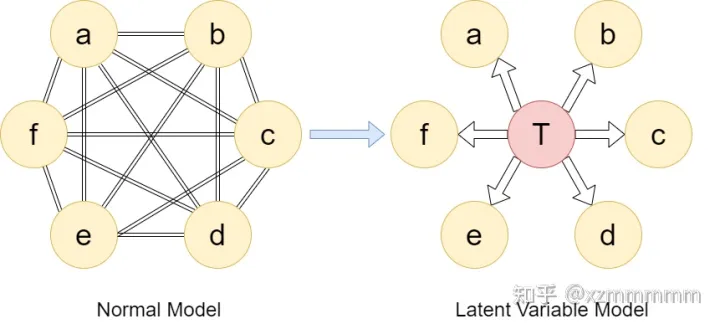

原本比较复杂的关系图，引入隐变量 T 后，会简洁很多，但代价是，需要更多的数学工作，且更难处理。这个隐变量是否有很大的实际意义并不关键，当然如果有的话就更好了。

回归到一般情况，对GMM的目标做如下推导 max p(X|θ)=max log p(X|θ)=max ∑i=1Nlog p(xi|θ)通常情况下，我们可能会使用随机梯度下降(SGD)来解决这个目标优化，但EM是今天的主题，优劣前面已经谈过。这里我们引入一个可变下界(variational lower bound)来逼近目标，以求得（局部）最大值，即

p(X|θ)=∑i=1Nlog∑c=13q(ti=c)p(xi,ti=c|θ)q(ti=c)≥∑i=1N∑c=13q(ti=c)logp(xi,ti=c|θ)q(ti=c)

其中最后一步用到了琴生(Jenson)不等式。然后经过一系列的复杂推导（公式太多懒得打），可以得出最大化的条件是 q(ti=c)=p(ti|xi,θ) ，那么EM算法的流程就比较清晰了：

1. 随机初始化各高斯分布的参数 θ={μ1,...,μc,σ1,...,σc,π1,...,πc}
2. 重复直至收敛：
3. (1)E-step(更新 q)：qk+1=p(ti|xi,θ) ；
4. (2)M-step(更新 θ )： θk+1=argmaxθ∑i∑cq(ti=c)logp(xi,ti=c|θ)


# Maxflow


## PushRelabel

参考：[Push-Relabel 最大流 推送重贴标签算法_debug 00的博客-CSDN博客](https://blog.csdn.net/qq_45824536/article/details/111772038)

**原理：**

源点 -> 高度从高到低的盈余点 -> 汇点

*结束标志：*

除了源点、汇点的盈余为0，流汇聚到汇点后，盈余返回到源点）

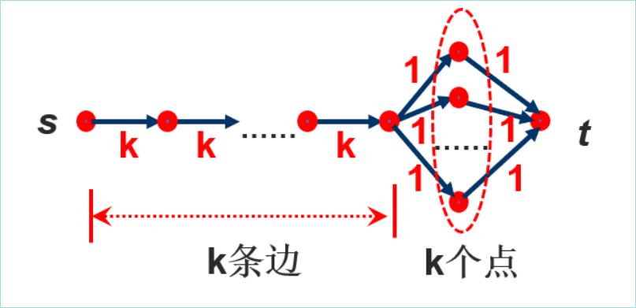


**伪代码：**

```c++
Push-Relabel( G, s, t )：
Initialize();
WHILE 存在盈余点 DO
    选择最大高度盈余点v；
    IF ∃𝒆(𝒗,𝒘)满足𝒉(𝒗)=𝒉(𝒘)+𝟏
    THEN    Push( v, e);
    ELSE    h(v)++; //Relabel
ENDWHILE
 
 
Push( v, e )：
IF 𝜶_𝒇 (𝒗)≥𝒓_𝒆 THEN
    𝚫=𝒓_𝒆;  //饱和推送
ELSE
    𝚫=𝜶_𝒇 (𝒗);  //非饱和推送
在边e上推送𝚫单位的流；
更新剩余容量𝒓_𝒆  ；
 
 
Initialize(  )：
𝒇=𝟎；
“反向BFS”设置高度值；
𝒉(𝒔)=𝒏;
FOR 𝒗∈𝜹^+ (𝒔) DO
    在𝒆(𝒔,𝒗)上饱和推送；
ENDFOR
 
 
```

**输入：**

总点数 总边数

源点 汇点

点u 点v u,v容量

**测试用例：**

```bash
10 25
1 8
1 8 5
1 4 1
1 6 6
1 5 1
2 7 2
2 9 1
3 10 1
3 9 4
3 2 6
3 1 4
3 8 3
4 8 9
4 6 4
4 3 8
5 4 3
5 9 9
6 7 7
6 10 2
7 10 3
7 8 10
7 5 10
9 7 6
9 10 7
10 4 7
10 2 2
```


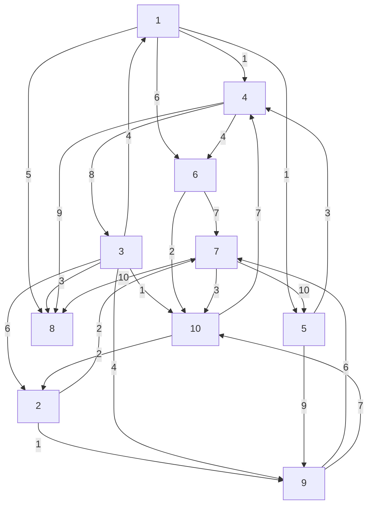


### 代码：


```c++
/*-------------------------------------------------
function:Push-Relabel
input: 
pot_number edge_number
pot_s pot_t
pot_u pot_v capacity_uv
... 
   
return: 
Maximum_Flow
running_time
-------------------------------------------------*/
#define _CRT_SECURE_NO_WARNINGS
#include "time.h"
#include<stdio.h>
#include<string.h>
#include<stdlib.h>
#define POTMAX 1100        //点数最大值，开辟空间 
int G[POTMAX][POTMAX];     //容量，剩余网络
int h[POTMAX];             //高度
int a[POTMAX];             //盈余
int n, m;                  //点数，边数
//队列start
int stack[POTMAX];int stack_head = 0;int stack_rear = 0;
int stack_push(int x) {
	if (stack_rear >= POTMAX)
		return -1;//满
	stack[stack_rear++] = x;
	return 0;
}
int stack_pop() {
//pop 空则输出-1
	if (stack_rear == stack_head)
		return -1;
	return stack[stack_head++];
} 
//队列end
int clear() {
    //数组等初始化
	int i, j;
	for (i = 0; i < POTMAX; i++)
		for (j = 0; j < POTMAX; j++)
			G[i][j] = 0;
	memset(h, 0, sizeof(int) * POTMAX);
	memset(a, 0, sizeof(int) * POTMAX);
	memset(tag, 0, sizeof(int) * POTMAX);
	stack_head = 0;
	stack_rear = 0;
	return 0;
}
int Initialize(int s,int t) {
    int tag[POTMAX];
	//BFS，建立高度函数
	h[t] = 0;
	int i;
	int temp = t;
	tag[t] = 1;
	while (temp != -1) {
		for (i = 1; i <= n; i++) {
			if (G[i][temp] != 0 && i != temp && tag[i]==0) {
				h[i] = h[temp] + 1;
				stack_push(i);
				tag[i] = 1;
	
			}
		}
		temp = stack_pop();
	}
	//默认n，调整为h max 
	int max_h = 0;
	for (i = 1; i <= n; i++) {
		if (h[i] > max_h)
			max_h = h[i];
	}
	h[s] = max_h;
	//初始 s->i 的i节点
	for (i = 1; i <= n; i++) {
		if (G[s][i] != 0) {
			a[i] = G[s][i];
			G[i][s] += G[s][i];
			G[s][i] = 0;
		}
			
	}
 
	return 0;
}
int check(int s,int t) {
    //查看是否有盈余点，如果有，返回高度最大点，否则-1（s,t不包括）
	int tag0=0;
	int i = 1, maxHighPot = t;//h[t]=0
	for (i = 1; i <= n; i++) {
		if (a[i] != 0 && h[i] > h[maxHighPot] && i != s && i!=t) {
				maxHighPot = i;
				tag0 = 1;
			
		}
	}
	if (tag0)
		return maxHighPot;
	else
		return -1;
 
}
int Push(int v, int e) {
    //推流
	if (a[v] >= G[v][e]) {
		a[e] += G[v][e];
		a[v] -= G[v][e];
		G[e][v] += G[v][e];
		G[v][e] = 0;
	}
	else {
		G[v][e] -= a[v];
		G[e][v] += a[v];
		a[e] += a[v];
		a[v] = 0;
	}
	return 0;
}
int main() {
	//
		clock_t start_time, end_time;
		start_time = clock();   //获取开始执行时间
	//
	clear();
	FILE* fp = NULL;
	if (!(fp = fopen("1.txt", "r"))) {
		printf("file error");
		return 0;
	}
	int s, t;
	fscanf_s(fp, "%d%d", &n, &m);
	fscanf_s(fp, "%d%d", &s, &t);
	int i, x, y, z;
	for (i = 0; i < m; i++) {
		fscanf_s(fp, "%d%d%d", &x, &y, &z);
 
		G[x][y] = z;
	}
	fclose(fp);
	
	Initialize(s, t);
	int maxHighPot = check(s,t);
	int check_tag;
	while (maxHighPot!=-1) {
		check_tag = 0;
		for (i = 1; i <= n; i++) {
			if (h[i] + 1 == h[maxHighPot]&&G[maxHighPot][i]>0) {
				Push(maxHighPot, i);
				check_tag = 1;
			}		
		}
		if (check_tag == 0)
			h[maxHighPot]++;
		maxHighPot = check(s,t);
		//printf("%d %d\n", a[t], h[maxHighPot]);    //测试
	}
 
 
	printf("%d\n", a[t]);
	//
	end_time = clock();     //获取结束时间
	double Times = (double)(end_time - start_time) / CLOCKS_PER_SEC;
	printf("%f seconds\n", Times);
	//
	return 0;
}
```


## Push Relabel算法


[PushRelabel 压入与重标记算法 · way-to-algorithm (gitbooks.io)](https://linrongbin16.gitbooks.io/way-to-algorithm/content/docs/GraphTheory/NetworkFlow/PushRelabel/)

### 问题


用压入与重标记算法求网络G=<V,E>的最大流，G是单源点、单汇点，边的容量都为正整数的网络。

### 定义


设网络中每个节点都有一个水位高度levellevel，当$c_f(i,j)=c(i,j)−f(i,j)>0$时边$e_{i,j}$仍然可以容纳更多的流，当$c_f(i,j)=0$时称边$e_{i,j}$为饱和边，不能容纳更多的流。

设节点$v_i (v_i∈V∖\{s,t\})$的流入和流出之差为：
$$
$$x(i)=inflow_i−outflow_i=\sum_{u \in V}f(u,i) - \sum_{v \in V}f(i,v)
$$


若相邻节点$v_i,v_j$满足$c_f(i,j)>0$，称$v_i,v_j$之间可以容纳额外的流。

### 压入操作

压入操作条件：

(1) 相邻节点$v_i,v_j$的水位满足$level(i)=level(j)+1$（称$v_j$在$v_i$的低位，$v_i$在$v_j$的高位）；

(2) 相邻节点$v_i,v_j$的边的剩余容量满足$c_f(i,j)>0$；

压入操作：像高处的水流向最低洼的位置，对于满足压入操作条件的相邻节点，由节点$v_i$流向节点$v_j$，边$e_{i,j}$的剩余容量更新为：
$$
\begin{cases}
f(i,j) = f(i,j) + \Delta\\
f(j,i) = f(j,i) - \Delta\\
x(i) = x(i) + \Delta\\
x(j) = x(j) - \Delta
\end{cases}
$$
其中$\Delta=min(x(i),c_f(i,j))$。任意节点$v_i$能够流出的最大值为$x(i)$（不能凭空制造流，每个节点必须有流入才能流出），而边$e_{i,j}$能够额外容纳的流为$c_f(i,j)$，因此实际可用的流是两者的最小值。

网络中将源点视作入流无穷大的节点，即有
$$
\begin{matrix}
inflow_s = +\infty \\
x(s) = +\infty
\end{matrix}
$$


将汇点视作出流无穷大的节点，即有
$$
\begin{matrix}
outflow_t = -\infty \\
x(t) = -\infty
\end{matrix}
$$

### 重标记操作

重标记操作是调整相邻节点之间的水位高度差的辅助操作，目的是尽可能将更多的流压入汇点。

重标记操作条件：

(1) 节点$v_i$的流入和流出之差满足$x(i)>0$，说明该节点仍然能够制造出流；

(2) 节点$v_i$在可以容纳额外的流的邻节点$v_j$即 ($c_f(i,j)>0$），且水位高度之差满足$level(i) \leq level(j)$；

重标记操作：
$$
level(i)=min \{level(j)\}+1
$$


其中$v_j$所有满足重标记条件的$v_i$的邻节点，将$v_i$的水位设置为所有节点中最低的水位加1。

### 解法

初始时设网络中任意两点间的流为0，即$f(i,j)=f(j,i)=0$（其中$v_i,v_j$为相邻节点），可知任意节点$v_i$的流入流出差为：
$$
x(i) = \begin{cases}
+ \infty \quad v_i = s\\
- \infty \quad v_i = t \\
0 \quad v_i \in V \backslash \{s,t \} 
\end{cases}
$$
对源点$s$进行预压入操作（无视水位）：


$$
x(i)=f(s,i)=c(s,i)
$$
其中$v_i$是所有与源点$s$相邻，且满足剩余容量$c_f(s,i)>0$的邻节点。

然后设置网络中节点的水位：
$$
level(i)= \begin{cases}
|V|\quad v_i=s \\
0 \quad v_i∈V \backslash \{s\}
\end{cases}
$$
遍历网络找到满足压入操作、重标记操作的相邻节点和边，并进行对应操作。重复这两种操作直到无法继续，算法结束。网络的最大流即为汇点$t$的邻节点的出流之和：
$$
flow_{max}=\sum_{u∈V}f(u,t)
$$
该算法的时间复杂度为$O(|V|^2⋅|E|)$。


## PushRelabel理解

[【Algorithm】Push-Relabel算法_Anova.YJ的博客-CSDN博客_推送 重贴标签算法](https://blog.csdn.net/weixin_44246009/article/details/115493207)


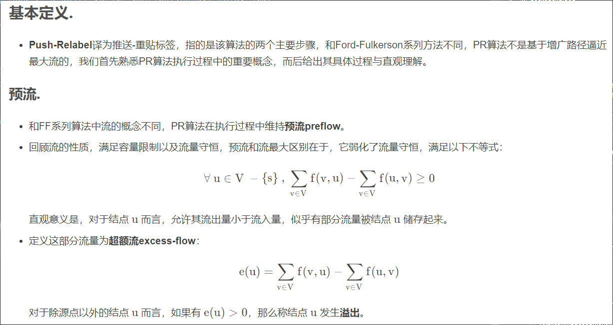


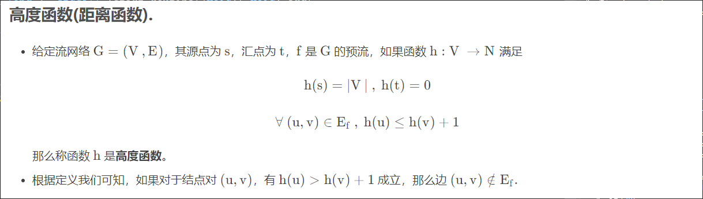


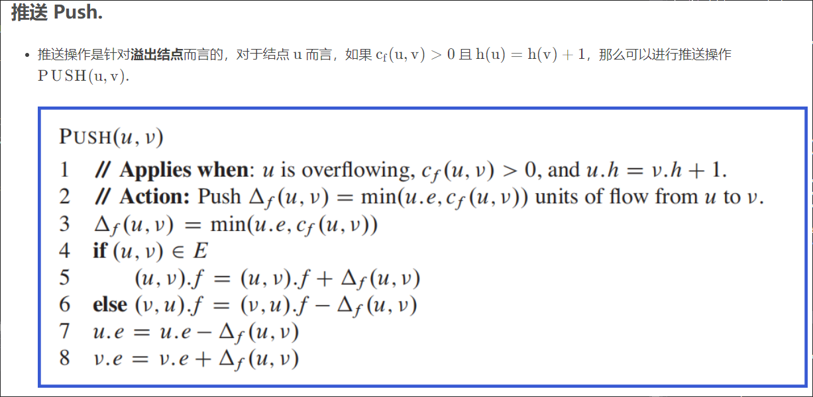


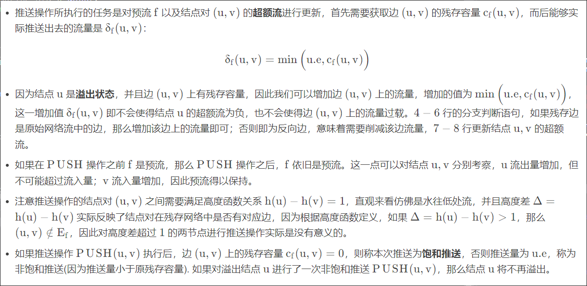

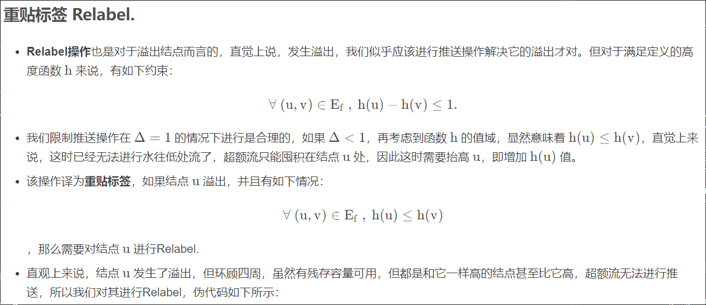


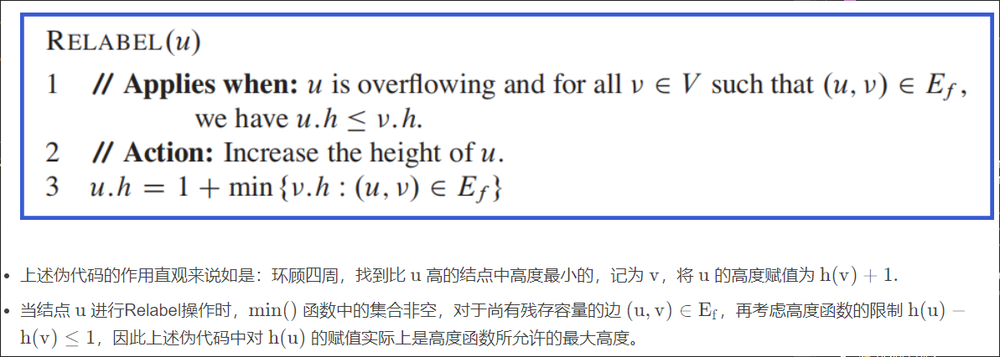


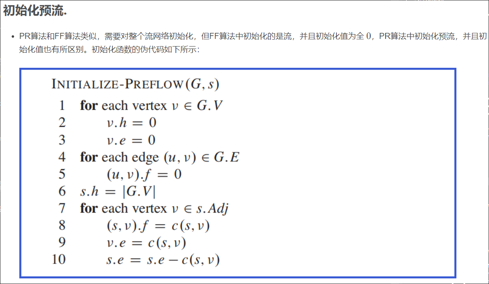


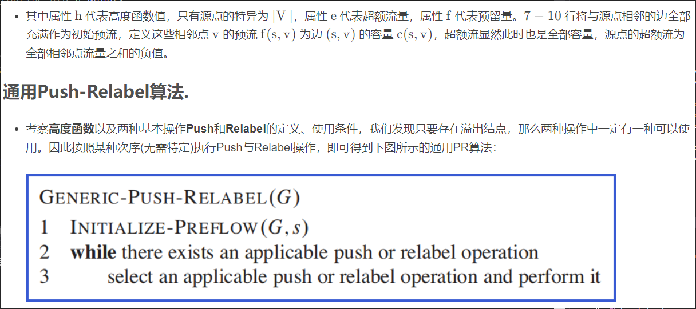

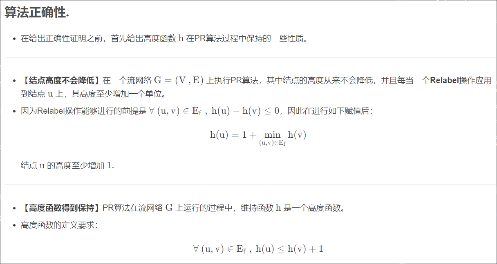

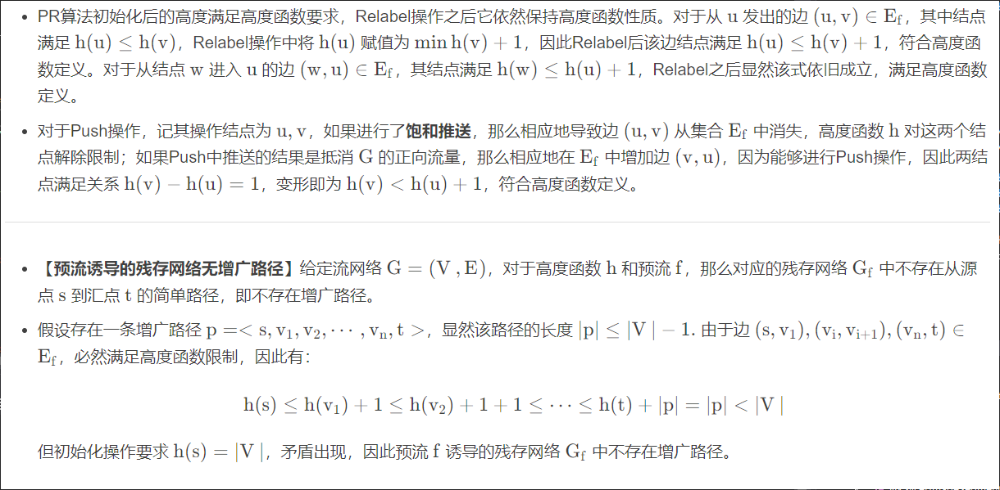

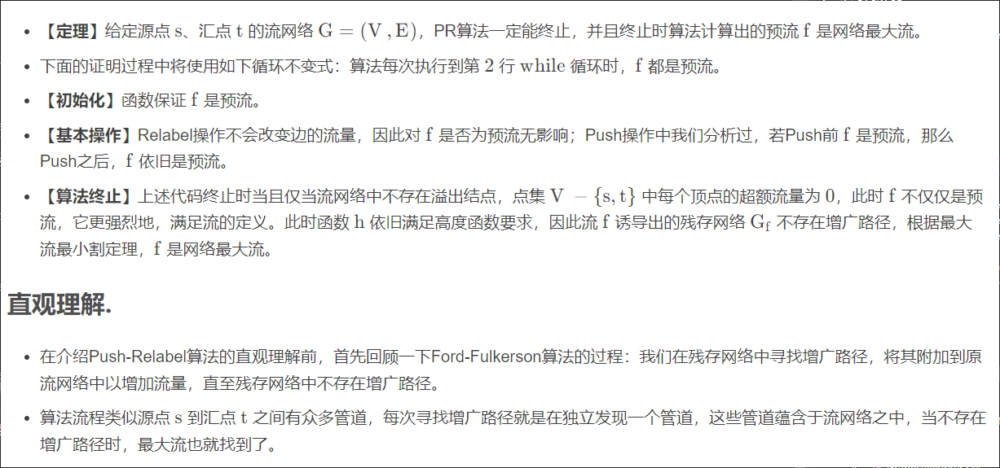


- 而Push-Relabel算法有别于这种独立发现管道的形式，它每次循环并不会考察从源点到汇点的整个网络，而只着眼于某个溢出点的邻域。
- 在初始化函数中，我们将连接源点 s ss 的每条边容量都发挥到最大，显然这是最大流的上界，之后的过程有种水往低处流的直观感受。如果某个结点存在超额流，即该结点溢出，它会尽力将超额流向地处推送，如果邻域内的结点都高于它或与之同高度，则抬高该点，使其超额流能够完成推送。
- 源点向整个网络推送了不低于最大流量的水流，而后网络中每个结点对自己收到的流量进行调节，最终达到一个平衡状态，网络中现存的水流即为最大流量，超额流全部通过抬高结点高度反推回源点。
  

## Push Relabel Algorithm Tutorial

[Goldberg Tarjan Push Relabel Algorithm (adrian-haarbach.de)](http://www.adrian-haarbach.de/idp-graph-algorithms/implementation/maxflow-push-relabel/index_en.html)

[Push Relabel Algorithm Tutorial](https://codeforces.com/blog/entry/68494)

实现1

```cpp
 #include <bits/stdc++.h>
 
using namespace std;
 
typedef long long ll;
 
struct edge{
    int from,to; ll cap,f;
};
 
vector<edge> ed;
vector<vector<int> > adj,hs;
vector<int> h;vector<ll> ex;
int N,S,T;
 
void init(int n,int s,int t){
    N=n;S=s;T=t; // S - source, T - sink
    h=vector<int>(N); // height
    ex=vector<ll>(N); // excess
    adj=vector<vector<int>>(N);
    hs=vector<vector<int>>(2*N+1); // for finding max height with excess
}
 
void add_edge(int from,int to,int cap){
    if(from==to) return;
    adj[from].push_back(ed.size());
    ed.push_back({from,to,cap,0});
    adj[to].push_back(ed.size());
    ed.push_back({to,from,0,0});
}
 
void push(int id){
    int v=ed[id].from,to=ed[id].to;
    ll fl=min(ex[v],ed[id].cap-ed[id].f);
    if(to!=S && to!=T && !ex[to] && fl) hs[h[to]].push_back(to);
    ed[id].f+=fl;
    ed[id^1].f-=fl;
    ex[v]-=fl;
    ex[to]+=fl;
}
 
int relabel(int v){
    h[v]=2*N; // Cannot exceed this value
    for(int id:adj[v])
        if(ed[id].cap>ed[id].f)
            h[v]=min(h[v],h[ed[id].to]+1);
    hs[h[v]].push_back(v);
    return h[v];
}
 
ll max_flow(){
    // initialization and preflow
    h[S]=N;
    for(int id:adj[S]){
        ex[S]+=ed[id].cap;
        push(id);
    }
 
    if(hs[0].size())
    for(int hi=0;hi>=0;){
        // find a vertex v with ex[v]>0 && max height
        int v=hs[hi].back();hs[hi].pop_back();
        while(ex[v] >0){
            for(int i=0;i<(int)adj[v].size() && ex[v];i++){
                int id=adj[v][i];edge e=ed[id];
                if(e.cap-e.f>0 && h[v]==h[e.to]+1)
                    push(id);
            }
            if(ex[v]) hi=relabel(v);
        }
        while(hi>=0 && hs[hi].empty()) --hi;
    }
    // Calculate flow
    ll res=0;
    for(int id:adj[S]) res+=ed[id].f;
    return res;
}

int main(){
    // blah blah
    init(n,s,t);
    ll flow=max_flow();
    return 0;
}
```


实现2

[Maximum flow - Push-relabel algorithm - Algorithms for Competitive Programming (cp-algorithms.com)](https://cp-algorithms.com/graph/push-relabel.html#definitions)

```cpp
const int inf = 1000000000;

int n;
vector<vector<int>> capacity, flow;
vector<int> height, excess, seen;
queue<int> excess_vertices;

void push(int u, int v)
{
    int d = min(excess[u], capacity[u][v] - flow[u][v]);
    flow[u][v] += d;
    flow[v][u] -= d;
    excess[u] -= d;
    excess[v] += d;
    if (d && excess[v] == d)
        excess_vertices.push(v);
}

void relabel(int u)
{
    int d = inf;
    for (int i = 0; i < n; i++) {
        if (capacity[u][i] - flow[u][i] > 0)
            d = min(d, height[i]);
    }
    if (d < inf)
        height[u] = d + 1;
}

void discharge(int u)
{
    while (excess[u] > 0) {
        if (seen[u] < n) {
            int v = seen[u];
            if (capacity[u][v] - flow[u][v] > 0 && height[u] > height[v])
                push(u, v);
            else 
                seen[u]++;
        } else {
            relabel(u);
            seen[u] = 0;
        }
    }
}

int max_flow(int s, int t)
{
    height.assign(n, 0);
    height[s] = n;
    flow.assign(n, vector<int>(n, 0));
    excess.assign(n, 0);
    excess[s] = inf;
    for (int i = 0; i < n; i++) {
        if (i != s)
            push(s, i);
    }
    seen.assign(n, 0);

    while (!excess_vertices.empty()) {
        int u = excess_vertices.front();
        excess_vertices.pop();
        if (u != s && u != t)
            discharge(u);
    }

    int max_flow = 0;
    for (int i = 0; i < n; i++)
        max_flow += flow[i][t];
    return max_flow;
}
```


