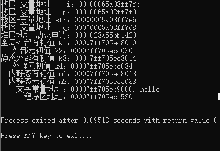

# C++ 模板

https://www.runoob.com/cplusplus/cpp-templates.html

模板是泛型编程的基础，泛型编程即以一种独立于任何特定类型的方式编写代码。

模板是创建泛型类或函数的蓝图或公式。库容器，比如迭代器和算法，都是泛型编程的例子，它们都使用了模板的概念。

每个容器都有一个单一的定义，比如 **向量**，我们可以定义许多不同类型的向量，比如 **vector <int>** 或 **vector <string>**。

您可以使用模板来定义函数和类，接下来让我们一起来看看如何使用。

## 函数模板

模板函数定义的一般形式如下所示：

```cpp
template <typename type> ret-type func-name(parameter list)
{
   // 函数的主体
}
```

在这里，type 是函数所使用的数据类型的占位符名称。这个名称可以在函数定义中使用。

下面是函数模板的实例，返回两个数中的最大值：

```cpp
#include <iostream>
#include <string>
 
using namespace std;
 
template <typename T>
inline T const& Max (T const& a, T const& b) 
{ 
    return a < b ? b:a; 
} 
int main ()
{
 
    int i = 39;
    int j = 20;
    cout << "Max(i, j): " << Max(i, j) << endl; 
 
    double f1 = 13.5; 
    double f2 = 20.7; 
    cout << "Max(f1, f2): " << Max(f1, f2) << endl; 
 
    string s1 = "Hello"; 
    string s2 = "World"; 
    cout << "Max(s1, s2): " << Max(s1, s2) << endl; 
 
    return 0;
}
```

当上面的代码被编译和执行时，它会产生下列结果：

```bash
Max(i, j): 39
Max(f1, f2): 20.7
Max(s1, s2): World
```

## 类模板

正如我们定义函数模板一样，我们也可以定义类模板。泛型类声明的一般形式如下所示：

```cpp
template <class type> class class-name {
.
.
.
}
```

在这里，**type** 是占位符类型名称，可以在类被实例化的时候进行指定。您可以使用一个逗号分隔的列表来定义多个泛型数据类型。

下面的实例定义了类 Stack<>，并实现了泛型方法来对元素进行入栈出栈操作：

```cpp
#include <iostream>
#include <vector>
#include <cstdlib>
#include <string>
#include <stdexcept>
 
using namespace std;
 
template <class T>
class Stack { 
  private: 
    vector<T> elems;     // 元素 
 
  public: 
    void push(T const&);  // 入栈
    void pop();               // 出栈
    T top() const;            // 返回栈顶元素
    bool empty() const{       // 如果为空则返回真。
        return elems.empty(); 
    } 
}; 
 
template <class T>
void Stack<T>::push (T const& elem) 
{ 
    // 追加传入元素的副本
    elems.push_back(elem);    
} 
 
template <class T>
void Stack<T>::pop () 
{ 
    if (elems.empty()) { 
        throw out_of_range("Stack<>::pop(): empty stack"); 
    }
    // 删除最后一个元素
    elems.pop_back();         
} 
 
template <class T>
T Stack<T>::top () const 
{ 
    if (elems.empty()) { 
        throw out_of_range("Stack<>::top(): empty stack"); 
    }
    // 返回最后一个元素的副本 
    return elems.back();      
} 
 
int main() 
{ 
    try { 
        Stack<int>         intStack;  // int 类型的栈 
        Stack<string> stringStack;    // string 类型的栈 
 
        // 操作 int 类型的栈 
        intStack.push(7); 
        cout << intStack.top() <<endl; 
 
        // 操作 string 类型的栈 
        stringStack.push("hello"); 
        cout << stringStack.top() << std::endl; 
        stringStack.pop(); 
        stringStack.pop(); 
    } 
    catch (exception const& ex) { 
        cerr << "Exception: " << ex.what() <<endl; 
        return -1;
    } 
}
```

当上面的代码被编译和执行时，它会产生下列结果：

```bash
7
hello
Exception: Stack<>::pop(): empty stack

--------------------------------
Process exited after 0.07319 seconds with return value 4294967295

Press ANY key to exit...
```


## 获取时间

```cpp
#include<iostream>
#include<ctime>

using namespace std;

int main()
{
	//基于当前系统的当前时间
	time_t now=time(0);
	
	//把now转换为字符串类型
	char *dt=ctime(&now);
	
	cout<<"本地日期和时间: "<<dt<<endl;
	
	//把now转换为tm结构
	tm *gmtm=gmtime(&now);
	dt=asctime(gmtm);
	cout<<"UTC日期和时间: "<<dt<<endl;
	return 0;
}
```

运行输出：

```bash
本地日期和时间: Wed Aug 24 20:10:28 2022

UTC日期和时间: Wed Aug 24 12:10:28 2022


--------------------------------
Process exited after 0.007458 seconds with return value 0

Press ANY key to exit...
```


## 随机数生成

C++中有专门的随机数生成器

```cpp
#include<cstdlib>

int rand();
```

于是我们激动地实验了一下这个函数
发现了一个严肃的问题：为什么每次“随机”出来的数都是一样的呢？？？

这就引发我们思考另一个很重要地问题：

计算机可以产生真正的随机数嘛？
很遗憾，不行。。。
所谓的随机数，实际上是事先存储在计算机内部的一个数表
为了使取出来的数**可视为随机**，我们需要给计算机一个**种子**

根据种子为基准以某个递推公式推算出一系列数，因为其周期长，故在一定范围内可以看成是随机数

怎么设置种子
我们需要在使用随机数生成函数之前调用一次：

```cpp
void srand(unsigned int seed);
```

通过设置seed来产生不同的随机数，只要种子不同，那么通过rand()得到的随机数序列就是不同的；反之，如果种子是一样的，那么通过rand()得到的随机数序列就是相同的

那么我们**如何选择种子就显得无比重要**
一般的，我们就选择**time(0)**


```cpp
#include <iostream>
#include <cstdlib>
#include <ctime>

using namespace std;

int main()
{
	const int seq_int = 41;//定义一个常量值为41
	int random_val = 0;//用来存放随机数
	srand((unsigned int)time(NULL));//srand中的参数就是seed，也就是随机数将会在0~(seed-1)中进行产生
	
	random_val = rand() % seq_int + 60;//产生0~100以内的数据
	
	cout << random_val << endl;
	
	//system("pause");
	return 0;
}

```

```bash
77

--------------------------------
Process exited after 0.006921 seconds with return value 0

Press ANY key to exit...
```


测试，生成随机数的时间确实不快。


## 常见关键字

### const

[C++ const 关键字小结 | 菜鸟教程 (runoob.com)](https://www.runoob.com/w3cnote/cpp-const-keyword.html)

[C语言中const的用法详解 (qq.com)](https://mp.weixin.qq.com/s/xFrmugLMMK3-QTklTgQMNg)

const 关键字不能与 static 关键字同时使用，因为 static 关键字修饰静态成员函数，静态成员函数不含有 this 指针，即不能实例化，const 成员函数必须具体到某一实例。

#### const基本介绍

const是constant的简写，用来定义常量，它限定一个变量不允许被改变，产生静态作用。const最开始推出的目的是为了取代预编译指令，取长补短。

#### 与define的对比

1. define是预编译指令，定义的宏是在预处理阶段展开的，而const是普通变量的定义，是只读变量，且是在编译运行阶段使用的。
2. define定义的是常量，define定义的宏在编译后消失了，它不占用内存，而const定义的常变量本质上仍然是一个变量，具有变量的基本属性，有类型、占用存储单元，除了不能作为数组的长度，用const定义的常变量具有宏的优点，而且使用更方便。
3. define定义的对象没有数据类型，编译器只能机械地进行字符替换，没有类型安全检查，即会出现“`边际问题`”或者是“`括号问题`”。而const定义的是变量，有数据类型。

#### 修饰局部变量

```
const int num=5;
int const num=5;
```

这两种写法是一样的，都是表示变量num的值不能被改变，用const修饰变量时，一定要初始化，否则之后就不能再进行赋值了（后面会讲到一种特殊情况）。

接下来看看const用于修饰常量静态字符串，例如：

```
const char* str="techdreamer";
```

如果没有const的修饰，我们可能会在后不经意间的修改代码，比如`str[4]=’D’`，这样会导致对只读内存区域的赋值，使程序异常终止。

而加上const修饰之后，这个错误就能在程序被编译的时候立即被检查出来，让逻辑错误在编译期被发现，避免我们在后续中继续debug。

#### 修饰全局变量

全局变量的作用域是整个文件，且全局变量的生存周期为程序运行的整个过程，所以我们应该尽量避免使用全局变量，一旦某个函数改变了全局变量的值，会影响到其他引用这个变量的函数，是一个很隐蔽的操作。

如果一定要用全局变量，应该尽量的使用const进行修饰，防止不必要的人为修改，使用 const 修饰过的局部变量就有了静态特性，它的生存周期也是程序运行的整个过程，虽然有了静态特性，但并不是说它变成了静态变量。

#### 修饰常量指针与指针常量

##### 常量指针


常量指针是指针指向的内容是常量，可以有以下两种定义方式。

```
const int * num;
int const * num;
```

以下两点需要注意：

1. 常量指针说的是不能通过这个指针改变变量的值，但可以通过其他的引用来改变变量的值。

```
int cnt=5;
const int* num=&cnt;
cnt=6;
```

1. 常量指针指向的值不能改变，但这并不意味着指针本身不能改变，常量指针可以指向其他的地址。

```
int cnt=5;
int tmp=6;
const int* num=&cnt;
num=&tmp;
```

#### 指针常量

指针常量是指指针本身是个常量，不能再指向其他的地址，写法如下：

```
int *const num;
```

需要注意的是，指针常量指向的地址不能改变，但是地址中保存的数值是可以改变的，可以通过其他指向改地址的指针来修改。

```
int cnt=5;
int *tmp=&cnt;
int* const num=&cnt;
*tmp=6;
```

区分常量指针和指针常量的关键就在于`星号的位置`，我们以星号为分界线。

- 如果const在星号的左边，则为常量指针
- 如果const在星号的右边则为指针常量

如果我们将星号读作‘指针’，将const读作‘常量’的话，内容正好符合。

- `int const * num；`是常量指针，
- `int *const num；`是指针常量。

#### 指向常量的常指针

还有一种情况是指向常量的常指针，这相当于是常量指针与指针常量的结合，指针指向的位置不能改变并且也不能通过这个指针改变`变量的值`，例如

```
const int* const num;
```

这个代表num所指向的对象的值以及它的地址本身都不能被改变

#### 修饰函数的形参


根据常量指针与指针常量，const修饰函数的参数也是分为三种情况

1. 防止修改指针指向的内容

```
void FUN(char *destin, const char *source);
```

其中 source 是输入参数，destin 是输出参数。给 source 加上 const 修饰后，如果函数体内的语句试图改动 source 的内容，编译器将报错，但反过来是可以的，编译器允许将`char *`类型的数据赋值给`const char *`类型的变量。

1. 防止修改指针指向的地址

```
void FUN ( int * const p1 , int * const p2 )
```

指针p1和指针p2指向的地址都不能修改。

1. 以上两种的结合。

在C语言标准库中，有很多函数的形参都被 const 限制了，下面是部分函数的原型：

```
size_t strlen ( const char * str );
int strcmp ( const char * str1, const char * str2 );
char * strcat ( char * destination, const char * source );
char * strcpy ( char * destination, const char * source );
int system (const char* command);
int puts ( const char * str );
int printf ( const char * format, ... );
```

#### 修饰函数的返回值


如果给以“`指针传递`”方式的函数返回值加 const 修饰，那么函数返回值（即指针）的内容不能被修改，该返回值只能被赋给加const 修饰的同类型指针，例如

```
const char * FUN(void);
```

如下语句将出现编译错误：

```
char *str = FUN();
```

正确的用法是

```
const char *str = FUN();
```

#### 思考

- C与C++中的const用法有什么区别？
- 编译器会给const定义的变量分配存储空间吗？
- const变量能被其他文件extern引用吗？

参考：C语言中文网


### static

[C/C++ 中 static 的用法全局变量与局部变量 | 菜鸟教程 (runoob.com)](https://www.runoob.com/w3cnote/cpp-static-usage.html)

#### 什么是static?


static 是 C/C++ 中很常用的修饰符，它被用来控制变量的存储方式和可见性。

#####  static 的引入

我们知道在函数内部定义的变量，当程序执行到它的定义处时，编译器为它在栈上分配空间，**函数在栈上分配的空间在此函数执行结束时会释放掉**，这样就产生了一个问题: **如果想将函数中此变量的值保存至下一次调用时**，如何实现？ 最容易想到的方法是定义为全局的变量，但定义一个全局变量有许多缺点，最明显的缺点是破坏了此变量的访问范围（使得在此函数中定义的变量，不仅仅只受此函数控制）。**static 关键字则可以很好的解决这个问题**。

另外，在 C++ 中，需要一个数据对象为整个类而非某个对象服务,同时又力求不破坏类的封装性,即要求此成员隐藏在类的内部，对外不可见时，可将其定义为静态数据。

##### 静态数据的存储

**全局（静态）存储区**：分为 DATA 段和 BSS 段。DATA 段（全局初始化区）存放初始化的全局变量和静态变量；BSS 段（全局未初始化区）存放未初始化的全局变量和静态变量。程序运行结束时自动释放。其中BBS段在程序执行之前会被系统自动清0，所以未初始化的全局变量和静态变量在程序执行之前已经为0。存储在静态数据区的变量会在程序刚开始运行时就完成初始化，也是唯一的一次初始化。

在 C++ 中 static 的内部实现机制：静态数据成员要在程序一开始运行时就必须存在。因为函数在程序运行中被调用，所以静态数据成员不能在任何函数内分配空间和初始化。

这样，**它的空间分配有三个可能的地方**，一是作为类的外部接口的头文件，那里有类声明；二是类定义的内部实现，那里有类的成员函数定义；三是应用程序的 main() 函数前的全局数据声明和定义处。

静态数据成员要实际地分配空间，故不能在类的声明中定义（只能声明数据成员）。类声明只声明一个类的"尺寸和规格"，并不进行实际的内存分配，所以在类声明中写成定义是错误的。它也不能在头文件中类声明的外部定义，因为那会造成在多个使用该类的源文件中，对其重复定义。

**static** 被引入以告知编译器，**将变量存储在程序的静态存储区而非栈上空间，静态数据成员按定义出现的先后顺序依次初始化，注意静态成员嵌套时，要保证所嵌套的成员已经初始化了。消除时的顺序是初始化的反顺序**。

**优势：**可以节省内存，因为它是所有对象所公有的，因此，对多个对象来说，静态数据成员只存储一处，供所有对象共用。静态数据成员的值对每个对象都是一样，但它的值是可以更新的。只要对静态数据成员的值更新一次，保证所有对象存取更新后的相同的值，这样可以提高时间效率。

#### 在 C/C++ 中static的作用

##### 总的来说

- （1）在修饰变量的时候，static 修饰的静态局部变量**只执行初始化一次**，而且延长了局部变量的生命周期，直到程序运行结束以后才释放。
- （2）static **修饰全局变量**的时候，这个全局变量**只能在本文件中访问**，不能在其它文件中访问，即便是 extern 外部声明也不可以。
- （3）static **修饰一个函数**，则这个函数的**只能在本文件中调用**，不能被其他文件调用。static 修饰的变量存放在全局数据区的静态变量区，包括全局静态变量和局部静态变量，都在全局数据区分配内存。初始化的时候自动初始化为 0。
- （4）不想被释放的时候，可以使用static修饰。比如修饰函数中存放在栈空间的数组。如果不想让这个数组在函数调用结束释放可以使用 static 修饰。
- （5）考虑到数据安全性（当程序想要使用全局变量的时候应该先考虑使用 static）。

##### 静态变量与普通变量

**静态全局变量有以下特点：**

- （1）静态变量都在全局数据区分配内存，包括后面将要提到的静态局部变量;
- （2）未经初始化的静态全局变量会被程序自动初始化为0（在函数体内声明的自动变量的值是随机的，除非它被显式初始化，而在函数体外被声明的自动变量也会被初始化为 0）；
- （3）静态全局变量在声明它的整个文件都是可见的，而在文件之外是不可见的。

**优点：**静态全局变量不能被其它文件所用；其它文件中可以定义相同名字的变量，不会发生冲突。

**（1）全局变量和全局静态变量的区别**

- 1）全局变量是不显式用 static 修饰的全局变量，全局变量默认是有外部链接性的，作用域是整个工程，在一个文件内定义的全局变量，在另一个文件中，通过 extern 全局变量名的声明，就可以使用全局变量。
- 2）全局静态变量是显式用 static 修饰的全局变量，作用域是声明此变量所在的文件，其他的文件即使用 extern 声明也不能使用。

##### 静态局部变量有以下特点：

- （1）该变量在全局数据区分配内存；
- （2）静态局部变量在程序执行到该对象的声明处时被首次初始化，即以后的函数调用不再进行初始化；
- （3）静态局部变量一般在声明处初始化，如果没有显式初始化，会被程序自动初始化为 0；
- （4）它始终驻留在全局数据区，直到程序运行结束。但其作用域为局部作用域，当定义它的函数或语句块结束时，其作用域随之结束。

一般程序把新产生的动态数据存放在堆区，函数内部的自动变量存放在栈区。自动变量一般会随着函数的退出而释放空间，静态数据（即使是函数内部的静态局部变量）也存放在全局数据区。全局数据区的数据并不会因为函数的退出而释放空间。

例子

```cpp
//example:
#include <stdio.h>  
#include <stdlib.h>  
int k1 = 1;
int k2;
static int k3 = 2;
static int k4;
int main()
{
    static int m1 = 2, m2;
    int i = 1;
    char*p;
    char str[10] = "hello";
    char*q = "hello";
    p = (char *)malloc(100);
    free(p);
    printf("栈区-变量地址    i：%p\n", &i);
    printf("栈区-变量地址   p：%p\n", &p);
    printf("栈区-变量地址 str：%p\n", str);
    printf("栈区-变量地址   q：%p\n", &q);
    printf("堆区地址-动态申请：%p\n", p);
    printf("全局外部有初值 k1：%p\n", &k1);
    printf("   外部无初值 k2：%p\n", &k2);
    printf("静态外部有初值 k3：%p\n", &k3);
    printf("   外静无初值 k4：%p\n", &k4);
    printf("  内静态有初值 m1：%p\n", &m1);
    printf("  内静态无初值 m2：%p\n", &m2);
    printf("    文字常量地址：%p, %s\n", q, q);
    printf("      程序区地址：%p\n", &main);
    return 0;
}
```

运行输出：



####  static 用法

##### 在 C++ 中

static 关键字最基本的用法是：

- 1、被 static 修饰的变量属于类变量，可以通过**类名.变量名**直接引用，而不需要 new 出一个类来
- 2、被 static 修饰的方法属于类方法，可以通过**类名.方法名**直接引用，而不需要 new 出一个类来

被 static 修饰的变量、被 static 修饰的方法统一属于类的静态资源，是类实例之间共享的，换言之，一处变、处处变。

在 C++ 中，静态成员是属于整个类的而不是某个对象，静态成员变量只存储一份供所有对象共用。所以在所有对象中都可以共享它。使用静态成员变量实现多个对象之间的数据共享不会破坏隐藏的原则，保证了安全性还可以节省内存。

静态成员的定义或声明要加个关键 static。静态成员可以通过双冒号来使用即 **<类名>::<静态成员名>**。

##### 静态类相关

通过类名调用静态成员函数和非静态成员函数:

```cpp
class Point  
{  
public:   
    void init()  
    {    
    }  
    static void output()  
    {  
    }  
};  
void main()  
{  
    Point::init();  
    Point::output();  
}
```


报错：

```bash
'Point::init' : illegal call of non-static member function
```

**结论 1：**不能通过类名来调用类的非静态成员函数。

通过类的对象调用静态成员函数和非静态成员函数。

```cpp
//example:
#include <stdio.h>  
#include <stdlib.h>  
class Point  
{  
	public:   
	void init()  
	{    
	}  
	static void output()  
	{  
	}  
}; 
int main()  
{  
	Point pt;  
	pt.init();  
	pt.output(); 
	return 0;
}
```

编译通过。

**结论 2**：类的对象可以使用静态成员函数和非静态成员函数。

在类的静态成员函数中使用类的非静态成员。

```cpp
#include <stdio.h>  
class Point  
{  
	public:   
	void init()  
	{    
	}  
	static void output()  
	{  
		printf("%d\n", m_x);  
	}  
	private:  
	int m_x;  
};  
int main()  
{  
	Point pt;  
	pt.output();  
	return 0;
}
```


编译出错：

```bash
 error: invalid use of member 'Point::m_x' in static member function
```

因为静态成员函数属于整个类，在类实例化对象之前就已经分配空间了，而类的非静态成员必须在类实例化对象后才有内存空间，所以这个调用就出错了，就好比没有声明一个变量却提前使用它一样。

**结论3：**静态成员函数中不能引用非静态成员。

在类的非静态成员函数中使用类的静态成员。

```cpp
#include <stdio.h>  
class Point  
{  
	public:   
	void init()  
	{    
		output();  
	}  
	static void output()  
	{  
	}  
};  
int main()  
{  
	Point pt;  
	pt.init();
	pt.output(); 
	return 0;
}
```

编译通过。

**结论 4**：类的非静态成员函数可以调用用静态成员函数，但反之不能。

使用类的静态成员变量。

```cpp
#include <stdio.h>  
class Point  
{  
	public:   
	Point()  
	{    
		m_nPointCount++;  
	}  
	~Point()  
	{  
		m_nPointCount--;  
	}  
	static void output()  
	{  
		printf("%d\n", m_nPointCount);  
	}  
	private:  
	static int m_nPointCount;  
};  
int main()  
{  
	Point pt;  
	pt.output(); 
	return 0;
}
```

编译无错误， 生成 EXE 程序时报链接错误。

```bash
86_64-w64-mingw32/bin/ld.exe: main.o:main.cpp:(.rdata$.refptr._ZN5Point13m_nPointCountE[.refptr._ZN5Point13m_nPointCountE]+0x0): undefined reference to `Point::m_nPointCount'
collect2.exe: error: ld returned 1 exit status
```

这是因为类的静态成员变量在使用前必须先初始化。

在 **main()** 函数前加上 **int Point::m_nPointCount = 0;** 再编译链接无错误，运行程序将输出 1。

**结论 5**：类的静态成员变量必须先初始化再使用。

**思考总结：**静态资源属于类，但是是独立于类存在的。从 J 类的加载机制的角度讲，静态资源是类初始化的时候加载的，而非静态资源是类实例化对象的时候加载的。 类的初始化早于类实例化对象，比如 **Class.forName("xxx")** 方法，就是初始化了一个类，但是并没有实例化对象，只是加载这个类的静态资源罢 了。所以对于静态资源来说，它是不可能知道一个类中有哪些非静态资源的；但是对于非静态资源来说就不一样了，由于它是实例化对象出来之后产生的，因此属于类的这些东西它都能认识。所以上面的几个问题答案就很明确了：

- 1）静态方法能不能引用非静态资源？不能，实例化对象的时候才会产生的东西，对于初始化后就存在的静态资源来说，根本不认识它。
- 2）静态方法里面能不能引用静态资源？可以，因为都是类初始化的时候加载的，大家相互都认识。
- 3）非静态方法里面能不能引用静态资源？可以，非静态方法就是实例方法，那是实例化对象之后才产生的，那么属于类的内容它都认识。

（**static 修饰类：**这个用得相对比前面的用法少多了，static 一般情况下来说是不可以修饰类的， 如果 static 要修饰一个类，说明这个类是一个静态内部类（注意 static 只能修饰一个内部类），也就是匿名内部类。像线程池 ThreadPoolExecutor 中的四种拒绝机制 CallerRunsPolicy、AbortPolicy、DiscardPolicy、 DiscardOldestPolicy 就是静态内部类。静态内部类相关内容会在写内部类的时候专门讲到。）

#### 总结：


- （1）静态成员函数中不能调用非静态成员。
- （2）非静态成员函数中可以调用静态成员。因为静态成员属于类本身，在类的对象产生之前就已经存在了，所以在非静态成员函数中是可以调用静态成员的。
- （3）静态成员变量使用前必须先初始化(如 **int MyClass::m_nNumber = 0;**)，否则会在 linker 时出错。

**一般总结**：在类中，static 可以用来修饰静态数据成员和静态成员方法。

**静态数据成员**

- （1）静态数据成员可以实现多个对象之间的数据共享，它是类的所有对象的共享成员，它在内存中只占一份空间，如果改变它的值，则各对象中这个数据成员的值都被改变。
- （2）静态数据成员是在程序开始运行时被分配空间，到程序结束之后才释放，只要类中指定了静态数据成员，即使不定义对象，也会为静态数据成员分配空间。
- （3）静态数据成员可以被初始化，但是只能在类体外进行初始化，若未对静态数据成员赋初值，则编译器会自动为其初始化为 0。
- （4）静态数据成员既可以通过对象名引用，也可以通过类名引用。

**静态成员函数**

- （1）静态成员函数和静态数据成员一样，他们都属于类的静态成员，而不是对象成员。
- （2）非静态成员函数有 this 指针，而静态成员函数没有 this 指针。
- （3）静态成员函数主要用来访问静态数据成员而不能访问非静态成员。

再给一个利用类的静态成员变量和函数的例子以加深理解，这个例子建立一个学生类，每个学生类的对象将组成一个双向链表，用一个静态成员变量记录这个双向链表的表头，一个静态成员函数输出这个双向链表。

```cpp
#include <stdio.h>  
#include <string.h>
const int MAX_NAME_SIZE = 30;  

class Student  
{  
	public:  
	Student(char *pszName);
	~Student();
public:
	static void PrintfAllStudents();
	private:  
	char    m_name[MAX_NAME_SIZE];  
	Student *next;
	Student *prev;
	static Student *m_head;
};  

Student::Student(char *pszName)
{  
	strcpy(this->m_name, pszName);
	
	//建立双向链表，新数据从链表头部插入。
	this->next = m_head;
	this->prev = NULL;
	if (m_head != NULL)
		m_head->prev = this;
	m_head = this;  
}  

Student::~Student ()//析构过程就是节点的脱离过程  
{  
	if (this == m_head) //该节点就是头节点。
	{
		m_head = this->next;
	}
	else
	{
		this->prev->next = this->next;
		this->next->prev = this->prev;
	}
}  

void Student::PrintfAllStudents()
{
	for (Student *p = m_head; p != NULL; p = p->next)
		printf("%s\n", p->m_name);
}

Student* Student::m_head = NULL;  

int main()  
{   
	Student studentA("AAA");
	Student studentB("BBB");
	Student studentC("CCC");
	Student studentD("DDD");
	Student student("MoreWindows");
	Student::PrintfAllStudents();
	return 0;
}
```

程序将输出:


[(7条消息) C++ static详解_鬼筠的博客-CSDN博客_c++static](https://blog.csdn.net/u010797208/article/details/41549461)


静态局部变量有以下特点:
01.其内存存放在 程序的全局数据区中,
02.静态局部变量在程序执行到该对象声明时,会被首次初始化.其后运行到该对象的声明时,不会再次初始化,这也是为什么上面程序测试函数每次输出的值都是递增的原因.
03.如果静态局部变量没有被显示初始化,则其值会自动被系统初始化为0.
04.局部静态变量 不能被其作用域之外的其他模块调用,其调用范围仅限于声明该变量的函数作用域当中.


在函数的返回类型前加上关键字static,可以将此函数声明为静态函数.静态函数与普通函数不同,其作用域只在声明它的文件当中.其他文件可以定义同名的全局函数,而不冲突.
想要在其他文件调用静态函数 需要显示的调用extern关键字修饰其声明.否则编译器会link error.

总结定义静态函数的好处:

01.其他文件可以定义同名函数
02.静态函数不会被其他文件所引用,其作用域只在当前声明他的文件中.


静态数据成员的特点:

01.静态数据成员的服务对象并非是单个类实例化的对象,而是所有类实例化的对象(这点可以用于设计模式中的单例模式实现).
02.静态数据成员必须显示的初始化分配内存,在其包含类没有任何实例花之前,其已经有内存分配.
03.静态数据成员与其他成员一样,遵从public,protected,private的访问规则.
04.静态数据成员内存存储在全局数据区,只随着进程的消亡而消亡.

静态数据成员与全局变量相比的优势:
01.静态数据成员不进入程序全局名字空间,不会与其他全局名称的同名同类型变量冲突.

静态局部函数的特点如下:

01.静态成员函数比普通成员函数多了一种调用方式.
02.静态成员函数为整个类服务,而不是具体的一个类的实例服务.(这句话可能比较绕口,可以理解为在没有任何实例化的类对象的条件下调用类方法,详见上面代码注释处.)
03.静态成员函数中没有隐含的this指针,所以静态成员函数不可以操作类中的非静态成员.


ps:关于this指针的深入解释
在C++中,普通的成员函数一般都隐含了一个this指针,例如调用函数Fun(),实际上是this->Fun().
静态成员函数中没有这样的this指针,所以静态成员函数不能操作类中的非静态成员函数.否则编译器会报错.

三 注意事项
01.静态数据成员都是静态存储的,所以必须在main函数之前显示的对其进行初始化.
02.静态成员初始化与一般成员的初始化不同.
03.不能再头文件中声明静态全局变量,这点在简单的测试代码中无法体现,只有在多文件同时包含,引用和操作时候才会显露出来.其结果可能是产生了多个同名的静态数据.一旦出现这种问题,是非常难以查找和排除的.
04.不能将静态成员函数定义为虚函数.
05.静态成员函数没有this指针.
06.static缩短了子类对父类静态成员访问的时间,相对来说节省了内存空间
07.关于06条的补充,如果不想在子类中操作父类的静态成员,则可以在子类中定义一个同名的static成员.这样既可覆盖父类中的静态成员.并且根据C++的多态性变量命名规则.这样做是安全的.
08.静态成员声明在类中,操作在其外部,所以对其取地址操作就跟取普通成员的操作略有不同.静态变量地址是指向其数据类型的指针,函数地址则是一个类型为nonmember的函数指针.


### inline

[内联函数 (C++) | Microsoft Docs](https://docs.microsoft.com/zh-cn/cpp/cpp/inline-functions-cpp?view=msvc-170)

**`inline`** 关键字告诉编译器用函数定义中的代码替换每个函数调用实例。

使用内联函数可以使程序更快，因为它们消除了与函数调用关联的开销。 编译器可以通过对普通函数不可用的方式来优化内联扩展的函数。

内联代码替换在编译器的任意时间进行。 例如，如果采用该函数的地址或太大，则编译器不会内联函数。如果函数的地址太大，则不会内联。

类声明正文中定义的函数是隐式内联函数。

```bash
 备注
在类声明中，未声明 **`inline`** 关键字的函数。 可以在 **`inline`** 类声明中指定关键字;结果相同。
```

给定的内联成员函数在每个编译单元中必须以相同的方式进行声明。 此约束会导致内联函数像实例化函数一样运行。 此外，必须有精确的内联函数的定义。

类成员函数默认为外部链接，除非该函数的定义包含 **`inline`** 说明符。 前面的示例显示，无需使用 **`inline`** 说明符显式声明这些函数。 在 **`inline`** 函数定义中使用会导致它是内联函数。 但是，不允许在调用该函数后重新声明函数 **`inline`** 。

#### 何时使用内联函数

内联函数最适用于小函数使用，例如访问私有数据成员。 这两个单行或两行“访问器”函数的主要用途是返回有关对象的状态信息。 短函数对函数调用的开销很敏感。 较长的函数在调用和返回序列中花费的时间比例较低，并且从内联中受益更少。


[C++ inline 函数简介 - 知乎 (zhihu.com)](https://zhuanlan.zhihu.com/p/375828786)

[C++ 中的 inline 用法 | 菜鸟教程 (runoob.com)](https://www.runoob.com/w3cnote/cpp-inline-usage.html)


### cast

c++强制类型转换运算符。

强制类型转换运算符是一种特殊的运算符，它把一种数据类型转换成另一种数据类型。强制转换运算符是一元运算符，它的优先级与其他一元运算符相同。

大多数的c++编译器都支持大部分通用的强制转换运算符。

```cpp
(type) expression
```

其中，type是转换后的数据类型。下面列出了c++支持的其他几种强制转换运算符：

- **const_cast<type> (expr)** : const_cast运算符用于修改类型的const/volatile属性。除了const或colatile属性外，目标类型必须与源类型相同。这种类型转换主要是用来操作所传对象的const属性，可以加上const属性，也可以去掉const属性。
- **dynamic_cast<type>(expr)** : dynamic_cast在运行时执行转换，验证转换的有效性。如果转换未执行，则转换失败，表达式expr倍判定为null。dynamic_cast执行动态转换是，type必须是类的指针、类的引用或者void*，如果type是类指针类型，那么expr也必须是一个指针，如果type是一个引用，那么expr也必须是一个引用。
- **reinterpret_cast<type>(expr)** : reinterpret_cast运算符把某种指针改为其他类型的指针。它可以把一个指针转换为一个整数，也可以把一个整数转换为一个指针。
- **static_cast<type>(expr)** : static_cast运算符执行非动态转换，没有运行时类检查来保证转换的安全性。例如，它可以把一个基类指针转换为派生类指针。


[(1条消息) C++ 四种cast 详解_帅B猪的博客-CSDN博客_c++ cast](https://blog.csdn.net/m0_46210273/article/details/121147406)


#### C++ 四种cast 详解


##### cast出现的意义

1.C++继承并扩展C语言的传统[类型转换](https://so.csdn.net/so/search?q=类型转换&spm=1001.2101.3001.7020)方式，提供了功能更加强大的转型机制（检查与风险）
2.更好的定位转型的地方。


##### reinterpret_cast

reinterpret_cast是四种强制转换中功能最为强大的（最暴力，最底层，最不安全）。它的本质是[编译器](https://so.csdn.net/so/search?q=编译器&spm=1001.2101.3001.7020)的指令。
它的作用：它可以把一个指针转换成一个整数，也可以把一个整数转换成一个指针。或者不同类型的指针的相互替换
代码示例：

```cpp
#include <iostream> 
int main()
{
	double a = 1.1;
	char * c = reinterpret_cast<char*>(&a);
	double* b = reinterpret_cast<double*>(c);
	printf("%lf",*b);
}

```

运行结果：


分析：我们通过中间的 char*来转double但是没有出现精度问题。事实上reinterpret_cast只是在编译器进行的予以转化，只要是个地址就可以转（二进制拷贝）。

##### const_cast

有两个功能，去掉const和加上const
加上const的情况：
代码：

```cpp
#include <iostream> 
int main()
{
	int* a=new int(1);
	const int * b = const_cast<const int * >(a);
	*a=2;
	//*b=2;，常量不能修改
	printf("%d\n",*a);
	printf("%d\n",*b);
	std::cout << a << std::endl;
	std::cout << b << std::endl;
}

```


分析：
我们发现值是一样的.

去掉const的情况（这里的情况非常多，深拷贝和浅拷贝各不一样，转型之后返回的可能不是原地址）：
代码：

```cpp
#include <iostream> 
class A
{
public:
	int num;
	A(int val = 100):num(val){}
	~A(){}
};
int main()
{
	//1.const 修饰指针对象,指向原对象 
	const A * pa1 = new A(200);
	A * cast_pa1 = const_cast<A * >(pa1);
	printf("1.const 修饰指针指向对象\n");
	printf("%p\n",pa1); 
	printf("%p\n",cast_pa1); 
	
	//2.const 修饰指向指针对象的值,指向原对象
	A * const pa2 = new A(200);
	A * cast_pa2 = const_cast<A * >(pa2);
	printf("2.const 修饰指向对象的值\n");
	printf("%p\n",pa2); 
	printf("%p\n",cast_pa2);
	
	//3.const 同时修饰指针对象和指针对象的值,指向原对象
	const A * const pa3 = new A(200);
	A * cast_pa3_1 = const_cast<A * >(pa3);
	const A * cast_pa3_2 = const_cast<A * >(pa3);
	A * const cast_pa3_3 = const_cast<A * >(pa3);
	printf("3.const 同时修饰指针对象和指针对象的值,指向原对象\n");
	printf("%p\n",pa3); 
	printf("%p\n",cast_pa3_1);
	printf("%p\n",cast_pa3_2);
	printf("%p\n",cast_pa3_3);
	
	//4.const 修饰普通对象，并且赋值给一般对象,不指向原对象 
	const A pa4;
	A cast_pa4 = const_cast<A &>(pa4);
	printf("4.const 修饰普通对象，并且赋值给一般对象\n");
	printf("%p\n",&pa4); 
	printf("%p\n",&cast_pa4);
	
	//5.const 修饰普通对象，并且赋值给引用对象,指向原对象
	const A pa5;
	A& cast_pa5 = const_cast<A& >(pa5);
	printf("5.const 修饰普通对象，并且赋值给引用对象\n");
	printf("%p\n",&pa5); 
	printf("%p\n",&cast_pa5);
	
	// 6. const 修饰对象，对象指针去 const 属性后赋给指针,指向原对象 
	const A pa6;
	A * cast_pa6 = const_cast<A * >(&pa6); 
	printf("6. const 修饰对象，对象指针去 const 属性后赋给指针\n");
	printf("%p\n",&pa6); 
	printf("%p\n",cast_pa6);
	
	//7.const修饰局部变量，不指向原对象
	const int pa7=1;
	int  cast_pa7_1 = const_cast<int&>(pa7); 
	int& cast_pa7_2 = const_cast<int&>(pa7);
	int* cast_pa7_3 = const_cast<int*>(&pa7);
	
	printf("6. const 修饰对象，对象指针去 const 属性后赋给指针\n");
	printf("%p\n",&pa7); 
	printf("%p\n",&cast_pa7_1);
	printf("%p\n",&cast_pa7_2);
	printf("%p\n",cast_pa7_3);
	cast_pa7_1=10;
	printf("%d,未修改\n",pa7);
	cast_pa7_2=100;
	printf("%d,未修改\n",pa7);
	*cast_pa7_3=1000;
	printf("%d,未修改\n",pa7);
}
```

执行结果：


分析：
去掉对象指针的const，全是原对象
去掉一般对象的const，如果赋值给一般对象则是新对象，否则全是原对象
去掉局部变量的const，全是新对象

##### static_cast

作用：
1.基本类型之间的转换
2.void指针转换为任意基本类型的指针
3.用于有继承关系的子类与父类之间的指针或引用的转换

基本类型之间的转换：
代码：

```cpp
#include <iostream> 
int main()
{
	double i=1.1;
	int a = static_cast<int>(i);
	printf("%d\n",a); 
	double b = static_cast<int>(a);
	printf("%lf\n",b);
}
```

运行结果：


分析：可以进行基本类型的转化，但是会损失精度类似与C语言的强制转化。跟reinterpret_cast不太一样reinterpret_cast是底层二进制的强制拷贝和语义转换不会损失精度。

void指针和其他指针的转换;
代码;

```cpp
#include <iostream> 
int main()
{
	int *a = new int(1);
	void *v = static_cast<void *>(a);
	int *p = static_cast<int *>(v);
	*a=2;
	printf("%d\n",*a);
	printf("%d\n",*p);
	printf("%p\n",a); 
	printf("%p\n",p); 
}
```

运行结果：


分析：这里是void指针和其他类型的指针进行的转化，结果是指向的是原地址。（普通类型的转换不是）

子类和父类之间的转换：
代码：

```cpp
#include <iostream> 
using namespace std;
class A
{
	public:
	A(){}
	void foo()
	{
		cout<<"A!"<<endl;
	}
};
class B:public A
{
	public:
	B(){}	
	void foo()
	{
		cout<<"B!"<<endl;
	}
}; 
int main()
{
	A *a = new A();
	B * b = static_cast<B *>(a);
	b->foo();
	return 0;
}
```

运行结果：


这是向下转型，是不安全的，但是为什么没有报错呢，因为B中还没有B特有的（B的成员变量）。我们在看看别的
代码：

```cpp
#include <iostream> 
using namespace std;
class A
{
	public:
	A(){}
	void foo()
	{
		cout<<"A!"<<endl;
	}
};
class B:public A
{
	char b='c';
	public:
	B(){}	
	void foo()
	{
		cout<<b<<endl;
	}
}; 
int main()
{
	A * a = new A();
	a->foo();
	static_cast<B*>(a)->foo();
	return 0;
}
```

运行结果;


分析：这里就发生了错误了，B中特有的成员变量没有初始化（使用了不安全的向下转型）
static_cast的类的转型类似于普通的强转，可以抛出异常

##### dynamic_cast

dynamic_cast用于类继承层次间的指针或引用转换(主要用于向下的安全转换)
dynamic_cast向下转型的安全性主要体现在RTTI
**RTTI**：
运行时类型识别。程序能够使用基类的指针或引用来检查着这些指针或引用所指的对象的实际派生类型（判断指针原型）
RTTI提供了两个非常有用的操作符：typeid和dynamic_cast。（三个最主要的东西，dynamic_cast,typeid,type_info）
typeid:typeid函数（为type_info类的友元函数，为什么要这样呢？目的是防止创建type_info对象）的主要作用就是让用户知道当前的变量是什么类型的,它可以返回一个type_info的引用，可以获取类的名称和编码typeid重载了type_info中的==和!=可以用于判断两个类型是否相等
1）typeid识别静态类型
当typeid中的操作数是如下情况之一时，typeid运算符指出操作数的静态类型，即编译时的类型。
（1）类型名
（2）一个**基本类型**的变量
（3）一个**具体**的对象(非指针对象)
（4）一个指向 不含有virtual函数的类 对象的指针的解引用
（5）一个指向 不含有virtual函数的类 对象的引用
静态类型在程序的运行过程中并不会改变，所以并不需要在程序运行时计算类型，在编译时就能根据操作数的静态类型，推导出其类型信息。例如如下的代码片断，typeid中的操作数均为静态类型：

代码：
```cpp
#include <iostream> 
#include <typeinfo> 
using namespace std;
class X  {
	public:
		X()
		{
			
		}
		void func()
		{
			
		}
}; 
class XX : public X  {
	public:
	XX()
	{
		
	}
	void func()
	{
			
	}
}; 
class Y  {
	public:
	Y()
	{
		
	}
	void func()
	{
			
	}
}; 
 
int main()
{
    int n = 0;
    XX xx;
    Y y;
    Y *py = &y;
 
    // int和XX都是类型名
    cout << typeid(int).name() << endl;
    cout << typeid(XX).name() << endl;
    // n为基本变量
    cout << typeid(n).name() << endl;
    // xx所属的类虽然存在virtual，但是xx为一个具体的对象
    cout << typeid(xx).name() << endl;
    // py为一个指针，属于基本类型
    cout << typeid(py).name() << endl;
    // py指向的Y的对象，但是类Y不存在virtual函数
    cout << typeid(*py).name() << endl;
    return 0;
}
```


运行输出：


2）typeid识别多态类型
当typeid中的操作数是如下情况之一时，typeid运算符需要在程序运行时计算类型，因为其操作数的类型在编译时期是不能被确定的。
（1）一个指向含有virtual函数的类对象的指针的解引用
（2）一个指向含有virtual函数的类对象的引用

代码：

```cpp
#include <iostream> 
#include <typeinfo> 
using namespace std;
class X
{
    public:
        X()
        {
            mX = 101;
        }
        virtual void vfunc()
        {
            cout << "X::vfunc()" << endl;
        }
    private:
        int mX;
};
class XX : public X
{
    public:
        XX():
            X()
        {
            mXX = 1001;
        }
        virtual void vfunc()
        {
            cout << "XX::vfunc()" << endl;
        }
    private:
        int mXX;
};
void printTypeInfo(const X *px)
{
    cout << "typeid(px) -> " << typeid(px).name() << endl;
    cout << "typeid(*px) -> " << typeid(*px).name() << endl;
}
int main()
{
    X x;
    XX xx;
    printTypeInfo(&x);
    printTypeInfo(&xx);
    return 0;
}
```


运行结果：


最后真实的判断出了指针原型
那么问题来了，typeid是如何计算这个类型信息的呢？下面将重点说明这个问题。

多态类型是通过在类中声明一个或多个virtual函数来区分的。因为在C++中，一个具备多态性质的类，正是内含直接声明或继承而来的virtual函数。多态类的对象的类型信息保存在虚函数表的索引的-1的项中，该项是一个type_info对象的地址，该type_info对象保存着该对象对应的类型信息，每个类（多态）都对应着一个type_info对象
在多重继承和虚拟继承的情况下，一个类有n（n>1）个虚函数表，该类的对象也有n个vptr，分别指向这些虚函数表，但是一个类的所有的虚函数表的索引为-1的项的值（type_info对象的地址）都是相等的，即它们都指向同一个type_info对象，这样就实现了无论使用了哪一个基类的指针或引用指向其派生类的对象，都能通过相应的虚函数表获取到相同的type_info对象，从而得到相同的类型信息。

##### dynamic_cast（可以抛出异常）

dynamic_cast借助RTTI机制实现了安全的向下转型（无法转型的返回NULL）
代码：

```cpp
#include <iostream> 
#include <typeinfo> 
using namespace std;
class X
{
    public:
        X()
        {
            mX = 101;
        }
        virtual ~X()
        {
        }
    private:
        int mX;
};
 
class XX : public X
{
    public:
        XX():
            X()
        {
            mXX = 1001;
        }
        virtual ~XX()
        {
        }
    private:
        int mXX;
};
 
class YX : public X
{
    public:
        YX()
        {
            mYX = 1002;
        }
        virtual ~YX()
        {
        }
    private:
        int mYX;
};
int main()
{
    X x;
    XX xx;
    YX yx;
 
    X *px = &xx;
    cout << px << endl;
 
    XX *pxx = dynamic_cast<XX*>(px); // 转换1
    cout << pxx << endl;
 
    YX *pyx = dynamic_cast<YX*>(px); // 转换2
    cout << pyx << endl;
 
    pyx = (YX*)px; // 转换3
    cout << pyx << endl;
 
    pyx = static_cast<YX*>(px); // 转换4
    cout << pyx << endl;
 
    return 0;
}

```

运行结果：


分析：
px是一个基类（X）的指针，但是它指向了派生类XX的一个对象。在转换1中，转换成功，因为px指向的对象确实为XX的对象。在转换2中，转换失败，因为px指向的对象并不是一个YX对象，此时dymanic_cast返回NULL。转换3为C风格的类型转换而转换4使用的是C++中的静态类型转换，它们均能成功转换，但是这个对象实际上并不是一个YX的对象，所以在转换3和转换4中，若继续通过指针使用该对象必然会导致错误，所以这个转换是不安全的。

声明：引用的情况与指针稍有不同，失败时并不是返回NULL，而是抛出一个bad_cast异常，因为引用不能参考NULL。


### extern

[extern (C++) | Microsoft Docs](https://docs.microsoft.com/zh-cn/cpp/cpp/extern-cpp?view=msvc-170)

#### extern——关键字

extern是C语言中的一个关键字，一般用在变量名前或函数名前，作用是用来说明“**此变量/函数是在别处定义的，要在此处引用**”，extern这个关键字大部分读者应该是在变量的存储类型这一类的内容中

遇到的，下面先分析C语言不同的存储类型


在C语言中变量和函数有**数据类型**和**存储类型**两个属性，因此变量定义的一般形式为：存储类型 数据类型 变量名表；

C语言提供了一下几种不同的存储类型：

（1） 自动变量（auto）

（2） 静态变量（static）

（3） 外部变量（extern）

（4） 寄存器变量（register）

（上面的auto、static、extern、register都是C语言的关键字），这里只分析extern关键字的使用

外部变量（全局变量）extern----全局静态存储区

标准定义格式：**extern 类型名 变量名；**


1、函数的声明extern关键词是可有可无的，因为函数本身不加修饰的话就是extern。但是引用的时候一样需要声明的。

2、全局变量在外部使用声明时，extern关键字是必须的，如果变量没有extern修饰且没有显式的初始化，同样成为变量的定义，因此此时必须加extern，而编译器在此标记存储空间在执行时加载内并初始化为0。而局部变量的声明不能有extern的修饰，且局部变量在运行时才在堆栈部分分配内存。

3、全局变量或函数本质上讲没有区别，函数名是指向函数二进制块开头处的指针。而全局变量是在函数外部声明的变量。函数名也在函数外，因此函数也是全局的。

4、谨记：声明可以多次，定义只能一次。

5、extern int i; //声明，不是定义
int i; //声明，也是定义

##### 示例


```cpp
#include <stdio.h>

extern int count;

void write_extern(void)
{
	printf("count is %d\n", count);
}
```


```cpp
#include <stdio.h>

int count ;
extern void write_extern();

int main()
{
	count = 5;
    write_extern();
}
```


#### extern"C" 作用

[C/C++中extern关键字详解 - 简书 (jianshu.com)](https://www.jianshu.com/p/111dcd1c0201)

C++语言在编译的时候为了解决函数的多态问题，会将函数名和参数联合起来生成一个中间的函数名称，而C语言则不会，因此会造成链接时无法找到对应函数的情况，此时C函数就需要用extern “C”进行链接指定，这告诉编译器，请保持我的名称，不要给我生成用于链接的中间函数名。

比如说你用C 开发了一个DLL 库，为了能够让C ++语言也能够调用你的DLL 输出(Export) 的函数，你需要用extern "C" 来强制编译器不要修改你的函数名。

通常，在C 语言的头文件中经常可以看到类似下面这种形式的代码：

```cpp
#ifdef __cplusplus  
extern "C" {  
#endif  
  
/**** some declaration or so *****/  
  
#ifdef __cplusplus  
}  
#endif
```


1. 现在要写一个c语言的模块，供以后使用（以后的项目可能是c的也可能是c++的），源文件事先编译好，编译成.so或.o都无所谓。头文件中声明函数时要用条件编译包含起来，如下：

```cpp
#ifdef __cpluscplus  
extern "C" {  
#endif  
  
//some code  
  
#ifdef __cplusplus  
}  
#endif  
```

也就是把所有函数声明放在some code的位置。

2. 如果这个模块已经存在了，可能是公司里的前辈写的，反正就是已经存在了，模块的.h文件中没有extern "C"关键字，这个模块又不希望被改动的情况下，可以这样，在你的c++文件中，包含该模块的头文件时加上extern "C", 如下：


```cpp
extern "C" {  
#include "test_extern_c.h"  
} 
```

3. 上面例子中，如果仅仅使用模块中的1个函数，而不需要include整个模块时，可以不include头文件，而单独声明该函数，像这样:

```cpp

extern "C"{  
int ThisIsTest(int, int);            
} 
```


**注意:** 当单独声明函数时候， 就不能要头文件，或者在头文件中不能写extern intThisIsTest(int a, int b);否则会有error C2732: 链接规范与“ThisIsTest”的早期规范冲突，这个错误。

####  声明和定义知识点

1. 定义也是声明，extern声明不是定义，即不分配存储空间。extern告诉编译器变量在其他地方定义了。
    eg：extern int  i; //声明，不是定义
    int i; //声明，也是定义
2. 如果声明有初始化式，就被当作定义，即使前面加了extern。只有当extern声明位于函数外部时，才可以被初始化。
    eg：extern double pi=3.1416; //定义
3. 函数的声明和定义区别比较简单，带有{}的就是定义，否则就是声明。
    eg：extern double max(double d1,double d2); //声明
    double max(double d1,double d2){} //定义
4. 除非有extern关键字，否则都是变量的定义。
    eg：extern inti; //声明
    inti; //定义

注:  basic_stdy.h中有char
 glob_str[];而basic_stdy.cpp有char
 glob_str;此时头文件中就不是定义，默认为extern
 **程序设计风格：**

1. 不要把变量定义放入.h文件，这样容易导致重复定义错误。
2. 尽量使用static关键字把变量定义限制于该源文件作用域，除非变量被设计成全局的。
    也就是说
3. 可以在头文件中声明一个变量，在用的时候包含这个头文件就声明了这个变量。


### 堆和栈

[(2条消息) C++中堆（heap）和栈(stack)的区别（面试中被问到的题目）_Howie_Yue的博客-CSDN博客](https://blog.csdn.net/qq_34175893/article/details/83502412)


一般面试官想问的是C++的内存分区管理方式。

首先说明,在C++中，内存分为5个区：堆、占、自由存储区、全局/静态存储区、常量存储区

- **栈**：是由编译器在需要时自动分配，不需要时自动清除的变量存储区。通常存放局部变量、函数参数等。
- **堆**：是由new分配的内存块，由程序员释放（编译器不管），一般一个new与一个delete对应，一个new[]与一个delete[]对应。如果程序员没有释放掉，        资源将由操作系统在程序结束后自动回收。
- **自由存储区**：是由malloc等分配的内存块，和堆十分相似，用free来释放。
- **全局/静态存储区**：全局变量和静态变量被分配到同一块内存中（在C语言中，全局变量又分为初始化的和未初始化的，C++中没有这一区分）。
- **常量存储区**：这是一块特殊存储区，里边存放常量，不允许修改。

#### 堆和栈的区别


