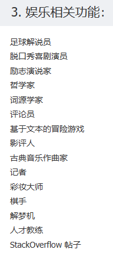

# ChatGPT应用领域

ChatGPT是一种基于GPT-4架构的大型语言模型，具有极高的自然语言生成和理解能力。它已经被广泛应用于许多领域，包括自然语言处理、聊天机器人、文本生成和语音识别等。本文将探讨ChatGPT在这些领域的应用，并探讨其未来发展方向。

关键词：ChatGPT、自然语言处理、聊天机器人、文本生成、语音识别

一、引言

自然语言处理（Natural Language Processing, NLP）是人工智能领域的一个重要分支。它涉及到对人类语言的理解、生成和应用等方面。随着人工智能技术的不断发展，NLP领域也得到了快速发展。在NLP领域中，大型语言模型已经成为了一种非常流行的技术。ChatGPT是一种基于GPT-3.5架构的大型语言模型，具有极高的自然语言生成和理解能力。本文将重点探讨ChatGPT在自然语言处理、聊天机器人、文本生成和语音识别等领域的应用。

二、ChatGPT在自然语言处理中的应用

自然语言处理是ChatGPT应用的重要领域之一。ChatGPT能够对自然语言进行处理和分析，从而实现各种语言任务，例如自动摘要、文本分类、命名实体识别、情感分析等。ChatGPT的应用能够帮助人们更好地理解和处理自然语言。

ChatGPT在文本生成方面具有突出的性能，可以生成具有连贯性和逻辑性的文章、新闻和评论等文本。此外，ChatGPT还可以用于对话系统的开发，可以与人类用户进行自然对话。ChatGPT能够理解用户的输入，并根据上下文生成合适的回复。因此，ChatGPT在虚拟助手、客服系统、问答系统等领域中有广泛的应用。

三、ChatGPT在聊天机器人中的应用

聊天机器人是一种基于人工智能技术的对话系统，可以与人类用户进行自然对话。聊天机器人能够理解用户的输入，并根据上下文生成合适的回复。聊天机器人的应用在社交媒体、在线客服、教育和健康等领域都有广泛的应用。

ChatGPT在聊天机器人中的应用非常广泛，它可以作为一种虚拟助手为用户提供服务，也可以作为一种问答机器人来回答用户的问题。ChatGPT具有强大的自然语言生成能力，能够生成连贯、流畅的对话内容。此外，ChatGPT还能够理解用户的情感和语气，从而生成合适的回复，使得对话更加真实和自然。

ChatGPT还可以通过对话场景的设置来提高聊天机器人的应用效果。例如，对于医疗领域，可以设置针对特定疾病的问答场景，提供针对性的帮助和建议。对于教育领域，可以设置针对不同学科的问答场景，帮助学生更好地学习和理解知识。

四、ChatGPT在文本生成中的应用

文本生成是ChatGPT的另一个应用领域。ChatGPT能够生成各种类型的文本，例如新闻、故事、诗歌等。ChatGPT的生成内容具有逻辑性、连贯性和自然性，可以用于生成各种文本内容。

ChatGPT在文本生成方面的应用非常广泛。例如，可以使用ChatGPT来生成新闻报道，以提高新闻的撰写效率。此外，ChatGPT还可以用于自动生成广告文案、产品描述等内容。ChatGPT的应用可以提高工作效率，节省时间和人力成本。

五、ChatGPT在语音识别中的应用

语音识别是另一个ChatGPT应用的领域。ChatGPT可以通过分析语音信号来识别人类语言。语音识别技术可以应用于语音助手、语音翻译、语音搜索等领域。

ChatGPT在语音识别方面的应用也非常广泛。例如，可以使用ChatGPT来开发智能语音助手，使得用户能够通过语音命令来控制设备、获取信息等。此外，ChatGPT还可以用于语音翻译，将语音转化为不同语言的文本内容。

六、未来展望

ChatGPT是一种非常强大的语言模型，具有广泛的应用前景。随着人工智能技术的不断发展，ChatGPT的应用领域也将不断拓展。

在未来，ChatGPT将继续在自然语言处理、聊天机器人、文本生成和语音识别等领域发挥重要作用。同时，ChatGPT的应用还将拓展到更多领域，例如图像处理、自动驾驶、智能医疗等。

在图像处理领域，ChatGPT可以应用于图像标注和图像生成。通过结合图像和自然语言，ChatGPT可以自动生成图像描述或者从图像中生成相应的文本内容。在自动驾驶领域，ChatGPT可以用于车内语音交互系统，使得驾驶者能够通过语音命令来控制车辆。在智能医疗领域，ChatGPT可以应用于患者问诊、病历记录、医学知识库等方面，提高医疗服务的效率和质量。

总之，ChatGPT是一种非常有潜力的语言模型，具有广泛的应用前景。它可以应用于自然语言处理、聊天机器人、文本生成和语音识别等领域，还可以拓展到更多领域，例如图像处理、自动驾驶、智能医疗等。随着人工智能技术的不断发展，ChatGPT的应用领域也将不断扩大。

尽管ChatGPT的应用前景非常广泛，但是在实际应用中还存在一些挑战和问题。下面将重点介绍一些与ChatGPT应用相关的挑战和问题。

一、数据隐私和安全

ChatGPT的训练需要大量的数据，其中可能包含用户的个人信息。在实际应用中，如何保护用户的数据隐私和安全是一个重要的问题。同时，ChatGPT本身也可能存在一些安全隐患，例如被恶意攻击或者用于不良用途。

二、模型的偏见和歧视

由于训练数据的局限性，ChatGPT模型可能存在一些偏见和歧视。例如，对某些人群或者话题的理解可能存在误差，从而导致生成的内容存在歧视性。因此，在应用ChatGPT模型时，需要对模型进行审查和调整，以减少偏见和歧视的影响。

三、模型的可解释性和可控性

ChatGPT模型的复杂性和不确定性使得其很难被解释和控制。在某些情况下，可能需要对ChatGPT生成的内容进行审核和审查，以保证其合法性和准确性。同时，也需要考虑如何解释和解释ChatGPT模型生成的内容，以满足用户的需求和期望。

四、模型的效率和性能

由于ChatGPT模型的巨大规模和复杂性，其训练和应用的效率和性能也是一个重要的问题。在实际应用中，需要考虑如何减少模型的计算和存储开销，以提高模型的效率和性能。

总之，尽管ChatGPT在各种应用领域都有广泛的前景，但是其应用中还存在一些挑战和问题。这些问题需要我们在应用ChatGPT模型时认真考虑，并且不断研究和探索相应的解决方法。

参考：[浅谈ChatGPT应用领域 - 知乎 (zhihu.com)](https://zhuanlan.zhihu.com/p/615289288)

研究生如何利用ChatGPT帮助开展日常科研工作?
不过，尽管ChatGPT此次回答不尽如人意，但在一些基础的科研工作上，ChatGPT还是能起到一定的辅助作用。
**论文搜集**
指定论文主题和时间范围，ChatGPT会自动给出一些代表性论文，根据论文顺藤摸瓜，可以对相关领域有大概了解。

**作为普通人，可以用ChatGPT做什么？**
作为一种预训练语言模型，ChatGPT为普通人提供了诸多方便和帮助。下面是一些具体的例子：
生成文本：ChatGPT可以根据用户的输入生成相关的文本，比如可以生成故事、文章、诗歌等。
回答问题：ChatGPT可以回答各种常见问题，比如历史、地理、数学、科学等。
对话：ChatGPT可以与用户进行对话，帮助用户解决问题、获取信息等。
记录和提醒：ChatGPT可以帮助用户记录信息，比如日程、清单等，并在合适的时候提醒用户。
语音识别和合成：ChatGPT可以支持语音识别和合成，帮助用户完成语音控制任务等。
总的来说，ChatGPT是一种非常实用的工具，能够帮助普通人提高工作效率，解决日常问题。随着人工智能技术的不断提高，ChatGPT的功能将会不断增强，为普通人带来更多便捷和帮助。

[功能_chatgpt可以做些什么？chatgpt已探索的143个功能分类\] (u72.net)](https://www.u72.net/dev/show-109877.html)

## Transformer

# 个人总结部分

## 个人总结

ChatGPT模型可能存在一些偏见和歧视。例如，对某些人群或者话题的理解可能存在误差，从而导致生成的内容存在歧视性。因此，在应用ChatGPT模型时，需要对模型进行审查和调整，以减少偏见和歧视的影响。比如使用中发现的问题：新闻中说对非母语的人的作文误判AI生成为70%多；比如询问诗词的后半句，回答的是诗词的解释。

近日，北京大学北京国际数学研究中心推出的一道数学题，获得了数学爱好者的广泛关注。
出题的是北京大学数学科学学院研究员，第49届、第50届国际数学奥林匹克竞赛满分金牌得主韦东奕。

现阶段的GPT-4，虽然在一次次的提示下逻辑推理能力有大幅度的提升，但答案从第二行开始就有错误，提示了5次也没有做对，目前的GPT-4还是无法完成稍微有挑战的数学问题。
中国科学院院士、北京大学数学科学学院教授、北京国际数学研究中心主任田刚说，目前看来，在“解答有挑战的数学问题”这个任务上人类大脑具有优势，但是随着AI不断升级更新，这种优势能在多大程度上保持呢？年轻一代将肩负起探寻这一问题答案的重任。