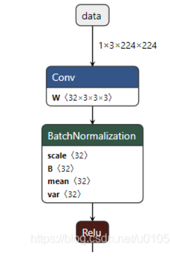
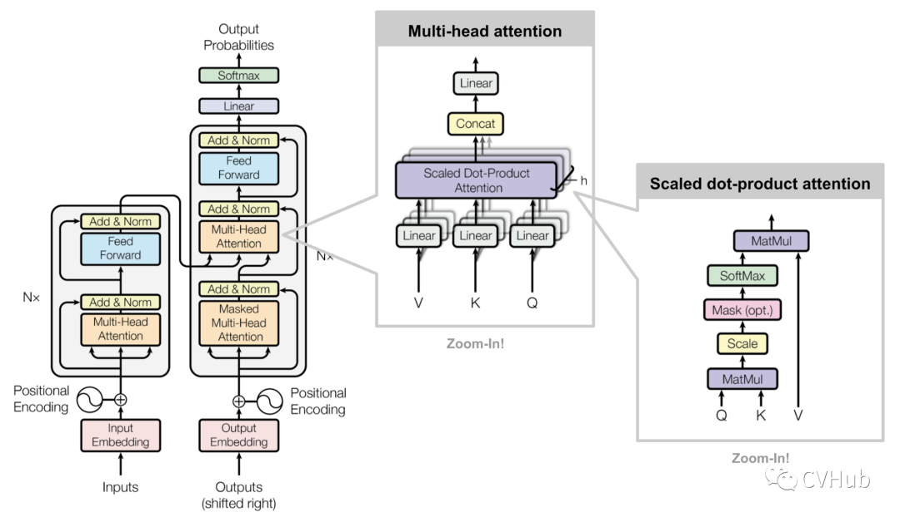
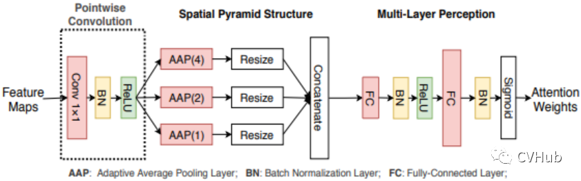
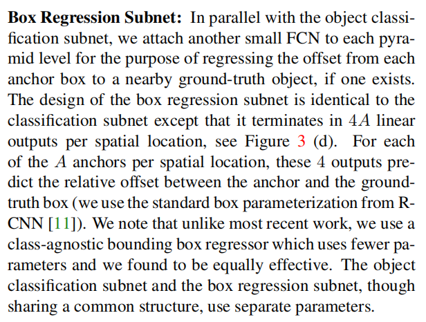

# 神经网络笔记


## 3DUNet


支持任意尺寸的输入,关键代码：

```cpp
 def center_crop(self, skip_connection, x):
        skip_shape = torch.tensor(skip_connection.shape)
        x_shape = torch.tensor(x.shape)
        crop = skip_shape[2:] - x_shape[2:]
        half_crop = (crop / 2).int()
        # If skip_connection is 10, 20, 30 and x is (6, 14, 12)
        # Then pad will be (-2, -2, -3, -3, -9, -9)
        pad = -torch.stack((half_crop, half_crop)).t().flatten()
        skip_connection = F.pad(skip_connection, pad.tolist())
        return skip_connection
```

解码器中调用：

```cpp
 def forward(self, skip_connection, x):
        x = self.upsample(x)
        skip_connection = self.center_crop(skip_connection, x)
        x = torch.cat((skip_connection, x), dim=CHANNELS_DIMENSION)
        if self.residual:
            connection = self.conv_residual(x)
            x = self.conv1(x)
            x = self.conv2(x)
            x += connection
        else:
            x = self.conv1(x)
            x = self.conv2(x)
        return x
```


## 神经网络基础

FCN为什么需要固定尺寸的输入？

一个确定的CNN网络结构之所以要固定输入图片大小，是因为全连接层权值数固定，而该权值数和feature map大小有关, 但是FCN在CNN的基础上把1000个结点的全连接层改为含有1000个1×1卷积核的卷积层，经过这一层，还是得到二维的feature map，同样我们也不关心这个feature map大小, 所以对于输入图片的size并没有限制。

# 深度学习常见问题

## 深度学习常用方法

现在在应用领域应用的做多的是DNN，CNN和RNN。

- DNN是传统的全连接网络，可以用于广告点击率预估，推荐等。其使用embedding的方式将很多离散的特征编码到神经网络中，可以很大的提升结果。

- CNN主要用于计算机视觉(Computer Vision)领域，CNN的出现主要解决了DNN在图像领域中参数过多的问题。同时，CNN特有的卷积、池化、batch normalization、Inception、ResNet、DeepNet等一系列的发展也使得在分类、物体检测、人脸识别、图像分割等众多领域有了长足的进步。同时，CNN不仅在图像上应用很多，在自然语言处理上也颇有进展，现在已经有基于CNN的语言模型能够达到比LSTM更好的效果。在最新的AlphaZero中，CNN中的ResNet也是两种基本算法之一。

- GAN是一种应用在生成模型的训练方法，现在有很多在CV方面的应用，例如图像翻译，图像超清化、图像修复等等。

## 简单说说CNN常用的几个模型


## 在神经网络中，有哪些办法防止过拟合

1. Dropout

2. 加L1/L2正则化

3. BatchNormalization

4. 网络bagging

5. 提取终止训练

6. 数据增强


## CNN是什么，CNN关键的层有哪些？

其关键层有：

① 输入层，对数据去均值，做data augmentation等工作

② 卷积层，局部关联抽取feature

③ 激活层，非线性变化

④ 池化层，下采样

⑤ 全连接层，增加模型非线性

⑥ 高速通道，快速连接

⑦ BN层，缓解梯度弥散

## 如何解决深度学习中模型训练效果不佳的情况？

如果模型的训练效果不好，可先考察以下几个方面是否有可以优化的地方。

(1)选择合适的损失函数（choosing proper loss ）

神经网络的损失函数是非凸的，有多个局部最低点，目标是找到一个可用的最低点。非凸函数是凹凸不平的，但是不同的损失函数凹凸起伏的程度不同，例如下述的平方损失和交叉熵损失，后者起伏更大，且后者更容易找到一个可用的最低点，从而达到优化的目的。

\- Square Error（平方损失）

\- Cross Entropy（交叉熵损失）

(2)选择合适的Mini-batch size

采用合适的Mini-batch进行学习，使用Mini-batch的方法进行学习，一方面可以减少计算量，一方面有助于跳出局部最优点。因此要使用Mini-batch。更进一步，batch的选择非常重要，batch取太大会陷入局部最小值，batch取太小会抖动厉害，因此要选择一个合适的batch size。


# 深度学习实践


## pytorch模型导出onnx模型


```python
def export_onnx(model, input, input_names, output_names, modelname):
    dummy_input = input
    torch.onnx.export(model, dummy_input, modelname,
                      export_params=True,
                      verbose=False,
                      opset_version=13,
                      input_names=input_names,
                      output_names=output_names, dynamic_axes={'input': {2: "input_dynamic_axes_1", 3: "input_dynamic_axes_1",
                    4: "input_dynamic_axes_1"}, 'output': {2: "input_dynamic_axes_1", 3: "input_dynamic_axes_1", 4: "input_dynamic_axes_1"}})
    # torch.onnx.export(model, dummy_input, modelname,
    #                   export_params=True,
    #                   verbose=False,
    #                   opset_version=12,
    #                   input_names=input_names,
    #                   output_names=output_names)
    print("export onnx model success!")
    
 with torch.no_grad():
        # net.eval()
        input = torch.randn(1, 1, 224, 144, 144, device=device)
        # itk_img = sitk.ReadImage('D:/Dataset/Hip_Femur_Detection/Detect/BJ_02006.nii.gz')
        # img_arr = sitk.GetArrayFromImage(itk_img)
        # img_arr = img_arr[np.newaxis, np.newaxis, :, :, :]
        # input = torch.from_numpy(img_arr).float()
        input_names = ['input']
        output_names = ['output']
        export_onnx(net, input, input_names, output_names, "test.onnx")

        exit(0)
```

## 反卷积输出尺寸计算

[ConvTranspose3d — PyTorch 1.12 documentation](https://pytorch.org/docs/stable/generated/torch.nn.ConvTranspose3d.html?highlight=convtranspose3d#torch.nn.ConvTranspose3d)


##  根据网络结构图反向工程网络


```python
# -*- coding : UTF-8 -*-
# @file   : UNET_3D.py
# @Time   : 2022/8/11 0011 21:50
# @Author : wmz

import torch
import torch.nn as nn


class DoubleConv(nn.Module):
    def __init__(self, in_channels, out_channels=[32, 64],
                 kernel_size=3, padding=1):
        super(DoubleConv, self).__init__()
        if isinstance(out_channels, int):
            out_channels = [out_channels] * 2

        self.doubleConv = nn.Sequential(
            nn.Conv3d(in_channels, out_channels[0],
                      kernel_size=kernel_size, padding=padding),
            nn.BatchNorm3d(out_channels[0]),
            nn.ReLU(inplace=True),
            nn.Conv3d(out_channels[0], out_channels[1],
                      kernel_size=kernel_size, padding=padding),
            nn.BatchNorm3d(out_channels[1]),
            nn.ReLU(inplace=True)
        )

    def forward(self, x):
        return self.doubleConv(x)


class Down(nn.Module):
    def __init__(self, in_channels, out_channels=[32, 64]):
        super(Down, self).__init__()

        self.maxpool_conv = nn.Sequential(
            nn.MaxPool3d(kernel_size=2),
            DoubleConv(in_channels, out_channels)
        )

    def forward(self, x):
        return self.maxpool_conv(x)


class Up(nn.Module):
    def __init__(self, in_channels, out_channels):
        super(Up, self).__init__()
        # self.trans_conv = nn.Upsample(scale_factor=2, mode='trilinear', align_corners=True)

        self.trans_conv = nn.ConvTranspose3d(in_channels, out_channels, kernel_size=2, stride=2, dilation=2, padding=1, output_padding=1)

        self.double_conv = DoubleConv(out_channels + out_channels, out_channels)

    def forward(self, x_trans, x_cat):
        x = self.trans_conv(x_trans)
        #print("x_trans", x_trans.shape)
        #print("x", x.shape)
        #print("x_cat", x_cat.shape)
        x = torch.cat([x_cat, x], dim=1)
        return self.double_conv(x)


class Out(nn.Module):
    def __init__(self, in_channels, out_channels):
        super(Out, self).__init__()
        self.conv = nn.Conv3d(in_channels, out_channels, kernel_size=1)
        #self.bn = nn.BatchNorm3d(out_channels)
        self.norm = nn.ReLU()
        #self.norm = nn.Tanh()

    def forward(self, x):
        return self.norm(self.conv(x))


ch = [32,32,64,128,256,512]
class UNet_3D(nn.Module):
    def __init__(self, in_channels, out_classes, last_layer=Out):
        super(UNet_3D, self).__init__()
        self.encoder_1 = DoubleConv(in_channels, [ch[0], ch[1]]) # 32,32
        self.encoder_2 = Down(ch[1], [ch[2], ch[2]]) #32, 64 64
        self.encoder_3 = Down(ch[2], [ch[3], ch[3]]) # 64,128,128
        self.encoder_4 = Down(ch[3], [ch[4], ch[4]])  # 128,256,256
        self.buttom = Down(ch[4], [ch[5], ch[5]]) # 256,512,512
        self.decoder_4 = Up(ch[5], ch[4])  # 512,256
        self.decoder_3 = Up(ch[4], ch[3]) #256,128
        self.decoder_2 = Up(ch[3], ch[2]) # 128, 64
        self.decoder_1 = Up(ch[2], ch[1]) # 64, 32
        self.output = last_layer(ch[1], out_classes) if last_layer is not None else None

    def forward(self, x):
        e1 = self.encoder_1(x)
        e2 = self.encoder_2(e1)
        e3 = self.encoder_3(e2)
        e4 = self.encoder_4(e3)
        e = self.buttom(e4)
        #print(e.shape, e3.shape)
        d4 = self.decoder_4(e, e4)
        d3 = self.decoder_3(d4, e3)
        d2 = self.decoder_2(d3, e2)
        d1 = self.decoder_1(d2, e1)
        if self.output is not None:
            d1 = self.output(d1)
        return d1


def export_onnx(model, input, input_names, output_names, modelname):
    dummy_input = input
    torch.onnx.export(model, dummy_input, modelname,
                      export_params=True,
                      verbose=False,
                      opset_version=13,
                      input_names=input_names,
                      output_names=output_names, dynamic_axes={'input': {2: "input_dynamic_axes_1", 3: "input_dynamic_axes_1",
                    4: "input_dynamic_axes_1"}, 'output': {2: "input_dynamic_axes_1", 3: "input_dynamic_axes_1", 4: "input_dynamic_axes_1"}})
    # torch.onnx.export(model, dummy_input, modelname,
    #                   export_params=True,
    #                   verbose=False,
    #                   opset_version=12,
    #                   input_names=input_names,
    #                   output_names=output_names)
    print("export onnx model success!")


if __name__ == "__main__":
    import numpy as np
    device = torch.device('cpu')

    x = np.random.rand(1, 1, 224, 144, 144)
    pt = torch.from_numpy(x).float()
    net = UNet_3D(in_channels=1, out_classes=1)
    # net.train()
    y = net(pt)
    with torch.no_grad():
        # net.eval()
        input = torch.randn(1, 1, 224, 144, 144, device=device)
        # itk_img = sitk.ReadImage('D:/Dataset/Hip_Femur_Detection/Detect/BJ_02006.nii.gz')
        # img_arr = sitk.GetArrayFromImage(itk_img)
        # img_arr = img_arr[np.newaxis, np.newaxis, :, :, :]
        # input = torch.from_numpy(img_arr).float()
        input_names = ['input']
        output_names = ['output']
        export_onnx(net, input, input_names, output_names, "test.onnx")

        exit(0)
    print(y.shape)


```


## 神经网络数据加载

[torch.utils.data — PyTorch 1.12 documentation](https://pytorch.org/docs/stable/data.html?highlight=dataset#torch.utils.data.Dataset)


## onnx模型

[[ONNX从入门到放弃\] 1. ONNX协议基础 - 知乎 (zhihu.com)](https://zhuanlan.zhihu.com/p/456124635)

 ONNX是开放式[神经网络](https://so.csdn.net/so/search?q=神经网络&spm=1001.2101.3001.7020)(Open Neural Network Exchange)的简称，主要由微软和合作伙伴社区创建和维护。

###  onnx结构

通过阅读github上ONNX工程中的.proto文件，很容易发现ONNX由下面几部分组成。

| 类型           | 用途                                                         |
| -------------- | ------------------------------------------------------------ |
| ModelProto     | 定义了整个网络的模型结构                                     |
| GraphProto     | 定义了模型的计算逻辑，包含了构成图的节点，这些节点组成了一个有向图结构 |
| NodeProto      | 定义了每个OP的具体操作                                       |
| ValueInfoProto | 序列化的张量，用来保存weight和bias                           |
| TensorProto    | 定义了输入输出形状信息和张量的维度信息                       |
| AttributeProto | 定义了OP中的具体参数，比如Conv中的stride和kernel_size等      |

在工程实践中，导出一个ONNX模型就是导出一个ModelProto。ModelProto中包含GraphProto、版本号等信息。GraphProto又包含了NodeProto类型的node，ValueInfoProto类型的input和output，TensorProto类型的initializer。其中，node包含了模型中的所有OP，input和output包含了模型的输入和输出，initializer包含了所有的权重信息。 每个计算节点node中还包含了一个AttributeProto数组，用来描述该节点的属性，比如Conv节点或者卷积层的属性包含group，pad，strides等等。

### 构建ONNX模型


在熟悉了ONNX的模型结构之后，可以采用ONNX官方提供的API构建ONNX的网络结构，这里举一个简单的例子。

```python
# -*- coding : UTF-8 -*-
# @file   : test_onnx.py
# @Time   : 2022-09-03 18:24
# @Author : wmz

import onnx
from onnx import helper
from onnx import AttributeProto, TensorProto, GraphProto

if __name__ == '__main__':
    # 创建输入（ValueInfoProto）
    X = helper.make_tensor_value_info('X', TensorProto.FLOAT, [3, 2])
    pads = helper.make_tensor_value_info('pads', TensorProto.FLOAT, [1, 4])
    value = helper.make_tensor_value_info('value', AttributeProto.FLOAT, [1])

    # 创建输出 （ValueInfoProto）
    Y = helper.make_tensor_value_info('Y', TensorProto.FLOAT, [3, 4])

    # 创建节点（NodeProto）
    node_def = helper.make_node(
        'Pad',  # node name
        ['X', 'pads', 'value'],  # inputs
        ['Y'],  # outputs
        mode='constant',  # attributes
    )

    # 创建图 （GraphProto）
    graph_def = helper.make_graph(
        [node_def],
        'test_model',
        [X, pads, value],
        [Y],
    )

    # 创建模型(ModelProto)
    model_def = helper.make_model(graph_def, producer_name='onnx-example')

    print('The model is: \n{}'.format(model_def))
    onnx.checker.check_model(model_def)
    onnx.save(model_def, "./test_model.onnx")
    print('The model is checked!')

```

该例从onnx.helper模块中引入了多个函数，helper模块相当于对onnx的protobuf输出做了简单的封装，用户可以直接调用helper模块中提供的接口构造ONNX模型。按照之前提到过的ONNX结构定义，先构建模型的输入与输出，再构建模型的多个节点操作，用图将节点封装，一个复杂的模型中可能包含多个子图，所以图是模型的子集，最后再定义模型本身，构建相应的参数，打印的结果如下所示：

```bash
The model is: 
ir_version: 8
producer_name: "onnx-example"
graph {
  node {
    input: "X"
    input: "pads"
    input: "value"
    output: "Y"
    op_type: "Pad"
    attribute {
      name: "mode"
      s: "constant"
      type: STRING
    }
  }
  name: "test_model"
  input {
    name: "X"
    type {
      tensor_type {
        elem_type: 1
        shape {
          dim {
            dim_value: 3
          }
          dim {
            dim_value: 2
          }
        }
      }
    }
  }
  input {
    name: "pads"
    type {
      tensor_type {
        elem_type: 1
        shape {
          dim {
            dim_value: 1
          }
          dim {
            dim_value: 4
          }
        }
      }
    }
  }
  input {
    name: "value"
    type {
      tensor_type {
        elem_type: 1
        shape {
          dim {
            dim_value: 1
          }
        }
      }
    }
  }
  output {
    name: "Y"
    type {
      tensor_type {
        elem_type: 1
        shape {
          dim {
            dim_value: 3
          }
          dim {
            dim_value: 4
          }
        }
      }
    }
  }
}
opset_import {
  version: 15
}

The model is checked!

Process finished with exit code 0

```

### AI模型可视化

生成模型后，往往需要对导出的模型结构进行查看，这时模型可视化就显得十分重要。

目前，github上已经有多款开源的AI模型可视化工具，它们都有自己的特色，如TensorBoard，Netscope等。这里介绍一个非常好用的可视化工具Netron。

用Netron打开用onnx.helper导出的模型：


[(2条消息) ONNX构建并运行模型_亦梦云烟的博客-CSDN博客_onnx模型](https://blog.csdn.net/u010580016/article/details/119493797)

### ONNX文件格式

ONNX文件是基于Protobuf进行序列化。了解Protobuf协议的同学应该知道，Protobuf都会有一个*.proto的文件定义协议，ONNX的该协议定义在https://github.com/onnx/onnx/blob/master/onnx/onnx.proto3 文件中。

从onnx.proto3协议中我们需要重点知道的数据结构如下：

- ModelProto：模型的定义，包含版本信息，生产者和GraphProto。
- GraphProto: 包含很多重复的NodeProto, initializer, ValueInfoProto等，这些元素共同构成一个计算图，在GraphProto中，这些元素都是以列表的方式存储，连接关系是通过Node之间的输入输出进行表达的。
- NodeProto: onnx的计算图是一个有向无环图(DAG)，NodeProto定义算子类型，节点的输入输出，还包含属性。
- ValueInforProto: 定义输入输出这类变量的类型。
- TensorProto: 序列化的权重数据，包含数据的数据类型，shape等。
- AttributeProto: 具有名字的属性，可以存储基本的数据类型(int, float, string, vector等)也可以存储onnx定义的数据结构(TENSOR, GRAPH等)。


### 搭建ONNX模型
 ONNX是用DAG来描述网络结构的，也就是一个网络(Graph)由节点(Node)和边(Tensor)组成，ONNX提供的helper类中有很多API可以用来构建一个ONNX网络模型，比如make_node, make_graph, make_tensor等，下面是一个单个Conv2d的网络构造示例：

```python
# -*- coding : UTF-8 -*-
# @file   : onnx_p2.py
# @Time   : 2022-09-03 19:10
# @Author : wmz
import onnx
from onnx import helper
from onnx import TensorProto
import numpy as np

if __name__ == '__main__':
    weight = np.random.randn(36)
    X = helper.make_tensor_value_info('X', TensorProto.FLOAT, [1, 2, 4, 4])
    W = helper.make_tensor('W', TensorProto.FLOAT, [2, 2, 3, 3], weight)
    B = helper.make_tensor('B', TensorProto.FLOAT, [2], [1.0, 2.0])
    Y = helper.make_tensor_value_info('Y', TensorProto.FLOAT, [1, 2, 2, 2])

    node_def = helper.make_node(
        'Conv',  # node name
        ['X', 'W', 'B'],
        ['Y'],  # outputs
        # attributes
        strides=[2, 2],
    )

    graph_def = helper.make_graph(
        [node_def],
        'test_conv_mode',
        [X],  # graph inputs
        [Y],  # graph outputs
        initializer=[W, B],
    )

    mode_def = helper.make_model(graph_def, producer_name='onnx-example')
    onnx.checker.check_model(mode_def)
    onnx.save(mode_def, "./Conv.onnx")

```


搭建的这个Conv[算子](https://so.csdn.net/so/search?q=算子&spm=1001.2101.3001.7020)模型使用netron可视化如下图所示：


这个示例演示了如何使用helper的make_tensor_value_info, make_mode, make_graph, make_model等方法来搭建一个onnx模型。

        相比于PyTorch或其它框架，这些API看起来仍然显得比较繁琐，一般我们也不会用ONNX来搭建一个大型的网络模型，而是通过其它框架转换得到一个ONNX模型。


### Shape Inference

很多时候我们从pytorch, [tensorflow](https://so.csdn.net/so/search?q=tensorflow&spm=1001.2101.3001.7020)或其他框架转换过来的onnx模型中间节点并没有shape信息，如下图所示：




 我们经常希望能直接看到网络中某些node的shape信息，shape_inference模块可以推导出所有node的shape信息，这样可视化模型时将会更友好：


```python
import onnx
from onnx import shape_inference
 
onnx_model = onnx.load("./test_data/mobilenetv2-1.0.onnx")
onnx_model = shape_inference.infer_shapes(onnx_model)
onnx.save(onnx_model, "./test_data/mobilenetv2-1.0_shaped.onnx")
```

可视化经过shape_inference之后的模型如下图：


### ONNX Optimizer

ONNX的optimizer模块提供部分图优化的功能，例如最常用的：fuse_bn_into_conv，fuse_pad_into_conv等等。

​    查看onnx支持的优化方法：

```python
from onnx import optimizer
all_passes = optimizer.get_available_passes()
print("Available optimization passes:")
for p in all_passes:
    print(p)
print()
```


[(2条消息) 模型部署入门教程（五）：ONNX 模型的修改与调试_OpenMMLab的博客-CSDN博客_onnx模型](https://blog.csdn.net/qq_39967751/article/details/124989296)


## onnx模型加密


[(2条消息) onnxruntime(c++)模型加密与解密部署_小小菜鸡升级ing的博客-CSDN博客_onnx模型加密](https://blog.csdn.net/weixin_39853245/article/details/117953268)


```cpp
//加密模型
#ifdef WINVER
void encryptDecrypt(const wchar_t* toEncrypt, int strLength, const wchar_t* key, wchar_t* output)
{
        int keyLength = wcslen(key);
        for (int i = 0; i < strLength; i++)
        {
                output[i] = toEncrypt[i] ^ key[i % keyLength];
        }
}
#else
void encryptDecrypt(const char* toEncrypt, int strLength, const char* key, wchar_t* output)
{
        int keyLength = strlen(key);
        for (int i = 0; i < strLength; i++)
        {
                output[i] = toEncrypt[i] ^ key[i % keyLength];
        }
}
#endif


int main()
{
        bool bRet = true;
        std::string model_path = "11.onnx";
        FILE *pModel1File = fopen(model_path.c_str(), "rb");
        if (NULL == pModel1File)
        {
                bRet = false;

        }
        int length = 0;
        fseek(pModel1File, 0, SEEK_END);
        length = ftell(pModel1File);
        fseek(pModel1File, 0, SEEK_SET);
        ORTCHAR_T* model1rbuffer = nullptr;
        model1rbuffer = new ORTCHAR_T[length];
        if (nullptr == model1rbuffer) {
                bRet = false;
        }

        fread((ORTCHAR_T *)model1rbuffer, 1, length, pModel1File);
        fclose(pModel1File);

        //写入加密模型
        FILE *pOutFile = fopen("1.data", "wb");
        if (NULL == pOutFile)
        {
                return -1;
        }
        #ifdef WINVER
        const wchar_t* key = L"1234";
        const wchar_t* encrypted = new wchar_t[length];
        #else
        const char* key = "1234";
        const char* encrypted = new char[length];
        #endif
        encryptDecrypt(model1rbuffer, length, key, encrypted);
        fwrite(encrypted, 1,  length, pOutFile);
        fclose(pOutFile);
        delete[] encrypted;
        delete[] model1rbuffer;
        system("pause");
        return 0;
}


// 解密模型加载
int main() 
{
        bool bRet = true;
        std::string model_path = "1.data";
        FILE *pModel1File = fopen(model_path.c_str(), "rb");
        if (NULL == pModel1File)
        {
                bRet = false;
        }
        int length = 0;
        fseek(pModel1File, 0, SEEK_END);
        length = ftell(pModel1File);
        fseek(pModel1File, 0, SEEK_SET);
        ORTCHAR_T* model1rbuffer = nullptr;
        model1rbuffer = new ORTCHAR_T[length];
        if (nullptr == model1rbuffer) {
                bRet = false;
        }

        fread((ORTCHAR_T *)model1rbuffer, 1, length, pModel1File);
        fclose(pModel1File);
        #ifdef WINVER
        	const wchar_t* key = L"1234";
        	const wchar_t* encrypted = new wchar_t[length];
        #else
        	const char* key = "1234";
        	const char* encrypted = new char[length];
        #endif
        
        encryptDecrypt(model1rbuffer, length, key, decrypted);

        const OrtApi* g_ort = OrtGetApiBase()->GetApi(ORT_API_VERSION);
        OrtEnv* env_;
        g_ort->CreateEnv(ORT_LOGGING_LEVEL_WARNING, "cyril", &env_);
        OrtSessionOptions* session_options_= nullptr;
        OrtSession* session_= nullptr;
        g_ort->CreateSessionOptions(&session_options_);
        g_ort->SetIntraOpNumThreads(session_options_, 1);
        g_ort->SetSessionGraphOptimizationLevel(session_options_, ORT_ENABLE_ALL);
        //g_ort->CreateSession(env_, model1rbuffer, session_options_, &session_);
        g_ort->CreateSessionFromArray(env_, decrypted, length, session_options_, &session_);
        std::cout << "ok!" << std::endl;
        delete[] model1rbuffer;
        delete[] decrypted;
        system("pause");
        return 0;
}


```


# DL 各种机制和模块


## SCE模块

[CV中的attention机制之（cSE，sSE，scSE）_just-solo的博客-CSDN博客_scse注意力](https://blog.csdn.net/justsolow/article/details/106517945)


[最简单最易实现的SE模块（Squeeze-and-Excitation Networks）_just-solo的博客-CSDN博客_神经网络se模块](https://blog.csdn.net/justsolow/article/details/105376899)


Squeeze-and-Excitation Networks

SENet是Squeeze-and-Excitation Networks的简称，拿到了ImageNet2017分类比赛冠军，其效果得到了认可，其提出的SE模块思想简单，易于实现，并且很容易可以加载到现有的网络模型框架中。SENet主要是学习了channel之间的相关性，筛选出了针对通道的注意力，稍微增加了一点计算量，但是效果比较好。


> 本文介绍了一个用于语义分割领域的attention模块scSE。scSE模块与之前介绍的BAM模块很类似，不过在这里scSE模块只在语义分割中进行应用和测试，对语义分割准确率带来的提升比较大，还可以让分割边界更加平滑。

提出scSE模块论文的全称是：《**Concurrent Spatial and Channel ‘Squeeze & Excitation’ in Fully Convolutional Networks** 》。这篇文章对SE模块进行了改进，提出了SE模块的三个变体cSE、sSE、scSE，并通过实验证明了了这样的模块可以增强有意义的特征，抑制无用特征。实验是基于两个医学上的数据集MALC Dataset和Visceral Dataset进行实验的。

语义分割模型大部分都是类似于U-Net这样的encoder-decoder的形式，先进行下采样，然后进行上采样到与原图一样的尺寸。其添加SE模块可以添加在每个卷积层之后，用于对feature map信息的提炼。具体方案如下图所示：


然后开始分别介绍由SE改进的三个模块，首先说明一下图例:


### cSE模块


这个模块类似之前BAM模块里的Channel attention模块，通过观察这个图就很容易理解其实现方法，具体流程如下:

- 将feature map通过global average pooling方法从[C, H, W]变为[C, 1, 1]
- 然后使用两个1×1×1卷积进行信息的处理，最终得到C维的向量
- 然后使用sigmoid函数进行归一化，得到对应的mask
- 最后通过channel-wise相乘，得到经过信息校准过的feature map


```python
import torch
import torch.nn as nn


class cSE(nn.Module):
    def __init__(self, in_channels):
        super().__init__()
        self.avgpool = nn.AdaptiveAvgPool2d(1)
        self.Conv_Squeeze = nn.Conv2d(in_channels,
                                      in_channels // 2,
                                      kernel_size=1,
                                      bias=False)
        self.Conv_Excitation = nn.Conv2d(in_channels // 2,
                                         in_channels,
                                         kernel_size=1,
                                         bias=False)
        self.norm = nn.Sigmoid()

    def forward(self, U):
        z = self.avgpool(U)  # shape: [bs, c, h, w] to [bs, c, 1, 1]
        z = self.Conv_Squeeze(z)  # shape: [bs, c/2, 1, 1]
        z = self.Conv_Excitation(z)  # shape: [bs, c, 1, 1]
        z = self.norm(z)
        return U * z.expand_as(U)


if __name__ == "__main__":
    bs, c, h, w = 10, 3, 64, 64
    in_tensor = torch.ones(bs, c, h, w)

    c_se = cSE(c)
    print("in shape:", in_tensor.shape)
    out_tensor = c_se(in_tensor)
    print("out shape:", out_tensor.shape)
```

输出：

```bash
in shape: torch.Size([10, 3, 64, 64])
out shape: torch.Size([10, 3, 64, 64])
```

### sSE模块：


上图是空间注意力机制的实现，与BAM中的实现确实有很大不同，实现过程变得很简单，具体分析如下：

- 直接对feature map使用1×1×1卷积, 从[C, H, W]变为[1, H, W]的features
- 然后使用sigmoid进行激活得到spatial attention map
- 然后直接施加到原始feature map中，完成空间的信息校准

NOTE: 这里需要注意一点，先使用1×1×1卷积，后使用sigmoid函数，这个信息无法从图中直接获取，需要理解论文。


```python
import torch
import torch.nn as nn


class sSE(nn.Module):
    def __init__(self, in_channels):
        super().__init__()
        self.Conv1x1 = nn.Conv2d(in_channels, 1, kernel_size=1, bias=False)
        self.norm = nn.Sigmoid()

    def forward(self, U):
        q = self.Conv1x1(U) # U:[bs,c,h,w] to q:[bs,1,h,w]
        q = self.norm(q)
        return U * q # 广播机制


if __name__ == "__main__":
    bs, c, h, w = 10, 3, 64, 64
    in_tensor = torch.ones(bs, c, h, w)

    s_se = sSE(c)
    print("in shape:", in_tensor.shape)
    out_tensor = s_se(in_tensor)
    print("out shape:", out_tensor.shape)
```

输出：

```bash
in shape: torch.Size([10, 3, 64, 64])
out shape: torch.Size([10, 3, 64, 64])
```

### scSE模块：


可以看出scSE是前两个模块的并联，与BAM的并联很相似，具体就是在分别通过sSE和cSE模块后，然后将两个模块相加，得到更为精准校准的feature map, 直接上代码：


```python
import torch
import torch.nn as nn


class sSE(nn.Module):
    def __init__(self, in_channels):
        super().__init__()
        self.Conv1x1 = nn.Conv2d(in_channels, 1, kernel_size=1, bias=False)
        self.norm = nn.Sigmoid()

    def forward(self, U):
        q = self.Conv1x1(U)  # U:[bs,c,h,w] to q:[bs,1,h,w]
        q = self.norm(q)
        return U * q  # 广播机制

class cSE(nn.Module):
    def __init__(self, in_channels):
        super().__init__()
        self.avgpool = nn.AdaptiveAvgPool2d(1)
        self.Conv_Squeeze = nn.Conv2d(in_channels, in_channels // 2, kernel_size=1, bias=False)
        self.Conv_Excitation = nn.Conv2d(in_channels//2, in_channels, kernel_size=1, bias=False)
        self.norm = nn.Sigmoid()

    def forward(self, U):
        z = self.avgpool(U)# shape: [bs, c, h, w] to [bs, c, 1, 1]
        z = self.Conv_Squeeze(z) # shape: [bs, c/2]
        z = self.Conv_Excitation(z) # shape: [bs, c]
        z = self.norm(z)
        return U * z.expand_as(U)

class scSE(nn.Module):
    def __init__(self, in_channels):
        super().__init__()
        self.cSE = cSE(in_channels)
        self.sSE = sSE(in_channels)

    def forward(self, U):
        U_sse = self.sSE(U)
        U_cse = self.cSE(U)
        return U_cse+U_sse

if __name__ == "__main__":
    bs, c, h, w = 10, 3, 64, 64
    in_tensor = torch.ones(bs, c, h, w)

    sc_se = scSE(c)
    print("in shape:",in_tensor.shape)
    out_tensor = sc_se(in_tensor)
    print("out shape:", out_tensor.shape)
```

输出：

```bash
in shape: torch.Size([10, 3, 64, 64])
out shape: torch.Size([10, 3, 64, 64])
```


## 3D SCE模块

 主要是对上面的2D的算子换成3D的算子。

```python
class sSE(nn.Module):
    def __init__(self, in_channels):
        super().__init__()
        self.conv1x1 = nn.Conv3d(in_channels, 1, 1, bias=False)
        self.norm = nn.Sigmoid()

    def forward(self, U):
        q = self.conv1x1(U)
        q = self.norm(q)
        return U * q  # 广播机制


class cSE(nn.Module):
    def __init__(self, in_channels):
        super().__init__()
        self.pool = nn.AdaptiveAvgPool3d(1)
        self.conv_squeeze = nn.Conv3d(
            in_channels, in_channels//2, 1, bias=False)
        self.conv_excitation = nn.Conv3d(
            in_channels//2, in_channels, 1, bias=False)
        self.norm = nn.Sigmoid()

    def forward(self, U):
        z = self.pool(U)
        z = self.conv_squeeze(z)
        z = self.conv_excitation(z)
        z = self.norm(z)
        return U * z.expand_as(U)


class scSE(nn.Module):
    def __init__(self, in_channels):
        super().__init__()
        self.sSE = sSE(in_channels)
        self.cSE = cSE(in_channels)

    def forward(self, U):
        U_sSE = self.sSE(U)
        U_cSE = self.cSE(U)
        return U_sSE + U_cSE

```


## DSNT模块

论文地址：[Numerical Coordinate Regression with Convolutional Neural Networks](https://arxiv.org/abs/1801.07372)
代码地址：https://github.com/anibali/dsntnn

比起主流的预测heatmap再使用argmax获得最大响应点的方法，作者提出用soft-argmax方法，直接从featuremap计算得到近似的最大响应点，从而模型可以直接对坐标值进行回归预测。

该方法的好处是：

- 可以极大节约显存，减少了很多代码量（省去了高斯热图的生成）;
- 计算速度很快（省去argmax）;
- 训练过程全部可微分;
- 能取得还不错的效果;

但是从近年的新论文实验对比，基于坐标回归的方法，先天缺少空间和上下文信息，这限制了方法的性能上限

- DSNT这种regression-based method对移动端非常友好，在移动设备上为了提高fps往往特征图会压到14x14甚至7x7，这个尺度下heatmap根本用不了;
- 另一个好处是可以比较方便地混合使用2d和3d训练数据，由于每一轴上的坐标都是通过将特征图求和压缩到一维再求期望得到的，因此可以很容易地用2d数据监督3d特征图（2d只比3d少算一次回归）

[DSNT与SCN](https://blog.csdn.net/juluwangriyue/article/details/122890209)

### 论文总结

本文提供了一种从图像中直接学习到坐标的一种思路。现在主流的方法都是基于高斯核处理的heatmap作为监督，但这种方法学习到的heatmap，在后处理得到坐标的过程中，存在量化误差（比如4倍下采样的heatmap，量化误差的期望是2）。

本文提出一种新的处理方法，称为DSNT，通过DSNT处理（没添加额外参数），直接对坐标进行监督。DSNT是对heatmap进行处理的，思路如下图所示。最后的处理过程，就是将heatmap通过softmax，得到一个基于heatmap的概率分布，再通过这个概率分布，与预设好的X，Y（坐标轴）进行点乘，得到坐标的期望值。监督损失也是建立在这个期望值上的。


与其他方法比较：


虽然文中的思想，主要说的是直接对坐标进行的回归，但实际上应用时，还是对heatmap做了约束的，而且权重还不算小。换个角度想，其实本文的实际操作，也可以认为，是对heatmap做了监督，然后添加了一个坐标的正则化因子。该正则化项的监督，可以有效减少heatmap转化成坐标的量化损失，与一些直接对heatmap做回归造成的损失误差与预期不符的问题。但是，这个heatmap项的损失也是精心挑选的，甚至不添加heatmap损失项，比不少heatmap损失计算方法的结果更好一些。

但是，对于那些在图像中不存在的关键点（比如半身），以及多人之类的问题，DSNT都不能直接进行解决。对于某些场景的应用，这是不可避免的问题。

个人见解：之所以DSNT能直接得到坐标，又能同时具有空间泛化能力，是在于两点：（1）其对heatmap进行了监督，监督对象为高斯分布，具有对称性；（2）其对坐标轴对象X,Y进行了精心设计，分别是1 ∗ n和n ∗ 1的单方向性，使其在两个坐标轴具有对称性。


上面是论文的片段，其中 $X \in [\frac{-(n-1)}{n}, \frac{n-1}{n}] \in (-1,1)$与 $Y \in [\frac{-(m-1)}{m}, \frac{m-1}{m}] \in (-1,1)$
官方实现：

```python
import torch
def normalized_linspace(length, dtype=None, device=None):
    """Generate a vector with values ranging from -1 to 1.
    Note that the values correspond to the "centre" of each cell, so
    -1 and 1 are always conceptually outside the bounds of the vector.
    For example, if length = 4, the following vector is generated:
    ```text
     [ -0.75, -0.25,  0.25,  0.75 ]
     ^              ^             ^
    -1              0             1
```
    Args:
        length: The length of the vector
    Returns:
        The generated vector
    """
    if isinstance(length, torch.Tensor):
        length = length.to(device, dtype)
    first = -(length - 1.0) / length
    return torch.arange(length, dtype=dtype, device=device) * (2.0 / length) + first
```

官方实现没有包含边界值，下面的实现包含了边界值，有没有包含边界值的区别是，结果中会不会出现边界
对于二维的情况：

```python
 B, C, Y, X = h.shape
 x = torch.linspace(-1, 1, X)
 y = torch.linspace(-1, 1, Y)
```
对于三维的情况：

```python
B, C, Z, Y, X = h.shape
 x = torch.linspace(-1, 1, X)
 y = torch.linspace(-1, 1, Y)
 z = torch.linspace(-1, 1, Z)
```


将 $\hat{Z}_{i,j}$ 理解成概率密度函数，$X$和$Y$就是变量取值范围，我们的目标就是求期望，也就是目标位置。

如果是连续变量，求$X$方向的期望就是对$X$方向求积分，如果是离散变量，就是概率密度与离散变量的乘积和。
对于期望值，也就是目标值，对于二维坐标分别用$E_x,E_y$表示，对于三位坐标分别用$E_x,E_y,E_z$表示。
二维计算：

```python
Ex = (Z_hat * x).sum(dim=(2, 3)).sum(dim=-1)
Ey = (Z_hat * y).sum(dim=(2, 4)).sum(dim=-1)
```

三维计算：
```python
Ex = (Z_hat * x).sum(dim=(2, 3)).sum(dim=-1)
Ey = (Z_hat * y).sum(dim=(2, 4)).sum(dim=-1)
Ez = (Z_hat * z).sum(dim=(3, 4)).sum(dim=-1)
```


### DSNT 代码


使用说明：[dsntnn/examples/basic_usage.md](https://github.com/anibali/dsntnn/blob/master/examples/basic_usage.md)

下面通过一个坐标点回归任务来学习dsnt的使用

下面首先创建一个简单的FCN模型，

```python
import torch 
torch.manual_seed(12345)
from torch import nn
import dsntnn
class FCN(nn.Module):
    def __init__(self):
        super().__init__()
        self.layers = nn.Sequential(
            nn.Conv2d(3, 16, kernel_size=3, padding=1),
            nn.ReLU(),
            nn.BatchNorm2d(16),
            nn.Conv2d(16, 16, kernel_size=3, padding=1),
            nn.ReLU(),
            nn.BatchNorm2d(16),
            nn.Conv2d(16, 16, kernel_size=3, padding=1),
        )
    def forward(self, x):
        return self.layers(x)
```

DSNT层可以很方便的扩展到任何的FCN网络后面，来处理坐标点回归任务，下面就是一个例子

```python
class CoordRegressionNetwork(nn.Module):
    def __init__(self, n_locations):
        super().__init__()
        self.fcn = FCN()
        self.hm_conv = nn.Conv2d(16, n_locations, kernel_size=1, bias=False)
 
    def forward(self, images):
        # 1. Run the images through our FCN
        fcn_out = self.fcn(images)
        # 2. Use a 1x1 conv to get one unnormalized heatmap per location
        unnormalized_heatmaps = self.hm_conv(fcn_out)
        # 3. Normalize the heatmaps
        heatmaps = dsntnn.flat_softmax(unnormalized_heatmaps)
        # 4. Calculate the coordinates
        coords = dsntnn.dsnt(heatmaps)
 
        return coords, heatmaps
```
训练模型

为了训练模型下面创建了一个小浣熊单只眼睛的图像

```python
from torch import optim
import matplotlib.pyplot as plt
import scipy
import scipy.misc as sm
from skimage.transform import resize
 
image_size = [40, 40]
image = scipy.misc.face()[200:400, 600:800, :]
raccoon_face = resize(image, image_size)  # (40, 40, 3)
eye_x, eye_y = 24, 26
 
plt.imshow(raccoon_face)
plt.scatter([eye_x], [eye_y], color='red', marker='X')
plt.show()
```


由于DSNT输出的坐标范围是(-1, 1)，所以需要将target的坐标也归一化到这个范围

```python
import torch
raccoon_face_tensor = torch.from_numpy(raccoon_face).permute(2, 0, 1).float()  # torch.Size([3, 40, 40])
input_tensor = raccoon_face_tensor.div(255).unsqueeze(0)  # torch.Size([1, 3, 40, 40])
input_var = input_tensor.cuda()
 
eye_coords_tensor = torch.Tensor([[[eye_x, eye_y]]])  # shape = [1, 1, 2],value=[[[24., 26.]]]
target_tensor = (eye_coords_tensor * 2 + 1) / torch.Tensor(image_size) - 1  # shape = [1, 1, 2],value=[[[0.2250, 0.3250]]]
target_var = target_tensor.cuda()
 
print('Target: {:0.4f}, {:0.4f}'.format(*list(target_tensor.squeeze())))
```
运行输出：

```bash
Target: 0.2250, 0.3250
```
现在我们训练模型，让模型在小浣熊的眼睛点出过拟合，全部的代码如下

```python
import scipy
import scipy.misc as sm
from skimage.transform import resize
import matplotlib.pyplot as plt
import torch
torch.manual_seed(12345)
from torch import nn
import dsntnn
import torch.optim as optim
class FCN(nn.Module):
    def __init__(self):
        super().__init__()
        self.layers = nn.Sequential(
            nn.Conv2d(3, 16, kernel_size=3, padding=1),
            nn.ReLU(),
            nn.BatchNorm2d(16),
            nn.Conv2d(16, 16, kernel_size=3, padding=1),
            nn.ReLU(),
            nn.BatchNorm2d(16),
            nn.Conv2d(16, 16, kernel_size=3, padding=1),
        )
    def forward(self, x):
        return self.layers(x)
class CoordRegressionNetwork(nn.Module):
    def __init__(self, n_locations):
        super().__init__()
        self.fcn = FCN()
        self.hm_conv = nn.Conv2d(16, n_locations, kernel_size=1, bias=False)
    def forward(self, images):
        # 1. Run the images through our FCN
        fcn_out = self.fcn(images)
        # 2. Use a 1x1 conv to get one unnormalized heatmap per location
        unnormalized_heatmaps = self.hm_conv(fcn_out)
        # 3. Normalize the heatmaps
        heatmaps = dsntnn.flat_softmax(unnormalized_heatmaps)
        # 4. Calculate the coordinates
        coords = dsntnn.dsnt(heatmaps)
        return coords, heatmaps
image_size = [40, 40]
# raccoon_face = sm.imresize(scipy.misc.face()[200:400, 600:800, :], image_size)      # (40, 40, 3)
image = scipy.misc.face()[200:400, 600:800, :]
raccoon_face = resize(image, image_size)
eye_x, eye_y = 24, 26
plt.imshow(raccoon_face)
plt.scatter([eye_x], [eye_y], color='red', marker='X')
plt.show()
raccoon_face_tensor = torch.from_numpy(raccoon_face).permute(2, 0, 1).float()   # torch.Size([3, 40, 40])
input_tensor = raccoon_face_tensor.div(255).unsqueeze(0)    # torch.Size([1, 3, 40, 40])
input_var = input_tensor.cuda()
eye_coords_tensor = torch.Tensor([[[eye_x, eye_y]]])    # # shape = [1, 1, 2],value=[[[24., 26.]]]
target_tensor = (eye_coords_tensor * 2 + 1) / torch.Tensor(image_size) - 1  # shape = [1, 1, 2],value=[[[0.2250, 0.3250]]]
target_var = target_tensor.cuda()
print('Target: {:0.4f}, {:0.4f}'.format(*list(target_tensor.squeeze())))
model = CoordRegressionNetwork(n_locations=1).cuda()    # n_locations=keypoint num=1
# coords, heatmaps = model(input_var)
# print('Initial prediction: {:0.4f}, {:0.4f}'.format(*list(coords[0, 0])))
# plt.imshow(heatmaps[0, 0].detach().cpu().numpy())
# plt.show()
optimizer = optim.RMSprop(model.parameters(), lr=2.5e-4)
for i in range(400):
    # Forward pass
    coords, heatmaps = model(input_var)
    # coords:shape=[1, 1, 2], value=[[[0.0323, 0.0566]]]; heatmaps:shape=[1, 1, 40, 40]
    # Per-location euclidean losses
    euc_losses = dsntnn.euclidean_losses(coords, target_var)
    # Per-location regularization losses
    reg_losses = dsntnn.js_reg_losses(heatmaps, target_var, sigma_t=1.0)
    # Combine losses into an overall loss
    loss = dsntnn.average_loss(euc_losses + reg_losses)
    # Calculate gradients
    optimizer.zero_grad()
    loss.backward()
    # Update model parameters with RMSprop
    optimizer.step()
# Predictions after training
print('Predicted coords: {:0.4f}, {:0.4f}'.format(*list(coords[0, 0])))
plt.imshow(heatmaps[0, 0].detach().cpu().numpy())
plt.show()
```


运行输出：


Target: 0.2250, 0.3250 

Predicted coords: 0.2236, 0.3299


### DSNT的其他实现


```python
def DSNT_f(h, spacial=None):
    B, C, Z, Y, X = h.shape
    #heatmap = heatmap * 20
    #h = heatmap / torch.sum(heatmap, dim=(2, 3, 4), keepdim=True)
    x = torch.linspace(-1, 1, X).to(h.device)
    y = torch.linspace(-1, 1, Y).to(h.device)
    z = torch.linspace(-1, 1, Z).to(h.device)
    x_cord = x.view([B, 1, 1, 1, X])
    y_cord = y.view([B, 1, 1, Y, 1])
    z_cord = z.view([B, 1, Z, 1, 1])
    px = (h * x_cord).sum(dim=(2, 3)).sum(dim=-1)
    py = (h * y_cord).sum(dim=(2, 4)).sum(dim=-1)
    pz = (h * z_cord).sum(dim=(3, 4)).sum(dim=-1)

    #print(x_cord.shape, px.shape, px.view(B, C, 1, 1, 1).shape)
    var_x = (h * ((x_cord - px.view(B, C, 1, 1, 1)) ** 2)).sum(dim=(2, 3, 4))
    var_y = (h * (y_cord - py.view(B, C, 1, 1, 1)) ** 2).sum(dim=(2, 3, 4))
    var_z = (h * (z_cord - pz.view(B, C, 1, 1, 1)) ** 2).sum(dim=(2, 3, 4))
    return px, py, pz, var_x, var_y, var_z
```


## SCN模块


[1908.00748.pdf (arxiv.org)](https://arxiv.org/pdf/1908.00748.pdf)

论文图片


该方法的优点：

不需要大量的标注数据就可以训练较好的定位模型。

### SpatialConfiguration-Net

The fundamental concept of the SpatialConfiguration-Net (SCN) is the interaction between its two components (see Fig. 1). The first component takes the image as input to generate locally accurate but potentially ambiguous local appearance heatmaps $h_{i}^{LA}(\pmb{x})$. Motivated by handcrafted graphical models for eliminating these potential ambiguities, the second component takes the predicted candidate heatmaps $h_{i}^{LA}(\pmb{x})$ as input to generate inaccurate
but unambiguous spatial configuration heatmaps $h_{i}^{SC}(\pmb{x})$.

For $N$ landmarks, the set of predicted heatmaps $\mathbb{H} = \{h_{i}(\pmb{x}) | i = 1 \cdots N\}$ is obtained by element-wise multiplication $\odot$ of the corresponding heatmap outputs $h_{i}^{LA}(\pmb{x})$ and  $h_{i}^{SC}(\pmb{x})$ of the two components:
$$
h_{i}(\pmb{x}) = h_{i}^{LA}(\pmb{x}) \odot h_{i}^{SC}(\pmb{x}) \tag{1}
$$


This multiplication is crucial for the SCN, as it forces both of its components to generate a response on the location of the target landmark $\pmb{x}^*_{i}$, i.e., both  $h_{i}^{LA}(\pmb{x})$ and  $h_{i}^{SC}(\pmb{x})$deliver responses for x close to $\pmb{x}^*_{i}$ , while on all other locations one component may have a response as long as the other one does not have one.  

通过这篇论文 《Integrating Spatial Configuration into Heatmap Regression Based CNNs for Landmark Localization》只可以知道输出结果由2部分组成，分别是 local appearance heatmaps 和spatial configuration heatmaps。输出结果为二者的逐点乘积。

```python
heatmap = HLA * HSC
```

关于HLA和HSC的计算没有明确说明。其中HLA和HSC共用一个基础的Unet，不同之处在于HLA生成

参考 [MedicalDataAugmentationTool-VerSe/network.py at master · christianpayer/MedicalDataAugmentationTool-VerSe (github.com)](https://github.com/christianpayer/MedicalDataAugmentationTool-VerSe/blob/master/verse2019/network.py)

《Coarse to Fine Vertebrae Localization and Segmentation with SpatialConfiguration-Net and U-Net》

参考实现（论文作者的tensorflow实现）：

```python
    scnet_local = actual_network(num_filters_base=num_filters_base,
                                 num_levels=4,
                                 double_filters_per_level=False,
                                 normalization=None,
                                 activation=activation,
                                 data_format=data_format,
                                 padding=padding)
    unet_out = scnet_local(node, is_training)
    local_heatmaps = conv3d(unet_out,
                            filters=num_labels,
                            kernel_size=[3, 3, 3],
                            name='local_heatmaps',
                            kernel_initializer=heatmap_layer_kernel_initializer,
                            activation=None,
                            data_format=data_format,
                            is_training=is_training)
    downsampled = avg_pool3d(local_heatmaps, [downsampling_factor] * 3, name='local_downsampled', data_format=data_format)
    conv = conv3d(downsampled, filters=num_filters_base, kernel_size=[7, 7, 7], name='sconv0', activation=activation, data_format=data_format, is_training=is_training, padding=padding)
    conv = conv3d(conv, filters=num_filters_base, kernel_size=[7, 7, 7], name='sconv1', activation=activation, data_format=data_format, is_training=is_training, padding=padding)
    conv = conv3d(conv, filters=num_filters_base, kernel_size=[7, 7, 7], name='sconv2', activation=activation, data_format=data_format, is_training=is_training, padding=padding)
    conv = conv3d(conv, filters=num_labels, kernel_size=[7, 7, 7], name='spatial_downsampled', kernel_initializer=heatmap_layer_kernel_initializer, activation=tf.nn.tanh, data_format=data_format, is_training=is_training, padding=padding)
    if data_format == 'channels_last':
        # suppose that 'channels_last' means CPU
        # resize_trilinear is much faster on CPU
        spatial_heatmaps = resize_tricubic(conv, factors=[downsampling_factor] * 3, name='spatial_heatmaps', data_format=data_format)
    else:
        # suppose that 'channels_first' means GPU
        # upsample3d_linear is much faster on GPU
        spatial_heatmaps = upsample3d_cubic(conv, factors=[downsampling_factor] * 3, name='spatial_heatmaps', data_format=data_format, padding='valid_cropped')

    heatmaps = local_heatmaps * spatial_heatmaps

    return heatmaps, local_heatmaps, spatial_heatmaps
```


[MedicalDataAugmentationTool-HeatmapRegression/network.py at master · christianpayer/MedicalDataAugmentationTool-HeatmapRegression (github.com)](https://github.com/christianpayer/MedicalDataAugmentationTool-HeatmapRegression/blob/master/spine/network.py)

该项目中也有关于SCN的实现

```python


import tensorflow as tf
from tensorflow_train.layers.layers import conv3d, avg_pool3d, dropout, add
from tensorflow_train.layers.interpolation import upsample3d_linear, upsample3d_cubic
from tensorflow_train.networks.unet_base import UnetBase
from tensorflow_train.networks.unet import UnetClassic3D


class SCNetLocal(UnetBase):
    def downsample(self, node, current_level, is_training):
        return avg_pool3d(node, [2, 2, 2], name='downsample' + str(current_level), data_format=self.data_format)

    def upsample(self, node, current_level, is_training):
        return upsample3d_linear(node, [2, 2, 2], name='upsample' + str(current_level), data_format=self.data_format)

    def conv(self, node, current_level, postfix, is_training):
        return conv3d(node,
                      self.num_filters(current_level),
                      [3, 3, 3],
                      name='conv' + postfix,
                      activation=self.activation,
                      normalization=self.normalization,
                      is_training=is_training,
                      data_format=self.data_format,
                      padding=self.padding)

    def combine(self, parallel_node, upsample_node, current_level, is_training):
        return add([parallel_node, upsample_node], name='add' + str(current_level))

    def contracting_block(self, node, current_level, is_training):
        node = self.conv(node, current_level, '_0', is_training)
        node = dropout(node, 0.5, 'drop' + str(current_level), is_training)
        node = self.conv(node, current_level, '_1', is_training)
        return node

    def parallel_block(self, node, current_level, is_training):
        node = self.conv(node, current_level, '', is_training)
        return node

    def expanding_block(self, node, current_level, is_training):
        return node


def network_scn(input, num_heatmaps, is_training, data_format='channels_first'):
    num_filters_base = 64
    activation = lambda x, name: tf.nn.leaky_relu(x, name=name, alpha=0.1)
    padding = 'reflect'
    heatmap_layer_kernel_initializer = tf.truncated_normal_initializer(stddev=0.001)
    downsampling_factor = 8
    node = conv3d(input,
                  filters=num_filters_base,
                  kernel_size=[3, 3, 3],
                  name='conv0',
                  activation=activation,
                  data_format=data_format,
                  is_training=is_training)
    scnet_local = SCNetLocal(num_filters_base=num_filters_base,
                             num_levels=4,
                             double_filters_per_level=False,
                             normalization=None,
                             activation=activation,
                             data_format=data_format,
                                      padding=padding)
    unet_out = scnet_local(node, is_training)
    local_heatmaps = conv3d(unet_out,
                            filters=num_heatmaps,
                            kernel_size=[3, 3, 3],
                            name='local_heatmaps',
                            kernel_initializer=heatmap_layer_kernel_initializer,
                            activation=None,
                            data_format=data_format,
                            is_training=is_training)
    downsampled = avg_pool3d(local_heatmaps, [downsampling_factor] * 3, name='local_downsampled', data_format=data_format)
    conv = conv3d(downsampled, filters=num_filters_base, kernel_size=[7, 7, 7], name='sconv0', activation=activation, data_format=data_format, is_training=is_training, padding=padding)
    conv = conv3d(conv, filters=num_filters_base, kernel_size=[7, 7, 7], name='sconv1', activation=activation, data_format=data_format, is_training=is_training, padding=padding)
    conv = conv3d(conv, filters=num_filters_base, kernel_size=[7, 7, 7], name='sconv2', activation=activation, data_format=data_format, is_training=is_training, padding=padding)
    conv = conv3d(conv, filters=num_heatmaps, kernel_size=[7, 7, 7], name='spatial_downsampled', kernel_initializer=heatmap_layer_kernel_initializer, activation=tf.nn.tanh, data_format=data_format, is_training=is_training, padding=padding)
    spatial_heatmaps = upsample3d_cubic(conv, [downsampling_factor] * 3, name='spatial_heatmaps', data_format=data_format, padding='valid_cropped')

    heatmaps = local_heatmaps * spatial_heatmaps

    return heatmaps, local_heatmaps, spatial_heatmaps


def network_unet(input, num_heatmaps, is_training, data_format='channels_first'):
    num_filters_base = 64
    activation = tf.nn.relu
    node = conv3d(input,
                  filters=num_filters_base,
                  kernel_size=[3, 3, 3],
                  name='conv0',
                  activation=activation,
                  data_format=data_format,
                  is_training=is_training)
    scnet_local = UnetClassic3D(num_filters_base=num_filters_base,
                             num_levels=5,
                             double_filters_per_level=False,
                             normalization=None,
                             activation=activation,
                             data_format=data_format)
    unet_out = scnet_local(node, is_training)
    heatmaps = conv3d(unet_out,
                            filters=num_heatmaps,
                            kernel_size=[3, 3, 3],
                            name='heatmaps',
                            kernel_initializer=tf.truncated_normal_initializer(stddev=0.0001),
                            activation=None,
                            data_format=data_format,
                            is_training=is_training)

    return heatmaps, heatmaps, heatmaps
```

### SCN其他实现1


```python
import torch
import torch.nn as nn
from typing import Sequence


ACT = {'relu': nn.ReLU, 'leaky': nn.LeakyReLU, 'prelu': nn.PReLU, 'tanh': nn.Tanh, 'sigmoid': nn.Sigmoid}


class SCN(nn.Module):
    def __init__(
        self,
        in_channels: int,
        num_classes: int,
        filters: int = 64,
        factor: int = 8,
        dropout: float = 0.,
        mode: str = 'add',
        local_act: str = None,
        spatial_act: str = 'tanh',
    ):
        super().__init__()
        self.HLA = LocalAppearance(in_channels, num_classes, filters, dropout, mode)
        self.down = nn.AvgPool3d(factor, factor, ceil_mode=True)
        self.up = nn.Upsample(scale_factor=factor, mode='trilinear', align_corners=True)
        self.local_act = ACT[local_act]() if local_act else None
        self.HSC = nn.Sequential(
            nn.Conv3d(filters, filters, 7, 1, 3, bias=False),
            nn.Conv3d(filters, filters, 7, 1, 3, bias=False),
            nn.Conv3d(filters, filters, 7, 1, 3, bias=False),
            nn.Conv3d(filters, num_classes, 7, 1, 3, bias=False),
        )
        self.spatial_act = ACT[spatial_act]()
        nn.init.trunc_normal_(self.HSC[-1].weight, 0, 1e-4)

    def forward(self, x: torch.Tensor) -> Sequence[torch.Tensor]:
        d1, HLA = self.HLA(x)
        if self.local_act:
            HLA = self.local_act(HLA)
        HSC = self.up(self.spatial_act(self.HSC(self.down(d1))))
        heatmap = HLA * HSC
        return heatmap, HLA, HSC


class LocalAppearance(nn.Module):
    def __init__(
        self,
        in_channels: int,
        num_classes: int,
        filters: int = 64,
        dropout: float = 0.,
        mode: str = 'add',
    ):
        super().__init__()
        self.mode = mode
        self.pool = nn.AvgPool3d(2, 2, ceil_mode=True)
        self.up = nn.Upsample(
            scale_factor=2, mode='trilinear', align_corners=True)
        self.in_conv = self.Block(in_channels, filters)
        self.enc1 = self.Block(filters, filters, dropout)
        self.enc2 = self.Block(filters, filters, dropout)
        self.enc3 = self.Block(filters, filters, dropout)
        self.enc4 = self.Block(filters, filters, dropout)
        if mode == 'add':
            self.dec3 = self.Block(filters, filters, dropout)
            self.dec2 = self.Block(filters, filters, dropout)
            self.dec1 = self.Block(filters, filters, dropout)
        else:
            self.dec3 = self.Block(2*filters, filters, dropout)
            self.dec2 = self.Block(2*filters, filters, dropout)
            self.dec1 = self.Block(2*filters, filters, dropout)
        self.out_conv = nn.Conv3d(filters, num_classes, 1, bias=False)
        nn.init.trunc_normal_(self.out_conv.weight, 0, 1e-4)

    def Block(self, in_channels, out_channels, dropout=0):
        return nn.Sequential(
            nn.Conv3d(in_channels, out_channels, 3, 1, 1, bias=False),
            nn.Dropout3d(dropout, True),
            nn.BatchNorm3d(out_channels),
            nn.LeakyReLU(inplace=True),
            nn.Conv3d(out_channels, out_channels, 3, 1, 1, bias=False),
            nn.Dropout3d(dropout, True),
            nn.BatchNorm3d(out_channels),
            nn.LeakyReLU(inplace=True),
        )

    def forward(self, x: torch.Tensor) -> torch.Tensor:
        x0 = self.in_conv(x)
        e1 = self.enc1(x0)
        e2 = self.enc2(self.pool(e1))
        e3 = self.enc3(self.pool(e2))
        e4 = self.enc4(self.pool(e3))
        if self.mode == 'add':
            d3 = self.dec3(self.up(e4)+e3)
            d2 = self.dec2(self.up(d3)+e2)
            d1 = self.dec1(self.up(d2)+e1)
        else:
            d3 = self.dec3(torch.cat([self.up(e4), e3], dim=1))
            d2 = self.dec2(torch.cat([self.up(d3), e2], dim=1))
            d1 = self.dec1(torch.cat([self.up(d2), e1], dim=1))

        out = self.out_conv(d1)
        return d1, out


class UNet(nn.Module):
    def __init__(
        self,
        in_channels: int,
        num_classes: int,
        filters: int = 64,
    ) -> None:
        super().__init__()
        self.in_conv = self.Block(in_channels, filters)
        self.enc1 = self.Block(filters, filters)
        self.enc2 = self.Block(filters, filters)
        self.enc3 = self.Block(filters, filters)
        self.enc4 = self.Block(filters, filters)
        self.enc5 = self.Block(filters, filters)
        self.dec4 = self.Block(2*filters, filters)
        self.dec3 = self.Block(2*filters, filters)
        self.dec2 = self.Block(2*filters, filters)
        self.dec1 = self.Block(2*filters, filters)
        self.out_conv = nn.Conv3d(filters, num_classes, 1, bias=False)
        self.pool = nn.AvgPool3d(2, 2, ceil_mode=True)
        self.up = nn.Upsample(
            scale_factor=2, mode='trilinear', align_corners=True)

    def forward(self, x: torch.Tensor) -> torch.Tensor:
        x0 = self.in_conv(x)
        e1 = self.enc1(x0)
        e2 = self.enc2(self.pool(e1))
        e3 = self.enc3(self.pool(e2))
        e4 = self.enc4(self.pool(e3))
        e5 = self.enc5(self.pool(e4))

        d4 = self.dec4(torch.cat([self.up(e5), e4], dim=1))
        d3 = self.dec3(torch.cat([self.up(d4), e3], dim=1))
        d2 = self.dec2(torch.cat([self.up(d3), e2], dim=1))
        d1 = self.dec1(torch.cat([self.up(d2), e1], dim=1))

        out = self.out_conv(d1)
        return torch.sigmoid(out)

    def Block(self, in_channels, out_channels, dropout=0):
        return nn.Sequential(
            nn.Conv3d(in_channels, out_channels, 3, 1, 1, bias=False),
            nn.Dropout3d(dropout, True),
            nn.BatchNorm3d(out_channels),
            nn.LeakyReLU(inplace=True),
            nn.Conv3d(out_channels, out_channels, 3, 1, 1, bias=False),
            nn.Dropout3d(dropout, True),
            nn.BatchNorm3d(out_channels),
            nn.LeakyReLU(inplace=True),
        )
```


### SCN其他实现2


```python
import torch
import torch.nn as nn
import torch.nn.functional as F
import numpy as np


class UNet(nn.Module):
    def __init__(self, channels, classes):
        super().__init__()
        self.conv = DoubleConv(channels, 16, 32)
        self.down1 = Down(32, 32, 64)
        self.down2 = Down(64, 64, 128)
        self.down3 = Down(128, 128, 256)

        self.up1 = Up(384, 128, 128)
        self.up2 = Up(192, 64, 64)
        self.up3 = Up(96, 32, 32)
        self.out = OutConv(32, classes)
        self.spacial = Spacial_Info_Tanh(32, classes)
        #self.spacial = Spacial_Info(32, classes).cuda(0)
        #self.norm = nn.ReLU(inplace=True)

        #self.edge = EdgeOut(32, 26).cuda(1)

    def forward(self, x):
        x0 = self.conv(x)
        x1 = self.down1(x0)
        x2 = self.down2(x1)
        x3 = self.down3(x2)

        x = self.up1(x3,x2)
        x = self.up2(x,x1)
        x = self.up3(x,x0)
        #edge = self.edge(x)

        local = self.out(x)

        spacial = self.spacial(x)
        x = local * spacial

        # for check
        # self.localt = local
        # self.spacialt = spacial
        #x = self.norm(x)
        return x
        # return [x, edge]

class SCN_Net(nn.Module):
    def __init__(self):
        super().__init__()
        self.unet = UNet(channels=1,classes=15)
        self.sccov0 = nn.Conv3d(in_channels=15,out_channels=64,kernel_size=[7,7,7],padding=3)
        self.sccov1 = nn.Conv3d(in_channels=64,out_channels=64,kernel_size=[7,7,7],padding=3)
        self.sccov2 = nn.Conv3d(in_channels=64,out_channels=64,kernel_size=[7,7,7],padding=3)
        self.sccov3 = nn.Conv3d(in_channels=64,out_channels=15,kernel_size=[7,7,7],padding=3)
        self.downsample = nn.MaxPool3d(kernel_size=4)
        self.upsample = nn.Upsample(scale_factor=4, mode='trilinear', align_corners=True)

    def forward(self,x):
        local_pred = self.unet(x).cuda(1)
        spatial_pred = self.downsample(local_pred)
        spatial_pred = self.sccov0(spatial_pred)
        spatial_pred = self.sccov1(spatial_pred)
        spatial_pred = self.sccov2(spatial_pred)
        spatial_pred = self.sccov3(spatial_pred)
        spatial_pred = self.upsample(spatial_pred)
        prediction = spatial_pred*local_pred
        return prediction
    
  class DoubleConv(nn.Module):
    def __init__(self, in_channels, out_channel1, out_channel2):
        super().__init__()
        self.doubleConv = nn.Sequential(
            nn.Conv3d(in_channels, out_channel1, kernel_size=3, padding=1),
            nn.BatchNorm3d(out_channel1),
            nn.LeakyReLU(inplace=True),
            nn.Conv3d(out_channel1, out_channel2, kernel_size=3, padding=1),
            nn.BatchNorm3d(out_channel2),
            nn.LeakyReLU(inplace=True)
        )

    def forward(self, x):
        return self.doubleConv(x)

class EdgeOut(nn.Module):
    def __init__(self, in_channels, edge_num):
        super().__init__()
        self.conv1 = nn.Conv3d(in_channels, 64, kernel_size=7, padding=3)
        self.avgpool = nn.AvgPool3d(3)
        self.linear = nn.Linear(42 * 42 * 66, edge_num * 3)
        self.edge_num = edge_num

    def forward(self, x):
        x = self.conv1(x)
        x = self.avgpool(x)
        x = torch.max(x, dim=1)[0]
        x = torch.reshape(x, (1, 42 * 42 * 66))
        x = self.linear(x)
        x = torch.reshape(x, (1, self.edge_num, 3))
        return x


class Down(nn.Module):
    def __init__(self, in_channels, out_channel1, out_channel2):
        super().__init__()
        self.maxpool_conv = nn.Sequential(
            nn.MaxPool3d(kernel_size=2, padding=0),
            DoubleConv(in_channels, out_channel1, out_channel2)
        )

    def forward(self, x):
        return self.maxpool_conv(x)


class Up(nn.Module):
    def __init__(self, in_channels, out_channel1, out_channel2):
        super().__init__()
        self.up =nn.Upsample(scale_factor=2.0, mode="trilinear")
        self.conv = DoubleConv(in_channels, out_channel2, out_channel2)

    def forward(self, x1, x2):
        x1 = self.up(x1)
        x = torch.cat([x1, x2], dim=1)
        x = self.conv(x)
        return x


class OutConv(nn.Module):
    def __init__(self, in_channels, out_channels):
        super().__init__()
        self.conv = nn.Conv3d(in_channels, out_channels, kernel_size=1)
        nn.init.normal_(self.conv.weight, 0, 0.0001)
        nn.init.constant_(self.conv.bias, 0)
        # self.conv = nn.Conv3d(in_channels, out_channels,kernel_size=1)

    def forward(self, x):
        x = self.conv(x)
        return x

class Spacial_Info(nn.Module):
    def __init__(self, in_channels, out_channels):
        super().__init__()
        self.down = nn.Upsample(scale_factor=0.25, mode="trilinear")
        self.conv1 = nn.Conv3d(in_channels, 64, kernel_size=7, padding=3)
        self.conv2 = nn.Conv3d(64, 64, kernel_size=7, padding=3)
        self.conv3 = nn.Conv3d(64, 64, kernel_size=7, padding=3)

        self.conv4 = nn.Conv3d(64, out_channels, kernel_size=7, padding=3)
        self.conv5 = nn.Conv3d(out_channels, out_channels, kernel_size=7, padding=3)
        self.conv6 = nn.Conv3d(out_channels, out_channels, kernel_size=7, padding=3)
        nn.init.normal_(self.conv6.weight, 0, 0.0001)
        nn.init.constant_(self.conv6.bias, 0)
        self.softmax = nn.Softmax()
        self.relu = nn.LeakyReLU(inplace=True)


    def forward(self, x):
        a, b, c = x.shape[2:]
        x = self.down(x)
        x = self.conv1(x)
        x = self.relu(x)
        x = self.conv2(x)
        x = self.relu(x)
        x = self.conv3(x)
        x = self.relu(x)
        x = self.conv4(x)
        x = self.relu(x)
        x = self.conv5(x)
        x = self.relu(x)
        x = self.conv6(x)
        x = self.softmax(x)
        self.up = nn.Upsample((a, b, c), mode="trilinear")
        x = self.up(x)
        return x

class Spacial_Info_Tanh(nn.Module):
    def __init__(self, in_channels, out_channels):
        super().__init__()
        self.down = nn.Upsample(scale_factor=0.25, mode="trilinear")
        self.conv1 = nn.Conv3d(in_channels, 64, kernel_size=7, padding=3)
        self.conv2 = nn.Conv3d(64, 64, kernel_size=7, padding=3)
        self.conv3 = nn.Conv3d(64, 64, kernel_size=7, padding=3)

        self.conv4 = nn.Conv3d(64, out_channels, kernel_size=7, padding=3)
        self.conv5 = nn.Conv3d(out_channels, out_channels, kernel_size=7, padding=3)
        self.conv6 = nn.Conv3d(out_channels, out_channels, kernel_size=7, padding=3)
        nn.init.normal_(self.conv6.weight, 0, 0.0001)
        nn.init.constant_(self.conv6.bias, 0)
        self.tanh = nn.Tanh()

    def forward(self, x):
        a, b, c = x.shape[2:]
        x = self.down(x)
        x = self.conv1(x)
        x = self.conv2(x)
        x = self.conv3(x)
        x = self.conv4(x)
        x = self.conv5(x)
        x = self.conv6(x)
        x = self.tanh(x)
        self.up = nn.Upsample((a, b, c), mode="trilinear")
        x = self.up(x)
        return x


```


## pytorch中图像的分块（patch）操作


[(1条消息) pytorch中图像的分块（patch）操作（使用了.permute()维度转换）_cdy艳0917的博客-CSDN博客_patch pytorch](https://blog.csdn.net/sinat_42239797/article/details/104666149)


## Depthwise卷积与Pointwise卷积

Depthwise(DW)卷积与Pointwise(PW)卷积，合起来被称作Depthwise Separable Convolution(参见Google的Xception)，该结构和常规卷积操作类似，可用来提取特征，但相比于常规卷积操作，其参数量和运算成本较低。所以在一些轻量级网络中会碰到这种结构如MobileNet。

### 常规卷积操作

对于一张5×5像素、三通道彩色输入图片（shape为5×5×3）。经过3×3卷积核的卷积层（假设输出通道数为4，则卷积核shape为3×3×3×4），最终输出4个Feature Map，如果有same padding则尺寸与输入层相同（5×5），如果没有则为尺寸变为3×3。


此时，卷积层共4个Filter，每个Filter包含了3个Kernel，每个Kernel的大小为3×3。因此卷积层的参数数量可以用如下公式来计算：
N_std = 4 × 3 × 3 × 3 = 108

### Depthwise Separable Convolution

Depthwise Separable Convolution是将一个完整的卷积运算分解为两步进行，即Depthwise Convolution与Pointwise Convolution。

#### Depthwise Convolution

不同于常规卷积操作，Depthwise Convolution的一个卷积核负责一个通道，一个通道只被一个卷积核卷积。上面所提到的常规卷积每个卷积核是同时操作输入图片的每个通道。

同样是对于一张5×5像素、三通道彩色输入图片（shape为5×5×3），Depthwise Convolution首先经过第一次卷积运算，不同于上面的常规卷积，DW完全是在二维平面内进行。卷积核的数量与上一层的通道数相同（通道和卷积核一一对应）。所以一个三通道的图像经过运算后生成了3个Feature map(如果有same padding则尺寸与输入层相同为5×5)，如下图所示。


其中一个Filter只包含一个大小为3×3的Kernel，卷积部分的参数个数计算如下：
N_depthwise = 3 × 3 × 3 = 27

Depthwise Convolution完成后的Feature map数量与输入层的通道数相同，无法扩展Feature map。而且这种运算对输入层的每个通道独立进行卷积运算，没有有效的利用不同通道在相同空间位置上的feature信息。因此需要Pointwise Convolution来将这些Feature map进行组合生成新的Feature map。

### **Pointwise Convolution**

Pointwise Convolution的运算与常规卷积运算非常相似，它的卷积核的尺寸为 1×1×M，M为上一层的通道数。所以这里的卷积运算会将上一步的map在深度方向上进行加权组合，生成新的Feature map。有几个卷积核就有几个输出Feature map。如下图所示。


参考：[Depthwise卷积与Pointwise卷积 - 知乎 (zhihu.com)](https://zhuanlan.zhihu.com/p/80041030)


## 各种注意力机制

### 导读


视觉注意力机制是人类视觉所特有的一种大脑信号处理机制，而深度学习中的注意力机制正是借鉴了人类视觉的注意力思维方式。一般来说，人类在观察外界环境时会迅速的扫描全景，然后根据大脑信号的处理快速的锁定重点关注的目标区域，最终形成注意力焦点[1]。该机制可以帮助人类在有限的资源下，从大量无关背景区域中筛选出具有重要价值信息的目标区域，帮助人类更加高效的处理视觉信息。


### 起源

注意力机制在计算机视觉领域的应用主要使用于捕捉图像上的respective field，而在自然语言处理领域中的应用主要使用于定位关键的token。下面简单介绍下注意力机制在早期的几个经典应用。


### 《A Model of Saliency-Based Visual Attention for Rapid Scene Analysis》[2]


这是早期将注意力机制应用于计算机视觉领域的一篇代表作，文章于1998年发表于TAPMI。作者受早期灵长目视觉系统的神经元结构启发，提出了一种视觉注意力系统，可以将多尺度的图像特征组合成单一的显著性图。最后，利用一个动态神经网络，并按照显著性的顺序来高效的选择重点区域。

### 《Recurrent Models of Visual Attention》[3]


使注意力机制真正火起来的当属于谷歌DeepMind于2014年所提出的这篇文章，该论文首次在RNN模型上应用了注意力机制的方法进行图像分类。

### 《Neural Machine Translation by Jointly Learning to Align and Translate》[4]


这是由深度学习三巨头之一Yoshua Bengio等人于2015年发表于ICLR上的一篇论文，该论文的最大贡献是将注意力机制首次应用到NLP领域，实现了同步的对齐和翻译，解决以往神经机器翻译(NMT)领域使用Encoder-Decoder架构的一个潜在问题，即将信息都压缩在固定长度的向量，无法对应长句子。

### 《Show, Attend and Tell: Neural Image Caption Generation with Visual Attention》[5]


这篇文章由Yoshua Bengio等人于2015年在ICML上所发表的，该论文将注意力机制引入到图像领域，作者提出了两种基于注意力机制的图像描述生成模型: 使用基本反向传播训练的Soft Attetnion方法和使用强化学习训练的Hard Attention方法。

### 《Look Closer to See Better: Recurrent Attention Convolutional Neural Network for Fine-grained Image Recognition》[6]

这是发表于CVPR 2017年的一篇文章，作者提出了一种基于CNN的注意力机制，叫做循环注意力卷积神经网络（Recurrent Attention Convolutional Neural Network, RA-CANN），该网络可以递归地分析局部信息，并从所获取的局部区域中提取细粒度信息。此外，作者还引入了一个注意力生成子网络（Attenion Proposal Sub-Network, APN），迭代的对整图操作以生成对应的子区域，最后再将各个子区域的预测记过整合起来，从而后的整张图片最终的分类预测结果。

### 《Attention is All Your Need》[7]

这是由谷歌机器翻译团队于2017年发表于NIPS上的一篇文章，该论文最大的贡献便是抛弃了以往机器翻译基本都会应用的RNN或CNN等传统架构，以编码器-解码器为基础，创新性的提出了一种Transformer架构。该架构可以有效的解决RNN无法并行处理以及CNN无法高效的捕捉长距离依赖的问题，近期更是被进一步地应用到了计算机视觉领域，同时在多个CV任务上取得了SOTA性能，挑战CNN在CV领域多年的霸主地位。

### 发展

本文将重点围绕**通道、空间、自注意力、类别**等多个维度[8]介绍计算机视觉领域中较为出名的注意力机制方法,力争用最简短的语言解释得更加通俗易懂。

### 通道&空间注意力

> **通道注意力**旨在显示的建模出不同通道之间的相关性，通过网络学习的方式来自动获取到每个特征通道的重要程度，最后再为每个通道赋予不同的权重系数，从而来强化重要的特征抑制非重要的特征。
> **空间注意力**旨在提升关键区域的特征表达，本质上是将原始图片中的空间信息通过空间转换模块，变换到另一个空间中并保留关键信息，为每个位置生成权重掩膜（mask）并加权输出，从而增强感兴趣的特定目标区域同时弱化不相关的背景区域。


#### SE-Net[9]

《Squeeze-and-Excitation Networks》发表于CVPR 2018，是CV领域将注意力机制应用到通道维度的代表作，后续大量基于通道域的工作均是基于此进行润(魔)色(改)。SE-Net是ImageNet 2017大规模图像分类任务的冠军，结构简单且效果显著，可以通过特征重标定的方式来自适应地调整通道之间的特征响应。

- **Squeeze** 利用全局平均池化(Global Average Pooling, GAP) 操作来提取全局感受野，将所有特征通道都抽象为一个点；
- **Excitation** 利用两层的多层感知机(Multi-Layer Perceptron, MLP) 网络来进行非线性的特征变换，显示地构建特征图之间的相关性；
- **Transform** 利用Sigmoid激活函数实现特征重标定，强化重要特征图，弱化非重要特征图。

```python
class SELayer(nn.Module):
    def __init__(self, channel, reduction=16):
        super(SELayer, self).__init__()
        self.avg_pool = nn.AdaptiveAvgPool2d(1)
        self.fc = nn.Sequential(
            nn.Linear(channel, channel // reduction, bias=False),
            nn.ReLU(inplace=True),
            nn.Linear(channel // reduction, channel, bias=False),
            nn.Sigmoid()
        )
 
    def forward(self, x):
        b, c, _, _ = x.size()
        y = self.avg_pool(x).view(b, c)
        y = self.fc(y).view(b, c, 1, 1)
        return x * y.expand_as(x)
```

#### GE-Net[10]

《Gather-Excite: Exploiting Feature Context in Convolutional Neural Networks》发表于NIPS 2018，从上下文建模的角度出发，提出了一种比SE-Net更一般的形式。GE-Net充分利用空间注意力来更好的挖掘特征之间的上下文信息。【代码链接可访问github[11]】

- **Gather** 用于从局部的空间位置上提取特征；
- **Excite** 用于将特征缩放至原始尺寸。

#### RA-Net[12]

《Residual attention network for image classification》发表于CVPR 2017，利用下采样和上采样操作提出了一种基于空间注意力机制的残差注意力网络。以往的Attention模型大多应用于图像分割和显著性检测任务，出发点在于将注意力集中在部分感兴趣区域或显著区域上。本文尝试在常规的分类网络中引入侧边分支，该分支同样是由一系列卷积和池化操作来逐渐地提取高级语义特征并增大网络的感受野，最后再将该分支直接上采样为原始分辨率尺寸作为特征激活图叠加回原始输入。

该方法提升效果好像并不明显，而且由于引入大量额外的参数，导致计算开销非常大。

#### SK-Net[13]

《Selective Kernel Networks》发表于CVPR 2019，原SE-Net的作者Momenta也参与到这篇文章中。SK-Net主要灵感来源于Inception-Net的多分支结构以及SE-Net的特征重标定策略，研究的是卷积核之间的相关性，并进一步地提出了一种选择性卷积核模块。SK-Net从多尺度特征表征的角度出发，引入多个带有不同感受野的并行卷积核分支来学习不同尺度下的特征图权重，使网络能够挑选出更加合适的多尺度特征表示，不仅解决了SE-Net中单一尺度的问题，而且也结合了多分枝结构的思想从丰富的语义信息中筛选出重要的特征。

- **Split** 采用不同感受野大小的卷积核捕获多尺度的语义信息；
- **Fuse** 融合多尺度语义信息，增强特征多样性；
- **Select** 在不同向量空间（代表不同尺度的特征信息）中进行Softmax操作，为合适的尺度通道赋予更高的权重。

```python
class SKConv(nn.Module):
    def __init__(self, features, M=2, G=32, r=16, stride=1, L=32):
        """ Constructor
        Args:
            features: input channel dimensionality.
            M: the number of branchs.
            G: num of convolution groups.
            r: the ratio for compute d, the length of z.
            stride: stride, default 1.
            L: the minimum dim of the vector z in paper, default 32.
        """
        super(SKConv, self).__init__()
        d = max(int(features/r), L)
        self.M = M
        self.features = features
        self.convs = nn.ModuleList([])
        for i in range(M):
            self.convs.append(nn.Sequential(
                nn.Conv2d(features, features, kernel_size=3, stride=stride, padding=1+i, dilation=1+i, groups=G, bias=False),
                nn.BatchNorm2d(features),
                nn.ReLU(inplace=False)
            ))
        self.gap = nn.AdaptiveAvgPool2d((1,1))
        self.fc = nn.Sequential(nn.Conv2d(features, d, kernel_size=1, stride=1, bias=False),
                                nn.BatchNorm2d(d),
                                nn.ReLU(inplace=False))
        self.fcs = nn.ModuleList([])
        for i in range(M):
            self.fcs.append(
                 nn.Conv2d(d, features, kernel_size=1, stride=1)
            )
        self.softmax = nn.Softmax(dim=1)
        
    def forward(self, x):
        
        batch_size = x.shape[0]
        
        feats = [conv(x) for conv in self.convs]      
        feats = torch.cat(feats, dim=1)
        feats = feats.view(batch_size, self.M, self.features, feats.shape[2], feats.shape[3])
        
        feats_U = torch.sum(feats, dim=1)
        feats_S = self.gap(feats_U)
        feats_Z = self.fc(feats_S)
 
        attention_vectors = [fc(feats_Z) for fc in self.fcs]
        attention_vectors = torch.cat(attention_vectors, dim=1)
        attention_vectors = attention_vectors.view(batch_size, self.M, self.features, 1, 1)
        attention_vectors = self.softmax(attention_vectors)
        
        feats_V = torch.sum(feats*attention_vectors, dim=1)
        
        return feats_V
```

#### SPA-Net[14]

《Spatial Pyramid Attention Network for Enhanced Image Recognition》 发表于ICME 2020 并获得了最佳学生论文。考虑到 SE-Net 这种利用 GAP 去建模全局上下文的方式会导致空间信息的损失，SPA-Net另辟蹊径，利用多个自适应平均池化(Adaptive Averatge Pooling, APP) 组成的空间金字塔结构来建模局部和全局的上下文语义信息，使得空间语义信息被更加充分的利用到。


```python
class CPSPPSELayer(nn.Module):
    def __init__(self,in_channel, channel, reduction=16):
        super(CPSPPSELayer, self).__init__()
        if in_channel != channel:
            self.conv1 = nn.Sequential(
                nn.Conv2d(in_channel, channel, kernel_size=1, stride=1, bias=False),
                nn.BatchNorm2d(channel),
                nn.ReLU(inplace=True)
            )
        self.avg_pool1 = nn.AdaptiveAvgPool2d(1)
        self.avg_pool2 = nn.AdaptiveAvgPool2d(2)
        self.avg_pool4 = nn.AdaptiveAvgPool2d(4)
        self.fc = nn.Sequential(
            nn.Linear(channel*21, channel*21 // reduction, bias=False),
            nn.ReLU(inplace=True),
            nn.Linear(channel*21 // reduction, channel, bias=False),
            nn.Sigmoid()
        )
 
    def forward(self, x):
        x = self.conv1(x) if hasattr(self, 'conv1') else x
        b, c, _, _ = x.size()
        y1 = self.avg_pool1(x).view(b, c)  # like resize() in numpy
        y2 = self.avg_pool2(x).view(b, 4 * c)
        y3 = self.avg_pool4(x).view(b, 16 * c)
        y = torch.cat((y1, y2, y3), 1)
        y = self.fc(y)
        b, out_channel = y.size()
        y = y.view(b, out_channel, 1, 1)
        return y
```

#### ECA-Net[15]

《ECANet：Efficient Channel Attention for Deep Convolutional Neural Networks》发表于CVPR 2020，是对SE-Net中特征变换部分进行了改进。SE-Net的通道信息交互方式是通过全连接实现的，在降维和升维的过程中会损害一部分的特征表达。ECA-Net则进一步地利用一维卷积来实现通道间的信息交互，相对于全连接实现的全局通道信息交互所带来的计算开销，ECA-Net提出了一种基于自适应选择卷积核大小的方法，以实现局部交互，从而显著地降低模型复杂度且保持性能。


```python
class ECALayer(nn.Module):
    """Constructs a ECA module.
    Args:
        channel: Number of channels of the input feature map
        k_size: Adaptive selection of kernel size
    """
    def __init__(self, channel, k_size=3):
        super(ECALayer, self).__init__()
        self.avg_pool = nn.AdaptiveAvgPool2d(1)
        self.conv = nn.Conv1d(1, 1, kernel_size=k_size, padding=(k_size - 1) // 2, bias=False) 
        self.sigmoid = nn.Sigmoid()
 
    def forward(self, x):
        # feature descriptor on the global spatial information
        y = self.avg_pool(x)
        # Two different branches of ECA module
        y = self.conv(y.squeeze(-1).transpose(-1, -2)).transpose(-1, -2).unsqueeze(-1)
        # Multi-scale information fusion
        y = self.sigmoid(y)
 
        return x * y.expand_as(x)
```


### 混合注意力

> 空间注意力由于将每个通道中的特征都做同等处理，忽略了通道间的信息交互；
> 通道注意力则是将一个通道内的信息直接进行全局处理，容易忽略空间内的信息交互；
> **混合注意力**主要是共同结合了通道域、空间域等注意力的形式来形成一种更加综合的特征注意力方法。

#### CBAM[16]

《CBAM: Convolutional Block Attention Module》发表于CVPR 2018，在原有通道注意力的基础上，衔接了一个空间注意力模块(Spatial Attention Modul, SAM)。SAM是基于通道进行全局平均池化以及全局最大池化操作，产生两个代表不同信息的特征图，合并后再通过一个感受野较大的7×7卷积进行特征融合，最后再通过Sigmoid操作来生成权重图叠加回原始的输入特征图，从而使得目标区域得以增强。总的来说，对于空间注意力来说，由于将每个通道中的特征都做同等处理，忽略了通道间的信息交互；而通道注意力则是将一个通道内的信息直接进行全局处理，容易忽略空间内的信息交互。


作者最终通过实验验证先通道后空间的方式比先空间后通道或者通道空间并行的方式效果更佳。

```python
# https://github.com/Jongchan/attention-module/blob/master/MODELS/cbam.py
class CBAM(nn.Module):
    def __init__(self, gate_channels, reduction_ratio=16, pool_types=['avg', 'max'], no_spatial=False):
        super(CBAM, self).__init__()
        self.ChannelGate = ChannelGate(gate_channels, reduction_ratio, pool_types)
        self.no_spatial=no_spatial
        if not no_spatial:
            self.SpatialGate = SpatialGate()
    def forward(self, x):
        x_out = self.ChannelGate(x)
        if not self.no_spatial:
            x_out = self.SpatialGate(x_out)
        return x_out
```

#### BAM[17]

《BAM: Bottleneck Attention Module》发表于BMC 2018，提出了一个简单有效的注意力模型来获取空间和通道的注意力图。


BAM形成了一种分层的注意力机制，可以有效地抑制背景特征，使模型更加聚焦于前景特征，从而加强高级语义，实现更高的性能。


不同于CBAM并联的方式，BAM以串联的方式来相继提取不同域的注意力图。

#### scSE[18]

《Concurrent Spatial and Channel Squeeze & Excitation in Fully Convolutional Networks》发表于MICCAI 2018，是一种更轻量化的SE-Net变体，在SE的基础上提出cSE、sSE、scSE这三个变种。cSE和sSE分别是根据通道和空间的重要性来校准采样。scSE则是同时进行两种不同采样校准，得到一个更优异的结果。


```python
class SCSEModule(nn.Module):
    def __init__(self, ch, re=16):
        super().__init__()
        self.cSE = nn.Sequential(nn.AdaptiveAvgPool2d(1),
                                 nn.Conv2d(ch,ch//re,1),
                                 nn.ReLU(inplace=True),
                                 nn.Conv2d(ch//re,ch,1),
                                 nn.Sigmoid())
        self.sSE = nn.Sequential(nn.Conv2d(ch,ch,1),
                                 nn.Sigmoid())
    def forward(self, x):
        return x * self.cSE(x) + x * self.sSE(x)
```

#### A2-Nets[19]

《A2-Nets: Double Attention Networks》发表于NIPS 2018，提出了一种双重注意力网络。该网络首先使用二阶的注意力池化(Second-order Attention Pooling, SAP) 用于将整幅图的所有关键特征归纳到一个集合当中，然后再利用另一种注意力机制将这些特征分别应用到图像中的每个区域。


```python
class DoubleAtten(nn.Module):
    """
    A2-Nets: Double Attention Networks. NIPS 2018
    """
    def __init__(self,in_c):
        super(DoubleAtten,self).__init__()
        self.in_c = in_c
        """Convolve the same input feature map to produce three feature maps with the same scale, i.e., A, B, V (as shown in paper).
        """
        self.convA = nn.Conv2d(in_c,in_c,kernel_size=1)
        self.convB = nn.Conv2d(in_c,in_c,kernel_size=1)
        self.convV = nn.Conv2d(in_c,in_c,kernel_size=1)
    def forward(self,input):
 
        feature_maps = self.convA(input)
        atten_map = self.convB(input)
        b, _, h, w = feature_maps.shape
 
        feature_maps = feature_maps.view(b, 1, self.in_c, h*w) # reshape A
        atten_map = atten_map.view(b, self.in_c, 1, h*w)       # reshape B to generate attention map
        global_descriptors = torch.mean((feature_maps * F.softmax(atten_map, dim=-1)),dim=-1) # Multiply the feature map and the attention weight map to generate a global feature descriptor
 
        v = self.convV(input)
        atten_vectors = F.softmax(v.view(b, self.in_c, h*w), dim=-1) # 生成 attention_vectors
        out = torch.bmm(atten_vectors.permute(0,2,1), global_descriptors).permute(0,2,1)
 
        return out.view(b, _, h, w)
```

### 自注意力

> 自注意力是注意力机制的一种变体，其目的是为了减少对外部信息的依赖，尽可能地利用特征内部固有的信息进行注意力的交互。

#### Non-Local[20]

《Non-local Neural Networks》发表于CVPR 2018，是第一篇将自注意力机制引入图像领域的文章。文中提出了经典的Non-Local模块，通过Self-Attention机制对全局上下午进行建模，有效地捕获长距离的特征依赖。后续许多基于自注意力的方法都是根据Non-Local来改进的。【代码链接可访问github[21]】自注意力流程一般是通过将原始特征图映射为三个向量分支，即Query、Key和Value。

- 首先，计算Q和K的相关性权重矩阵系数；
- 其次，通过软操作对权重矩阵进行归一化；
- 最后，再将权重系数叠加到V上，以实现全局上下文信息的建模。

#### DA-Net[22]

《DA-Net：Dual Attention Network for Scene Segmentation》发表于CVPR 2019，该论文将Non-local的思想同时引入到了通道域和空间域，分别将空间像素点以及通道特征作为查询语句进行上下文建模，自适应地整合局部特征和全局依赖。【代码链接可访问github[23]】

- **Position Attention Module**

> PAM将更广泛的上下文信息编码为局部特征，从而提高了它们的代表性。

- **Channel Attention Module**

> CAM通过挖掘通道图之间的相互依赖关系，可以强调相互依赖的特征图，改进特定语义的特征表示。

#### ANLNet[24]

《ANLNet：Asymmetric Non-local Neural Networks for Semantic Segmentation》发表于ICCV 2019，是基于Non-Local的思路往轻量化方向做改进。Non-Local模块是一种效果显著的技术，但同时也受限于过大计算量而难以很好地嵌入网络中应用。为了解决以上问题，ANLNet基于Non-Local结构并融入了金字塔采样模块，在充分考虑了长距离依赖的前提下，融入了不同层次的特征，从而在保持性能的同时极大地减少计算量。【代码链接可访问github[25]】

- 结合SPP和Non-Local，前者从不同大小区域内提取出关键点，后者对这些关键点建模长距离依赖；
- Non-Local 需要计算每一个像素点，可以看作是点对点建模；ANL-Net只计算通过SPP提取出的关键点，可以看作是点对区域建模；
- **AFNB**包含两个输入，一个高级特征图，一个低级特征图，分别对应图中的Stage5和Stage4。其中高级特征图作为Query，低级特征图作为Key和Value；
- **APNB**的建模方式与AFNB类似。

#### CC-Net[26]

《CCNet：Criss-Cross Attention for Semantic Segmentation》发表于ICCV 2019，同样是同Non-Local轻量化的另一种尝试。【代码链接可访问github[27]】与Non-Local的每个查询点需要与其它所有点计算相关性的建模方式不同，CC-Net仅计算该查询点与其在水平和垂直方向上的点相关性，并且重复计算两次就可以获取该点的全局依赖，极大减少计算量。

- CC-Net基于Non-Local的思路并利用横纵交叉方式完成对全局上下文建模。时间复杂度从 变为 ，降低了1~2个数量级;
- 和ANL-Net一样，CC-Net也是点对区域建模一次建模只能获取当前查询点上同一行和一列的信息，二次建模就可以捕捉全局信息;
- **Loop1**：右上方像素点（蓝色）只能捕捉水平（左上）和垂直（右下）方向的像素点信息，但无法捕捉左下角像素点（绿色）信息；
- **Loop2**：右上方像素点（蓝色）再次捕捉左上和右下的像素点信息时，由于在Loop1左上和右下像素点已经捕捉了左下的像素点信息，此时右上像素点就可以间接捕捉到左下像素点信息。

#### GC-Net[28]

《GCNet: Non-local Networks Meet Squeeze-Excitation Networks and Beyond》发表于ICCV 2019，受SE-Net和Non-local思想的启发提出了一种更简化的空间自注意力模块。Non-local采用Self-attention机制来建模全局的像素对关系，建模长距离依赖，但这种基于全局像素点(pixel-to-pixel) 对的建模方式其计算量无疑是巨大的。SE-Net则利用GAP和MLP完成通道之间的特征重标定，虽然轻量，但未能充分利用到全局上下文信息。因此，作者提出了GC-Net可以高效的建模全局的上下文信息。【代码链接可访问github[29]】

### 类别注意力

#### OCR-Net[30]

《Object-Contextual Representations for SemanticSegmentation》发表于ECCV 2020，是一种基于自注意力对类别信息进行建模的方法。与先前的自注意力对全局上下文建模的角度（通道和空间）不同，OCR-Net是从类别的角度进行建模，其利用粗分割的结果作为建模的对象，最后加权到每一个查询点，这是一种轻量并有效的方法。【代码链接可访问github[31]】

- **Soft Object Regions** 对Backbone倒数第二层所输出的粗分割结果进行监督;
- **Object Region Representations** 融合粗分割和Backbone网络最后一层所输出的高级语义特征图生成对象区域语义，每一条向量代表不同的类别信息;
- **Pixel-Region Relations** 结合最后一层的高级语义特征图以及对象区域语义信息，建模像素与对象区域之间的相关性;
- **Object Contextual Representations** 将像素-对象区域相关性加权到对象区域信息中，完成加权目标类别信息到每一个像素上; 不难发现，这种类别信息的建模方式是完全遵循自注意力机制（Q，K，V）的。

### 时间注意力

#### IAU-Net[32]

《IAUnet: Global Context-Aware Feature Learning forPerson Re-Identification》发表于 IEEE Trans. on Neural Networks and Learning Systems，将自注意力机制的方法扩展到时间维度并应用于行人充识别任务，有效的解决了大多数基于卷积神经网络的方法无法充分对空间-时间上下文进行建模的弊端。【代码链接可访问github[33]】

- 交互聚合模块(Interaction-Aggregation-Update, IAU)同时包含全局空间，时间和频道上下文信息，可用于高性能的reID；
- 空间-时间IAU(Spatial-Temporal IAU, STIAU)可有效地融合两种类型的上下文依赖；
- 通道IAU(Channel IAU, CIAU）模块旨在模拟信道特征之间的语义上下文交互，以增强特征表示，尤其是对于小型视觉线索和身体部位。

### 频率注意力

#### Fca-Net[34]

《FcaNet: Frequency Channel Attention Networks》截止至目前还未被接收，作者从频域角度切入，证明了GAP是DCT的特例，弥补了现有通道注意力方法中特征信息不足的缺点，将GAP推广到一种更为一般的表示形式，即二维的离散余弦变换(Discrete Cosine Transform, DCT)，并提出了多光谱通道注意力Fca-Net, 通过引入更多的频率分量来充分的利用信息。【代码链接可访问github[35]】通过探讨使用不同数量的频率分量及其不同组合的影响，提出了选择频率分量的两步准则:

- 分别计算出通道注意力中每个频率分量的结果；
- 根据所得结果筛选出Top-k个性能最佳的频率分量。

### 全局注意力

#### RGA-Net[36]

《Relation-Aware Global Attention for Person Re-identification》发表于CVPR 2020，作者针对行人重识别任务提出了的一种基于关系感知的全局注意力方法。【代码链接可访问github[37]】作者认为，要直观地判断一个特征节点是否重要，首先要知道其全局范围的特征信息，以便在决策的过程中更好地探索每个特征节点各自的全局关系，从而学习出更鲁棒的注意力特征。更详细的解读可参考本文[38]

### 高阶注意力

### GSoP-Net[39]

《Global Second-order Pooling Convolutional Networks》发表于CVPR 2019，通过应用GSoP可以充分利用到图像中的二阶统计量，以高效的捕获全局的上下文信息。考虑到传统的一阶网络显然不能够有效的表征CNN，因为其目标是表征高维空间中数千个类别的复杂边界，因此学习高阶表示对于增强非线性建模能力至关重要。【代码链接可访问github[40]】从底层到高层逐步引入全局的二阶池化模块，通过对整体图像信息的相关性建模，来捕获长距离的统计信息，充分利用到了图像的上下文信息。与SE等操作提倡的利用二维的GAP操作不同，GSoP通过引入协方差来计算通道之间的关系。具体来说，在利用卷积和池化进行非线性变换以后，该协方差矩阵不仅可以用于沿通道维度进行张量的缩放，也可以用于沿空间维度进行张量缩放。

### 总结

在计算机视觉领域中，注意力机制大致可分为强注意力和软注意力。由于强注意力是一种随机的预测，其强调的是动态变化，虽然效果不错，但由于不可微的性质导致其应用很受限制。与之相反的是，软注意力是处处可微的，即能够通过基于梯度下降法的神经网络训练所获得，因此其应用相对来说也比较广泛，本文所列举的注意力方法均为软注意力方式。总的来说，目前所有的注意力机制方法大都是基于各个不同的维度利用有限的资源进行信息的充分利用，本质作用是增强重要特征，抑制非重要特征。注意力机制的特点是参数少-速度快-效果好。

### **References**

- [1] http://projects.i-ctm.eu/en/project/visual-attention
- [2] https://ieeexplore.ieee.org/xpl/RecentIssue.jsp?punumber=34
- [3] https://papers.nips.cc/paper/5542-recurrent-models-of-visual-attention.pdf
- [4] https://arxiv.org/abs/1409.0473
- [5] http://proceedings.mlr.press/v37/xuc15
- [6]http://openaccess.thecvf.com/content_cvpr_2017/papers/Fu_Look_Closer_to_CVPR_2017_paper.pdf
- [7] https://arxiv.org/abs/1706.03762
- [8] https://zhuanlan.zhihu.com/p/339215696
- [9] https://openaccess.thecvf.com/content_cvpr_2018/html/Hu_Squeeze-and-Excitation_Networks_CVPR_2018_paper.html
- [10] https://papers.nips.cc/paper/8151-gather-excite-exploiting-feature-context-in-convolutional-neural-networks.pdf
- [11] https://github.com/cuihu1998/GENet-Res50
- [12]https://openaccess.thecvf.com/content_cvpr_2017/papers/Wang_Residual_Attention_Network_CVPR_2017_paper.pdf
- [13]http://openaccess.thecvf.com/content_CVPR_2019/papers/Li_Selective_Kernel_Networks_CVPR_2019_paper.pdf
- [14] https://ieeexplore.ieee.org/document/9102906
- [15] https://openaccess.thecvf.com/content_CVPR_2020/papers/Wang_ECA-Net_Efficient_Channel_Attention_for_Deep_Convolutional_Neural_Networks_CVPR_2020_paper.pdf
- [16]https://openaccess.thecvf.com/content_ECCV_2018/papers/Sanghyun_Woo_Convolutional_Block_Attention_ECCV_2018_paper.pdf
- [17] https://arxiv.org/abs/1807.06514
- [18] https://arxiv.org/abs/1803.02579
- [19] https://papers.nips.cc/paper/7318-a2-nets-double-attention-networks.pdf
- [20] http://openaccess.thecvf.com/content_cvpr_2018/papers/Wang_Non-Local_Neural_Networks_CVPR_2018_paper.pdf
- [21]https://github.com/xvjiarui/GCNet/blob/029db5407dc27147eb1d41f62b09dfed8ec88837/mmdet/models/plugins/non_local.py
- [22]https://openaccess.thecvf.com/content_CVPR_2019/papers/Fu_Dual_Attention_Network_for_Scene_Segmentation_CVPR_2019_paper.pdf
- [23] https://github.com/junfu1115/DANet
- [24]https://openaccess.thecvf.com/content_ICCV_2019/papers/Zhu_Asymmetric_Non-Local_Neural_Networks_for_Semantic_Segmentation_ICCV_2019_paper.pdf
- [25] https://github.com/donnyyou/torchcv
- [26] https://openaccess.thecvf.com/content_ICCV_2019/papers/Huang_CCNet_Criss-Cross_Attention_for_Semantic_Segmentation_ICCV_2019_paper.pdf
- [27] https://github.com/speedinghzl/CCNet
- [28]https://openaccess.thecvf.com/content_ICCVW_2019/papers/NeurArch/Cao_GCNet_Non-Local_Networks_Meet_Squeeze-Excitation_Networks_and_Beyond_ICCVW_2019_paper.pdf
- [29] https://github.com/xvjiarui/GCNet
- [30] https://www.ecva.net/papers/eccv_2020/papers_ECCV/papers/123510171.pdf
- [31] https://github.com/HRNet/HRNet-Semantic-Segmentation/tree/HRNet-OCR
- [32] IAUnet: Global Context-Aware Feature Learning forPerson Re-Identification
- [33] https://github.com/blue-blue272/ImgReID-IAnet
- [34] https://arxiv.org/abs/2012.11879
- [35] https://github.com/dcdcvgroup/FcaNet
- [36] https://openaccess.thecvf.com/content_CVPR_2020/papers/Zhang_Relation-Aware_Global_Attention_for_Person_Re-Identification_CVPR_2020_paper.pdf
- [37] https://github.com/microsoft/Relation-Aware-Global-Attention-Networks
- [38] https://zhuanlan.zhihu.com/p/165569337
- [39] https://openaccess.thecvf.com/content_CVPR_2019/papers/Gao_Global_Second-Order_Pooling_Convolutional_Networks_CVPR_2019_paper.pdf
- [40] https://github.com/ZilinGao/Global-Second-order-Pooling-Convolutional-Networks


```bash
CVPR和Transformer资料下载
 
后台回复：CVPR2021，即可下载CVPR 2021论文和代码开源的论文合集
后台回复：Transformer综述，即可下载最新的两篇Transformer综述PDF
CVer-Transformer交流群成立
扫码添加CVer助手，可申请加入CVer-Transformer 微信交流群，方向已涵盖：目标检测、图像分割、目标跟踪、人脸检测&识别、OCR、姿态估计、超分辨率、SLAM、医疗影像、Re-ID、GAN、NAS、深度估计、自动驾驶、强化学习、车道线检测、模型剪枝&压缩、去噪、去雾、去雨、风格迁移、遥感图像、行为识别、视频理解、图像融合、图像检索、论文投稿&交流、PyTorch和TensorFlow等群。
一定要备注：研究方向+地点+学校/公司+昵称（如Transformer+上海+上交+卡卡），根据格式备注，可更快被通过且邀请进群
▲长按加小助手微信，进交流群▲点击上方卡片，关注CVer公众号
整理不易，请给点赞和在看
```


[一文看尽深度学习中的各种注意力机制（1998-2020年）_Amusi（CVer）的博客-CSDN博客](https://blog.csdn.net/amusi1994/article/details/118347925?ydreferer=aHR0cHM6Ly9jbi5iaW5nLmNvbS8%3D)


# 神经网络任务分类

## 检测任务

### RetianNet

`RetinaNet`算法源自2018年Facebook AI Research的论文` Focal Loss for Dense Object Detection`，作者包括了Ross大神、Kaiming大神和Piotr大神。该论文最大的贡献在于`提出了Focal Loss用于解决类别不均衡问题`，从而创造了RetinaNet（`One Stage目标检测算法`）这个精度超越经典Two Stage的Faster-RCNN的目标检测网络。

#### 论文相关信息

 1.论文题目：Focal Loss for Dense Object Detection

 2.发表时间：2017

 3.文献地址：[https://arxiv.org/pdf/1708.02002.pdf](https://link.zhihu.com/?target=https%3A//arxiv.org/pdf/1708.02002.pdf)

4.论文作者: Tsung-Yi Lin, Kaiming He

 5.论文源码：code:[https://github.com/facebookresearch/Detectron](https://link.zhihu.com/?target=https%3A//github.com/facebookresearch/Detectron).


> **目标检测的 Two Stage 与 One Stage**

基于深度学习的目标检测算法有两类经典的结构：Two Stage 和 One Stage。

***Two Stage***：例如Faster-RCNN算法。第一级专注于proposal的提取，第二级对提取出的proposal进行分类和精确坐标回归。两级结构准确度较高，但因为第二级需要单独对每个proposal进行分类/回归，速度上就打了折扣

***One Stage***：例如SSD，YOLO算法。此类算法摒弃了提取proposal的过程，只用一级就完成了识别/回归，虽然速度较快但准确率远远比不上两级结构、

**产生精度差异的主要原因：类别失衡（Class Imbalance）**。One Stage方法在得到特征图后，会产生密集的目标候选区域，而这些大量的候选区域中只有很少一部分是真正的目标，这样就造成了机器学习中经典的训练样本正负不平衡的问题。它往往会造成最终算出的training loss为占绝对多数但包含信息量却很少的负样本所支配，少量正样本提供的关键信息却不能在一般所用的training loss中发挥正常作用，从而无法得出一个能对模型训练提供正确指导的loss（而Two Stage方法得到proposal后，其候选区域要远远小于One Stage产生的候选区域，因此不会产生严重的类别失衡问题）。常用的解决此问题的方法就是负样本挖掘，或其它更复杂的用于过滤负样本从而使正负样本数维持一定比率的样本取样方法。该论文中提出了Focal Loss来对最终的Loss进行校正。





## 分割任务


### BiSeNet

使用了ContextPath, SpacingPath, ARM, FFM等。


## nnU-net


nnUnet虽然不是新的论文，但是这个框架效果很好。它并没有提出新的网络结构，没有抓人眼球的地方，仅依靠一些技巧，将分割任务进行了大统一，并在很多任务上得到了非常好的成绩上，可以看出作者的功底之深。

对于分割任务，从unet出来之后的几年里，其实在网络结构上已经没有多少的突破了，结构修改越多，反而越容易过拟合。因此作者认为更多的提升其实在于理解数据，并针对医学数据采用适当的预处理和训练方法。

提出一种鲁棒的基于2D UNet和3D UNet的自适应框架nnUMet。作者在各种任务上拿这个框架和目前的STOA方法进行了比较，且该方法不需要手动调参。最终nnUNet得到了最高的平均dice。

作者提出一种nnUNet（no-new-Net）框架，基于原始的UNet（很小的修改），不去采用哪些新的结构，如相残差连接、dense连接、注意力机制等花里胡哨的东西。相反的，把重心放在：预处理（resampling和normalization）、训练（loss，optimizer设置、数据增广）、推理（patch-based策略、test-time-augmentations集成和模型集成等）、后处理（如增强单连通域等）。

参考：[【深度学习】nnU-Net(优秀的前处理和后处理框架)_专栏_易百纳技术社区 (ebaina.com)](https://www.ebaina.com/articles/140000012478)


# 深度学习训练网络通用架构

## pytorch


```python
import torch
import torch.nn as nn
import torch.nn.functional as F
import torch.optim as optim
from torch.utils.data import TensorDataset
from torch.utils.data import DataLoader

# 定义网络结构
class Model(nn.Module):
	def __init__(self):
        super().__init__()
        self.conv1 = nn.Conv2d(1, 16, kernel_size=3, stride=2, padding=1)
        self.conv2 = nn.Conv2d(16, 16, kernel_size=3, stride=2, padding=1)
        self.conv3 = nn.Conv2d(16, 10, kernel_size=3, stride=2, padding=1)

    def forward(self, xb):
        xb = xb.view(-1, 1, 28, 28)
        xb = F.relu(self.conv1(xb))
        xb = F.relu(self.conv2(xb))
        xb = F.relu(self.conv3(xb))
        xb = F.avg_pool2d(xb, 4)
        return xb.view(-1, xb.size(1))

# 网络实例化
model = Model()
# loss
loss_func = F.cross_entropy
# 优化器设置
opt = optim.SGD(model.parameters(), lr=lr, momentum=0.9)

train_ds = TensorDataset(x_train, y_train)
train_dl = DataLoader(train_ds, batch_size=bs, shuffle=True)
valid_ds = TensorDataset(x_valid, y_valid)
valid_dl = DataLoader(valid_ds, batch_size=bs, shuffle=False)

for epoch in range(epochs):
	# 设置为训练模式
    model.train()
    # iterate: 每次一个batch
    for xb, yb in train_dl:
    	# 前向传播
        pred = model(xb)
        # 计算损失
        loss = loss_func(pred, yb)
		# 反向传播，计算loss关于各权重参数的偏导，更新grad
        loss.backward()
        # 优化器基于梯度下降原则，更新（学习）权重参数parameters
        opt.step()
        # 各权重参数的偏导清零 grad=>0
        opt.zero_grad()
	# 设置为评估（推理）模式，设置BN、dropout等模块
    model.eval()
    # 不更新梯度
    with torch.no_grad():
        valid_loss = sum(loss_func(model(xb), yb) for xb, yb in valid_dl)

    print(epoch, valid_loss / len(valid_dl))

```


### 数据集加载

#### DataLoader

At the heart of PyTorch data loading utility is the [`torch.utils.data.DataLoader`](https://pytorch.org/docs/stable/data.html?highlight=dataloader#torch.utils.data.DataLoader) class. It represents a Python iterable over a dataset, with support for

- [map-style and iterable-style datasets](https://pytorch.org/docs/stable/data.html?highlight=dataloader#dataset-types),
- [customizing data loading order](https://pytorch.org/docs/stable/data.html?highlight=dataloader#data-loading-order-and-sampler),
- [automatic batching](https://pytorch.org/docs/stable/data.html?highlight=dataloader#loading-batched-and-non-batched-data),
- [single- and multi-process data loading](https://pytorch.org/docs/stable/data.html?highlight=dataloader#single-and-multi-process-data-loading),
- [automatic memory pinning](https://pytorch.org/docs/stable/data.html?highlight=dataloader#memory-pinning).

These options are configured by the constructor arguments of a [`DataLoader`](https://pytorch.org/docs/stable/data.html?highlight=dataset#torch.utils.data.DataLoader), which has signature:

```python
DataLoader(dataset, batch_size=1, shuffle=False, sampler=None,
           batch_sampler=None, num_workers=0, collate_fn=None,
           pin_memory=False, drop_last=False, timeout=0,
           worker_init_fn=None, *, prefetch_factor=2,
           persistent_workers=False)
```


#### Dataset

*CLASS*`torch.utils.data.``Dataset`(**args*, ***kwds*) [[SOURCE](https://pytorch.org/docs/stable/_modules/torch/utils/data/dataset.html#Dataset)]

An abstract class representing a [`Dataset`](https://pytorch.org/docs/stable/data.html?highlight=dataset#torch.utils.data.Dataset).

All datasets that represent a map from keys to data samples should subclass it. All subclasses should overwrite `__getitem__()`, supporting fetching a data sample for a given key. Subclasses could also optionally overwrite `__len__()`, which is expected to return the size of the dataset by many [`Sampler`](https://pytorch.org/docs/stable/data.html?highlight=dataset#torch.utils.data.Sampler) implementations and the default options of [`DataLoader`](https://pytorch.org/docs/stable/data.html?highlight=dataset#torch.utils.data.DataLoader).

##### 代码中的例子

```python
# -*- coding: utf-8 -*-
import torch
import torch.utils.data as Data
torch.manual_seed(1)    # reproducible
 
BATCH_SIZE = 5
 
x = torch.linspace(1, 10, 10)       # this is x data (torch tensor)
y = torch.linspace(10, 1, 10)       # this is y data (torch tensor)
 
'''先转换成 torch 能识别的 Dataset'''
torch_dataset = Data.TensorDataset(x, y)
print(torch_dataset[0])     #输出(tensor(1.), tensor(10.))
print(torch_dataset[1])     #输出(tensor(2.), tensor(9.))
 
''' 把 dataset 放入 DataLoader'''
loader = Data.DataLoader(
    dataset=torch_dataset,      # torch TensorDataset format
    batch_size=BATCH_SIZE,      # mini batch size
    shuffle=True,               # 要不要打乱数据 (打乱比较好)
    #num_workers=2,              # subprocesses for loading data
)
 
for epoch in range(3):   # train entire dataset 3 times
    for step, (batch_x, batch_y) in enumerate(loader):  # for each training step
        # train your data...
        print('Epoch: ', epoch, '| Step: ', step, '| batch x: ',
              batch_x.numpy(), '| batch y: ', batch_y.numpy())
```

运行输出：

```bash
(tensor(1.), tensor(10.))
(tensor(2.), tensor(9.))
Epoch:  0 | Step:  0 | batch x:  [5. 3. 1. 7. 9.] | batch y:  [ 6.  8. 10.  4.  2.]
Epoch:  0 | Step:  1 | batch x:  [ 8. 10.  2.  6.  4.] | batch y:  [3. 1. 9. 5. 7.]
Epoch:  1 | Step:  0 | batch x:  [5. 9. 2. 6. 1.] | batch y:  [ 6.  2.  9.  5. 10.]
Epoch:  1 | Step:  1 | batch x:  [ 3.  4.  7. 10.  8.] | batch y:  [8. 7. 4. 1. 3.]
Epoch:  2 | Step:  0 | batch x:  [6. 9. 4. 8. 7.] | batch y:  [5. 2. 7. 3. 4.]
Epoch:  2 | Step:  1 | batch x:  [10.  3.  2.  1.  5.] | batch y:  [ 1.  8.  9. 10.  6.]
```


##### 参考例子1


```python
class SpineCentroidSet(Dataset):
    def __init__(self, root: str, files: List[str], mode: str = 'train', norm: bool = True, num_classes: int = 25) -> None:
        super().__init__()
        self.files = [os.path.join(root, os.path.basename(p)) for p in files]
        self.mode = mode
        self.num_classes = num_classes
        self.norm = norm

    def __len__(self):
        return len(self.files)

    def __getitem__(self, index):
        label_path = self.files[index]
        image_path = label_path.replace("_seg", "")
        image = sitk.GetArrayFromImage(sitk.ReadImage(image_path))
        label = sitk.GetArrayFromImage(sitk.ReadImage(label_path))
        if self.mode == 'train':
            image, label = random_crop(image, label)
        image = normalize(image.astype(np.float32)) if self.norm else image
        if self.num_classes > 1:
            landmark = generate_landmark(label, self.num_classes)
        else:
            landmark = generate_one_channel_landmark(label)
        image = image[np.newaxis, ...]
        label = label[np.newaxis, ...]
        return image, label, landmark
    
def normalize(img: np.ndarray):
    '''Intensity value of the CT volumes is divided by 2048 and clamped between -1 and 1'''
    return np.clip(img / 2048, -1, 1)


def random_crop(image: np.ndarray, label: np.ndarray) -> Tuple[np.ndarray, np.ndarray]:
    '''在2mm脊柱图像(尺寸为[Z, 96, 96])中随机裁剪[128, 96, 96]大小'''
    if label.shape == (128, 96, 96):
        return image, label

    # np.random.randint是[low, high)区间
    z_range = (64, label.shape[0] - 64 + 1)
    label_cropped = np.zeros((128, 96, 96), dtype=np.uint8)
    classes = np.unique(label_cropped)
    while(len(classes) == 1):
        z = np.random.randint(*z_range)
        label_cropped = label[z-64:z+64]
        classes = np.unique(label_cropped)
        # 在VerSe数据集中, 如果椎骨不完整是没有标注的
        if len(classes) > 1:
            # TODO 可以修改成按百分比来计算
            if(label_cropped == classes[1]).sum() != (label == classes[1]).sum():
                # 删除顶端不完整的标注
                label_cropped[label_cropped == classes[1]] = 0

            if(label_cropped == classes[-1]).sum() != (label == classes[-1]).sum():
                # 删除底端不完整的标注
                label_cropped[label_cropped == classes[-1]] = 0
        classes = np.unique(label_cropped)
    image_cropped = image[z-64:z+64]
    return image_cropped, label_cropped


def generate_landmark(label: np.ndarray, num: int) -> np.ndarray:
    '''Generate one-hot landmark volume'''
    landmark = np.zeros((num, *label.shape), np.float32)
    classes = np.unique(label)
    for c in range(1, num+1):
        if c in classes:
            Z, Y, X = np.where(label == c)
            Z = np.round(Z.mean()).astype(int)
            Y = np.round(Y.mean()).astype(int)
            X = np.round(X.mean()).astype(int)
            landmark[c-1, Z, Y, X] = 1
    return landmark


def generate_one_channel_landmark(label: np.ndarray) -> np.ndarray:
    '''Generate a single channel landmark volume'''
    landmark = np.zeros(label.shape, np.float32)
    classes = np.unique(label)
    for c in classes[1:]:
        Z, Y, X = np.where(label == c)
        Z = np.round(Z.mean()).astype(int)
        Y = np.round(Y.mean()).astype(int)
        X = np.round(X.mean()).astype(int)
        landmark[Z, Y, X] = 1
    return landmark[np.newaxis, ...]

```


##### 参考例子2


```python
class SegDataset(Dataset):
    def __init__(
        self,
        root,
        file_list: List[str],
        mode: str = 'train',
        patch_size: Tuple[int] = (128, 128, 96),
        augment: bool = False,
        weight: bool = False
    ):
        super().__init__()
        self.root = root
        self.file_list = file_list
        self.mode = mode
        self.patch_size = patch_size
        self.augment = augment
        self.weight = weight

    def __len__(self):
        return len(self.file_list)

    def __getitem__(self, index):
        if self.mode == 'train':
            return self._get_train_data(index)
        return self._get_inf_data(index)

    def _get_train_data(self, index):
        path = self.file_list[index]
        basename = os.path.basename(path)
        ID = basename[:basename.find("_seg.nii.gz")]
        mask_path = os.path.join(self.root, basename)
        img_path = mask_path.replace("_seg", "")
        mask = sitk.GetArrayFromImage(sitk.ReadImage(mask_path))
        image = sitk.GetArrayFromImage(sitk.ReadImage(img_path))
        image, mask, landmark, category = self.generate_random_patch(image, mask)
        image = normalize(image.astype(np.float32))
        image = np.expand_dims(image, 0)
        mask = np.expand_dims(mask, 0)
        landmark = np.expand_dims(landmark, 0)
        return ID, image, mask, landmark, category

    def _get_inf_data(self, index):
        path = self.file_list[index]
        basename = os.path.basename(path)
        ID = basename[:basename.find("_seg.nii.gz")]
        mask_path = os.path.join(self.root, basename)
        img_path = mask_path.replace("_seg", "")
        mask = sitk.GetArrayFromImage(sitk.ReadImage(mask_path))
        image = sitk.GetArrayFromImage(sitk.ReadImage(img_path))
        classes = np.unique(mask)
        return ID, image, mask, classes[1:]

    def get_bbox(self, shape: np.ndarray, center: tuple):
        patch_size = list(self.patch_size)[::-1]
        # 原始图像的bbox | original bbox
        z_min = max(0, center[0] - patch_size[0]//2)
        z_max = min(shape[0], center[0] + patch_size[0]//2)
        y_min = max(0, center[1] - patch_size[1]//2)
        y_max = min(shape[1], center[1] + patch_size[1]//2)
        x_min = max(0, center[2] - patch_size[2]//2)
        x_max = min(shape[2], center[2] + patch_size[2]//2)

        # 新图像的bbox | new bbox
        Z_MIN = patch_size[0]//2 - (center[0] - z_min)
        Z_MAX = patch_size[0]//2 + (z_max - center[0])
        Y_MIN = patch_size[1]//2 - (center[1] - y_min)
        Y_MAX = patch_size[1]//2 + (y_max - center[1])
        X_MIN = patch_size[2]//2 - (center[2] - x_min)
        X_MAX = patch_size[2]//2 + (x_max - center[2])
        return (z_min, z_max, y_min, y_max, x_min, x_max), (Z_MIN, Z_MAX, Y_MIN, Y_MAX, X_MIN, X_MAX)

    def generate_random_patch(self, image, mask):
        classes = np.unique(mask)[1:]
        idx = random.randint(0, len(classes)-1)
        Z, Y, X = np.where(mask == classes[idx])
        Z = Z.mean().round().astype(int)
        Y = Y.mean().round().astype(int)
        X = X.mean().round().astype(int)
        patch_size = list(self.patch_size)[::-1]
        bbox, BBOX = self.get_bbox(mask.shape, (Z, Y, X))

        new_mask = np.zeros(patch_size, dtype=np.uint8)
        new_img = -1023*np.ones(patch_size, dtype=np.int16)
        landmark = np.zeros(patch_size, dtype=np.float32)
        landmark[tuple([shape//2 for shape in patch_size])] = 1
        new_mask[
            BBOX[0]:BBOX[1],
            BBOX[2]:BBOX[3],
            BBOX[4]:BBOX[5]
        ] = mask[bbox[0]:bbox[1], bbox[2]:bbox[3], bbox[4]:bbox[5]]
        new_img[
            BBOX[0]:BBOX[1],
            BBOX[2]:BBOX[3],
            BBOX[4]:BBOX[5]
        ] = image[bbox[0]:bbox[1], bbox[2]:bbox[3], bbox[4]:bbox[5]]
        new_mask[new_mask != classes[idx]] = 0
        new_mask[new_mask > 0] = 1
        if self.augment:
            new_img,new_mask = elastic_transformation(new_img,new_mask)
        return new_img, new_mask, landmark, classes[idx]

    def generate_inf_patch(self, image, mask):
        img_list = []
        mask_list = []
        patch_size = list(self.patch_size)[::-1]
        classes = np.unique(mask)[1:]
        for c in classes:
            new_mask = np.zeros(patch_size, dtype=np.uint8)
            new_img = -1023*np.ones(patch_size, dtype=np.int16)
            Z, Y, X = np.where(mask == c)
            Z = Z.mean().round().astype(int)
            Y = Y.mean().round().astype(int)
            X = X.mean().round().astype(int)
            bbox, BBOX = self.get_bbox(mask.shape, (Z, Y, X))
            new_mask[
                BBOX[0]:BBOX[1],
                BBOX[2]:BBOX[3],
                BBOX[4]:BBOX[5]
            ] = mask[bbox[0]:bbox[1], bbox[2]:bbox[3], bbox[4]:bbox[5]]
            new_img[
                BBOX[0]:BBOX[1],
                BBOX[2]:BBOX[3],
                BBOX[4]:BBOX[5]
            ] = image[bbox[0]:bbox[1], bbox[2]:bbox[3], bbox[4]:bbox[5]]
            new_mask[new_mask != c] = 0
            new_mask[new_mask > 0] = 1

            img_list.append(np.expand_dims(new_img, 0))
            mask_list.append(np.expand_dims(new_mask, 0))

        new_img = torch.Tensor(np.vstack(img_list)).unsqueeze(
            1)  # [N,1,96,128,128]
        new_img = torch.clip(new_img/2048, -1, 1)
        new_mask = torch.Tensor(np.vstack(mask_list)).unsqueeze(1)
        landmark = torch.zeros_like(new_mask, dtype=torch.float32)
        landmark[:, 0, patch_size[0]//2,
                 patch_size[1]//2, patch_size[2]//2] = 1
        return TensorDataset(new_img, new_mask, landmark)

def elastic_transformation(img: np.ndarray, mask: np.ndarray, alpha: float = 20, sigma: float = 5):
    '''Elastic deformation of images as described in [Simard2003]_.'''
    shape = img.shape
    dx = gaussian_filter((np.random.rand(*shape) * 2 - 1), sigma, mode="constant", cval=0) * alpha
    dy = gaussian_filter((np.random.rand(*shape) * 2 - 1), sigma, mode="constant", cval=0) * alpha
    dz = gaussian_filter((np.random.rand(*shape) * 2 - 1), sigma, mode="constant", cval=0) * alpha

    z, y, x = np.meshgrid(np.arange(shape[0]), np.arange(shape[1]), np.arange(shape[2]), indexing='ij')
    coordinates = np.reshape(z + dz, (-1, 1)), np.reshape(y + dy, (-1, 1)), np.reshape(x + dx, (-1, 1))

    distorted_img = map_coordinates(img, coordinates, None, 3, 'reflect').reshape(shape)
    distorted_mask = map_coordinates(mask, coordinates, None, 1, 'reflect').reshape(shape)
    return distorted_img, distorted_mask

```


##### 参考例子3


```python
import os
import torch
import numba as nb
import numpy as np
import SimpleITK as sitk
from torch.utils.data import Dataset
from typing import List


cls_map = {
    11: 0, 12: 1, 13: 2, 14: 3, 15: 4, 16: 5, 17: 6, 18: 7,
    21: 8, 22: 9, 23: 10, 24: 11, 25: 12, 26: 13, 27: 14, 28: 15,
    31: 16, 32: 17, 33: 18, 34: 19, 35: 20, 36: 21, 37: 22, 38: 23,
    41: 24, 42: 25, 43: 26, 44: 27, 45: 28, 46: 29, 47: 30, 48: 31
}


class ToothSet(Dataset):
    def __init__(self, file_list: List[str], num_class: int, augment_prob: float, detection: bool,  offset: bool):
        super().__init__()
        self.file_list = file_list
        self.augment_prob = augment_prob
        self.num_class = num_class
        if detection and offset:
            raise ValueError("You can only select one type!")
        self.detection = detection
        self.offset = offset
        self.classmap = {v: k for k, v in cls_map.items()}

    def __len__(self):
        return len(self.file_list)

    def __getitem__(self, index):
        image_path = self.file_list[index]
        label_path = image_path.replace("image", "label")
        basename = os.path.basename(image_path)
        image = sitk.ReadImage(image_path)
        label = sitk.ReadImage(label_path)
        origin = self.get_origin(label)
        if np.random.uniform() > self.augment_prob:
            angle = np.random.randint(-10, 0)
            radian = angle/180 * np.pi
            offset = [
                np.random.randint(-5, 5)*0.5,
                np.random.randint(-5, 5)*0.5,
                np.random.randint(-5, 5)*0.5
            ]
            center_ijk = np.array(image.GetSize())//2
            center_ras = image.TransformContinuousIndexToPhysicalPoint(
                center_ijk.tolist())
            t = sitk.AffineTransform(3)
            t.SetCenter(center_ras)
            t.Rotate(1, 2, radian)
            t.Translate(offset)
        else:
            t = sitk.Transform(3, sitk.sitkIdentity)
        image = self.transform(image, origin, t, sitk.sitkLinear, -1024)
        label = self.transform(label, origin, t, sitk.sitkNearestNeighbor, 0)
        # sitk.WriteImage(image, f"test/image/{basename}")
        # sitk.WriteImage(label, f"test/label/{basename}")
        image = sitk.GetArrayFromImage(image)
        label = sitk.GetArrayFromImage(label)
        if self.detection:
            label = self.generate_landmark(label)
        image = image[np.newaxis, :, :, :]
        if self.offset:
            label = label[np.newaxis, :, :, :]
            seg = (label > 0).astype(np.uint8)
            offset = generate_offset(label)
            return image, (seg, offset)
        return image, label

    def get_origin(self, sitk_label: sitk.Image) -> np.ndarray:
        '''计算裁剪图像的origin'''
        size = sitk_label.GetSize()
        index = np.array(size)//2
        center = np.array(
            sitk_label.TransformContinuousIndexToPhysicalPoint(index.tolist()))

        '''训练集中有两类数据
        ①一类的数据尺寸为80mm*80mm*80mm,这类数据FOV很小,可以直接将裁剪中心置为CT中心
        ②另一类数据尺寸通常为160mm*160mm*87mm,这类数据FOV较大,需要对中心点进行偏移
        '''
        if(size != (160, 160, 160)):
            label = sitk.GetArrayFromImage(sitk_label)
            Z, _, _ = np.where(label > 0)
            index = np.array([
                size[0]//2,
                (size[1]//2-144 + size[1]//2 + 48)//2,
                (Z.min() + Z.max())//2
            ])

            center = np.array(
                sitk_label.TransformContinuousIndexToPhysicalPoint(index.tolist()))
        origin = center - 96*0.5
        return origin

    def transform(self, image: sitk.Image, origin: tuple, t: sitk.Transform, method: int, fillValue: int = -1024) -> sitk.Image:
        filter = sitk.ResampleImageFilter()
        filter.SetInterpolator(method)
        filter.SetTransform(t)
        filter.SetSize((192, 192, 192))
        filter.SetOutputOrigin(origin)
        filter.SetOutputDirection(image.GetDirection())
        filter.SetOutputSpacing(image.GetSpacing())
        filter.SetDefaultPixelValue(fillValue)
        return filter.Execute(image)

    def generate_landmark(self, label: np.ndarray) -> np.ndarray:
        '''生成牙齿质心点'''
        landmark = np.zeros(label.shape, np.float32)
        classes = np.unique(label)
        for c in classes[1:]:
            Z, Y, X = np.where(label == c)
            Z = np.round(Z.mean()).astype(int)
            Y = np.round(Y.mean()).astype(int)
            X = np.round(X.mean()).astype(int)
            landmark[Z, Y, X] = 1
        return landmark[np.newaxis, :, :, :]


@nb.jit(nopython=True, cache=True)
def generate_offset(label: np.ndarray):
    '''使用numba加速偏移值的计算'''
    classes = np.unique(label)
    offset = np.zeros((3, 192, 192, 192), nb.int16)
    for c in classes[1:]:
        _, Z, Y, X = np.where(label == c)
        centroid_z = np.round(Z.mean())
        centroid_y = np.round(Y.mean())
        centroid_x = np.round(X.mean())
        for j in range(len(Z)):
            offset[0, Z[j], Y[j], X[j]] = centroid_z - Z[j]
            offset[1, Z[j], Y[j], X[j]] = centroid_y - Y[j]
            offset[2, Z[j], Y[j], X[j]] = centroid_x - X[j]
    return offset
```


### 损失函数


### 训练

#### 定义损失函数和优化器

定义一个损失函数和优化器 让我们使用分类交叉熵Cross-Entropy 作损失函数，动量SGD做优化器。

```python
import torch.optim as optim

criterion = nn.CrossEntropyLoss()
optimizer = optim.SGD(net.parameters(), lr=0.001, momentum=0.9)
```

#### 训练网络

[PyTorch 图像分类器 - PyTorch官方教程中文版 (pytorch123.com)](https://www.pytorch123.com/SecondSection/training_a_classifier/)

##### 参考1


训练网络 这里事情开始变得有趣，我们只需要在数据迭代器上循环传给网络和优化器 输入就可以。

```python
for epoch in range(2):  # loop over the dataset multiple times

    running_loss = 0.0
    for i, data in enumerate(trainloader, 0):
        # get the inputs
        inputs, labels = data

        # zero the parameter gradients
        optimizer.zero_grad()

        # forward + backward + optimize
        outputs = net(inputs)
        loss = criterion(outputs, labels)
        loss.backward()
        optimizer.step()

        # print statistics
        running_loss += loss.item()
        if i % 2000 == 1999:    # print every 2000 mini-batches
            print('[%d, %5d] loss: %.3f' %
                  (epoch + 1, i + 1, running_loss / 2000))
            running_loss = 0.0

print('Finished Training')
```


##### 参考2

```python
for ep in range(START, EPOCHS):
        train_loss = 0
        begin = time.time()
        model.train()
        for step, (image, landmark) in enumerate(train_loader):
            inputs = image.cuda().float()
            target = gaussian(landmark.cuda())

            outputs = model(inputs)
            outputs = torch.tanh(outputs)
            loss = criterion(outputs, target)

            optimizer.zero_grad()
            loss.backward()
            optimizer.step()

            train_loss += loss.item()
            print("Epoch:{}/{}\tBatch:{}/{}\tLoss:{:.6f}".format(
                ep+1, EPOCHS, step+1, NUM_BATCHES, train_loss/(step+1), end='\r'))

        model.eval()
        val_loss = 0
        for step, (image, landmark) in enumerate(test_loader):
            inputs = image.cuda().float()
            target = gaussian(landmark.cuda())
            with torch.no_grad():
                outputs = model(inputs)
                outputs = torch.tanh(outputs)
                loss = F.mse_loss(outputs, target)
            val_loss += loss

        train_loss /= NUM_BATCHES
        val_loss /= len(test_loader)
        logger.info("Epoch:{}/{}\tTrain:{:.6f}\tVal:{:.6f}\tTime:{:.3f}s".format(
            ep+1, EPOCHS, train_loss, val_loss, time.time()-begin))

        checkpoint = {
            "epoch": ep,
            "model_state_dict": model.state_dict(),
            "optimizer_state_dict": optimizer.state_dict(),
            "train_loss": train_loss,
            "val_loss": val_loss
        }

        if ep % 10 == 0:
            torch.save(checkpoint, os.path.join(
                MODEL_PATH, f"checkpoint_{ep}.pth"))
        if train_loss + val_loss < BEST_SCORE:
            BEST_SCORE = train_loss + val_loss
            torch.save(checkpoint, os.path.join(
                MODEL_PATH, f"{MODEL_PATH}.pth"))


```


##### 参考3

```python
for ep in range(START, EPOCHS):
        train_dc_loss = 0
        train_l1_loss = 0
        begin = time.time()
        model.train()
        for step, (image, (seg, offset)) in enumerate(train_loader):
            inputs = image.cuda().float()
            seg_gt = seg.cuda().float()
            offset_gt = offset.cuda().float()

            pred_seg, pred_offset = model(inputs)

            dice_loss = seg_loss(pred_seg, seg_gt)
            l1_loss = offset_loss(pred_offset, offset_gt)

            optimizer.zero_grad()
            loss = dice_loss + 5 * l1_loss
            loss.backward()
            optimizer.step()

            train_dc_loss += dice_loss.item()
            train_l1_loss += l1_loss.item()
            print("Epoch:{}/{}\tBatch:{}/{}\tDice Loss:{:.6f}\tL1 Loss:{:.6f}".format(
                ep+1, EPOCHS, step+1, NUM_BATCHES, train_dc_loss/(step+1), train_l1_loss/(step+1), end='\r'))

        model.eval()
        val_dc = 0
        val_l1 = 0
        for step, (image, (seg, offset)) in enumerate(test_loader):
            inputs = image.cuda().float()
            with torch.no_grad():
                pred_seg, pred_offset = model(inputs)
                pred_seg = torch.sigmoid(pred_seg)
                val_l1 += F.smooth_l1_loss(pred_offset, offset.cuda().float())

            seg = seg.squeeze().numpy()
            pred_seg = pred_seg.cpu().squeeze().numpy()
            pred_seg = (pred_seg >= 0.5).astype(np.uint8)
            val_dc += Dice(pred_seg, seg)
        train_dc_loss /= NUM_BATCHES
        train_l1_loss /= NUM_BATCHES
        val_dc /= len(test_loader)
        val_l1 /= len(test_loader)

        logger.info("Epoch:{}/{}\tTrainDC:{:.2f}%\tTrainL1:{:.6f}\tValDC:{:.2f}%\tValL1:{:.6f}\tTime:{:.3f}s".format(
            ep+1, EPOCHS, (1-train_dc_loss)*100, train_l1_loss, val_dc*100, val_l1, time.time()-begin))

        checkpoint = {
            "epoch": ep,
            "model_state_dict": model.state_dict(),
            "optimizer_state_dict": optimizer.state_dict(),
            "train_dc_loss": train_dc_loss,
            "train_l1_loss": train_l1_loss,
            "val_dc": val_dc,
            "val_l1": val_l1,
        }

        if ep % 5 == 0:
            torch.save(checkpoint, os.path.join(
                MODEL_PATH, f"checkpoint_{ep}.pth"))
        if train_dc_loss + val_dc + 5*train_l1_loss + 5*val_l1 < BEST_SCORE:
            BEST_SCORE = train_dc_loss + val_dc + 5*train_l1_loss + 5*val_l1
            torch.save(checkpoint, os.path.join(
                MODEL_PATH, f"{MODEL_PATH}.pth"))

```


### 思维导图


[PyTorch 全部笔记的思维导图精简记忆版_孤柒「一起学计算机」的博客-CSDN博客_pytorch思维导图](https://blog.csdn.net/weixin_43959833/article/details/117002441)


### pytorch导出onnx模型


```python
import torch
import torch.nn as nn
from torch.onnx import export
from lib.network import UNet, InstanceUNet


################## 导出质心检测模型 ##################
model_path = "UNet/UNet.pth"
net = UNet(1, 1)
net.eval()
ckpt = torch.load(model_path, map_location="cpu")
net.load_state_dict(ckpt['model_state_dict'])
model = nn.Sequential(
    net,
    nn.Tanh(),
)

dummy_input = torch.rand((1, 1, 192, 192, 192))
with torch.no_grad():
    output = model(dummy_input)

export(
    model,
    dummy_input,
    'tooth_centroid.onnx',
    input_names=['input'],
    output_names=['centroid'],
    opset_version=11,
    verbose=True
)

################## 导出实例分割模型 ##################
model_path = "UNetInstance/UNetInstance.pth"


class Instance(nn.Module):
    def __init__(self):
        super().__init__()
        self.net = InstanceUNet(1, 1)

    def forward(self, x):
        seg, offset = self.net(x)
        seg = torch.sigmoid(seg)
        offset_z = offset[:, 0]
        offset_y = offset[:, 1]
        offset_x = offset[:, 2]
        return seg, offset_z, offset_y, offset_x


instance = Instance()
instance.eval()
ckpt = torch.load(model_path, map_location='cpu')
instance.net.load_state_dict(ckpt['model_state_dict'])

with torch.no_grad():
    output, offset_z, offset_y, offset_x = instance(dummy_input)

export(
    instance,
    dummy_input,
    "tooth_offset.onnx",
    input_names=['input'],
    output_names=['seg', 'offset_z', 'offset_y', 'offset_x'],
    opset_version=11,
    verbose=True,
)
```


```python
import torch
import torch.nn as nn
from lib.network import UNet
from torch.onnx import export


if __name__ == '__main__':
    inputs = torch.rand((1, 1, 96, 144, 128))
    net = UNet(1, 1, True)
    net.eval()
    checkpoint = torch.load(
        "UNet_scSE_mask/UNet_scSE_mask.pth", map_location='cpu')
    net.load_state_dict(checkpoint['model_state_dict'])
    model = nn.Sequential(
        net,
        nn.Sigmoid()
    )

    export(
        model,
        inputs,
        "MandibleCanalSeg_v2.onnx",
        input_names=['input'],
        output_names=['seg'],
        opset_version=11
    )

```


```python
import SimpleITK as sitk
    from torch.onnx import export
    from torchvision.ops.feature_pyramid_network import LastLevelP6P7
    from torchvision.models.detection.backbone_utils import resnet_fpn_backbone

    img = sitk.GetArrayFromImage(sitk.ReadImage("raw/003.nii.gz"))
    inputs = torch.as_tensor(img)

    backbone = resnet_fpn_backbone(
        'resnet50', False, returned_layers=[2, 3, 4], extra_blocks=LastLevelP6P7(256, 256))
    model = ExportRetina(backbone)
    ckpt = torch.load("Retina/Retina.pth")
    model.retina.load_state_dict(ckpt['model_state_dict'])
    model.eval()

    with torch.no_grad():
        boxes, scores = model(inputs)

    export(
        model,
        inputs,
        "Onnx/RotateRetina.onnx",
        opset_version=11,
        input_names=["PanoVol"],
        output_names=["boxes", "scores"],
        dynamic_axes={
            "PanoVol": {0: 'width', 1: 'height', 2: 'thickness'},
            "boxes": {0: 'num'},
            "scores": {0: 'num'}
        }
    )
```


```python
ref = sitk.ReadImage("image/001.nii.gz")
    image = sitk.GetArrayFromImage(ref)
    label = sitk.GetArrayFromImage(sitk.ReadImage('label/001.nii.gz'))
    classes = np.unique(label)[1:]
    centroids = []
    for c in classes:
        Z, Y, X = np.where(label == c)
        centroids.append([int(Z.mean()), int(Y.mean()), int(X.mean())])

    centroids = torch.as_tensor(centroids)
    img = torch.as_tensor(image)

    patch_generator = PatchGenerator()
    patches = patch_generator(img, centroids)
    inputs = patches[0].unsqueeze(0).unsqueeze(0).float()
    model = Model()
    ckpt = torch.load("UNet/UNet.pth", map_location="cpu")
    model.unet.load_state_dict(ckpt['model_state_dict'])
    model.eval()

    with torch.no_grad():
        outputs = model(inputs)

    export(
        model,
        inputs,
        "tooth_cls.onnx",
        opset_version=11,
        input_names=["cropped_img"],
        output_names=["output"]
    )
```


## tensorflow


## paddle


# pytorch基础知识


## torchvision


torchvision是pytorch的一个图形库，它服务于PyTorch深度学习框架的。其构成如下：

torchvision.datasets: 一些加载数据的函数及常用的数据集接口；
torchvision.models: 包含常用的模型结构（含预训练模型），例如AlexNet、VGG、ResNet等；
torchvision.transforms: 常用的图片变换，例如裁剪、旋转等；
torchvision.utils: 其他的一些有用的方法。


## 训练技巧

[PyTorch学习记录——PyTorch进阶训练技巧_maximejia的博客-CSDN博客_pytorch 训练](https://blog.csdn.net/maximejia/article/details/125902794?spm=1001.2101.3001.6650.17&utm_medium=distribute.pc_relevant.none-task-blog-2~default~BlogCommendFromBaidu~Rate-17-125902794-blog-123258204.pc_relevant_aa&depth_1-utm_source=distribute.pc_relevant.none-task-blog-2~default~BlogCommendFromBaidu~Rate-17-125902794-blog-123258204.pc_relevant_aa&utm_relevant_index=17)


### 自定义损失函数


自定义损失函数的方法主要包括两种，即以函数的方式定义和以类的方式定义。

#### 以函数的方式定义损失函数

以函数的方式定义与定义python函数没有什么区别，通过将参与损失计算的张量（即Tensor）作为函数的形参进行定义，例如

```python
def my_loss(output: torch.Tensor, target: torch.Tensor):
    loss = torch.mean((output - target) ** 2)
    return loss
```

在上述定义中，我们使用了MSELoss损失函数。同时可以看到，在损失函数编写过程中，可以直接使用我们熟悉的Python中的运算符，包括加减乘除等等，但牵涉到矩阵运算，如矩阵乘法则需要使用Pytorch提供的张量计算接口`torch.matmul`。采用这样的方式定义损失函数实际上就仅需要把计算过程定义清楚即可，或者说是把计算图或数据流定义清楚。

#### 以类的方式定义损失函数

以类的方式定义损失函数需要让我们定义的类继承`nn.Module`类。采用这样的方式定义损失函数类，可以让我们把定义的损失函数作为一个神经网络层来对待。Pytorch现有的损失函数也大都采用这种类的方式进行定义的。事实上，在Pytorch中，`Loss`函数部分继承自`_loss`, 部分继承自`_WeightedLoss`, 而`_WeightedLoss`继承自`_loss`，` _loss`继承自 `nn.Module`。例如，通过查看Pytorch中`CrossEntropyLoss`的代码，我们可以看到上述关系，如下。


```python
class CrossEntropyLoss(_WeightedLoss):
        ...

class _WeightedLoss(_Loss):
    ...

class _Loss(Module):
    ...

```

#### 比较与思考


教程中有说到，相比于以函数的方式定义的损失函数，类的方式定义更为常用。

> 虽然以函数定义的方式很简单，但是以类方式定义更加常用，…

然而，从教程中给出的例子，比如`DiceLoss`损失函数的定义

```python
class DiceLoss(nn.Module):
    def __init__(self,weight=None,size_average=True):
        super(DiceLoss,self).__init__()

    def forward(self,inputs,targets,smooth=1):
        inputs = F.sigmoid(inputs)       
        inputs = inputs.view(-1)
        targets = targets.view(-1)
        intersection = (inputs * targets).sum()                   
        dice = (2.*intersection + smooth)/(inputs.sum() + targets.sum() + smooth)  
        return 1 - dice

```

确实又难以体现出其相比函数方法的优越之处。考虑到类这种面向对象的设计方式，上述采用类的方式设计损失函数可能存在如下两个方面的优势：

- 当损失函数计算过程中出现一些类似滑动平均等需要动态缓存一些数的时候，采用类的方式可以直接将这样的数存放在实体对象中；
- 采用类的方式可以通过继承的方式梳理清楚不同损失函数的关系，并有可能能复用一些父类损失函数的特性和方法。
  

### 动态调整学习率

无论是在深度学习任务中还是深度强化学习任务中，学习率对于神经网络的训练非常重要。因为本质上讲，两者都是通过数据驱动的手段，通过梯度下降类算法，对神经网络的参数进行寻优。对于一个任务，在起始时，我们可能设定了一个比较好的学习率。这使得我们的算法在训练初期收敛的效率和效果都较好。但随着训练的进行，特别是当网络参数非常靠近我们期待的位置时（神经网络参数空间中的理想点），我们初期设置的学习率可能就会显得偏大，导致梯度下降过程步长过长，从而使得神经网络参数在理想点附近震荡。

为解决上述问题，一种方式是通过手动调整学习率，来适应神经网络训练不同的时期，以及神经网络所达到的不同性能。但这样的方式就要求我们要能够自行设计出一套学习率变化的算法，这无疑为我们程序训练的编写又增加了复杂度。另一种方式下，我们可以使用Pytorch中的scheduler进行动态的学习率调整。

Pytorch的scheduler可以提供两种使用方式的支持：官方提供的scheduler API和自定义的scheduler。

#### 官方提供的scheduler API

官方提供的scheduler API主要放在`torch.optim.lr_scheduler`中，具体包括


| scheduler API                                                | 说明                                                         | 参数                                                         |
| ------------------------------------------------------------ | ------------------------------------------------------------ | ------------------------------------------------------------ |
| `lr_scheduler.LambdaLR`                                      | 学习率`lr`为一个初始值乘以一个函数，当last_epoch=-1时，`lr`取值为初始值 | * optimizer (Optimizer) – Wrapped optimizer.<br/>* lr_lambda (function or list) – A function which computes a multiplicative factor given an integer parameter epoch, or a list of such functions, one for each group in optimizer.param_groups.<br/> |
| \* last_epoch (int) – The index of last epoch. Default: -1.  |                                                              |                                                              |
| \* verbose (bool) – If True, prints a message to stdout for each update. Default: False. |                                                              |                                                              |
| `lr_scheduler.MultiplicativeLR`                              | 学习率`lr`为一个初始值乘以一个函数，当last_epoch=-1时，`lr`取值为初始值 | * optimizer (Optimizer) – Wrapped optimizer.                 |
| * lr_lambda (function or list) – A function which computes a multiplicative factor given an integer parameter epoch, or a list of such functions, one for each group in optimizer.param_groups.<br/> |                                                              |                                                              |
| \* last_epoch (int) – The index of last epoch. Default: -1.  |                                                              |                                                              |
| \* verbose (bool) – If True, prints a message to stdout for each update. Default: False. |                                                              |                                                              |
| `lr_scheduler.StepLR`                                        | 每step_size个epoch，学习率`lr`变为其当前值乘以`gamma`，当last_epoch=-1时，`lr`取值为初始值 | * optimizer (Optimizer) – Wrapped optimizer.                 |
| \* step_size (int) – Period of learning rate decay.          |                                                              |                                                              |
| \* gamma (float) – Multiplicative factor of learning rate decay. Default: 0.1. |                                                              |                                                              |
| \* last_epoch (int) – The index of last epoch. Default: -1.  |                                                              |                                                              |
| \* verbose (bool) – If True, prints a message to stdout for each update. Default: False. |                                                              |                                                              |
| `lr_scheduler.MultiStepLR`                                   | 当epoch数达到milestones数量时，学习率`lr`变为其当前值乘以`gamma`，当last_epoch=-1时，`lr`取值为初始值 | * optimizer (Optimizer) – Wrapped optimizer.                 |
| * milestones (list) – List of epoch indices. Must be increasing. |                                                              |                                                              |
| * gamma (float) – Multiplicative factor of learning rate decay. / * Default: 0.1. |                                                              |                                                              |
| * last_epoch (int) – The index of last epoch. Default: -1.   |                                                              |                                                              |
| * verbose (bool) – If True, prints a message to stdout for each update. Default: False. |                                                              |                                                              |
| `lr_scheduler.ExponentialLR`                                 | 每个epoch，学习率`lr`变为其当前值乘以`gamma`，当last_epoch=-1时，`lr`取值为初始值 | * optimizer (Optimizer) – Wrapped optimizer.                 |
| * gamma (float) – Multiplicative factor of learning rate decay. |                                                              |                                                              |
| * last_epoch (int) – The index of last epoch. Default: -1.   |                                                              |                                                              |
| * verbose (bool) – If True, prints a message to stdout for each update. Default: False. |                                                              |                                                              |
| `lr_scheduler.CosineAnnealingLR`                             | 采用cos衰减的方式调整学习率，当last_epoch=-1时，`lr`取值为初始值 | * optimizer (Optimizer) – Wrapped optimizer.                 |
| * T_max (int) – Maximum number of iterations.                |                                                              |                                                              |
| * eta_min (float) – Minimum learning rate. Default: 0.       |                                                              |                                                              |
| * last_epoch (int) – The index of last epoch. Default: -1.   |                                                              |                                                              |
| * verbose (bool) – If True, prints a message to stdout for each update. Default: False. |                                                              |                                                              |
| `lr_scheduler.ReduceLROnPlateau`                             | 当某项指标不再下降时削减学习率                               | * ptimizer (Optimizer) – Wrapped optimizer.                  |
| * mode (str) – One of min, max. In min mode, lr will be reduced when the quantity monitored has stopped decreasing; in max mode it will be reduced when the quantity monitored has stopped increasing. Default: ‘min’. |                                                              |                                                              |
| * factor (float) – Factor by which the learning rate will be reduced. new_lr = lr * factor. Default: 0.1. |                                                              |                                                              |
| * patience (int) – Number of epochs with no improvement after which learning rate will be reduced. For example, if patience = 2, then we will ignore the first 2 epochs with no improvement, and will only decrease the LR after the 3rd epoch if the loss still hasn’t improved then. Default: 10. |                                                              |                                                              |
| * threshold (float) – Threshold for measuring the new optimum, to only focus on significant changes. Default: 1e-4. |                                                              |                                                              |
| * threshold_mode (str) – One of rel, abs. In rel mode, dynamic_threshold = best * ( 1 + threshold ) in ‘max’ mode or best * ( 1 - threshold ) in min mode. In abs mode, dynamic_threshold = best + threshold in max mode or best - threshold in min mode. Default: ‘rel’. |                                                              |                                                              |
| * cooldown (int) – Number of epochs to wait before resuming normal operation after lr has been reduced. Default: 0. |                                                              |                                                              |
| min_lr (float or list) – A scalar or a list of scalars. A lower bound on the learning rate of all param groups or each group respectively. Default: 0. |                                                              |                                                              |
| * eps (float) – Minimal decay applied to lr. If the difference between new and old lr is smaller than eps, the update is ignored. Default: 1e-8. |                                                              |                                                              |
| * verbose (bool) – If True, prints a message to stdout for each update. Default: False. |                                                              |                                                              |
| `lr_scheduler.CyclicLR`                                      | 以某种循环策略调整学习率                                     | 详见https://pytorch.org/docs/stable/generated/torch.optim.lr_scheduler.CyclicLR.html#torch.optim.lr_scheduler.CyclicLR |
| `lr_scheduler.OneCycleLR`                                    | 以某种单次循环策略调整学习率                                 | 详见https://pytorch.org/docs/stable/generated/torch.optim.lr_scheduler.OneCycleLR.html#torch.optim.lr_scheduler.OneCycleLR |
| `lr_scheduler.CosineAnnealingWarmRestarts`                   | 采用cos衰减的方式调整学习率，当last_epoch=-1时，`lr`取值为初始值 |                                                              |


在训练中，上述scheduler API通过实例化创建scheduler实例，再通过**在optimizer优化一步（即调用step()方法）后**，调用step()方法进行学习率调整，如下：

```python
# 选择优化器
optimizer = torch.optim.Adam(...) 
# 选择一种或多种动态调整学习率方法
scheduler = torch.optim.lr_scheduler.... 

# 进行训练
for epoch in range(100):
    train(...)
    validate(...)
    optimizer.step()
    # 在优化器参数更新之后再动态调整学习率
    scheduler.step() 
    ...

```


#### 自定义scheduler

自定义scheduler的方法是通过构建自定义函数adjust_learning_rate，来改变optimizer的param_group中lr的值实现的，例如：

```python
def adjust_learning_rate(optimizer, epoch):
    lr = args.lr * (0.1 ** (epoch // 30))
    for param_group in optimizer.param_groups:
        param_group['lr'] = lr
```

基于此定义的scheduler，我们便可以在训练时进行使用，如下：

```python
# 选择优化器
optimizer = torch.optim.Adam(...) 
# 进行训练
for epoch in range(100):
    train(...)
    validate(...)
    optimizer.step()
    # 调用自定义函数调整学习率
    adjust_learning_rate(optimizer, epoch)
    ...
```

#### 问题

在使用自定义学习率调整函数时，自定义学习率调整函数是否也要放在`optimizer.step()`语句之后？


### 模型微调

当前，模型参数的规模持续膨胀，能够达到的能力水平，甚至跨任务的泛化水平也在不断提高，但这些模型往往均是通过在大数据集上训练的。因此，当前在很多深度学习任务求解上的做法是基于一个在很大的数据集上训练的模型进行进一步调整实现的。这其实就是模型微调——基于预训练模型在当前任务上进行进一步训练。也正是基于这样的思想，近年来预训练大模型开始成为热点。从BERT到GPT-3，到大模型的出现一方面促进了AI模型泛化能力的提升，另一方面也削减了下游任务（具体任务）的训练成本，催生了“大模型预训练+微调”的应用研发范式。

Pytorch提供了许多预训练好的网络模型（VGG，ResNet系列，mobilenet系列…），这些模型都是PyTorch官方在相应的大型数据集训练好的。在面对具体下游任务时，我们可以从中选择与我们任务接近的模型，换成我们的数据进行精调，也就是我们经常见到的finetune。

#### 模型微调流程

模型精调分为如下几步：

1. 在源数据集上预训练一个神经网络模型，即源模型。这一步实际上预训练模型制作方为我们准备好了，即我们在Pytorch中拿到的就已经是预训练好的模型了。
2. 创建新的神经网络模型，即目标模型。将源模型中除了最终的输出层外所有部分的模型和相应的参数复制到目标模型中。这一步是通过模型结构和参数的拷贝，将源模型（预训练模型）预训练中的经验赋予目标模型。但由于目标模型与源模型面对的任务不同，因此，目标模型中最后的输出层保留独立。我认为，这里不仅限于输出层，扩充一些。只要是针对当前任务特有的层都可以保留相对于源模型的独立性。
3. 为目标模型添加一个与目标模型任务想匹配的输出层，并随机初始化该层的模型参数。
4. 在目标数据集上训练目标模型。对于输出层（即目标模型特有的部分），我们将从头训练，而其余层的参数都是基于源模型的参数微调得到的。
   


[[PyTorch 学习笔记\] 8.2 目标检测简介 - 知乎 (zhihu.com)](https://zhuanlan.zhihu.com/p/259494709)

在构造 DataLoader 时，还要传入一个`collate_fn()`函数。这是因为在目标检测中，图片的宽高可能不一样，无法以 4D 张量的形式拼接一个 batch 的图片，因此这里使用 tuple 来拼接数据。


```python
# 收集batch data的函数
    def collate_fn(batch):
        return tuple(zip(*batch))
```

collate_fn 的输入是 list，每个元素是 tuple；每个 tuple 是 Dataset 中的 `__getitem__()`返回的数据，包括`(image, target)`

举个例子：

```python
image=[1,2,3]
target=[4,5,6]
batch=list(zip(image,target))
print("batch:")
print(batch)
collate_result = tuple(zip(*batch))
print("collate_result:")
print(collate_result)
```

输出为：

```python
batch:
[(1, 4), (2, 5), (3, 6)]
collate_result:
((1, 2, 3), (4, 5, 6))
```


# python 基础


## 时间测试


[python 时间函数 毫秒_python 利用time模块给程序计时_小西老师的博客-CSDN博客](https://blog.csdn.net/weixin_30569303/article/details/112357544)


python的time内置模块是一个与时间相关的内置模块，很多人喜欢用time.time()获取当前时间的**时间戳**，利用程序前后两个时间戳的差值计算程序的运行时间，如下：

### 使用time.time()

```python
import time
T1 = time.time()
 
#______假设下面是程序部分______
for i in range(100*100):
    pass
 
T2 = time.time()
print('程序运行时间:%s毫秒' % ((T2 - T1)*1000))
# 程序运行时间:0.0毫秒
```

不要以为你的处理器很厉害，就忽视了一个问题，一万次遍历，时间为0.0毫秒？

下面解决上面的质疑

### 使用time.clock()

Python time clock() 函数以浮点数计算的秒数返回当前的CPU时间。用来衡量不同程序的耗时，比time.time()更有用。

这个需要注意，在不同的系统上含义不同。在UNIX系统上，它返回的是"进程时间"，它是用秒表示的浮点数（时间戳）。而在WINDOWS中，第一次调用，返回的是进程运行的实际时间。而第二次之后的调用是自第一次调用以后到现在的运行时间。（实际上是以WIN32上QueryPerformanceCounter()为基础，它比毫秒表示更为精确）

使用time.clock()更改后的程序查看一下：


```python
import platform
print('系统:',platform.system())
 
import time
T1 = time.clock()
 
#______假设下面是程序部分______
for i in range(100*100):
    pass
 
T2 =time.clock()
print('程序运行时间:%s毫秒' % ((T2 - T1)*1000))
# 程序运行时间:0.27023641716203606毫秒
```


### 使用time.perf_counter()

返回性能计数器的值（以微秒为单位,1秒=1000毫秒；1毫秒=1000微秒）作为浮点数，即具有最高可用分辨率的时钟，以测量短持续时间。它包括在睡眠期间和系统范围内流逝的时间。返回值的参考点未定义，因此只有连续调用结果之间的差异有效。

1秒 = 1000毫秒

1毫秒 = 1000微秒

1微秒 = 1000纳秒

1纳秒 = 1000皮秒

```python
import platform
print('系统:',platform.system())
 
import time
T1 = time.perf_counter()
 
#______假设下面是程序部分______
for i in range(100*100):
    pass
 
T2 =time.perf_counter()
print('程序运行时间:%s毫秒' % ((T2 - T1)*1000))
# 系统: Windows
# 程序运行时间:0.3007180604248629毫秒
```


### 使用time.process_time()

返回当前进程的系统和用户CPU时间总和的值（以小数微秒为单位）作为浮点数。

通常time.process_time()也用在测试代码时间上，根据定义，它在整个过程中。返回值的参考点未定义，因此我们测试代码的时候需要调用两次，做差值。

注意process_time()不包括sleep()休眠时间期间经过的时间。

```python
import platform
print('系统:',platform.system())
 
import time
T1 = time.process_time()
 
#______假设下面是程序部分______
for i in range(100*100):
    pass
 
T2 =time.process_time()
print('程序运行时间:%s毫秒' % ((T2 - T1)*1000))
# 系统: Windows
# 程序运行时间:0.0毫秒
```


建议PC上使用time.perf_counter() 来计算程序的运算时间，特别是测试算法在相邻两帧的处理时间，如果计算不准确，那可能会对算法的速度过于自信。

尤其在嵌入式的板子的开发中，性能的测试中，请仔细选择时间模块，比如某些嵌入式板子会封装专门的模块。


# 其他库使用


## SimpleCRF


## GeodisTK


Landmark-free Statistical Shape Modeling via Neural Flow Deformations


# 各种Loss 函数

## Focal Loss

### 背景

Focal loss是最初由何恺明提出的，出自Kaiming He的一篇《Focal Loss for Dense Object Detection》，最初用于图像领域解决数据不平衡造成的模型性能问题。本文试图从交叉熵损失函数出发，分析数据不平衡问题，focal loss与交叉熵损失函数的对比，给出focal loss有效性的解释。

### 交叉熵损失函数

$$
Loss = L(y, \hat{p})=-y \log(\hat{p})-(1-y)\log(1-\hat{p})
$$


其中$\hat{p}$ 为预测概率大小。

y为label，在二分类中对应0，1。
$$
L(y, \hat{p})= \begin{cases}
-\log(\hat{p}),& if\ y = 1\\
-\log(1-\hat{p}),& if\ y = 0
\end{cases}
\tag{1}
$$

### 样本不均衡问题

对于所有样本，损失函数为：
$$
L=\frac{1}{N}\sum_{i=1}^{N}l(y_i, \hat{p_i})
$$


对于二分类问题，损失函数可以写为：
$$
L=\frac{1}{N}\bigg(\sum_{y_i=1}^{m}-\log( \hat{p_i})+\sum_{y_i=0}^n-\log(1-\hat{p}) \bigg)
$$


其中m为正样本个数，n为负样本个数，N为样本总数，m+n=N。

当样本分布失衡时，在损失函数L的分布也会发生倾斜，如m<<n时，负样本就会在损失函数占据主导地位。由于损失函数的倾斜，模型训练过程中会倾向于样本多的类别，造成模型对少样本类别的性能较差。

### 平衡交叉熵函数(balanced cross entropy)

基于样本非平衡造成的损失函数倾斜，一个直观的做法就是在损失函数中添加权重因子，提高少数类别在损失函数中的权重，平衡损失函数的分布。如在上述二分类问题中，添加权重参数 $\alpha \in [0,1]$ 和 $1-\alpha$
$$
L=\frac{1}{N}\bigg(\sum_{y_i=1}^{m}-\alpha \log( \hat{p_i})+\sum_{y_i=0}^n-(1-\alpha)\log(1-\hat{p}) \bigg)
$$


其中 $\frac{\alpha}{1-\alpha}=\frac{n}{m}$ ，即权重的大小根据正负样本的分布进行设置。

### focal loss

focal loss也是针对样本不均衡问题，从loss角度提供的另外一种解决方法。

focal loss的具体形式为：
$$
L_{fl}=\begin{cases}
-(1-\hat{p})^{\gamma}\log(\hat{p})&if \ y=1 \\
-\hat{p}^{\gamma}\log(1-\hat{p}) & if \ y=0
\end{cases} \tag{2}
$$

令
$$
p_t=\begin{cases}
\hat{p} & if \ y = 1 \\
1-\hat{p} & otherwise
\end{cases}
$$
将focal loss表达式（2）统一为一个表达式：
$$
L_{fl}=-(1-p_t)^{\gamma}\log(p_t) \tag{3}
$$
同理可将交叉熵表达式（1）统一为一个表达式：
$$
L_{ce}=-\log(p_t) \tag{4}
$$
$p_t$ 反映了与ground truth即类别y的接近程度，$p_t$ 越大说明越接近类别y，即分类越准确。

$\gamma > 0$ 为可调节因子。

对比表达式（3）和（4），focal loss相比交叉熵多了一个modulating factor即$(1-p_t)^{\gamma}$ 。对于分类准确的样本$p_t \rightarrow 1$，momdulating factor趋近于0。对于分类不准确的样本$1-p_t \rightarrow 1$，modulating factoor趋近于1。即相比交叉熵损失，focal loss对分类不准确的样本，损失没有改变，对于分类准确的样本，损失会表笑。整体而言，相当于增加了分类不准确样本在损失函数中的权重。

$p_t$ 反映了分类的难易程度，$p_t$ 越大，说明分类的置信度越高，代表样本越易分；$p_t$ 越小，分类置信度月底，代表样本越难分。因此focal loss相当于增加了难分样本在损失函数中的权重，使得损失函数倾向于难分的样本，有助于提高难分样本的准确度。focal loss与交叉熵的对比，可见下图：


### focal loss vs balanced cross entropy

focal loss相比balanced cross entropy而言，二者都是试图解决样本不平衡带来的模型训练问题，后者从样本分布角度对损失函数添加权重因子，前者从样本分类难易程度出发，使loss聚焦于难分样本。

### focal loss为什么有效

focal loss从样本难易分类角度出发，解决样本非平衡带来的模型训练问题。

相信很多人会在这里有一个疑问，样本难易分类角度怎么能够解决样本非平衡的问题，直觉上来讲样本非平衡造成的问题就是样本数少的类别分类难度较高。因此从样本难易分类角度出发，使得loss聚焦于难分样本，解决了样本少的类别分类准确率不高的问题，当然难分样本不限于样本少的类别，也就是focal loss不仅仅解决了样本非平衡的问题，同样有助于模型的整体性能提高。

要想使模型训练过程中聚焦难分类样本，仅仅使得Loss倾向于难分类样本还不够，因为训练过程中模型参数更新取决于Loss的梯度。
$$
w=w-\alpha\frac{\partial L}{\partial w} \tag{5}
$$

如果Loss中男分类样本权重较高，但是难分类样本的Loss梯度为0，难分类样本不会影响模型学习过程。

对于梯度问题，在focal loss的文章中，也给出了答案。在图下图所示为focal loss的梯度示意图。其中$x_t = yx$，其中$y \in \{-1, 1\}$ 为类别，$p_t = \sigma(x_t)$ ，对于易分样本，$x_t > 0$ ，即$p_t > 0.5$。由图可以看出，对于focal loss而言，在$x_t > 0$ 时，导数很小，趋近于0。因此对于focal loss，导数中易是难分类样本占主导，因此学习过程更加聚焦正在难分类样本。


### 一点小思考

难分类样本与易分类样本其实是一个动态概念，也就是说$p_t$ 会随着训练过程而变化。原先易分类样本即$p_t$ 大的样本，可能随着训练过程变化为难训练样本即 $p_t$ 小的样本。

上面讲到，由于Loss梯度中，难训练样本起主导作用，即参数的变化主要是朝着优化难训练样本的方向改变。当参数变化后，可能会使原先易训练的样本 $p_t$ 发生变化，即可能变为难训练样本。当这种情况发生时，可能会造成模型收敛速度慢，正如苏剑林在他的文章中提到的那样。

为了防止难易样本的频繁变化，应当选取小的学习率。防止学习率过大，造成 $w$ 变化较大从而引起 $p_t$ 的巨大变化，造成难易样本的改变。

### 代码实现

```python
# coding: utf-8
from torch import nn
import torch
from torch.nn import functional as F

#focal_loss func, L = -α(1-yi)**γ *ce_loss(xi,yi)
class focal_loss(nn.Module):
    def __init__(self, alpha=0.25, gamma=2, num_classes = 3, size_average=True):
        super(focal_loss,self).__init__()
        self.size_average = size_average
        if isinstance(alpha,list):
            assert len(alpha)==num_classes   
            self.alpha = torch.Tensor(alpha)
        else:
            assert alpha<1  
            self.alpha = torch.zeros(num_classes)
            self.alpha[0] += alpha
            self.alpha[1:] += (1-alpha)

        self.gamma = gamma

    def forward(self, preds, labels):
        # assert preds.dim()==2 and labels.dim()==1
        preds = preds.view(-1,preds.size(-1))
        self.alpha = self.alpha.to(preds.device)
        preds_softmax = F.softmax(preds, dim=1) 
        preds_logsoft = torch.log(preds_softmax)
        
        #focal_loss func, Loss = -α(1-yi)**γ *ce_loss(xi,yi)
        preds_softmax = preds_softmax.gather(1,labels.view(-1,1)) 
        preds_logsoft = preds_logsoft.gather(1,labels.view(-1,1))
        self.alpha = self.alpha.gather(0,labels.view(-1))
        # torch.pow((1-preds_softmax), self.gamma) 为focal loss中 (1-pt)**γ
        loss = -torch.mul(torch.pow((1-preds_softmax), self.gamma), preds_logsoft) 

        loss = torch.mul(self.alpha, loss.t())
        if self.size_average:
            loss = loss.mean()
        else:
            loss = loss.sum()
        return loss


#ps 
# 二分类 CrossEntropy         L= −(ylog(p)+(1−y)log(1−p))  down links L is wrong
#https://blog.csdn.net/qq_16949707/article/details/82990164
#https://blog.csdn.net/weixin_44638957/article/details/100733971   
     
pred = torch.randn((3,5))
print("pred:",pred)
"""
pred: tensor([[-1.1999, -1.3392,  0.5045,  1.7387, -0.1106],
        [ 1.1021, -0.2102, -0.5730, -0.4233,  0.5862],
        [-0.4305, -0.0398, -0.4083, -0.1910,  1.4663]])

"""


label = torch.tensor([2,3,4])
# label: tensor([2, 3, 4]) There are at least 5 classes because index is > 4
print("label:",label) 


"""
labels--> tensor([1, 1, 1, 1], device='cuda:0')
preds--->  tensor([[ -0.4785,   0.6357],
        [-18.2364,  19.2472],
        [-10.6268,  11.6450],
        [-12.4487,  13.7467]], device='cuda:0', grad_fn=<ViewBackward>)

"""
# 有一个疑问目标检测第一类是背景，按照paper alpha值正样本 则这里是不是应该alpha=0.75 ？
# 目标检测 中focalloss 真正的实现应该是按照下面的连接来的，先找出正样本、负样本
# https://blog.csdn.net/weixin_44791964/article/details/102853782 
loss_fn = focal_loss(alpha=0.25, gamma=2, num_classes=5)
loss = loss_fn(pred, label) 
print(loss) # tensor(0.7783)

# alpha  Enter a list and apply different weights to each category separately
loss_fn = focal_loss(alpha=[1,2,3,1,2], gamma=2, num_classes=5)
loss = loss_fn(pred, label)
print("cpu loss --->", loss) # tensor(1.8033)

loss_fn2 = focal_loss(alpha=[1,2,3,3,0.25], gamma=2, num_classes=5)
loss2 = loss_fn2(pred, label)
print("cpu loss2 --->", loss2) # tensor(1.6033)


# GPU apply
pred = pred.to('cuda')
print("pred:",pred)
"""
pred: tensor([[-1.1999, -1.3392,  0.5045,  1.7387, -0.1106],
        [ 1.1021, -0.2102, -0.5730, -0.4233,  0.5862],
        [-0.4305, -0.0398, -0.4083, -0.1910,  1.4663]], device='cuda:0')
"""

label = label.to('cuda')
print("label:",label) #label: tensor([2, 3, 4], device='cuda:0')
loss_fn = focal_loss(alpha=[1,2,3,1,2], gamma=2, num_classes=5)
loss = loss_fn(pred, label) 
print(loss) #tensor(1.8033, device='cuda:0')

#CUDA_VISIBLE_DEVICES=3 python floss_test.py
```


参考：[pytorch focal_loss - 知乎 (zhihu.com)](https://zhuanlan.zhihu.com/p/155615126)

参考：[focal loss 通俗讲解 - 知乎 (zhihu.com)](https://zhuanlan.zhihu.com/p/266023273)

### pytorch 下的多分类 focal loss 以及 dice loss实现

Dice loss

```python
class DiceLoss(nn.Module):
    def __init__(self):
        super(DiceLoss, self).__init__()

    def forward(self, input, target):
        N = target.size(0)
        smooth = 1

        input_flat = input.view(N, -1)
        target_flat = target.view(N, -1)

        intersection = input_flat * target_flat

        loss = 2 * (intersection.sum(1) + smooth) / (input_flat.sum(1) + target_flat.sum(1) + smooth)
        # loss = 1 - loss.sum() / N
        return 1 - loss
```

focal loss
$$
L_{fl}=-\alpha(1-p_t)^{\gamma}\log(p_t) \tag{3}
$$


```python
class FocalLoss(nn.Module):
    def __init__(self, alpha=0.25, gamma=2, logits=False, sampling='mean'):
        super(FocalLoss, self).__init__()
        self.alpha = alpha
        self.gamma = gamma
        self.logits = logits
        self.sampling = sampling

    def forward(self, y_pred, y_true):
        alpha = self.alpha
        alpha_ = (1 - self.alpha)
        if self.logits:
            y_pred = torch.sigmoid(y_pred)

        pt_positive = torch.where(y_true == 1, y_pred, torch.ones_like(y_pred))
        pt_negative = torch.where(y_true == 0, y_pred, torch.zeros_like(y_pred))
        pt_positive = torch.clamp(pt_positive, 1e-3, .999)
        pt_negative = torch.clamp(pt_negative, 1e-3, .999)
        pos_ = (1 - pt_positive) ** self.gamma
        neg_ = pt_negative ** self.gamma

        pos_loss = -alpha * pos_ * torch.log(pt_positive)
        neg_loss = -alpha_ * neg_ * torch.log(1 - pt_negative)
        loss = pos_loss + neg_loss

        if self.sampling == "mean":
            return loss.mean()
        elif self.sampling == "sum":
            return loss.sum()
        elif self.sampling == None:
            return loss
```


参考：[【深度学习】模型训练教程之Focal Loss调参和Dice实现_专栏_易百纳技术社区 (ebaina.com)](https://www.ebaina.com/articles/140000012799)

# 理论知识


[【图像分割模型】以RNN形式做CRF后处理—CRFasRNN - 知乎 (zhihu.com)](https://zhuanlan.zhihu.com/p/64030420)


## **1 预备知识**

条件随机场（CRF或CRFs）与隐马尔科夫模型有着千丝万缕的联系。为了理解CRF，这里先简单说一下马尔科夫链（MC, Markov Chain）和隐马尔科夫模型。

**1.1 马尔科夫链**

**马尔科夫链**是指具有**马尔可夫性质**且存在于**离散**指数集合状态空间内的随机过程。那么什么是马尔科夫性质呢？

从定义上来说，当一个随机过程在给定现在状态及过去所有状态的情况下，其未来状态的条件概率分布仅依赖于当前状态；换句话说，在给定现在状态时，其过去状态（即该过程的历史路径）是条件独立的。

**这个表述比较抽象，我们举个马尔科夫链的例子理解一下：**

比如有一只蚂蚁在下图所示的网格内爬行（网格区域无限大），由于墙壁的存在，它只能向前、后、左、右四个防线之一前进，每次前进一步。假设蚂蚁从位置S开始，那么在给定前n步的选择后，当前蚂蚁的所在位置就是知道的（假设在红色点处）；那么下一步依然是四个方向之一，即下一步的状态仅依赖与当前状态，且选择随机。同时，之前走过的每一步之间是条件独立的，即上一步走的方向不会影响这一步的方向。

由于存在的选择只有四个，即选择离散，所以我们称这个过程为马尔科夫链。当选择连续时，称为马尔科夫过程（Markov Process）。


**1.2 隐式马尔科夫模型**

隐式马尔科夫模型（HMM，Hidden Markov Model）是关于时序的概率模型，描述由一个隐藏的马尔科夫链随机生成的不可观测的状态随机序列，再由各个状态生成一个观测而产生观测序列的过程。隐藏的部分称为状态序列；生成的观测组成的随机序列称为观测序列。


**同样，我们举个例子来理解一下隐式马尔科夫模型：**

比如我们现在需要进行天气预测，已知天气的状态有两种：天气好（晴天）和天气不好（雨雪雾、阴天等），分别用1和2表示。

很明显，要预测明天天气的话，今天及以前的天气是已知的。因此，我们可以通过历史天气计算出下图中各个状态之间的传递概率。比如，如果今天是晴天，那么明天是晴天的概率为0.6，则状态1到1为0.6（图中的1-α）、状态1到2的概率则为0.4；同理，假设今天天气不好那么明天天气也不好的概率为0.9，则状态2到2概率为0.9（图中的1-β），那么状态2到1的概率为0.1。


**1.3 什么是CRF**

CRF是一种判别式概率模型，是随机场的一种，结合了最大熵模型和隐式马尔科夫模型的特点；CRF是一种无向图模型，图中的顶点代表随机变量，顶点间的连线代表随机变量间的相依关系。其条件概率分布模型可以表述为P(Y|X)，即给定一组随机变量的条件下，随机变量Y的马尔科夫随机场（MRF，Markov Random Field）。


# onnxruntime


[Tutorial — ONNX Runtime 1.14.0 documentation](https://onnxruntime.ai/docs/api/python/tutorial.html)

## 官网python api


# Tutorial

*ONNX Runtime* provides an easy way to run machine learned models with high performance on CPU or GPU without dependencies on the training framework. Machine learning frameworks are usually optimized for batch training rather than for prediction, which is a more common scenario in applications, sites, and services. At a high level, you can:

1. Train a model using your favorite framework.
2. Convert or export the model into ONNX format. See [ONNX Tutorials](https://github.com/onnx/tutorials) for more details.
3. Load and run the model using *ONNX Runtime*.

In this tutorial, we will briefly create a pipeline with *scikit-learn*, convert it into ONNX format and run the first predictions.


## Step 1: Train a model using your favorite framework

We’ll use the famous iris datasets.

<<<

```python
from sklearn.datasets import load_iris
from sklearn.model_selection import train_test_split
iris = load_iris()
X, y = iris.data, iris.target
X_train, X_test, y_train, y_test = train_test_split(X, y)

from sklearn.linear_model import LogisticRegression
clr = LogisticRegression()
clr.fit(X_train, y_train)
print(clr)
```

\>>>

```bash
    /home/runner/.local/lib/python3.10/site-packages/sklearn/linear_model/_logistic.py:444: ConvergenceWarning: lbfgs failed to converge (status=1):
    STOP: TOTAL NO. of ITERATIONS REACHED LIMIT.
    
    Increase the number of iterations (max_iter) or scale the data as shown in:
        https://scikit-learn.org/stable/modules/preprocessing.html
    Please also refer to the documentation for alternative solver options:
        https://scikit-learn.org/stable/modules/linear_model.html#logistic-regression
      n_iter_i = _check_optimize_result(
    LogisticRegression()
```

## Step 2: Convert or export the model into ONNX format

[ONNX](https://github.com/onnx/onnx) is a format to describe the machine learned model. It defines a set of commonly used operators to compose models. There are [tools](https://github.com/onnx/tutorials) to convert other model formats into ONNX. Here we will use [ONNXMLTools](https://github.com/onnx/onnxmltools).

<<<

```python
from skl2onnx import convert_sklearn
from skl2onnx.common.data_types import FloatTensorType

initial_type = [('float_input', FloatTensorType([None, 4]))]
onx = convert_sklearn(clr, initial_types=initial_type)
with open("logreg_iris.onnx", "wb") as f:
    f.write(onx.SerializeToString())
```

\>>>

```

```

## Step 3: Load and run the model using ONNX Runtime

We will use *ONNX Runtime* to compute the predictions for this machine learning model.

<<<

```python
import numpy
import onnxruntime as rt

sess = rt.InferenceSession(
    "logreg_iris.onnx", providers=rt.get_available_providers())
input_name = sess.get_inputs()[0].name
pred_onx = sess.run(None, {input_name: X_test.astype(numpy.float32)})[0]
print(pred_onx)
```

\>>>

```bash
    [0 0 2 0 1 0 2 2 2 2 0 2 1 0 2 0 0 2 1 1 2 1 2 1 1 2 2 2 1 2 1 1 0 2 0 1 0
     2]
```

The code can be changed to get one specific output by specifying its name into a list.

<<<

```python
import numpy
import onnxruntime as rt

sess = rt.InferenceSession(
    "logreg_iris.onnx", providers=rt.get_available_providers())
input_name = sess.get_inputs()[0].name
label_name = sess.get_outputs()[0].name
pred_onx = sess.run(
    [label_name], {input_name: X_test.astype(numpy.float32)})[0]
print(pred_onx)
```

\>>>

```bash
    [0 0 2 0 1 0 2 2 2 2 0 2 1 0 2 0 0 2 1 1 2 1 2 1 1 2 2 2 1 2 1 1 0 2 0 1 0
     2]
```


