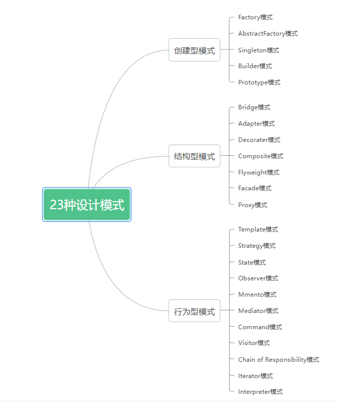

# 23种设计模式C++

[23种设计模式(c++) - 昨日明眸 - 博客园 (cnblogs.com)](https://www.cnblogs.com/46cxf/p/13906835.html)

[C++ 常用设计模式 - 小肚哥 - 博客园 (cnblogs.com)](https://www.cnblogs.com/chengjundu/p/8473564.html)





## 工厂模式

在工厂模式种，我们在创建对象是不会对客户端暴露创建逻辑，并且是通过使用一个共同的接口来指向新创建的对象。工厂模式作为一种创建模式，一般在创建复杂对象是，考虑使用；在创建简单对象时，建议直接new完成一个实例对象的创建。


### 简单工厂模式

主要特点时需要在工厂类中做判断，从而创造相应的产品，当增加新产品时，需要修改工厂类。使用简单工厂模式，我们只需要直到具体的产品型号就可以创建一个产品。

缺点：工厂类集中了所有产品类的创建逻辑，如果产品量较大，会使得工厂类变得非常臃肿。


```cpp
/*
  关键代码：创建过程在工厂类中完成。
 */

#include <iostream>

using namespace std;

//定义产品类型信息
typedef enum
{
	Tank_Type_56,
	Tank_Type_96,
	Tank_Type_Num
}Tank_Type;

//抽象产品类
class Tank
{
public:
	virtual const string& type() = 0;
	virtual ~Tank()
	{}
};

//具体的产品类
class Tank56 : public Tank
{
public:
	Tank56():Tank(),m_strType("Tank56")
	{
	}

	const string& type() override
	{
		cout << m_strType.data() << endl;
		return m_strType;
	}
private:
	string m_strType;
};

//具体的产品类
class Tank96 : public Tank
{
public:
	Tank96():Tank(),m_strType("Tank96")
	{
	}
	const string& type() override
	{
		cout << m_strType.data() << endl;
		return m_strType;
	}

private:
	string m_strType;
};

//工厂类
class TankFactory
{
public:
	//根据产品信息创建具体的产品类实例，返回一个抽象产品类
	Tank* createTank(Tank_Type type)
	{
		switch(type)
		{
		case Tank_Type_56:
			return new Tank56();
		case Tank_Type_96:
			return new Tank96();
			default:
				return nullptr;
		}
	}
};


int main()
{
	TankFactory* factory = new TankFactory();
	Tank* tank56 = factory->createTank(Tank_Type_56);
	tank56->type();
	Tank* tank96 = factory->createTank(Tank_Type_96);
	tank96->type();

	delete tank96;
	tank96 = nullptr;
	delete tank56;
	tank56 = nullptr;
	delete factory;
	factory = nullptr;
	return 0;
}
```


运行结果

```bash
Tank56
Tank96

--------------------------------
Process exited after 0.06844 seconds with return value 0

Press ANY key to exit...
```


### 工厂方法模式


定义一个创建对象的接口，其子类取具体实现这个接口以完成具体的创建工作。如果需要增加新的产品类，只需要扩展一个响应的工厂类即可。

缺点：产品类数据较多时，需要实现大量的工厂类，这无疑增加了代码量。

```cpp
/*
  关键代码：创建过程在其子类执行。
 */

#include <iostream>

using namespace std;

//产品抽象类
class Tank
{
public:
	virtual const string& type() = 0;
	virtual ~Tank(){}
};

//具体的产品类
class Tank56 : public Tank
{
public:
	Tank56():Tank(),m_strType("Tank56")
	{
	}

	const string& type() override
	{
		cout << m_strType.data() << endl;
		return m_strType;
	}
private:
	string m_strType;
};

//具体的产品类
class Tank96 : public Tank
{
public:
	Tank96():Tank(),m_strType("Tank96")
	{
	}
	const string& type() override
	{
		cout << m_strType.data() << endl;
		return m_strType;
	}

private:
	string m_strType;
};

//抽象工厂类，提供一个创建接口
class TankFactory
{
public:
	//提供创建产品实例的接口，返回抽象产品类
	virtual Tank* createTank() = 0;
	virtual ~TankFactory(){}
};

//具体的创建工厂类，使用抽象工厂类提供的接口，去创建具体的产品实例
class Tank56Factory : public TankFactory
{
public:
	Tank* createTank() override
	{
		return new Tank56();
	}
};

//具体的创建工厂类，使用抽象工厂类提供的接口，去创建具体的产品实例
class Tank96Factory : public TankFactory
{
public:
	Tank* createTank() override
	{
		return new Tank96();
	}
};


int main()
{
	TankFactory* factory56 = new Tank56Factory();
	Tank* tank56 = factory56->createTank();
	tank56->type();
	
	TankFactory* factory96 = new Tank96Factory();
	Tank* tank96 = factory96->createTank();
	tank96->type();

	delete tank96;
	tank96 = nullptr;
	delete factory96;
	factory96 = nullptr;

	delete tank56;
	tank56 = nullptr;
	delete factory56;
	factory56 = nullptr;

	return 0;
}
```

运行输出：

```bash
Tank56
Tank96

--------------------------------
Process exited after 0.06119 seconds with return value 0

Press ANY key to exit...
```


### 抽象工厂模式

抽象工厂模式提供创建一系列相关或者相互依赖对象的接口，而无需指定它们具体的类。

当存在多个产品系列，而客户端只是用一个系列的产品时，可以考虑使用抽象工厂模式。

缺点：当增加一个新系列的产品时，不仅需要实现具体的产品类，还需要增加一个新的创建接口，扩展相对困难。

```cpp
/*
 * 关键代码：在一个工厂里聚合多个同类产品。
 * 以下代码以白色衣服和黑色衣服为例，白色衣服为一个产品系列，黑色衣服为一个产品系列。白色上衣搭配白色裤子，   黑色上衣搭配黑色裤字。每个系列的衣服由一个对应的工厂创建，这样一个工厂创建的衣服能保证衣服为同一个系列。
 */
#include <string>
#include <iostream>
using namespace std;

//抽象上衣类
class Coat
{
public:
	virtual const string& color() = 0;
	virtual ~Coat(){}
};

//黑色上衣类
class BlackCoat : public Coat
{
public:
	BlackCoat():Coat(),m_strColor("Black Coat")
	{
	}

	const string& color() override
	{
		cout << m_strColor.data() << endl;
		return m_strColor;
	}
private:
	string m_strColor;
};

//白色上衣类
class WhiteCoat : public Coat
{
public:
	WhiteCoat():Coat(),m_strColor("White Coat")
	{
	}
	const string& color() override
	{
		cout << m_strColor.data() << endl;
		return m_strColor;
	}

private:
	string m_strColor;
};

//抽象裤子类
class Pants
{
public:
	virtual const string& color() = 0;
};

//黑色裤子类
class BlackPants : public Pants
{
public:
	BlackPants():Pants(),m_strColor("Black Pants")
	{
	}
	const string& color() override
	{
		cout << m_strColor.data() << endl;
		return m_strColor;
	}

private:
	string m_strColor;
};

//白色裤子类
class WhitePants : public Pants
{
public:
	WhitePants():Pants(),m_strColor("White Pants")
	{
	}
	const string& color() override
	{
		cout << m_strColor.data() << endl;
		return m_strColor;
	}

private:
	string m_strColor;
};

//抽象工厂类，提供衣服创建接口
class Factory
{
public:
	//上衣创建接口，返回抽象上衣类
	virtual Coat* createCoat() = 0;
	//裤子创建接口，返回抽象裤子类
	virtual Pants* createPants() = 0;
};

//创建白色衣服的工厂类，具体实现创建白色上衣和白色裤子的接口
class WhiteFactory : public Factory
{
public:
	Coat* createCoat() override
	{
		return new WhiteCoat();
	}

	Pants* createPants() override
	{
		return new WhitePants();
	}
};

//创建黑色衣服的工厂类，具体实现创建黑色上衣和白色裤子的接口
class BlackFactory : public Factory
{
	Coat* createCoat() override
	{
		return new BlackCoat();
	}

	Pants* createPants() override
	{
		return new BlackPants();
	}
};

int main()
{
	
	return 0;
}
```


## 策略模式


策略模式是指定义一系列的算法，把它们单独封装起来，并且使它们可以互相替换，使得算法可以独立于使用它的客户端而变化，也是说这些算法所完成的功能类型是一样的，对外接口也是一样的，只是不同的策略为引起环境角色环境角色表现出不同的行为。

相比于使用大量的if...else，使用策略模式可以降低复杂度，使得代码更容易维护。

缺点：可能需要定义大量的策略类，并且这些策略类都要提供给客户端。

[环境角色] 持有一个策略类的引用，最终给客户端调用。


