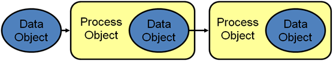
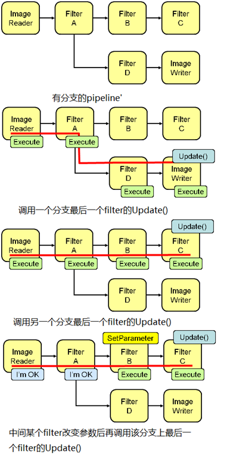

# [ITK简介与ITK Pipeline](https://www.cnblogs.com/chunshan/archive/2011/11/20/2256622.html)

### **ITK 概述**

[ITK](http://www.itk.org/)(Insight Segmentation and Registration Toolkit) 是一个开源，跨平台的图像分析框架，里面有大量的前沿算法，广泛用于图像[配准](http://en.wikipedia.org/wiki/Image_registration)和[分割](http://en.wikipedia.org/wiki/Segmentation_(image_processing))。ITK使用C++开发，可由[CMake](http://www.cmake.org/)生成不同环境下的可编译工程，并且ITK有对Tcl, Python和Java的封装层，使得开发者可以使用不同的语言进行开发。

ITK的主要特征有：

　　1，ITK提供了通用的方式表示图像（任意维度）和面片（非结构化的meshes），提供用于进行分割和配准的算法，主要面向医学应用，尽管也可以处理其他应用；

　　2，ITK不提供可视化的用户接口，仅提供最小化的文件接口，留由其他库提供；

　　3，ITK大量使用泛型编程技术；

　　4，ITK内存模型使用智能指针维护对象的引用计数，使用对象工厂实例化对象；

　　5，ITK支持多线程并行处理；

　　6，ITK使用命令/观察者模式进行事件处理；

　　7，ITK基于数据流的架构进行组织，数据被表示成数据对象（data object），数据对象由处理对象（process object）处理，数据对象和处理对象连在一起形成Pipeline。

　　8，ITK的开发基于极限编程（[extreme programming](http://en.wikipedia.org/wiki/Extreme_programming)）原则，设计、实现和维护是快速迭代的过程，而测试是这个过程的核心，每当有文件check in、每晚都会进行不同平台和编译器的测试。

 

### **ITK 系统组织**

ITK包含几个子系统

**Essential System Concepts**： ITK中重要的概念包括泛型编程，用于内存管理的智能指针，用于对象实例化的对象工厂，基于command/observer设计模式的事件管理，多线程支持等

**Numerics：**ITK使用VXL的VNL数值库，这个数值计算库是对用Fortran实现的Netlib数值库的C++封装。

**Data Representation and Access：**itk::Image 和itk::Mesh是两个用于表示数据的基本类，此外有不同类型的用于存储和遍历数据的迭代器和容器。

**Data Processing Pipeline**：数据表示类（数据对象，Data Object）被filters（处理对象，Process Object）处理，几个filter可以组织成一条pipeline。Pipeline可以记录并维护数据对象和filter的状态，只有需要的时候才执行响应的filters。ITK的pipeline支持多线程和流式处理。

**IO Framework：**与pipeline相关的是sources（初始化pipeline的filter），mappers（终止pipeline的filters）。sources和mapper的典型例子是分别是readers和writers，Readers输入数据，writers从pipeline输出数据。

**Spatial Objects：**ITK中使用spatial 对象层次表示几何形状。这些spatial objects支持解剖结构的建模，使用通用的基本接口，能够以许多不同的方式表示空间区域。Spatial Objects是分割和配准方法中用于保存分割结构和引入解剖先验知识的非常自然的数据结构。

**Registration Framework：**ITK灵活的配准框架支持不同类型的配准：图像配准，多分辨率配准，基于PDE（偏微分方程）和FEM（有限元方法）的配准。

**FEM Framework**：ITK包含一个解一般FEM问题的子系统，特别是非刚体配准。ITK中的FEM包包含mesh定义（nodes和elements），加载和边界条件。

**Level Set Framework：**水平集框架是一系列用于解决偏微分方程的filters。这些filter采用迭代、有限差分更新机制求解偏微分方程。水平集框架包含了稀疏水平集求解器，用于分割的一般水平集的filter和一些特殊的基于阈值，Canny，Laplacian的filters。

**Wrapping：**ITK使用一种独特而强大的系统产生对解释性语言如Tcl和Python的接口（wrapper）。首先用GCC_XML产生任意复杂C++代码的XML描述，然后用CSWIG将XML转换成wrappers。

**Auxiliary/Utilities**： 一些辅助的子系统用于对其他部分的补充。例如，calculators是支持filters的特殊操作的类。其他的辅助库包括一个不完全的DICOM解析库，MetaIO文件支持，png，zlib，FLTK/Qt图像浏览器和对VTK（visualization toolkit）的接口。

 

### ITK Pipeline

　　前面提到ITK中数据对象由处理对象（process object）处理，数据对象和处理对象连在一起形成Pipeline。ITK中的pipeline的示意图如Fig 1。处理对象（filter）根据输入数据为输出的数据对象申请内存并拥有此对象，然后该对象的引用传递给下一个filter处理。




Fig 1 ITK中pipeline示意图

ITK中的pipeline一般按如下步骤创建：

　　1, 确定filter的处理的数据类型；

　　2, 使用filter的静态方法New创建filter的实例；

　　3, 使用filter的方法SetInput(upperstreamfilter->GetOutput)将filter连在一起；

　　4, 设置filter所需的算法参数；

　　5, 触发最后一个filter的Update()方法。

一个简单的pipeline的实例如下：

```cpp
typedef     unsigned char                 PixelType;
typedef itk::Image< PixelType, 2 >       ImageType;

typedef itk::ImageFileReader< ImageType >  ReaderType;
typedef itk::ImageFileWriter< ImageType >  WriterType;

typedef itk::OtsuThresholdImageFilter<ImageType, ImageType >  FilterType;

ReaderType::Pointer reader = ReaderType::New();
WriterType::Pointer writer = WriterType::New();
FilterType::Pointer filter = FilterType::New();

const char * inputFilename  = "logo.bmp";
const char * outputFilename = "logo-processing.bmp";

reader->SetFileName( inputFilename  );
writer->SetFileName( outputFilename );

writer->SetInput( filter->GetOutput() );
filter->SetInput( reader->GetOutput() );

filter->SetNumberOfHistogramBins( 256 );

writer->Update();
```


ITK中的pipeline有如下特征：

　　1, pipeline决定哪一个filter需要执行，防止多余的执行以使整体的运行时间最小化;

　　2, 确定每一个filter要为其输出对象申请多大内存，申请后由filter进行初始化，为新数据做准备。

　　3, 执行过程决定一个filter需要多少输入数据从而能够为下游的filter产生足够大小的输出，还将内存上的限制和特殊filter的需求考虑在内。

　　4, pipeline可以细分数据成subpieces以进行多线程计算。

　　5, 当filter不需要某些输出数据或者用户请求将某些数据删除时可将这些数据释放。

　　Fig 2说明了ITK中一条pipeline如何防止多余filters的执行。为了能够仅执行需要的filters，执行过程与定义pipeline的filters进行协商，协商过程最终由特定大小的数据请求控制。只有每一个filter知道需要多少输入数据才能产生一个特定的输出。用户可能请求处理一幅大图像中的一个感兴趣区域或者由于内存限制需要将数据分成不同pieces的形式进行处理。pipeline中的数据请求向上传递，协商过程会配置每一个filter输出数据需要的输入数据大小。



Fig 2 ITK pipeline 执行示意图

ITK中 pipeline的执行细节：

　　一般而言，一个处理对象接收到ProcessObject::Update()请求时Pipeline开始执行。这个方法委托给filter的输出对象，触发DataObject::Update()方法。这是ProcessObject和DataObject典型的交互方式：一个对象中触发的方法最终委托给另一个对象。使用这种方式，pipeline将数据请求向上传递，直至source完成数据流的初始化，然后顺序向下执行。

DataObject::Update()方法又触发3个其他的方法，

　　• DataObject::UpdateOutputInformation()

　　• DataObject::PropagateRequestedRegion()

　　• DataObject::UpdateOutputData()

 

UpdateOutputInformation()

　　UpdateOutputInformation()决定Pipeline的修改时间，根据filter的配置情况它可能会设置RequestedRegion和LargestPossibleRegion （如果没有设置RequestedRegion默认设置为处理所有的数据，即LargestPossibleRegion）。UpdateOutputInformation()穿过整条pipeline向上传递直至sources。

　　在UpdateOutputInformation()执行过程中，filters有机会调用其重载的ProcessObject::GenerateOutputInformation() （GenerateOutputInformation()由  UpdateOutputInformation()触发），GenerateOutputInformation()的默认行为是使用DataObject::CopyInformation()将描述输入对象的元数据拷贝给输出。注意，是描述输入的元数据，如一幅图像的原点，spacing和LargestPossibleRegion。

　　重载GenerateOutputInformation()的一个例子是itk::ShrinkImageFilter。这个filter输入一张图像然后以一个整数值缩小，结果造成输出的spacing和LargestPossibleRegion与输入不同，因此需重载GenerateOutputInformation()。

 

PropagateRequestedRegion()

　　PropagateRequestedRegion()向上传递以满足一个数据请求。一般的应用中，这个数据请求是LargestPossibleRegion，但是如果需要streaming，或者用户仅对数据的一部分感兴趣，RequestedRegion可以是LargestPossibleRegion内任意有效的区域。

　　给定一个数据请求（大小由RequestedRegion决定），PropagateRequestedRegion()向上传递，配置filter的输入和输出为正确的大小。最终，它会配置BufferedRegion，也就是实际申请的数据尺寸。有Buffered region的原因是一个filter的输出可能会被下游不止一个filter使用。如果下游每一个filter需要不同大小的输入，导致上游的filter产生满足不同下游filter的数据，有时候可能产生比下游的一个filter需求多的数据。

ProcessObject::PropagateRequestedRegion()触发三个开发者可以重载的函数。

　　• EnlargeOutputRequestedRegion(DataObject *output) 给filter一个机会声明它将会提供比需要还多的数据。这在一个source仅能产生整个输出的情况下是可能发生的。itk::RGBGibbsPriorFilter是一个需要触发EnlargeOutputRequestedRegion()函数的filter。

　　• GenerateOutputRequestedRegion(DataObject *output) 给filter一个机会定义如何为每一个输出设置RequestedRegion。默认的实现是使所有输出的RequestedRegion一样大。一个filter可以重载这个函数如果每个输出有不同的分辨率。这个函数仅当一个filter有多个输出时才有必要重载。

　　•GenerateInputRequestedRegion() 给filter一个机会在输入上要求更大的RequestedRegion。这在一个filter在内部要求更多数据产生最终输出时是必要的。itk::GradientMagnitudeImageFilter是一个需要触发GenerateInputRequestedRegion()的filter。

 

UpdateOutputData()

　　UpdateOutputData()是Update调用的第三个也是最后一个函数。这个函数的目的是确定一个特定的filter是否需要执行以更新它的输出（即是否会触发一个filter的GenerateData()）。一个filter当以下条件至少一个满足时会执行：

1， 修改一个filter的成员造成filter的修改；

2， filter的输入发生变化；

3， filter的输入数据被释放了；

4， 之前设置了一个无效的RequestedRegion，导致而这个filter没有产生数据。

　　每一个itk::Object都有一个时间戳，调用其Modified()方法时会修改这个时间戳，而上述条件发生时就会调用Modified()。filter的执行是依次向下的，一旦一个filter执行，它下游一条分支上所有的filters都必须执行。

　　当数据对象需要更新时，DataObject::UpdateOutputData()被委托给产生该数据对象的filter，对修改时间，Pipeline时间，数据释放标记和有效RequestedRegion进行比较，如果其中任一个条件数据需要重新产生，就会调用该filter的ProcessObject::UpdateOutputData()。这些调用向上递归直至遇到一个source filter对象或者Pipeline已被确定是最新的。此时，递归展开，filters执行（初始化输出数据，触发StartEvent，调用filter的GenerateData函数，触发EndEvent，可能释放该filter的输入，并且这个filter的InformationTime更新为当前时间）。

　　开发者不需重载UpdateOutputData()，而是重写GenerateData()函数（非多线程）或ThreadedGenerateData()函数。

 

多线程filter的执行

　　以pieces形式处理数据的filter可以并行处理数据，仅需重写ThreadedGenerateData()函数就可以创建一个多线程filter。多线程处理的关键是仅为给定的输出区域产生输出，在ITK中这很容易实现，因为可以使用提供的region创建一个输出迭代器，循环输出迭代器获取计算输出像素的值所需要的相应输入像素。

　　多线程在进行I/O操作或触发事件时需要格外小心，比较安全的做法是仅使用thread id为0的线程进行I/O或产生事件。如果多于一个线程同时向同一个地方写入数据，程序会行为怪异甚至产生死锁或崩溃。


