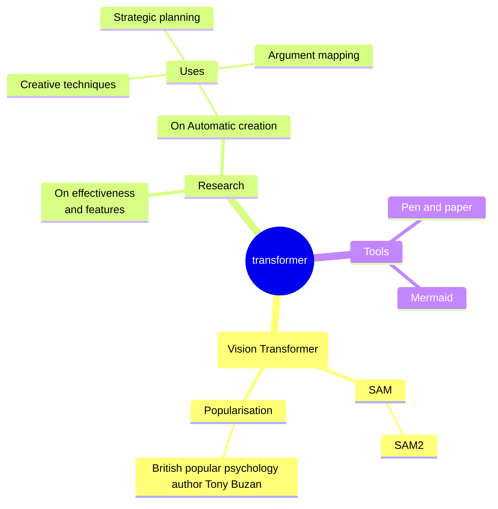

# Markdown常用设置


## 设置字体与颜色


### 字体加粗和倾斜设置

Markdown中的字体格式有如下几种：

- 字体加粗：在字体前后各加两个星号`\**`或两个下划线`\_`

1. \*\*字体加粗\*\*
2. \_\_字体加粗\_\_

- 字体倾斜：在字体前后各加一个星号`\*`或一个下划线`\_`
  1. \*字体倾斜\*
  2. \_字体倾斜\_
- 字体加粗并倾斜：在字体前后各加三个星号`\*`或三个下划线`\_`
  1. \*\*\*字体加粗并倾斜\*\*\*
  2. \_\_\_字体加粗并倾斜\_\_\_

### 字体大小和颜色设置

markdown编辑器本身不支持字体、字号、颜色的修改。但因为markdown支持HTML标签，所以可以使用内嵌HTML来实现这些功能。

我们可以在`<font></font>`标签中设置字体、大小、颜色：

- 字体的设置使用`face`。

```bash
<font face="微软雅黑" >微软雅黑</font>
<font face="华文彩云" >华文彩云</font>
```


<font face="微软雅黑" >微软雅黑</font>

<font face="华文彩云" >华文彩云</font>


- 字号的设置使用`size`，字号数值可设为1~7，浏览器默认为3。

```bash
<font size=2 >2号字</font>
<font size=5 >5号字</font>
```

<font size=2 >2号字</font> 

<font size=5 >5号字</font>

- 字体颜色的设置使用`color`

```bash
<font color=#FF000 >红色</font>
<font color=#008000 >绿色</font>
<font color=#FFFF00 >黄色</font>
```

<font color=#FF000 >红色</font> <font color=#008000 >绿色</font> <font color=#FFFF00 >黄色</font>


### 不同颜色

| HTML                              | 示例                                         | 示例效果 | 颜色名称             | 16进制  |
| --------------------------------- | -------------------------------------------- | -------- | -------------------- | ------- |
| <font color=AliceBlue>            | <font color=AliceBlue>Test</font>            | Test     | AliceBlue            | #F0F8FF |
| <font color=AntiqueWhite>         | <font color=AntiqueWhite>Test</font>         | Test     | AntiqueWhite         | #FAEBD7 |
| <font color=Aqua>                 | <font color=Aqua>Test</font>                 | Test     | Aqua                 | #00FFFF |
| <font color=Aquamarine>           | <font color=Aquamarine>Test</font>           | Test     | Aquamarine           | #7FFFD4 |
| <font color=Azure>                | <font color=Azure>Test</font>                | Test     | Azure                | #F0FFFF |
| <font color=Beige>                | <font color=Beige>Test</font>                | Test     | Beige                | #F5F5DC |
| <font color=Bisque>               | <font color=Bisque>Test</font>               | Test     | Bisque               | #FFE4C4 |
| <font color=Black>                | <font color=Black>Test</font>                | Test     | Black                | #000000 |
| <font color=BlanchedAlmond>       | <font color=BlanchedAlmond>Test</font>       | Test     | BlanchedAlmond       | #FFEBCD |
| <font color=Blue>                 | <font color=Blue>Test</font>                 | Test     | Blue                 | #0000FF |
| <font color=BlueViolet>           | <font color=BlueViolet>Test</font>           | Test     | BlueViolet           | #8A2BE2 |
| <font color=Brown>                | <font color=Brown>Test</font>                | Test     | Brown                | #A52A2A |
| <font color=BurlyWood>            | <font color=BurlyWood>Test</font>            | Test     | BurlyWood            | #DEB887 |
| <font color=CadetBlue>            | <font color=CadetBlue>Test</font>            | Test     | CadetBlue            | #5F9EA0 |
| <font color=Chartreuse>           | <font color=Chartreuse>Test</font>           | Test     | Chartreuse           | #7FFF00 |
| <font color=Chocolate>            | <font color=Chocolate>Test</font>            | Test     | Chocolate            | #D2691E |
| <font color=Coral>                | <font color=Coral>Test</font>                | Test     | Coral                | #FF7F50 |
| <font color=CornflowerBlue>       | <font color=CornflowerBlue>Test</font>       | Test     | CornflowerBlue       | #6495ED |
| <font color=Cornsilk>             | <font color=Cornsilk>Test</font>             | Test     | Cornsilk             | #FFF8DC |
| <font color=Crimson>              | <font color=Crimson>Test</font>              | Test     | Crimson              | #DC143C |
| <font color=Cyan>                 | <font color=Cyan>Test</font>                 | Test     | Cyan                 | #00FFFF |
| <font color=DarkBlue>             | <font color=DarkBlue>Test</font>             | Test     | DarkBlue             | #00008B |
| <font color=DarkCyan>             | <font color=DarkCyan>Test</font>             | Test     | DarkCyan             | #008B8B |
| <font color=DarkGoldenRod>        | <font color=DarkGoldenRod>Test</font>        | Test     | DarkGoldenRod        | #B8860B |
| <font color=DarkGray>             | <font color=DarkGray>Test</font>             | Test     | DarkGray             | #A9A9A9 |
| <font color=DarkGreen>            | <font color=DarkGreen>Test</font>            | Test     | DarkGreen            | #006400 |
| <font color=DarkKhaki>            | <font color=DarkKhaki>Test</font>            | Test     | DarkKhaki            | #BDB76B |
| <font color=DarkMagenta>          | <font color=DarkMagenta>Test</font>          | Test     | DarkMagenta          | #8B008B |
| <font color=DarkOliveGreen>       | <font color=DarkOliveGreen>Test</font>       | Test     | DarkOliveGreen       | #556B2F |
| <font color=Darkorange>           | <font color=Darkorange>Test</font>           | Test     | Darkorange           | #FF8C00 |
| <font color=DarkOrchid>           | <font color=DarkOrchid>Test</font>           | Test     | DarkOrchid           | #9932CC |
| <font color=DarkRed>              | <font color=DarkRed>Test</font>              | Test     | DarkRed              | #8B0000 |
| <font color=DarkSalmon>           | <font color=DarkSalmon>Test</font>           | Test     | DarkSalmon           | #E9967A |
| <font color=DarkSeaGreen>         | <font color=DarkSeaGreen>Test</font>         | Test     | DarkSeaGreen         | #8FBC8F |
| <font color=DarkSlateBlue>        | <font color=DarkSlateBlue>Test</font>        | Test     | DarkSlateBlue        | #483D8B |
| <font color=DarkSlateGray>        | <font color=DarkSlateGray>Test</font>        | Test     | DarkSlateGray        | #2F4F4F |
| <font color=DarkTurquoise>        | <font color=DarkTurquoise>Test</font>        | Test     | DarkTurquoise        | #00CED1 |
| <font color=DarkViolet>           | <font color=DarkViolet>Test</font>           | Test     | DarkViolet           | #9400D3 |
| <font color=DeepPink>             | <font color=DeepPink>Test</font>             | Test     | DeepPink             | #FF1493 |
| <font color=DeepSkyBlue>          | <font color=DeepSkyBlue>Test</font>          | Test     | DeepSkyBlue          | #00BFFF |
| <font color=DimGray>              | <font color=DimGray>Test</font>              | Test     | DimGray              | #696969 |
| <font color=DodgerBlue>           | <font color=DodgerBlue>Test</font>           | Test     | DodgerBlue           | #1E90FF |
| <font color=Feldspar>             | <font color=Feldspar>Test</font>             | Test     | Feldspar             | #D19275 |
| <font color=FireBrick>            | <font color=FireBrick>Test</font>            | Test     | FireBrick            | #B22222 |
| <font color=FloralWhite>          | <font color=FloralWhite>Test</font>          | Test     | FloralWhite          | #FFFAF0 |
| <font color=ForestGreen>          | <font color=ForestGreen>Test</font>          | Test     | ForestGreen          | #228B22 |
| <font color=Fuchsia>              | <font color=Fuchsia>Test</font>              | Test     | Fuchsia              | #FF00FF |
| <font color=Gainsboro>            | <font color=Gainsboro>Test</font>            | Test     | Gainsboro            | #DCDCDC |
| <font color=GhostWhite>           | <font color=GhostWhite>Test</font>           | Test     | GhostWhite           | #F8F8FF |
| <font color=Gold>                 | <font color=Gold>Test</font>                 | Test     | Gold                 | #FFD700 |
| <font color=GoldenRod>            | <font color=GoldenRod>Test</font>            | Test     | GoldenRod            | #DAA520 |
| <font color=Gray>                 | <font color=Gray>Test</font>                 | Test     | Gray                 | #808080 |
| <font color=Green>                | <font color=Green>Test</font>                | Test     | Green                | #008000 |
| <font color=GreenYellow>          | <font color=GreenYellow>Test</font>          | Test     | GreenYellow          | #ADFF2F |
| <font color=HoneyDew>             | <font color=HoneyDew>Test</font>             | Test     | HoneyDew             | #F0FFF0 |
| <font color=HotPink>              | <font color=HotPink>Test</font>              | Test     | HotPink              | #FF69B4 |
| <font color=IndianRed>            | <font color=IndianRed>Test</font>            | Test     | IndianRed            | #CD5C5C |
| <font color=Indigo>               | <font color=Indigo>Test</font>               | Test     | Indigo               | #4B0082 |
| <font color=Ivory>                | <font color=Ivory>Test</font>                | Test     | Ivory                | #FFFFF0 |
| <font color=Khaki>                | <font color=Khaki>Test</font>                | Test     | Khaki                | #F0E68C |
| <font color=Lavender>             | <font color=Lavender>Test</font>             | Test     | Lavender             | #E6E6FA |
| <font color=LavenderBlush>        | <font color=LavenderBlush>Test</font>        | Test     | LavenderBlush        | #FFF0F5 |
| <font color=LawnGreen>            | <font color=LawnGreen>Test</font>            | Test     | LawnGreen            | #7CFC00 |
| <font color=LemonChiffon>         | <font color=LemonChiffon>Test</font>         | Test     | LemonChiffon         | #FFFACD |
| <font color=LightBlue>            | <font color=LightBlue>Test</font>            | Test     | LightBlue            | #ADD8E6 |
| <font color=LightCoral>           | <font color=LightCoral>Test</font>           | Test     | LightCoral           | #F08080 |
| <font color=LightCyan>            | <font color=LightCyan>Test</font>            | Test     | LightCyan            | #E0FFFF |
| <font color=LightGoldenRodYellow> | <font color=LightGoldenRodYellow>Test</font> | Test     | LightGoldenRodYellow | #FAFAD2 |
| <font color=LightGrey>            | <font color=LightGrey>Test</font>            | Test     | LightGrey            | #D3D3D3 |
| <font color=LightGrey>            | <font color=LightGrey>Test</font>            | Test     | LightGreen           | #90EE90 |
| <font color=LightPink>            | <font color=LightPink>Test</font>            | Test     | LightPink            | #FFB6C1 |
| <font color=LightSalmon>          | <font color=LightSalmon>Test</font>          | Test     | LightSalmon          | #FFA07A |
| <font color=LightSeaGreen>        | <font color=LightSeaGreen>Test</font>        | Test     | LightSeaGreen        | #20B2AA |
| <font color=LightSkyBlue>         | <font color=LightSkyBlue>Test</font>         | Test     | LightSkyBlue         | #87CEFA |
| <font color=LightSlateBlue>       | <font color=LightSlateBlue>Test</font>       | Test     | LightSlateBlue       | #8470FF |
| <font color=LightSlateGray>       | <font color=LightSlateGray>Test</font>       | Test     | LightSlateGray       | #778899 |
| <font color=LightSteelBlue>       | <font color=LightSteelBlue>Test</font>       | Test     | LightSteelBlue       | #B0C4DE |
| <font color=LightYellow>          | <font color=LightYellow>Test</font>          | Test     | LightYellow          | #FFFFE0 |
| <font color=Lime>                 | <font color=Lime>Test</font>                 | Test     | Lime                 | #00FF00 |
| <font color=LimeGreen>            | <font color=LimeGreen>Test</font>            | Test     | LimeGreen            | #32CD32 |
| <font color=Linen>                | <font color=Linen>Test</font>                | Test     | Linen                | #FAF0E6 |
| <font color=Magenta>              | <font color=Magenta>Test</font>              | Test     | Magenta              | #FF00FF |
| <font color=Maroon>               | <font color=Maroon>Test</font>               | Test     | Maroon               | #800000 |
| <font color=MediumAquaMarine>     | <font color=MediumAquaMarine>Test</font>     | Test     | MediumAquaMarine     | #66CDAA |
| <font color=MediumBlue>           | <font color=MediumBlue>Test</font>           | Test     | MediumBlue           | #0000CD |
| <font color=MediumOrchid>         | <font color=MediumOrchid>Test</font>         | Test     | MediumOrchid         | #BA55D3 |
| <font color=MediumPurple>         | <font color=MediumPurple>Test</font>         | Test     | MediumPurple         | #9370D8 |
| <font color=MediumSeaGreen>       | <font color=MediumSeaGreen>Test</font>       | Test     | MediumSeaGreen       | #3CB371 |
| <font color=MediumSlateBlue>      | <font color=MediumSlateBlue>Test</font>      | Test     | MediumSlateBlue      | #7B68EE |
| <font color=MediumSpringGreen>    | <font color=MediumSpringGreen>Test</font>    | Test     | MediumSpringGreen    | #00FA9A |
| <font color=MediumTurquoise>      | <font color=MediumTurquoise>Test</font>      | Test     | MediumTurquoise      | #48D1CC |
| <font color=MediumVioletRed>      | <font color=MediumVioletRed>Test</font>      | Test     | MediumVioletRed      | #C71585 |
| <font color=MidnightBlue>         | <font color=MidnightBlue>Test</font>         | Test     | MidnightBlue         | #191970 |
| <font color=MintCream>            | <font color=MintCream>Test</font>            | Test     | MintCream            | #F5FFFA |
| <font color=MistyRose>            | <font color=MistyRose>Test</font>            | Test     | MistyRose            | #FFE4E1 |
| <font color=Moccasin>             | <font color=Moccasin>Test</font>             | Test     | Moccasin             | #FFE4B5 |
| <font color=NavajoWhite>          | <font color=NavajoWhite>Test</font>          | Test     | NavajoWhite          | #FFDEAD |
| <font color=Navy>                 | <font color=Navy>Test</font>                 | Test     | Navy                 | #000080 |
| <font color=OldLace>              | <font color=OldLace>Test</font>              | Test     | OldLace              | #FDF5E6 |
| <font color=Olive>                | <font color=Olive>Test</font>                | Test     | Olive                | #808000 |
| <font color=OliveDrab>            | <font color=OliveDrab>Test</font>            | Test     | OliveDrab            | #6B8E23 |
| <font color=Orange>               | <font color=Orange>Test</font>               | Test     | Orange               | #FFA500 |
| <font color=OrangeRed>            | <font color=OrangeRed>Test</font>            | Test     | OrangeRed            | #FF4500 |
| <font color=Orchid>               | <font color=Orchid>Test</font>               | Test     | Orchid               | #DA70D6 |
| <font color=PaleGoldenRod>        | <font color=PaleGoldenRod>Test</font>        | Test     | PaleGoldenRod        | #EEE8AA |
| <font color=PaleGreen>            | <font color=PaleGreen>Test</font>            | Test     | PaleGreen            | #98FB98 |
| <font color=PaleTurquoise>        | <font color=PaleTurquoise>Test</font>        | Test     | PaleTurquoise        | #AFEEEE |
| <font color=PaleVioletRed>        | <font color=PaleVioletRed>Test</font>        | Test     | PaleVioletRed        | #D87093 |
| <font color=PapayaWhip>           | <font color=PapayaWhip>Test</font>           | Test     | PapayaWhip           | #FFEFD5 |
| <font color=PeachPuff>            | <font color=PeachPuff>Test</font>            | Test     | PeachPuff            | #FFDAB9 |
| <font color=Peru>                 | <font color=Peru>Test</font>                 | Test     | Peru                 | #CD853F |
| <font color=Pink>                 | <font color=Pink>Test</font>                 | Test     | Pink                 | #FFC0CB |
| <font color=Plum>                 | <font color=Plum>Test</font>                 | Test     | Plum                 | #DDA0DD |
| <font color=PowderBlue>           | <font color=PowderBlue>Test</font>           | Test     | PowderBlue           | #B0E0E6 |
| <font color=Purple>               | <font color=Purple>Test</font>               | Test     | Purple               | #800080 |
| <font color=Red>                  | <font color=Red>Test</font>                  | Test     | Red                  | #FF0000 |
| <font color=RosyBrown>            | <font color=RosyBrown>Test</font>            | Test     | RosyBrown            | #BC8F8F |
| <font color=RoyalBlue>            | <font color=RoyalBlue>Test</font>            | Test     | RoyalBlue            | #4169E1 |
| <font color=SaddleBrown>          | <font color=SaddleBrown>Test</font>          | Test     | SaddleBrown          | #8B4513 |
| <font color=Salmon>               | <font color=Salmon>Test</font>               | Test     | Salmon               | #FA8072 |
| <font color=SandyBrown>           | <font color=SandyBrown>Test</font>           | Test     | SandyBrown           | #F4A460 |
| <font color=SeaGreen>             | <font color=SeaGreen>Test</font>             | Test     | SeaGreen             | #2E8B57 |
| <font color=SeaShell>             | <font color=SeaShell>Test</font>             | Test     | SeaShell             | #FFF5EE |
| <font color=Sienna>               | <font color=Sienna>Test</font>               | Test     | Sienna               | #A0522D |
| <font color=Silver>               | <font color=Silver>Test</font>               | Test     | Silver               | #C0C0C0 |
| <font color=SkyBlue>              | <font color=SkyBlue>Test</font>              | Test     | SkyBlue              | #87CEEB |
| <font color=SlateBlue>            | <font color=SlateBlue>Test</font>            | Test     | SlateBlue            | #6A5ACD |
| <font color=SlateGray>            | <font color=SlateGray>Test</font>            | Test     | SlateGray            | #708090 |
| <font color=Snow>                 | <font color=Snow>Test</font>                 | Test     | Snow                 | #FFFAFA |
| <font color=SpringGreen>          | <font color=SpringGreen>Test</font>          | Test     | SpringGreen          | #00FF7F |
| <font color=SteelBlue>            | <font color=SteelBlue>Test</font>            | Test     | SteelBlue            | #4682B4 |
| <font color=Tan>                  | <font color=Tan>Test</font>                  | Test     | Tan                  | #D2B48C |
| <font color=Teal>                 | <font color=Teal>Test</font>                 | Test     | Teal                 | #008080 |
| <font color=Thistle>              | <font color=Thistle>Test</font>              | Test     | Thistle              | #D8BFD8 |
| <font color=Tomato>               | <font color=Tomato>Test</font>               | Test     | Tomato               | #FF6347 |
| <font color=Turquoise>            | <font color=Turquoise>Test</font>            | Test     | Turquoise            | #40E0D0 |
| <font color=Violet>               | <font color=Violet>Test</font>               | Test     | Violet               | #EE82EE |
| <font color=VioletRed>            | <font color=VioletRed>Test</font>            | Test     | VioletRed            | #D02090 |
| <font color=Wheat>                | <font color=Wheat>Test</font>                | Test     | Wheat                | #F5DEB3 |
| <font color=White>                | <font color=White>Test</font>                | Test     | White                | #FFFFFF |
| <font color=WhiteSmoke>           | <font color=WhiteSmoke>Test</font>           | Test     | WhiteSmoke           | #F5F5F5 |
| <font color=Yellow>               | <font color=Yellow>Test</font>               | Test     | Yellow               | #FFFF00 |
| <font color=YellowGreen>          | <font color=YellowGreen>Test</font>          | Test     | YellowGreen          | #9ACD32 |

[【Markdown笔记】设置字体颜色_markdown字体颜色-CSDN博客](https://blog.csdn.net/u012028275/article/details/115445362)


## 数学公式

字体转换


要对公式的某一部分字符进行字体转换，可以用{\rm 需转换的部分字符}命令，其中\rm可以参照下表选择合适的字体。一般情况下，公式默认为意大利体。

| 标志     | 符号      | 显示         |
| -------- | --------- | ------------ |
| 罗马体   | \rm x     | $\rm x$      |
| 意大利体 | \it x     | $ \it x$     |
| 黑体     | \bf x     | $\bf x$      |
| 花体     | \mathbb x | $\mathbb{x}$ |

[Markdown数学公式语法、常用符号与字体_markdown公式字体-CSDN博客](https://blog.csdn.net/zdaiot/article/details/84710591)


## 思维导图

### Mermaid mindmap





参考：[About Mermaid | Mermaid](https://mermaid.js.org/intro/)

参考：[GitHub - mermaid-js/mermaid: Generation of diagrams like flowcharts or sequence diagrams from text in a similar manner as markdown](https://github.com/mermaid-js/mermaid)


### Markmap

如何使用：方法一（自动）
目前此方法仅限 Windows 平台。

[下载](https://github.com/obgnail/typora_plugin/releases/latest) 插件源码的压缩包，并解压

进入 Typora 安装路径，找到包含 window.html 的文件夹 A（一般是 Typora/resources/window.html 或者 Typora/resources/app/window.html）

打开文件夹 A，将源码的 plugin 文件夹粘贴进该文件夹下（参考方法二的图片）

进入文件夹 A/plugin/updater/，双击运行 updater.exe。如果看到下图，说明成功


验证：重启 Typora，在正文区域点击鼠标右键，弹出右键菜单栏，如果能看到 常用插件 栏目，说明一切顺利

每个插件皆有配置选项。开发者鼓励您修改配置，以符合自身需求。配置文件夹：A/plugin/global/settings/


```markmap
# My map

## Search sites

- [Google](https://www.google.com/)
- [Baidu](https://www.baidu.com/)
- [Bing](https://www.bing.com/)
- [pixabay](https://pixabay.com/)

## WeChat public number

### The preparatory work

- The theme
- conceived
- writing
- typography
- Adjustment and supplement
- Design cover drawing
- Regularly send

### Late work

- Public number text reading
- The reader forward
- The secondary transfer
- Circle of friends
- community
- ......

---

- learning
- The input
- The output

```

参考：[typora-plugin-markmap/README.zh-CN.md at main · typora-community-plugin/typora-plugin-markmap · GitHub](https://github.com/typora-community-plugin/typora-plugin-markmap/blob/main/README.zh-CN.md)

参考：[Typora Plugin_手机无图模式插件-CSDN博客](https://blog.csdn.net/qq_57450444/article/details/139249929)


与参考不同的是，执行的不是update.exe而是C:\Program Files\Typora\resources\plugin\bin\install_windows_amd_x64.exe

```markmap
# transformer

## vision transformer
### SAM
#### Efficient SAM
#### SAM2


## NLP
###  BERT
### ChatGPT

## Object Detection
### DETR
#### Deformable DETR
## Landmark
## Segmentation
### SETR
### Segmenter
### SegFormer


```


## 各种图标

[🎁 Emoji cheat sheet for GitHub, Basecamp, Slack & more (webfx.com)](https://www.webfx.com/tools/emoji-cheat-sheet/#)


🌟 :star2: ⭐️ :star: 💫 :dizzy: 💥 :boom:
💗:heartpulse: 🙏 :pray: ☀️ :sunny: 🌹 :rose:
🌙 :crescent_moon: 🌕 :full_moon:🌝 :full_moon_with_face:
💝 :gift_heart: 🎁:gift: 🎇 :sparkler: 🎉 :tada:
📅 :date: 🎀:ribbon: 🍓:strawberry:🍉:watermelon:
1️⃣ :one: 2️⃣ :two: 3️⃣:three:4️⃣ :four:
🔱 :trident: 💯 :100: ✨ :sparkles:
👈:point_left: 👉 :point_right:
👆:point_up_2: ✌️ :v:
🎊 :confetti_ball: 🔮 :crystal_ball:
🎈 :balloon: 🎆 :fireworks:
🔑 :key: 💰 :moneybag:
💎 :gem: 🀄️ :mahjong:
🍗 :poultry_leg: 🍰 :cake:
🔆 :high_brightness: 🚀 :rocket:

:camping::tent: :vertical_traffic_light: ​ :stop_sign: :rainbow:  


## 正文段落中的空格

一般首行缩进2个字符，使用`&emsp;&emsp;`。

# typora

## 插入视频

使用`iframe`方式，或者使用`video` 方式，暂时遇到问题是video方式可能无法显示，iframe方式自动播放。

参考代码

```bash
<video id="video" controls=""src="doc/video.mp4" preload="none" style="zoom:50%;">
```


https://typorachina.com/guide/how-tos/embed-video-media-or-web-contents.html


