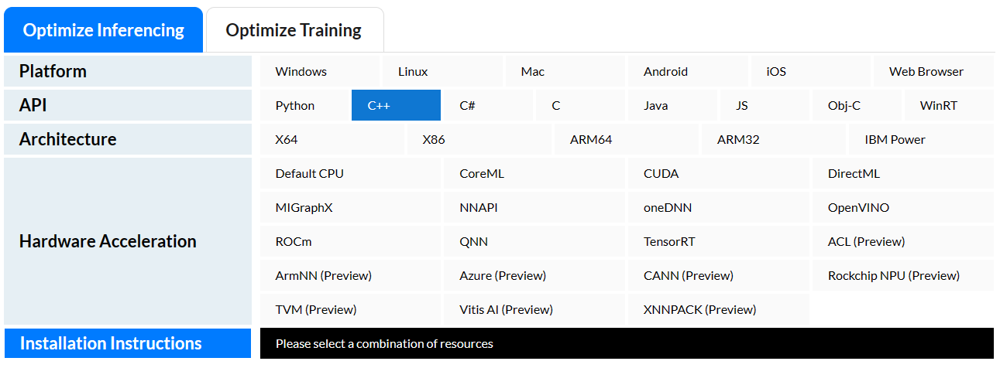
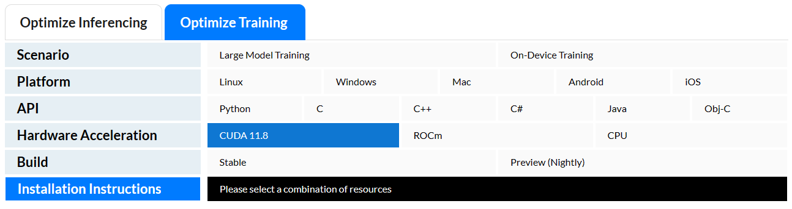
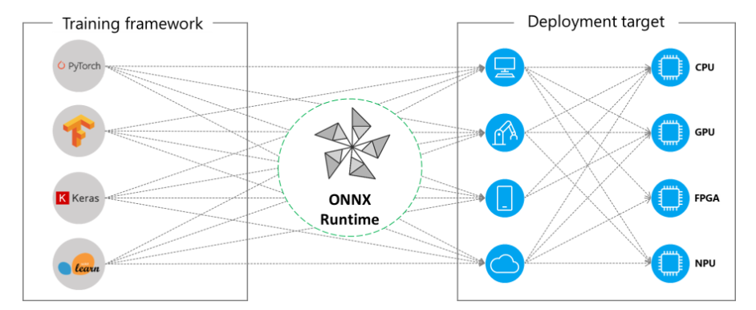
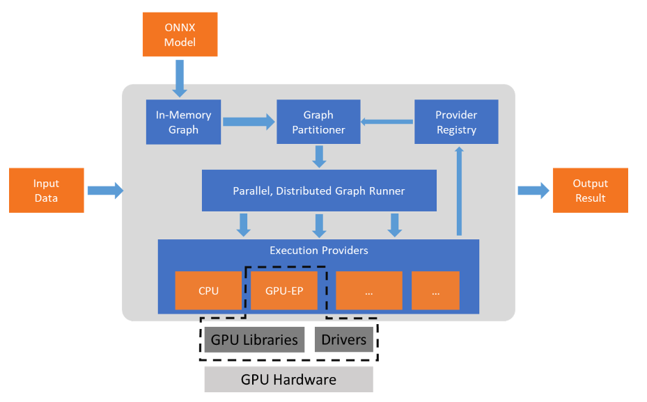
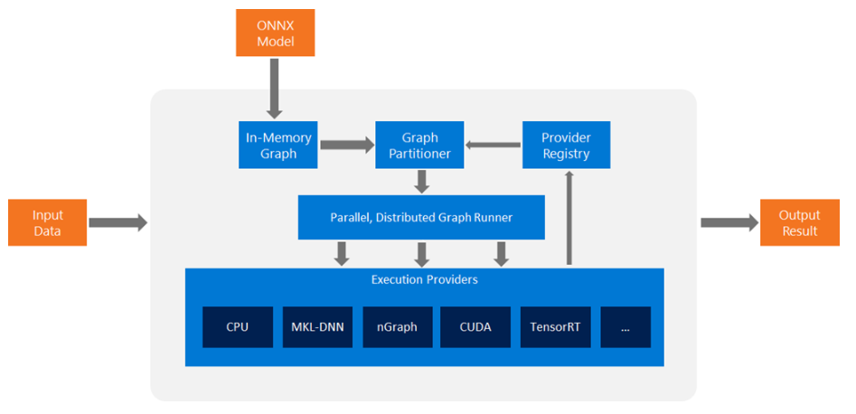

 

## Use ONNX Runtime with the platform of your choice

[ONNX Runtime | Home](https://onnxruntime.ai/index.html#getStartedTable)

Select the configuration you want to use and run the corresponding installation script.
ONNX Runtime supports a variety of hardware and architectures to fit any need.







## Use ONNX Runtime with your favorite language

[ONNX Runtime | Home](https://onnxruntime.ai/)


### python

```python
import onnxruntime as ort

# Load the model and create InferenceSession
model_path = "path/to/your/onnx/model"
session = ort.InferenceSession(model_path)

# Load and preprocess the input image inputTensor
...

# Run inference
outputs = session.run(None, {"input": inputTensor})
print(outputs)
```


### c#

```c#
using Microsoft.ML.OnnxRuntime;

// Load the model and create InferenceSession
string model_path = "path/to/your/onnx/model";
var session = new InferenceSession(model_path);

// Load and preprocess the input image to inputTensor
...

// Run inference
var outputs = session.Run(inputTensor).ToList();
Console.WriteLine(outputs[0].AsTensor()[0]);
```


### JavaScript

```javascript
import * as ort from "onnxruntime-web";

// Load the model and create InferenceSession
const modelPath = "path/to/your/onnx/model";
const session = await ort.InferenceSession.create(modelPath);

// Load and preprocess the input image to inputTensor
...

// Run inference
const outputs = await session.run({ input: inputTensor });
console.log(outputs);
```


### Java

```java
import ai.onnxruntime.*;

// Load the model and create InferenceSession
String modelPath = "path/to/your/onnx/model";
OrtEnvironment env = OrtEnvironment.getEnvironment();
OrtSession session = env.createSession(modelPath);

// Load and preprocess the input image inputTensor
...

// Run inference
OrtSession.Result outputs = session.run(inputTensor);
System.out.println(outputs.get(0).getTensor().getFloatBuffer().get(0));
```

### C++


```c++
#include "onnxruntime_cxx_api.h"

// Load the model and create InferenceSession
Ort::Env env;
std::string model_path = "path/to/your/onnx/model";
Ort::Session session(env, model_path, Ort::SessionOptions{ nullptr });

// Load and preprocess the input image to 
// inputTensor, inputNames, and outputNames
...

// Run inference
std::vector outputTensors =
 session.Run(Ort::RunOptions{nullptr}, 
 			inputNames.data(), 
			&inputTensor, 
			inputNames.size(), 
			outputNames.data(), 
			outputNames.size());

const float* outputDataPtr = outputTensors[0].GetTensorMutableData();
std::cout << outputDataPtr[0] << std::endl;
```


# onnxruntime源码阅读


官方文档

## ONNX运行时执行提供程序

[Execution Providers | onnxruntime](https://onnxruntime.ai/docs/execution-providers/)

ONNX Runtime通过其可扩展的Execution Providers (EP)框架与不同的硬件加速库一起工作，以在硬件平台上最佳地执行ONNX模型。该接口使AP应用程序开发人员能够灵活地在云和边缘的不同环境中部署ONNX模型，并利用平台的计算能力优化执行。



ONNX Runtime使用GetCapability()接口与执行提供程序一起工作，以分配特定的节点或子图，以便由支持硬件中的EP库执行。预安装在执行环境进程中的EP库，并在硬件上执行ONNX子图。该架构抽象出硬件特定库的细节，这些库对于优化跨硬件平台(如CPU, GPU, FPGA或专用npu)的深度神经网络执行至关重要。



ONNX Runtime现在支持许多不同的执行提供程序。有些ep已经投入生产，用于实时服务，而另一些则以预览版的形式发布，以便开发人员使用不同的选项开发和定制他们的应用程序。

**支持的执行提供程序摘要**

| CPU                                                          | GPU                                                          | IoT/Edge/Mobile                                              | Other                                                        |
| ------------------------------------------------------------ | ------------------------------------------------------------ | ------------------------------------------------------------ | ------------------------------------------------------------ |
| Default CPU                                                  | [NVIDIA CUDA](https://onnxruntime.ai/docs/execution-providers/CUDA-ExecutionProvider.html) | [Intel OpenVINO](https://onnxruntime.ai/docs/execution-providers/OpenVINO-ExecutionProvider.html) | [Rockchip NPU](https://onnxruntime.ai/docs/execution-providers/community-maintained/RKNPU-ExecutionProvider.html) (*preview*) |
| [Intel DNNL](https://onnxruntime.ai/docs/execution-providers/oneDNN-ExecutionProvider.html) | [NVIDIA TensorRT](https://onnxruntime.ai/docs/execution-providers/TensorRT-ExecutionProvider.html) | [ARM Compute Library](https://onnxruntime.ai/docs/execution-providers/community-maintained/ACL-ExecutionProvider.html) (*preview*) | [Xilinx Vitis-AI](https://onnxruntime.ai/docs/execution-providers/Vitis-AI-ExecutionProvider.html) (*preview*) |
| [TVM](https://onnxruntime.ai/docs/execution-providers/community-maintained/TVM-ExecutionProvider.html) (*preview*) | [DirectML](https://onnxruntime.ai/docs/execution-providers/DirectML-ExecutionProvider.html) | [Android Neural Networks API](https://onnxruntime.ai/docs/execution-providers/NNAPI-ExecutionProvider.html) | [Huawei CANN](https://onnxruntime.ai/docs/execution-providers/community-maintained/CANN-ExecutionProvider.html) (*preview*) |
| [Intel OpenVINO](https://onnxruntime.ai/docs/execution-providers/OpenVINO-ExecutionProvider.html) | [AMD MIGraphX](https://onnxruntime.ai/docs/execution-providers/MIGraphX-ExecutionProvider.html) | [ARM-NN](https://onnxruntime.ai/docs/execution-providers/community-maintained/ArmNN-ExecutionProvider.html) (*preview*) | [AZURE](https://onnxruntime.ai/docs/execution-providers/Azure-ExecutionProvider.html) (*preview*) |
| [XNNPACK](https://onnxruntime.ai/docs/execution-providers/Xnnpack-ExecutionProvider.html) | [Intel OpenVINO](https://onnxruntime.ai/docs/execution-providers/OpenVINO-ExecutionProvider.html) | [CoreML](https://onnxruntime.ai/docs/execution-providers/CoreML-ExecutionProvider.html) (*preview*) |                                                              |
|                                                              | [AMD ROCm](https://onnxruntime.ai/docs/execution-providers/ROCm-ExecutionProvider.html) | [TVM](https://onnxruntime.ai/docs/execution-providers/community-maintained/TVM-ExecutionProvider.html) (*preview*) |                                                              |
|                                                              | [TVM](https://onnxruntime.ai/docs/execution-providers/community-maintained/TVM-ExecutionProvider.html) (*preview*) | [Qualcomm QNN](https://onnxruntime.ai/docs/execution-providers/QNN-ExecutionProvider.html) |                                                              |
|                                                              |                                                              | [XNNPACK](https://onnxruntime.ai/docs/execution-providers/Xnnpack-ExecutionProvider.html) |                                                              |


## ONNX运行时中的图形优化

[Graph optimizations | onnxruntime](https://onnxruntime.ai/docs/performance/model-optimizations/graph-optimizations.html)

ONNX Runtime提供各种图形优化来提高性能。图优化本质上是图级转换，从小图简化和节点消除到更复杂的节点融合和布局优化。

图形优化根据其复杂性和功能分为几个类别(或级别)。它们可以在线或离线执行。在联机模式下，优化在执行推理之前完成，而在脱机模式下，运行时将优化的图保存到磁盘上。ONNX运行时提供Python、c#、c++和C api，以支持不同的优化级别，并在离线和在线模式之间进行选择。

下面我们将详细介绍优化级别、在线/离线模式以及控制它们的各种api。


| Optimization                    | Execution Provider | Comment                                                      |
| ------------------------------- | ------------------ | ------------------------------------------------------------ |
| GEMM Activation Fusion          | CPU                |                                                              |
| Matmul Add Fusion               | CPU                |                                                              |
| Conv Activation Fusion          | CPU                |                                                              |
| GELU Fusion                     | CPU, CUDA, ROCm    |                                                              |
| Layer Normalization Fusion      | CPU, CUDA, ROCm    |                                                              |
| BERT Embedding Layer Fusion     | CPU, CUDA, ROCm    | Fuse BERT embedding layer, layer normalization and attention mask length |
| Attention Fusion*               | CPU, CUDA, ROCm    |                                                              |
| Skip Layer Normalization Fusion | CPU, CUDA, ROCm    | Fuse bias of fully connected layer, skip connection and layer normalization |
| Bias GELU Fusion                | CPU, CUDA, ROCm    | Fuse bias of fully connected layer and GELU activation       |
| GELU Approximation*             | CUDA, ROCm         | Disabled by default. Enable with [kOrtSessionOptionsEnableGeluApproximation](https://cs.github.com/microsoft/onnxruntime/blob/175acf08f470db0bb2e4b8eefe55cdeb87c8b132/include/onnxruntime/core/session/onnxruntime_session_options_config_keys.h?q=kOrtSessionOptionsEnableGeluApproximation#L52) |


## 高级系统架构

[Architecture | onnxruntime](https://onnxruntime.ai/docs/reference/high-level-design.html)

流程非常简单。

1. 从ONNX模型开始，ONNX运行时首先将模型图转换为其内存中的图表示形式。
2. 它执行一组独立于提供者的[优化](https://onnxruntime.ai/docs/performance/graph-optimizations)。
3. 它根据可用的执行提供程序将图划分为一组子图。
4. 每个子图被分配给一个执行提供程序。通过使用GetCapability() API查询执行提供程序的能力，我们确保子图可以由执行提供程序执行。




