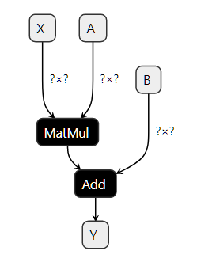
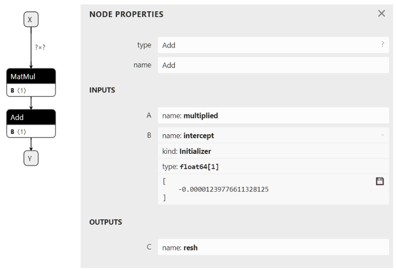

# ONNX


[Introduction to ONNX - ONNX 1.16.0 documentation](https://onnx.ai/onnx/intro/)


# Introduction to ONNX

This documentation describes the ONNX concepts (**Open Neural Network Exchange**). It shows how it is used with examples in python and finally explains some of challenges faced when moving to ONNX in production.

- ONNX Concepts
  - [Input, Output, Node, Initializer, Attributes](https://onnx.ai/onnx/intro/concepts.html#input-output-node-initializer-attributes)
  - [Serialization with protobuf](https://onnx.ai/onnx/intro/concepts.html#serialization-with-protobuf)
  - [Metadata](https://onnx.ai/onnx/intro/concepts.html#metadata)
  - [List of available operators and domains](https://onnx.ai/onnx/intro/concepts.html#list-of-available-operators-and-domains)
  - [Supported Types](https://onnx.ai/onnx/intro/concepts.html#supported-types)
  - [What is an opset version?](https://onnx.ai/onnx/intro/concepts.html#what-is-an-opset-version)
  - [Subgraphs, tests and loops](https://onnx.ai/onnx/intro/concepts.html#subgraphs-tests-and-loops)
  - [Extensibility](https://onnx.ai/onnx/intro/concepts.html#extensibility)
  - [Functions](https://onnx.ai/onnx/intro/concepts.html#functions)
  - [Shape (and Type) Inference](https://onnx.ai/onnx/intro/concepts.html#shape-and-type-inference)
  - [Tools](https://onnx.ai/onnx/intro/concepts.html#tools)
- ONNX with Python
  - [A simple example: a linear regression](https://onnx.ai/onnx/intro/python.html#a-simple-example-a-linear-regression)
  - [Serialization](https://onnx.ai/onnx/intro/python.html#serialization)
  - [Initializer, default value](https://onnx.ai/onnx/intro/python.html#initializer-default-value)
  - [Attributes](https://onnx.ai/onnx/intro/python.html#attributes)
  - [Opset and metadata](https://onnx.ai/onnx/intro/python.html#opset-and-metadata)
  - [Subgraph: test and loops](https://onnx.ai/onnx/intro/python.html#subgraph-test-and-loops)
  - [Functions](https://onnx.ai/onnx/intro/python.html#functions)
  - [Parsing](https://onnx.ai/onnx/intro/python.html#parsing)
  - [Checker and Shape Inference](https://onnx.ai/onnx/intro/python.html#checker-and-shape-inference)
  - [Evaluation and Runtime](https://onnx.ai/onnx/intro/python.html#evaluation-and-runtime)
  - [Implementation details](https://onnx.ai/onnx/intro/python.html#implementation-details)
- Converters
  - [What is a converting library?](https://onnx.ai/onnx/intro/converters.html#what-is-a-converting-library)
  - [Opsets](https://onnx.ai/onnx/intro/converters.html#opsets)
  - [Other API](https://onnx.ai/onnx/intro/converters.html#other-api)
  - [Tricks learned from experience](https://onnx.ai/onnx/intro/converters.html#tricks-learned-from-experience)

Next

## ONNX Concepts

ONNX可以比作专门用于数学函数的编程语言。它定义了机器学习模型使用这种语言实现其推理功能所需的所有必要操作。线性回归可以用以下方式表示:

```python
def onnx_linear_regressor(X):
    "ONNX code for a linear regression"
    return onnx.Add(onnx.MatMul(X, coefficients), bias)
```

这个例子与开发人员用Python编写的表达式非常相似。它也可以表示为一个图形，该图形一步一步地显示如何转换特征以获得预测。

这就是为什么用ONNX实现的机器学习模型通常被称为ONNX图的原因。




ONNX旨在提供一种通用语言，任何机器学习框架都可以使用它来描述其模型。第一个场景是简化在生产环境中部署机器学习模型的过程。ONNX解释器(或runtime)可以在部署它的环境中专门针对该任务实现和优化。使用ONNX，可以构建一个独特的过程来在生产中部署模型，并且独立于用于构建模型的学习框架。onnx实现了一个python runtime，可以用来计算onnx模型和onnx操作。这是为了澄清ONNX的语义，并帮助理解和调试ONNX工具和转换器。它不打算用于生产，性能也不是目标(参见[onnext .reference](https://onnx.ai/onnx/api/reference.html#l-reference-implementation))。

### Input, Output, Node, Initializer, Attributes

构建ONNX图意味着使用ONNX语言或更准确地说，使用[ONNX操作符](https://onnx.ai/onnx/operators/index.html#l-onnx-operators)实现一个函数。线性回归可以这样写。以下行不遵循python语法。它只是一种用来说明模型的伪代码。

```bash
Input: float[M,K] x, float[K,N] a, float[N] c
Output: float[M, N] y

r = onnx.MatMul(x, a)
y = onnx.Add(r, c)
```

这段代码实现了一个函数f(x, a, c) -> y = x @ a + c。其中x, a, c是**输入**，y是**输出**。r是中间结果。MatMul和Add是**节点**。它们也有输入和输出。节点也有一个类型，它是[ONNX operators](https://onnx.ai/onnx/operators/index.html#l-onnx-operators)中的一个操作符。这个图是用A节中的例子建立的，简单的例子:[线性回归](https://onnx.ai/onnx/intro/python.html#l-onnx-linear-regression-onnx-api)。

图也可以有一个**初始化器**。当输入永远不会改变时，例如线性回归的系数，将其转换为存储在图中的常量是最有效的。

```bash
Input: float[M,K] x
Initializer: float[K,N] a, float[N] c
Output: float[M, N] xac

xa = onnx.MatMul(x, a)
xac = onnx.Add(xa, c)
```

从视觉上看，此图类似于下图。右侧描述了Add操作符，其中第二个输入定义为初始化器。此图是使用此代码初始化器(默认值)获得的。



**属性**是操作符的固定参数。操作符[Gemm](https://onnx.ai/onnx/operators/onnx__Gemm.html#l-onnx-doc-gemm)有四个属性，alpha, beta, transA, transB。除非运行时允许它通过其API，否则一旦加载了ONNX图，这些值就不能被更改，并且在所有预测中保持冻结状态。

### 使用protobuf进行序列化

将机器学习模型部署到生产中通常需要复制用于训练模型的整个生态系统，大多数情况下使用docker。一旦将模型转换为ONNX，生产环境只需要runtime来执行用ONNX操作符定义的图。这个runtime可以用任何适合生产应用程序的语言开发，C, java, python, javascript, c#， Webassembly, ARM…

但要做到这一点，需要保存ONNX图。ONNX使用protobuf将图序列化为单个块(参见[解析和序列化](https://developers.google.com/protocol-buffers/docs/pythontutorial#parsing-and-serialization))。它的目的是尽可能优化模型大小。


### 元数据(Metadata)

机器学习模型不断更新。跟踪模型的版本、模型的作者以及它是如何被训练的是很重要的。ONNX提供了在模型本身中存储额外数据的可能性。


