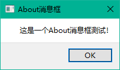

# Qt基础


```markmap
# Qt基础
## 1. Qt概述
## 2. Qt 5模板库、工具类及控件
## 3. Qt 5布局管理
## 4. Qt 5基本对话框
## 5. Qt 5主窗口
## 6. Qt 5图形宇图片
## 7. Qt 5图形视图框架
## 8. Qt 5模型/视图结构
## 9. Qt 5文件及磁盘处理
## 10. Qt 5网络宇通信
## 11. Qt 5事件处理及实例
## 12. Qt 5多线程
## 13. Qt 5数据库
## 14. Qt 5操作Office实例
## 15. Qt 5多国语言国际化
## 16. Qt 5单元测试框架

```


# Qt 学习笔记


## Qt 音乐播放器


参考：[Qt5 QMediaPlayer 音乐播放器_sundial dreams的博客-CSDN博客](https://blog.csdn.net/daydream13580130043/article/details/79094643)

[sundial-dreams/Qt5_Music: using qt5 to devolep a music app (github.com)](https://github.com/sundial-dreams/Qt5_Music)


## QtLineEdit


[QT：QLineEdit 各类操作详解_大黑山修道的博客-CSDN博客_qt中qlineedit](https://blog.csdn.net/sazass/article/details/109443576)


### 设置QLineEdit控件不可修改

```cpp
ui->lineEdit->setEnabled(false);
```


### 设置QLineEdit控件输入的字体样式和大小

```cpp
QFont font;
font.setPointSize(16); //字号大小
font.setFamily(("wenquanyi")); //字体样式
font.setBold(false);
ui->lineEdit->setFont(font); // 为控件设置格式
```


### 为QLineEdit控件的内容赋值

```cpp
ui->lineEdit->setText("0.000015");
```

### 获取QLineEdit控件的内容

获取QString类型：

```cpp
QString name = ui->lineEdit->text();
```

获取double类型：

```cpp
double c1 = ui->lineEdit->text().toDouble();
```

其他类型类似……

### 在QLineEdit控件输入时显示密码文

```cpp
//输入的时候就显示圆点
ui->edit_pw->setEchoMode(QLineEdit::Password);
```

### QLineEdit控件输入约束格式：

只允许输入数字:

```cpp
ui->lineEdit->setValidator(new QRegExpValidator(QRegExp("[0-9]+$")));   
```

只允许输入浮点型数据：

```cpp
ui->lineEdit->setValidator(new QRegExpValidator(QRegExp("^(-?\d+)(\.\d+)?$")));   
```

只能输入字母：

```cpp
ui->lineEdit->setValidator(new QRegExpValidator(QRegExp("^[A-Za-z]+$")));   
```

只能输入数字和字母：

```cpp
ui->lineEdit->setValidator(new QRegExpValidator(QRegExp("[a-zA-Z0-9]+$")));
```

只能输入-9999~9999的整型数据：

```cpp
ui->lineEdit->setValidator(new QRegExpValidato(new QRegExpValidator(QRegExp("^-?(9999|[0-9]?[0-9]?[0-9]?\\d(\\.\\d{1,4})?)$"))); 
```

只能输入-180~180的浮点型数据：

```cpp
ui->lineEdit>setValidator(new QRegExpValidator(QRegExp("^-?(180|1?[0-7]?\\d(\\.\\d{1,4})?)$")));   //只能输入数字
```

其他更多可查看：[QT QLineEdit 只能输入字母或数字，输入格式约束（正则表达式）_大黑山修道的博客-CSDN博客_qlineedit限制输入数字](https://blog.csdn.net/sazass/article/details/114785616)

### 添加提示语

```cpp
ui->lineEdit->setPlaceholderText(tr("请输入温度"));
```


## QRegExp正则表达式


```cpp
-?  ： 表示一个或者零个负号。？表示重复前面的字符0次或者1次
\d+：\d表示匹配一位数字，是转义的字符，+表示前面的\d(数字)重复一次或者多次
 ^  ：表示限定字符串的开头
 $  ：限定字符串的结尾
 \.  ：表示匹配小数点
 \   ：用来标记转义字符
 |   ： 表示或
```


## Qt消息框

[QMessageBox Class | Qt Widgets 5.15.11](https://doc.qt.io/qt-5/qmessagebox.html)

[Qt弹窗之——标准消息对话框_标识符的博客-CSDN博客_qt 消息框](https://blog.csdn.net/qq_36908789/article/details/106439905)

- 添加库`QT += widgets`
- 包含相关头文件`#include <QMessageBox>`
  通过查看QT[官方文档](https://doc.qt.io/qt-5/qmessagebox.html)找到QMessageBox的静态成员函数，可以看到其函数声明。


| void                        | **[about](https://doc.qt.io/qt-5/qmessagebox.html#about)**(QWidget **parent*, const QString &*title*, const QString &*text*) |
| --------------------------- | ------------------------------------------------------------ |
| void                        | **[aboutQt](https://doc.qt.io/qt-5/qmessagebox.html#aboutQt)**(QWidget **parent*, const QString &*title* = QString()) |
| QMessageBox::StandardButton | **[critical](https://doc.qt.io/qt-5/qmessagebox.html#critical)**(QWidget **parent*, const QString &*title*, const QString &*text*, QMessageBox::StandardButtons *buttons* = Ok, QMessageBox::StandardButton *defaultButton* = NoButton) |
| QMessageBox::StandardButton | **[information](https://doc.qt.io/qt-5/qmessagebox.html#information)**(QWidget **parent*, const QString &*title*, const QString &*text*, QMessageBox::StandardButtons *buttons* = Ok, QMessageBox::StandardButton *defaultButton* = NoButton) |
| QMessageBox::StandardButton | **[question](https://doc.qt.io/qt-5/qmessagebox.html#question)**(QWidget **parent*, const QString &*title*, const QString &*text*, QMessageBox::StandardButtons *buttons* = StandardButtons(Yes \| No), QMessageBox::StandardButton *defaultButton* = NoButton) |
| QMessageBox::StandardButton | **[warning](https://doc.qt.io/qt-5/qmessagebox.html#warning)**(QWidget **parent*, const QString &*title*, const QString &*text*, QMessageBox::StandardButtons *buttons* = Ok, QMessageBox::StandardButton *defaultButton* = NoButton) |


总的来说，标准消息对话框QMessageBox类有六种消息框。

| 静态函数                 | 函数说明          |
| ------------------------ | ----------------- |
| QMessageBox::question    | Question消息框    |
| QMessageBox::information | Information消息框 |
| QMessageBox::warning     | Warning消息框     |
| QMessageBox::critical    | Critical消息框    |
| QMessageBox::about       | About消息框       |
| QMessageBox::aboutQt     | AboutQt消息框     |


​	标准按钮的标志`QMessageBox::StandardButton`
​	

| 内容                         | 描述                                        |
| ---------------------------- | ------------------------------------------- |
| QMessageBox::Ok              | AcceptRole定义的“确定”按钮。                |
| QMessageBox::Open            | AcceptRole定义的“打开”按钮。                |
| QMessageBox::Save            | AcceptRole定义的“保存”按钮。                |
| QMessageBox::Cancel          | RejectRole定义的“取消”按钮。                |
| QMessageBox::Close           | RejectRole定义的“关闭”按钮。                |
| QMessageBox::Discard         | DestructiveRole定义的“放弃”或“不保存”按钮。 |
| QMessageBox::Apply           | ApplyRole定义的“应用”按钮。                 |
| QMessageBox::Reset           | ResetRole定义的“重置”按钮。                 |
| QMessageBox::RestoreDefaults | ResetRole定义的“恢复默认值”按钮。           |
| QMessageBox::Help            | HelpRole定义的“帮助”按钮。                  |
| QMessageBox::SaveAll         | AcceptRole定义的“全部保存”按钮。            |
| QMessageBox::Yes             | YesRole定义的“是”按钮。                     |
| QMessageBox::YesToAll        | YesRole定义的“全部同意”按钮。               |
| QMessageBox::No              | NoRole定义的“否”按钮。                      |
| QMessageBox::NoToAll         | NoRole定义的“全部拒绝”按钮。                |
| QMessageBox::Abort           | RejectRole定义的“中止”按钮。                |
| QMessageBox::Retry           | AcceptRole定义的“重试”按钮。                |
| QMessageBox::Ignore          | AcceptRole定义的“忽略”按钮。                |
| QMessageBox::NoButton        | 无效的按钮。                                |


​	消息严重级别

|                                                   |                                                              |                              |
| ------------------------------------------------- | ------------------------------------------------------------ | ---------------------------- |
|                  | [Question](https://doc.qt.io/qt-5/qmessagebox.html#Icon-enum) | 用于在正常操作期间提出问题。 |
|  | [Information](https://doc.qt.io/qt-5/qmessagebox.html#Icon-enum) | 用于报告有关正常操作的信息。 |
|  | [Warning](https://doc.qt.io/qt-5/qmessagebox.html#Icon-enum) | 用于报告非严重错误。         |
|  | [Critical](https://doc.qt.io/qt-5/qmessagebox.html#Icon-enum) | 用于报告严重错误。           |

### Question消息框

函数声明：

```cpp
QMessageBox::StandardButton question(QWidget *parent,
const QString &title,
const QString &text,
QMessageBox::StandardButtons buttons =StandardButtons(Yes|No),
QMessageBox::StandardButton defaultButton= NoButton)
```

示例代码：

 ```cpp
 QMessageBox::question(this, 
         tr("弹窗标题"),
         tr("弹窗内容"),
         QMessageBox::Ok | QMessageBox::Cancel, 
         QMessageBox::Ok);
 ```


效果：


解释：

- 第四个参数buttons指要添加的标准按钮，置为`QMessageBox::Ok | QMessageBox::Cancel`表示添加确认键和取消键。
- 第五个参数defaultButton指定按下Enter键时使用的按钮，若为`QMessageBox::NoButton`则QMessageBox自动选择一个合适的默认值。
- 函数返回类型为`QMessageBox::StandardButton`，可通过返回值知道用户按下了哪个按钮，以此作为后续操作依据。
  

### Information消息框

Information消息框具有和Question消息框一样的参数和返回值，其使用方法和解释都是一样的。

```cpp
QMessageBox::information(this, 
    tr("Information消息框标题"), 
    tr("这是Information消息框的内容。"),
    QMessageBox::Ok | QMessageBox::Cancel, 
    QMessageBox::Ok);
```


	

### Warning消息框

Warning消息框同上。

```cpp
    QMessageBox::warning(this, 
        tr("Warning消息框"),
        tr("您修改的内容还未保存，是否要保存对文档的修改？"),
        QMessageBox::Save | QMessageBox::Discard | QMessageBox::Cancel,
        QMessageBox::Save);
```


### Critical消息框

Critical消息框同上。
在调用时，如果不指定后两个参数，即设置按钮和设置按下时的默认按钮。系统会默认指定。（上述四个消息框都一样。）

```cpp
QMessageBox::critical(this, tr("Critical消息框"), tr("这是一个Critical消息框！"));
```

### About消息框

About消息框只能指定消息标题和内容，不能设置按钮。
它的函数声明：

```cpp
QMessageBox::about(this, tr("About消息框"), tr("这是一个About消息框测试！"));
```



### AboutQt消息框

AboutQt消息框显示了应用程序正在使用的Qt的版本号等信息。
它只能指定标题。其函数声明：

```cpp
QMessageBox::aboutQt(this, tr("About Qt消息框"));
```


### 总结

消息框显示用于向用户发出警报的主要[文本](https://doc.qt.io/qt-5/qmessagebox.html#text-prop)，用于进一步说明警报或询问用户问题的[信息性文本](https://doc.qt.io/qt-5/qmessagebox.html#informativeText-prop)，以及用于在用户需要时提供更多数据的可选[详细文本](https://doc.qt.io/qt-5/qmessagebox.html#detailedText-prop)。


