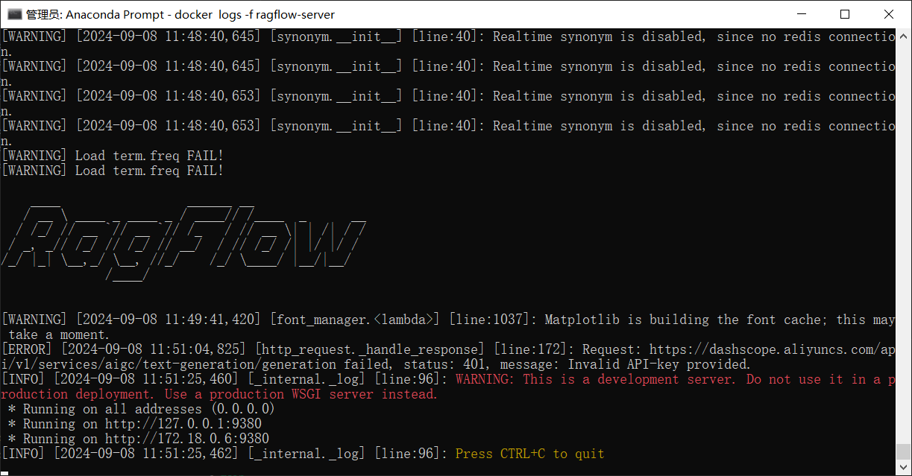

## 为Git设置代理

https://ericclose.github.io/git-proxy-config.html

```bash
git config --global http.https://github.com.proxy http://127.0.0.1:7890
```

取消和查看代理

```bash
取消代理

git config --global --unset http.proxy
git config --global --unset https.proxy

查看代理

git config --global --get http.proxy
git config --global --get https.proxy
git  config --list
```

## RAGFlow

https://docs.docker.com/desktop/install/windows-install/

安装桌面版Docker。

安装完成后需要重启，重启后报错：忽略继续执行。

进入下载代码的docker目录，执行：

```bash
docker compose up -d

docker logs -f ragflow-server
```

### docker安装到其他盘

注意不使用 `Program Files` 是因为windos会把命令从空格处断开。

```bash
start /w "" "Docker Desktop Installer.exe" install --backend=wsl-2 --installation-dir=E:\ProgramFiles\Docker --wsl-default-data-root=E:\ProgramFiles\wsl --accept-license
```

### 启动服务

在cmd中（我的时anaconda的base环境）。

```bash
docker compose up -d

docker logs -f ragflow-server
```

上面两个命令执行完成后：



启动完成后可以在Docker的GUI界面ragflow-server右侧的ports部分，单击80：80进入，随便注册一个账号，然后登录。

### ollama模型

模型供应商部分选择**Ollama** ，本地模型通过Ollama形式装载。

https://ollama.com/download


下载Ollama，安装模型，默认安装到C盘，命令行可以安装到指定目录。

```bash
ollamasetup.exe  /DIR="d:/ollama"
```

https://github.com/ollama/ollama/issues/2938


```bash
# llama3大模型
ollama run llama3:8b
# 通义千问大模型
ollama run qwen2:7b
```

https://ollama.com/library/qwen2:7b

将模型安装到D盘。

https://www.bilibili.com/video/BV1zw4m1f7QS/?spm_id_from=333.788&vd_source=148afb6cb7e28daa45a2f426a0dec4ee


卸载模型

```bash
C:\Users\Administrator>ollama list
NAME            ID              SIZE    MODIFIED
qwen2:7b        e0d4e1163c58    4.4 GB  5 minutes ago
gemma:2b        b50d6c999e59    1.7 GB  32 minutes ago

C:\Users\Administrator>ollama rm qwen2:7b
deleted 'qwen2:7b'

C:\Users\Administrator>ollama list
NAME            ID              SIZE    MODIFIED
gemma:2b        b50d6c999e59    1.7 GB  33 minutes ago

C:\Users\Administrator>ollama rm gemma:2b
deleted 'gemma:2b'

C:\Users\Administrator>ollama list
NAME    ID      SIZE    MODIFIED

```


