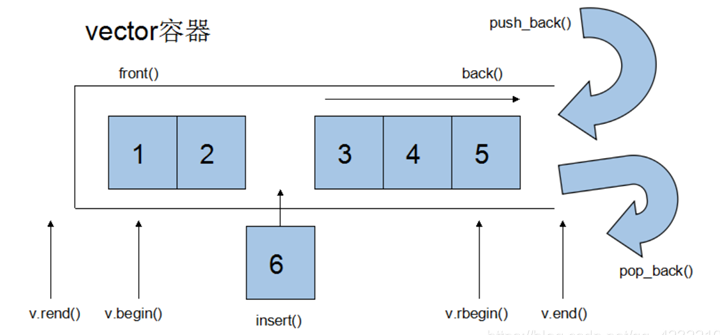
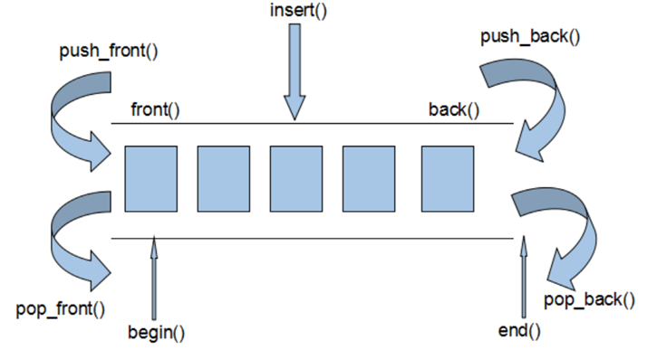
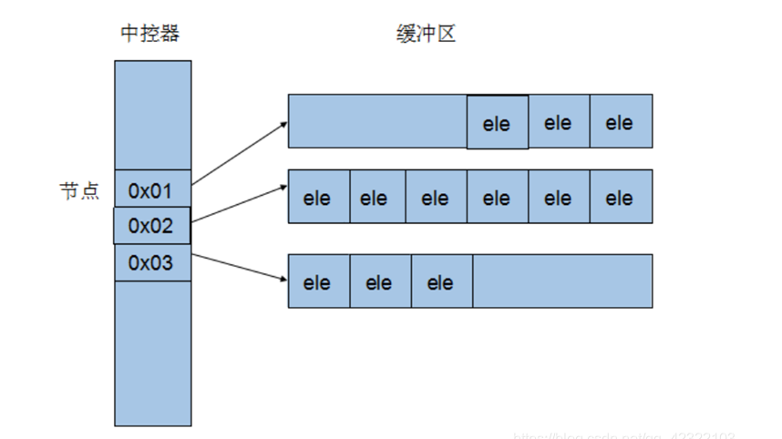
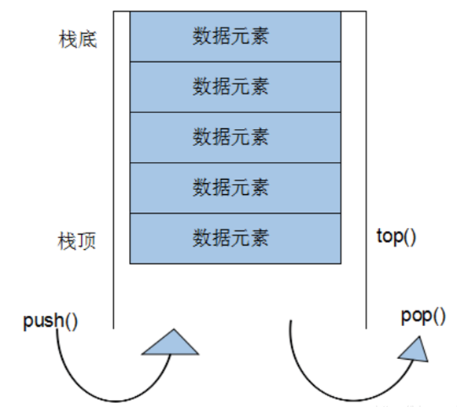
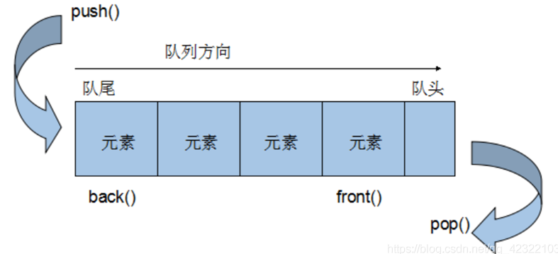
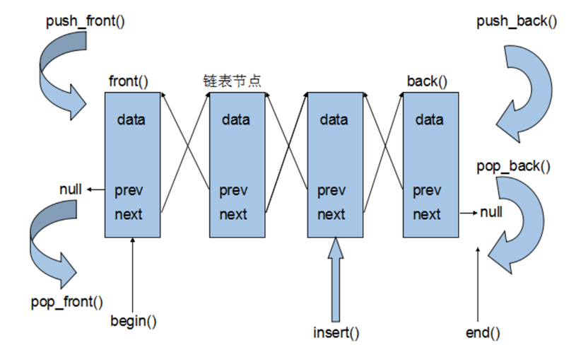

# C++模板

[C++ 模板 | 菜鸟教程 (runoob.com)](https://www.runoob.com/cplusplus/cpp-templates.html)


模板是泛型编程的基础，泛型编程即以一种独立于任何特定类型的方式编写代码。

模板是创建泛型类或函数的蓝图或公式。库容器，比如迭代器和算法，都是泛型编程的例子，它们都使用了模板的概念。

每个容器都有一个单一的定义，比如 **向量**，我们可以定义许多不同类型的向量，比如 **vector <int>** 或 **vector <string>**。

您可以使用模板来定义函数和类，接下来让我们一起来看看如何使用。

## 函数模板

模板函数定义的一般形式如下所示：

```cpp
template <typename type> ret-type func-name(parameter list)
{
   // 函数的主体
}
```

在这里，type 是函数所使用的数据类型的占位符名称。这个名称可以在函数定义中使用。

下面是函数模板的实例，返回两个数中的最大值：

```cpp
#include <iostream>
#include <string>
 
using namespace std;
 
template <typename T>
inline T const& Max (T const& a, T const& b) 
{ 
    return a < b ? b:a; 
} 
int main ()
{
 
    int i = 39;
    int j = 20;
    cout << "Max(i, j): " << Max(i, j) << endl; 
 
    double f1 = 13.5; 
    double f2 = 20.7; 
    cout << "Max(f1, f2): " << Max(f1, f2) << endl; 
 
    string s1 = "Hello"; 
    string s2 = "World"; 
    cout << "Max(s1, s2): " << Max(s1, s2) << endl; 
 
    return 0;
}
```

当上面的代码被编译和执行时，它会产生下列结果：

```bash
Max(i, j): 39
Max(f1, f2): 20.7
Max(s1, s2): World
```


#  C++ STL

参考：[【C/C++】STL详解](https://blog.csdn.net/qq_42322103/article/details/99685797)


## 概述

长久以来，软件界一直希望建立一种可重复利用的东西，以及一种得以制造出”可重复运用的东西”的方法，从函数(functions)，类别(classes),函数库(function libraries),类别库(class libraries)、各种组件，从模块化设计，到面向对象(object oriented )，为的就是复用性的提升。

复用性必须建立在某种标准之上。但是在许多环境下，就连软件开发最基本的数据结构(data structures) 和算法(algorithm)都未能有一套标准。大量程序员被迫从事大量重复的工作，竟然是为了完成前人已经完成而自己手上并未拥有的程序代码，这不仅是人力资源的浪费，也是挫折与痛苦的来源。

为了建立数据结构和算法的一套标准，并且降低他们之间的耦合关系，以提升各自的独立性、弹性、交互操作性(相互合作性,interoperability),诞生了STL。

STL(Standard Template Library,标准模板库)，是惠普实验室开发的一系列软件的统称。现在主要出现在 c++中，但是在引入 c++之前该技术已经存在很长时间了。

STL 从广义上分为: **容器**(container) **算法**(algorithm) **迭代器**(iterator)。

容器和算法之间通过迭代器进行无缝连接。STL 几乎所有的代码都采用了模板类或者模板函数，这相比传统的由函数和类组成的库来说提供了更好的代码重用机会。

STL(Standard Template Library)标准模板库,在我们 c++标准程序库中隶属于 STL 的占到了 80%以上。


## STL六大组件简介

STL提供了六大组件，彼此之间可以组合套用，这六大组件分别是:**容器、算法、迭代器、仿函数、适配器（配接器）、空间配置器**。

**容器**：各种数据结构，如vector、list、deque、set、map等,用来存放数据，从实现角度来看，STL容器是一种class template。

**算法**：各种常用的算法，如sort、find、copy、for_each。从实现的角度来看，STL算法是一种function tempalte.

**迭代器**：扮演了容器与算法之间的胶合剂，共有五种类型，从实现角度来看，迭代器是一种将operator* , operator-> , operator++,operator–等指针相关操作予以重载的class template. 所有STL容器都附带有自己专属的迭代器，只有容器的设计者才知道如何遍历自己的元素。原生指针(native pointer)也是一种迭代器。

**仿函数**：行为类似函数，可作为算法的某种策略。从实现角度来看，仿函数是一种重载了operator()的class 或者class template

**适配器**：一种用来修饰容器或者仿函数或迭代器接口的东西。

**空间配置器**：负责空间的配置与管理。从实现角度看，配置器是一个实现了动态空间配置、空间管理、空间释放的class tempalte.

STL六大组件的交互关系，容器通过空间配置器取得数据存储空间，算法通过迭代器存储容器中的内容，仿函数可以协助算法完成不同的策略的变化，适配器可以修饰仿函数。


 **STL的优点**

- STL 是 C++的一部分，因此不用额外安装什么，它被内建在你的编译器之内。
- STL 的一个重要特性是将数据和操作分离。数据由容器类别加以管理，操作则由可定制的算法定义。迭代器在两者之间充当“粘合剂”,以使算法可以和容器交互运作。
- 程序员可以不用思考 STL 具体的实现过程，只要能够熟练使用 STL 就 OK 了。这样他们就可以把精力放在程序开发的别的方面。
- STL 具有高可重用性，高性能，高移植性，跨平台的优点。
  高可重用性：STL 中几乎所有的代码都采用了模板类和模版函数的方式实现，这相比于传统的由函数和类组成的库来说提供了更好的代码重用机会。
  高性能：如 map 可以高效地从十万条记录里面查找出指定的记录，因为 map 是采用红黑树的变体实现的。
  高移植性：如在项目 A 上用 STL 编写的模块，可以直接移植到项目 B 上。

## 三大组件介绍


### 容器

几乎可以说，任何特定的数据结构都是为了实现某种特定的算法。STL容器就是将运用最广泛的一些数据结构实现出来。
常用的数据结构：**数组**(array) , **链表**(list), **树**(tree)，**栈**(stack), **队列**(queue), **集合**(set),**映射表**(map), 根据数据在容器中的排列特性，这些数据分为**序列式容器**和**关联式容器**两种。

- 序列式容器强调值的排序，序列式容器中的每个元素均有固定的位置，除非用删除或插入的操作改变这个位置。Vector容器、Deque容器、List容器等。
- 关联式容器是非线性的树结构，更准确的说是二叉树结构。各元素之间没有严格的物理上的顺序关系，也就是说元素在容器中并没有保存元素置入容器时的逻辑顺序。关联式容器另一个显著特点是：在值中选择一个值作为关键字key，这个关键字对值起到索引的作用，方便查找。Set/multiset容器 Map/multimap容器.

### 算法

算法，问题的解法，以有限的步骤，解决逻辑或数学上的问题。

我们所编写的每个程序都是一个算法，其中的每个函数也都是一个算法，毕竟它们都是用来解决或大或小的逻辑问题或数学问题。STL收录的算法经过了数学上的效能分析与证明，是极具复用价值的，包括常用的排序，查找等等。特定的算法往往搭配特定的数据结构，算法与数据结构相辅相成。

算法分为:质变算法和非质变算法。

- 质变算法：是指运算过程中会更改区间内的元素的内容。例如拷贝，替换，删除等等
- 非质变算法：是指运算过程中不会更改区间内的元素内容，例如查找、计数、遍历、寻找极值等等

### 迭代器

迭代器(iterator)是一种抽象的设计概念，现实程序语言中并没有直接对应于这个概念的实物。 在《Design Patterns》一书中提供了23种设计模式的完整描述， 其中iterator模式定义如下：提供一种方法，使之能够依序寻访某个容器所含的各个元素，而又无需暴露该容器的内部表示方式。

迭代器的设计思维-STL的关键所在，STL的中心思想在于将容器(container)和算法(algorithms)分开，彼此独立设计，最后再一贴胶着剂将他们撮合在一起。

从技术角度来看，容器和算法的泛型化并不困难，c++的class template和function template可分别达到目标，如果设计出这两个之间的良好的胶着剂，才是大难题。

迭代器的种类:

| 迭代器         | 功能                                                         | 描述                                   |
| -------------- | ------------------------------------------------------------ | -------------------------------------- |
| 输入迭代器     | 提供对数据的只读访问                                         | 只读，支持++、==、!=                   |
| 输出迭代器     | 提供对数据的只写访问                                         | 只写，支持++                           |
| 前向迭代器     | 提供读写操作，并能向前推进迭代器                             | 读写，支持++、==、!=                   |
| 双向迭代器     | 提供读写操作，并能向前和向后推进迭代器                       | 读写，支持++、--                       |
| 随机访问迭代器 | 提供读写操作，并能以跳跃方式访问容器的任意数据，是功能最强的迭代器 | 读写，支持++、–、[n]、-n、<、<=、>、>= |

演示

```cpp
#define _CRT_SECURE_NO_WARNINGS
#include<iostream>
#include<vector>
#include<algorithm>
using namespace std;

//STL 中的容器 算法 迭代器
void test01(){
	vector<int> v; //STL 中的标准容器之一 ：动态数组
	v.push_back(1); //vector 容器提供的插入数据的方法
	v.push_back(5);
	v.push_back(3);
	v.push_back(7);
	//迭代器
	vector<int>::iterator pStart = v.begin(); //vector 容器提供了 begin()方法 返回指向第一个元素的迭代器
	vector<int>::iterator pEnd = v.end(); //vector 容器提供了 end()方法 返回指向最后一个元素下一个位置的迭代器
	//通过迭代器遍历
	while (pStart != pEnd){
		cout << *pStart << " ";
		pStart++;
	}
	cout << endl;
	//算法 count 算法 用于统计元素的个数
	int n = count(pStart, pEnd, 5);
	cout << "n:" << n << endl;
}
//STL 容器不单单可以存储基础数据类型，也可以存储类对象
class Teacher
{
public:
	Teacher(int age) :age(age){};
	~Teacher(){};
public:
	int age;
};
void test02(){
	vector<Teacher> v; //存储 Teacher 类型数据的容器
	Teacher t1(10), t2(20), t3(30);
	v.push_back(t1);
	v.push_back(t2);
	v.push_back(t3);
	vector<Teacher>::iterator pStart = v.begin();
	vector<Teacher>::iterator pEnd = v.end();
	//通过迭代器遍历
	while (pStart != pEnd){
		cout << pStart->age << " ";
		pStart++;
	}
	cout << endl;
}
//存储 Teacher 类型指针
void test03(){
	vector<Teacher*> v; //存储 Teacher 类型指针
	Teacher* t1 = new Teacher(10);
	Teacher* t2 = new Teacher(20);
	Teacher* t3 = new Teacher(30);
	v.push_back(t1);
	v.push_back(t2);
	v.push_back(t3);
	//拿到容器迭代器
	vector<Teacher*>::iterator pStart = v.begin();
	vector<Teacher*>::iterator pEnd = v.end();
	//通过迭代器遍历
	while (pStart != pEnd){
		cout << (*pStart)->age << " ";
		pStart++;
	}
	cout << endl;
}
//容器嵌套容器 难点
void test04()
{
	vector< vector<int> > v;
	vector<int>v1;
	vector<int>v2;
	vector<int>v3;

	for (int i = 0; i < 5;i++)
	{
		v1.push_back(i);
		v2.push_back(i * 10);
		v3.push_back(i * 100);
	}
	v.push_back(v1);
	v.push_back(v2);
	v.push_back(v3);

	for (vector< vector<int> >::iterator it = v.begin(); it != v.end();it++)
	{
		for (vector<int>::iterator subIt = (*it).begin(); subIt != (*it).end(); subIt ++)
		{
			cout << *subIt << " ";
		}
		cout << endl;
	}
} 
int main(){
	//test01();
	//test02();
	//test03();
	test04();
	system("pause");
	return EXIT_SUCCESS;
}

```


## 常用容器


### string容器

string容器基本概念
C风格字符串(以空字符结尾的字符数组)太过复杂难于掌握，不适合大程序的开发，所以C++标准库定义了一种string类，定义在头文件<string>。
String和c风格字符串对比：

- Char\*是一个指针，String是一个类 ；

  string封装了char\*，管理这个字符串，是一个char\*型的容器。

- String封装了很多实用的成员方法
  查找find，拷贝copy，删除delete 替换replace，插入insert

- 不用考虑内存释放和越界
  string管理char\*所分配的内存。每一次string的复制，取值都由string类负责维护，不用担心复制越界和取值越界等。

  

### string容器常用操作


**string 构造函数**

```cpp
string();//创建一个空的字符串 例如: string str;      
string(const string& str);//使用一个string对象初始化另一个string对象
string(const char* s);//使用字符串s初始化
string(int n, char c);//使用n个字符c初始化 
```

**string基本赋值操作**

```cpp
string& operator=(const char* s);//char*类型字符串 赋值给当前的字符串
string& operator=(const string &s);//把字符串s赋给当前的字符串
string& operator=(char c);//字符赋值给当前的字符串
string& assign(const char *s);//把字符串s赋给当前的字符串
string& assign(const char *s, int n);//把字符串s的前n个字符赋给当前的字符串
string& assign(const string &s);//把字符串s赋给当前字符串
string& assign(int n, char c);//用n个字符c赋给当前字符串
string& assign(const string &s, int start, int n);//将s从start开始n个字符赋值给字符串
```


**string存取字符操作**

```cpp
char& operator[](int n);//通过[]方式取字符
char& at(int n);//通过at方法获取字符
```

**string拼接操作**

```cpp
string& operator+=(const string& str);//重载+=操作符
string& operator+=(const char* str);//重载+=操作符
string& operator+=(const char c);//重载+=操作符
string& append(const char *s);//把字符串s连接到当前字符串结尾
string& append(const char *s, int n);//把字符串s的前n个字符连接到当前字符串结尾
string& append(const string &s);//同operator+=()
string& append(const string &s, int pos, int n);//把字符串s中从pos开始的n个字符连接到当前字符串结尾
string& append(int n, char c);//在当前字符串结尾添加n个字符c
```

**string查找和替换**

```cpp
int find(const string& str, int pos = 0) const; //查找str第一次出现位置,从pos开始查找
int find(const char* s, int pos = 0) const;  //查找s第一次出现位置,从pos开始查找
int find(const char* s, int pos, int n) const;  //从pos位置查找s的前n个字符第一次位置
int find(const char c, int pos = 0) const;  //查找字符c第一次出现位置
int rfind(const string& str, int pos = npos) const;//查找str最后一次位置,从pos开始查找
int rfind(const char* s, int pos = npos) const;//查找s最后一次出现位置,从pos开始查找
int rfind(const char* s, int pos, int n) const;//从pos查找s的前n个字符最后一次位置
int rfind(const char c, int pos = 0) const; //查找字符c最后一次出现位置
string& replace(int pos, int n, const string& str); //替换从pos开始n个字符为字符串str
string& replace(int pos, int n, const char* s); //替换从pos开始的n个字符为字符串s
```

**string比较操作**

```cpp
/*
compare函数在>时返回 1，<时返回 -1，==时返回 0。
比较区分大小写，比较时参考字典顺序，排越前面的越小。
大写的A比小写的a小。
*/
int compare(const string &s) const;//与字符串s比较
int compare(const char *s) const;//与字符串s比较
```

**string插入和删除操作**

```cpp
string& insert(int pos, const char* s); //插入字符串
string& insert(int pos, const string& str); //插入字符串
string& insert(int pos, int n, char c);//在指定位置插入n个字符c
string& erase(int pos, int n = npos);//删除从Pos开始的n个字符 
```


**string和c-style字符串转换**

```cpp
//string 转 char*
string str = "it";
const char* cstr = str.c_str();
//char* 转 string 
char* s = "it";
string str(s);
```

在c++中存在一个从const char*到string的隐式类型转换，却不存在从一个string对象到C_string的自动类型转换。对于string类型的字符串，可以通过c_str()函数返回string对象对应的C_string.

通常，程序员在整个程序中应坚持使用string类对象，直到必须将内容转化为char*时才将其转换为C_string.
为了修改string字符串的内容，下标操作符[]和at都会返回字符的引用。但当字符串的内存被重新分配之后，可能发生错误.

```cpp
string s = "abcdefg";
	char& a = s[2];
	char& b = s[3];

	a = '1';
	b = '2';

	cout << s << endl;
	cout << (int*)s.c_str() << endl;

	s = "pppppppppppppppppppppppp";

	//a = '1';
	//b = '2';

	cout << s << endl;
	cout << (int*)s.c_str() << endl;

```

### vector容器

**vector容器基本概念**
vector的数据安排以及操作方式，与array非常相似，两者的唯一差别在于空间的运用的灵活性。

Array是静态空间，一旦配置了就不能改变，要换大一点或者小一点的空间，可以，一切琐碎得由自己来，首先配置一块新的空间，然后将旧空间的数据搬往新空间，再释放原来的空间。

Vector是动态空间，随着元素的加入，它的内部机制会自动扩充空间以容纳新元素。因此vector的运用对于内存的合理利用与运用的灵活性有很大的帮助，我们再也不必害怕空间不足而一开始就要求一个大块头的array了。

Vector的实现技术，关键在于其对大小的控制以及重新配置时的数据移动效率，一旦vector旧空间满了，如果客户每新增一个元素，vector内部只是扩充一个元素的空间，实为不智，因为所谓的扩充空间(不论多大)，一如刚所说，是”配置新空间-数据移动-释放旧空间”的大工程,时间成本很高，应该加入某种未雨绸缪的考虑，稍后我们便可以看到vector的空间配置策略。




**vector迭代器**
Vector维护一个线性空间，所以不论元素的型别如何，普通指针都可以作为vector的迭代器，因为vector迭代器所需要的操作行为，如operaroe*, operator->, operator++, operator–, operator+, operator-, operator+=, operator-=, 普通指针天生具备。

Vector支持随机存取，而普通指针正有着这样的能力。所以vector提供的是随机访问迭代器(Random Access Iterators).

根据上述描述，如果我们写如下的代码：
```cpp
Vector<int>::iterator it1;
Vector<Teacher>::iterator it2;
```

it1的型别其实就是Int*,it2的型别其实就是Teacher*.

```cpp
#define _CRT_SECURE_NO_WARNINGS
#include<iostream>
#include<vector>
using namespace std;

int main(){

	vector<int> v;
	for (int i = 0; i < 10;i ++){
		v.push_back(i);
		cout << v.capacity() << endl;  // v.capacity()容器的容量
	}


	system("pause");
	return EXIT_SUCCESS;
}

```


**vector的数据结构**
Vector所采用的数据结构非常简单，线性连续空间，它以两个迭代器_Myfirst和_Mylast分别指向配置得来的连续空间中目前已被使用的范围，并以迭代器_Myend指向整块连续内存空间的尾端。

为了降低空间配置时的速度成本，vector实际配置的大小可能比客户端需求大一些，以备将来可能的扩充，这边是容量的概念。换句话说，一个vector的容量永远大于或等于其大小，一旦容量等于大小，便是满载，下次再有新增元素，整个vector容器就得另觅居所。

```bash
所谓动态增加大小，并不是在原空间之后续接新空间(因为无法保证原空间之后尚有可配置的空间)，而是一块更大的内存空间，然后将原数据拷贝新空间，并释放原空间。因此，对vector的任何操作，一旦引起空间的重新配置，指向原vector的所有迭代器就都失效了。这是程序员容易犯的一个错误，务必小心。
```


### vector常用[API](https://so.csdn.net/so/search?q=API&spm=1001.2101.3001.7020)操作

**vector构造函数**

```cpp
vector<T> v; //采用模板实现类实现，默认构造函数
vector(v.begin(), v.end());//将v[begin(), end())区间中的元素拷贝给本身。
vector(n, elem);//构造函数将n个elem拷贝给本身。
vector(const vector &vec);//拷贝构造函数。
```


```cpp
//例子 使用第二个构造函数 我们可以...
int arr[] = {2,3,4,1,9};
vector<int> v1(arr, arr + sizeof(arr) / sizeof(int)); 
```

**vector常用赋值操作**

```cpp
assign(beg, end);//将[beg, end)区间中的数据拷贝赋值给本身。
assign(n, elem);//将n个elem拷贝赋值给本身。
vector& operator=(const vector  &vec);//重载等号操作符
swap(vec);// 将vec与本身的元素互换。
```

**vector大小操作**

```cpp
size();//返回容器中元素的个数
empty();//判断容器是否为空
resize(int num);//重新指定容器的长度为num，若容器变长，则以默认值填充新位置。如果容器变短，则末尾超出容器长度的元素被删除。
resize(int num, elem);//重新指定容器的长度为num，若容器变长，则以elem值填充新位置。如果容器变短，则末尾超出容器长>度的元素被删除。
capacity();//容器的容量
reserve(int len);//容器预留len个元素长度，预留位置不初始化，元素不可访问。
```

**vector数据存取操作**

```cpp
at(int idx); //返回索引idx所指的数据，如果idx越界，抛出out_of_range异常。
operator[];//返回索引idx所指的数据，越界时，运行直接报错
front();//返回容器中第一个数据元素
back();//返回容器中最后一个数据元素
```

**vector插入和删除操作**

```cpp
insert(const_iterator pos, int count,ele);//迭代器指向位置pos插入count个元素ele.
push_back(ele); //尾部插入元素ele
pop_back();//删除最后一个元素
erase(const_iterator start, const_iterator end);//删除迭代器从start到end之间的元素
erase(const_iterator pos);//删除迭代器指向的元素
clear();//删除容器中所有元素
```

vector 小demo: 巧用swap，收缩内存空间

```cpp
#define _CRT_SECURE_NO_WARNINGS
#include<iostream>
#include<vector>
using namespace std;

int main(){

	vector<int> v;
	for (int i = 0; i < 100000;i ++){
		v.push_back(i);
	}

	cout << "capacity:" << v.capacity() << endl;
	cout << "size:" << v.size() << endl;

	//此时 通过resize改变容器大小
	v.resize(10);

	cout << "capacity:" << v.capacity() << endl;
	cout << "size:" << v.size() << endl;

	//容量没有改变
	vector<int>(v).swap(v);

	cout << "capacity:" << v.capacity() << endl;
	cout << "size:" << v.size() << endl;


	system("pause");
	return EXIT_SUCCESS;
}
```

**reserve预留空间**

```cpp
#define _CRT_SECURE_NO_WARNINGS
#include<iostream>
#include<vector>
using namespace std;

int main(){

	vector<int> v;

	//预先开辟空间
	v.reserve(100000);

	int* pStart = NULL;
	int count = 0;
	for (int i = 0; i < 100000;i ++){
		v.push_back(i);
		if (pStart != &v[0]){
			pStart = &v[0];
			count++;
		}
	}

	cout << "count:" << count << endl;

	system("pause");
	return EXIT_SUCCESS;
}
```


### deque容器

**deque容器基本概念**
Vector容器是单向开口的连续内存空间，deque则是一种双向开口的连续线性空间。

所谓的双向开口，意思是可以在头尾两端分别做元素的插入和删除操作，当然，vector容器也可以在头尾两端插入元素，但是在其头部操作效率奇差，无法被接受。Vector容器是单向开口的连续内存空间，deque则是一种双向开口的连续线性空间。

所谓的双向开口，意思是可以在头尾两端分别做元素的插入和删除操作，当然，vector容器也可以在头尾两端插入元素，但是在其头部操作效率奇差，无法被接受。



Deque容器和vector容器的最大差异，一在于deque允许使用常数项时间对头端进行元素的插入和删除操作。二在于deque没有容量的概念，因为它是动态的以分段连续空间组合而成，随时可以增加一段新的空间并连接起来，换句话说，像vector那样，“旧空间不足而重新分配一块更大空间，然后复制元素，再释放空间”这样的事情再deque身上是不会发生的。也因此，deque没有必须要提供所谓的空间保留（reserve）功能.

虽然deque容器也提供了Random Access Iterator，但是它的迭代器并不是普通的指针，其复杂度和vector不是一个量级，这当然影像各个运算的层面。因此，除非有必要，我们应该尽可能的使用vector，而不是deque。对deque进行的排序操作，为了提高效率，可将deque先完整的复制到一个vector中，对vector容器进行排序，再复制回deque。

### deque容器实现原理

Deque容器是连续的空间，至少逻辑上看来如此，连续现行空间总是令我们联想到array和vector,array无法成长，vector虽可成长，却只能向尾端成长，而且其成长其实是一个假象，事实上(1) 申请更大空间 (2)原数据复制新空间 (3)释放原空间 三步骤，如果不是vector每次配置新的空间时都留有余裕，其成长假象所带来的代价是非常昂贵的。

Deque是由一段一段的定量的连续空间构成。一旦有必要在deque前端或者尾端增加新的空间，便配置一段连续定量的空间，串接在deque的头端或者尾端。Deque最大的工作就是维护这些分段连续的内存空间的整体性的假象，并提供随机存取的接口，避开了重新配置空间，复制，释放的轮回，代价就是复杂的迭代器架构。

既然deque是分段连续内存空间，那么就必须有中央控制，维持整体连续的假象，数据结构的设计及迭代器的前进后退操作颇为繁琐。Deque代码的实现远比vector或list都多得多。

Deque采取一块所谓的map(注意，不是STL的map容器)作为主控，这里所谓的map是一小块连续的内存空间，其中每一个元素(此处成为一个结点)都是一个指针，指向另一段连续性内存空间，称作缓冲区。缓冲区才是deque的存储空间的主体。




### deque常用API 

**deque构造函数**

```cpp
deque<T> deqT;//默认构造形式
deque(beg, end);//构造函数将[beg, end)区间中的元素拷贝给本身。
deque(n, elem);//构造函数将n个elem拷贝给本身。
deque(const deque &deq);//拷贝构造函数。
```

**deque赋值操作**

```cpp
assign(beg, end); // 将[beg, end)区间中的数据拷贝赋值给本身。
assign(n, elem); // 将n个elem拷贝赋值给本身。
deque& operator=(const deque &deq); // 重载等号操作符
swap(deq); //
```

**deque大小操作**

```cpp
deque.size();//返回容器中元素的个数
deque.empty();//判断容器是否为空
deque.resize(num);//重新指定容器的长度为num,若容器变长，则以默认值填充新位置。如果容器变短，则末尾超出容器长度的元素被删除。
deque.resize(num, elem); //重新指定容器的长度为num,若容器变长，则以elem值填充新位置,如果容器变短，则末尾超出容器长度的元素被删除。
```

**deque双端插入和删除操作**

```cpp
push_back(elem);//在容器尾部添加一个数据
push_front(elem);//在容器头部插入一个数据
pop_back();//删除容器最后一个数据
pop_front();//删除容器第一个数据
```

**deque数据存取**

```cpp
at(idx);//返回索引idx所指的数据，如果idx越界，抛出out_of_range。
operator[];//返回索引idx所指的数据，如果idx越界，不抛出异常，直接出错。
front();//返回第一个数据。
back();//返回最后一个数据
```

**deque插入操作**

```cpp
insert(pos,elem);//在pos位置插入一个elem元素的拷贝，返回新数据的位置。
insert(pos,n,elem);//在pos位置插入n个elem数据，无返回值。
insert(pos,beg,end);//在pos位置插入[beg,end)区间的数据，无返回值。
```

**deque删除操作**

```cpp
clear();//移除容器的所有数据
erase(beg,end);//删除[beg,end)区间的数据，返回下一个数据的位置。
erase(pos);//删除pos位置的数据，返回下一个数据的位置。
```

### stack容器

**stack容器基本概念**
stack是一种先进后出(First In Last Out,FILO)的数据结构，它只有一个出口，形式如图所示。stack容器允许新增元素，移除元素，取得栈顶元素，但是除了最顶端外，没有任何其他方法可以存取stack的其他元素。换言之，stack不允许有遍历行为。
有元素推入栈的操作称为:push,将元素推出stack的操作称为pop.



#### stack没有迭代器


Stack所有元素的进出都必须符合”先进后出”的条件，只有stack顶端的元素，才有机会被外界取用。Stack不提供遍历功能，也不提供迭代器。

#### stack常用API

**stack构造函数**

```cpp
stack<T> stkT;//stack采用模板类实现， stack对象的默认构造形式： 
stack(const stack &stk);//拷贝构造函数
```

**stack赋值操作**

```cpp
stack& operator=(const stack &stk);//重载等号操作符
```

**stack数据存取操作**

```cpp
push(elem);//向栈顶添加元素
pop();//从栈顶移除第一个元素
top();//返回栈顶元素
```

**stack大小操作**

```cpp
empty();//判断堆栈是否为空
size();//返回堆栈的大小
```

###  queue容器

#### queue容器基本概念

Queue是一种先进先出(First In First Out,FIFO)的数据结构，它有两个出口，queue容器允许从一端新增元素，从另一端移除元素。



#### queue没有迭代器

Queue所有元素的进出都必须符合”先进先出”的条件，只有queue的顶端元素，才有机会被外界取用。Queue不提供遍历功能，也不提供迭代器。

#### queue常用API

**queue构造函数**

```cpp
queue<T> queT;//queue采用模板类实现，queue对象的默认构造形式：
queue(const queue &que);//拷贝构造函数
```

**queue存取、插入和删除操作**

```cpp
push(elem);//往队尾添加元素
pop();//从队头移除第一个元素
back();//返回最后一个元素
front();//返回第一个元素
```

**queue赋值操作**

```cpp
queue& operator=(const queue &que);//重载等号操作符
```

**queue大小操作**

```cpp
empty();//判断队列是否为空
size();//返回队列的大小
```

###  list容器

**list容器基本概念**
链表是一种物理存储单元上非连续、非顺序的存储结构，数据元素的逻辑顺序是通过链表中的指针链接次序实现的。

链表由一系列结点（链表中每一个元素称为结点）组成，结点可以在运行时动态生成。每个结点包括两个部分：一个是存储数据元素的数据域，另一个是存储下一个结点地址的指针域。

相较于vector的连续线性空间，list就显得负责许多，它的好处是每次插入或者删除一个元素，就是配置或者释放一个元素的空间。因此，list对于空间的运用有绝对的精准，一点也不浪费。而且，对于任何位置的元素插入或元素的移除，list永远是常数时间。

List和vector是两个最常被使用的容器。

List容器是一个双向链表。




- 采用动态存储分配，不会造成内存浪费和溢出
- 链表执行插入和删除操作十分方便，修改指针即可，不需要移动大量元素
- 链表灵活，但是空间和时间额外耗费较大


**list容器的迭代器**
List容器不能像vector一样以普通指针作为迭代器，因为其节点不能保证在同一块连续的内存空间上。

List迭代器必须有能力指向list的节点，并有能力进行正确的递增、递减、取值、成员存取操作。所谓”list正确的递增，递减、取值、成员取用”是指，递增时指向下一个节点，递减时指向上一个节点，取值时取的是节点的数据值，成员取用时取的是节点的成员。

由于list是一个双向链表，迭代器必须能够具备前移、后移的能力，所以list容器提供的是Bidirectional Iterators.

List有一个重要的性质，插入操作和删除操作都不会造成原有list迭代器的失效。这在vector是不成立的，因为vector的插入操作可能造成记忆体重新配置，导致原有的迭代器全部失效，甚至List元素的删除，也只有被删除的那个元素的迭代器失效，其他迭代器不受任何影响。

**list容器的数据结构**
list容器不仅是一个双向链表，而且还是一个循环的双向链表。

```cpp
#include<bits/stdc++.h>             //万能头文件
#include<list>
using namespace std;

int main(){
	list<int>row;             //定义list 
	list<int>::iterator p1;        //定义迭代器 用于遍历 
	cout<<"请输入数据个数：";
	int n;
	cin>>n; 
	
	//输入值
	int j;
	for(j=0;j<n;j++) {
		int data;
		cin>>data;
		row.push_back(data);     //push_back()从list的末端插入一个元素 
	}
	
	//遍历值   
	cout<<"list:";
	for(p1=row.begin();p1!=row.end();p1++){
		cout<< *p1 <<" ";
	}
	return EXIT_SUCCESS;
}
```

### list常用API

**list构造函数**

```cpp
list<T> lstT;//list采用采用模板类实现,对象的默认构造形式：
list(beg,end);//构造函数将[beg, end)区间中的元素拷贝给本身。
list(n,elem);//构造函数将n个elem拷贝给本身。
list(const list &lst);//拷贝构造函数。
```


