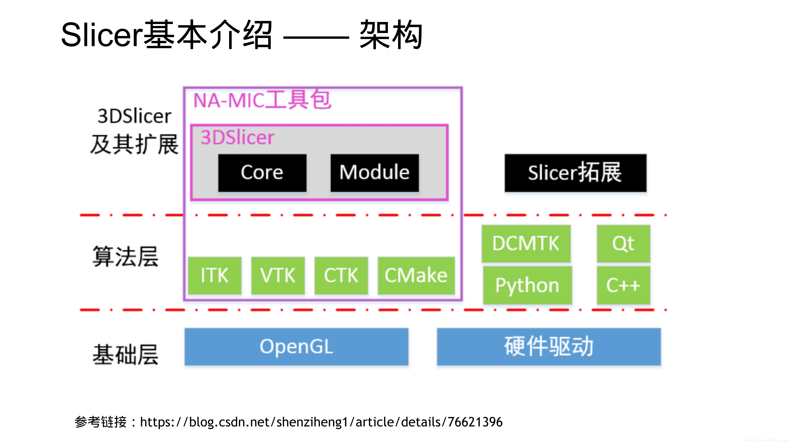

# Slicer Segmentation 模块的几个Effect

准备依次记录下面几个widget的响应。


[我的Slicer项目开发经验积累1_inter_peng的博客-CSDN博客_slicer module是什么](https://blog.csdn.net/inter_peng/article/details/120482021)


Slicer是由很多很多的Module构成的, 这些Module分别承担了不同的应用场景. 因此, 完成一个比较复杂的操作, 一般需要在不同的Module之间手动切换. 这对于需要批量操作或自动化操作, 就带来了很大的不便.
好在, Slicer提供了丰富的接口, 可以通过Python调用底层的接口, 从而实现很多需要手动完成的工作.

以下, 首先会列举出一些常用的, 通过python, 代替手动操作的例子. 然后, 结合一个具体的案例, 介绍一下如何根据自己的项目需求, 来从源码中定位所需要的接口, 并应用到项目实践中.

# Python常见接口:

## 3D View

### 获取3d view窗口中的相机实例

```python
threeDView = slicer.app.layoutManager().threeDWidget(0).threeDView()
renderer = threeDView.renderWindow().GetRenderers().GetFirstRenderer()
camera = renderer.GetActiveCamera()
center = camera.GetFocalPoint()
pos = camera.GetPosition()
viewUp = camera.GetViewUp()
```


### 如何设置3d视图中的标准方位(A, P, L, R, S, )

```python
Right = 1 #右视图
Left = 2 #左视图
Superior = 3 #俯视图
Inferior = 4 #仰视图
Anterior = 5 #正视图
Posterior = 6 #后视图

# 设置3d视图的默认方位为正视图
threeDView = slicer.app.layoutManager().threeDWidget(0).threeDView()
viewNode = slicer.app.layoutManager().threeDWidget(0).mrmlViewNode()
fov = viewNode.GetFieldOfView()
threeDView.lookFromAxis(5, fov)
```

### 改变/隐藏3d视图右下角的方位标识(orientation marker)


```python
viewNode = slicer.app.layoutManager().threeDWidget(0).mrmlViewNode()
# 隐藏掉方位标识OrientationMarker:0,不显示;1,Cube;2,Human;3,Axes
viewNode.SetOrientationMarkerType(0)
```

## Slice view:

### 隐藏/显示3个sliceView窗口中的十字光标


```python
viewNodes = slicer.util.getNodesByClass("vtkMRMLSliceCompositeNode")
for viewNode in viewNodes:
   viewNode.SetSliceIntersectionVisibility(0)
```


# 3D Slicer开发者入门


[3d Slicer开发者入门_inter_peng的博客-CSDN博客](https://blog.csdn.net/inter_peng/article/details/119382268)





[DICOM — 3D Slicer documentation](https://slicer.readthedocs.io/en/latest/user_guide/modules/dicom.html)


## 3D slicer简介

从功能层面，它提供非常丰富的交互和可视化界面，你可以用它导入医学影像，然后进行影像的分割、重建、配准、标记点选择、测量等等操作。它本身提供了非常多的模块，比如优秀的配准模块、齐全的交互分割和重建模块、图像的重采样、裁剪、滤波等各种操作。

如果自带的功能满足不了你的需求，还可以安装插件，如下图插件平台有上百个开源插件，支持各种高级处理；如果仍然找不到你需求的内容，那么你还可以自己写插件，满足自己的特定需求。


从软件的架构层面，它是一个具有优秀架构的软件平台。它的底层基于ITK、VTK和CTK，界面基于QT，都是优秀的开源软件.

- ITK提供丰富的图像分割和配准等大量的医学图像处理算法；
- VTK则是一种基于opengl的渲染引擎。
- CTK为支持生物医学图像计算的通用公共包。


下图为slicer的软件架构图：


### slicer的可扩展性

有人称slicer是医学影像的IDE，之所以这么说是因为，如果你会编程，你完全可以通过编程，完全自定义你想要的数据处理流程，做任何医学图像的分析处理，slicer负责读取数据给你作为输入，以及将数据可视化给你，当然它还提供了大量的基础图像处理模块供你使用。

实现以上功能，一方面可以通过slicer内置的python终端实现，通过python，可以将slicer中的影响以numpy格式数组，进行任何你想做的处理；另一方面你可以自己编写插件，slicer支持的插件有多种类型，可以对它的功能进行无限扩展。

目前slicer支持一下几种插件类型：

- Slicer Libs - Slicer Base
- Built in modules
- **C++ loadable modules**：C++编译生成动态链接库
- **CLI modules**:
- **Scripted modules**:如python脚本，最简单的方式
- Daemon

加粗的三种是我们可以作为扩展比较常用的三种插件形式。


对于c++ loadable module，我们可以通过修改源代码对一些公开的extention进行修改后重新编译并加载到slicer中，具体的流程如下：


slicer还支持一些用户甚至企业对它进行改造后，形成一个新的自定义的软件应用，或者是科研合作平台软件。因为slicer是完全免费的（遵循BSD协议），且支持商业使用。这一部分可以参考：[SlicerCAT: Creating custom applications based on 3D Slicer - Kitware Blog](https://link.zhihu.com/?target=https%3A//blog.kitware.com/slicercat-creating-custom-applications-based-on-3d-slicer/)

参考：[开源医学影像分析平台--3D Slicer - 知乎 (zhihu.com)](https://zhuanlan.zhihu.com/p/401619399?utm_id=0)


