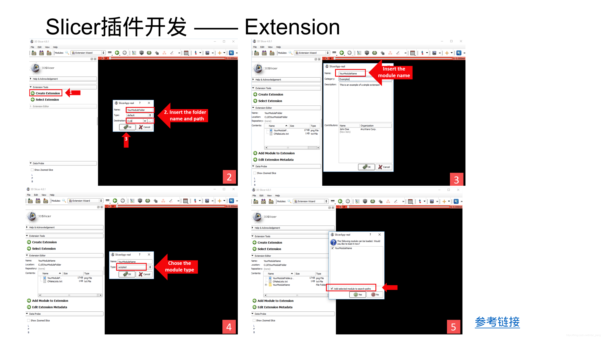

# Slicer Segmentation 模块的几个Effect

准备依次记录下面几个widget的响应。


[我的Slicer项目开发经验积累1_inter_peng的博客-CSDN博客_slicer module是什么](https://blog.csdn.net/inter_peng/article/details/120482021)


Slicer是由很多很多的Module构成的, 这些Module分别承担了不同的应用场景. 因此, 完成一个比较复杂的操作, 一般需要在不同的Module之间手动切换. 这对于需要批量操作或自动化操作, 就带来了很大的不便.
好在, Slicer提供了丰富的接口, 可以通过Python调用底层的接口, 从而实现很多需要手动完成的工作.

以下, 首先会列举出一些常用的, 通过python, 代替手动操作的例子. 然后, 结合一个具体的案例, 介绍一下如何根据自己的项目需求, 来从源码中定位所需要的接口, 并应用到项目实践中.

# Python常见接口:

## 3D View

### 获取3d view窗口中的相机实例

```python
threeDView = slicer.app.layoutManager().threeDWidget(0).threeDView()
renderer = threeDView.renderWindow().GetRenderers().GetFirstRenderer()
camera = renderer.GetActiveCamera()
center = camera.GetFocalPoint()
pos = camera.GetPosition()
viewUp = camera.GetViewUp()
```


### 如何设置3d视图中的标准方位(A, P, L, R, S, )

```python
Right = 1 #右视图
Left = 2 #左视图
Superior = 3 #俯视图
Inferior = 4 #仰视图
Anterior = 5 #正视图
Posterior = 6 #后视图

# 设置3d视图的默认方位为正视图
threeDView = slicer.app.layoutManager().threeDWidget(0).threeDView()
viewNode = slicer.app.layoutManager().threeDWidget(0).mrmlViewNode()
fov = viewNode.GetFieldOfView()
threeDView.lookFromAxis(5, fov)
```

### 改变/隐藏3d视图右下角的方位标识(orientation marker)


```python
viewNode = slicer.app.layoutManager().threeDWidget(0).mrmlViewNode()
# 隐藏掉方位标识OrientationMarker:0,不显示;1,Cube;2,Human;3,Axes
viewNode.SetOrientationMarkerType(0)
```

## Slice view:

### 隐藏/显示3个sliceView窗口中的十字光标


```python
viewNodes = slicer.util.getNodesByClass("vtkMRMLSliceCompositeNode")
for viewNode in viewNodes:
   viewNode.SetSliceIntersectionVisibility(0)
```


# 3D Slicer开发者入门


[3d Slicer开发者入门_inter_peng的博客-CSDN博客](https://blog.csdn.net/inter_peng/article/details/119382268)





[DICOM — 3D Slicer documentation](https://slicer.readthedocs.io/en/latest/user_guide/modules/dicom.html)


