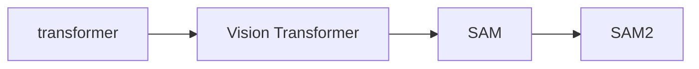
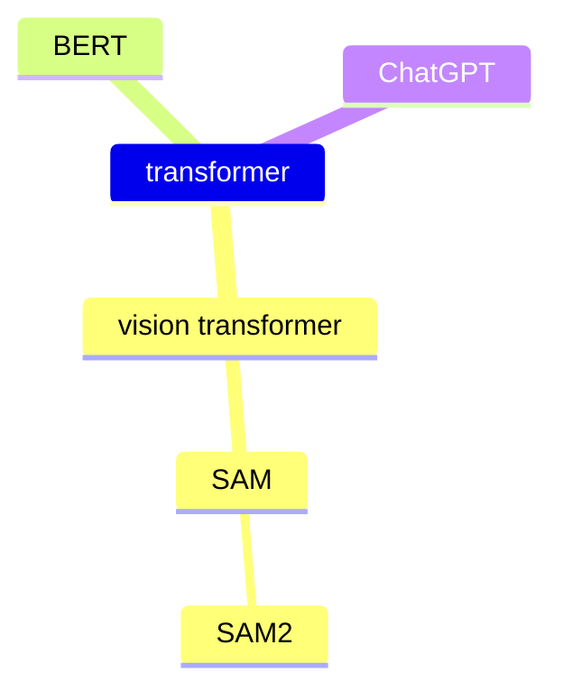

## Transformer相关笔记








```markmap
# transformer

## vision transformer
### SAM
#### Efficient SAM
#### SAM2
## NLP
###  BERT
### ChatGPT

## Object Detection
### DETR
#### Deformable DETR
## Landmark
### TransPose
### ViTPose
### Sparse Local Patch Transformer(SLPT)
### PoseFormer
### LOTR
### 1DFormer
## Segmentation
### SETR
### Segmenter
### SegFormer

```


可参考笔记

[GitHub - dk-liang/Awesome-Visual-Transformer: Collect some papers about transformer with vision. Awesome Transformer with Computer Vision (CV)](https://github.com/dk-liang/Awesome-Visual-Transformer)

[Vision Transformer, LLM, Diffusion Model 超详细解读 (原理分析+代码解读) (目录) - 知乎 (zhihu.com)](https://zhuanlan.zhihu.com/p/348593638)

[Vision Transformer 超详细解读 (原理分析+代码解读) (十二) - 知乎 (zhihu.com)](https://zhuanlan.zhihu.com/p/369710857)

[Vision Transformer 超详细解读 (原理分析+代码解读) (十八) - 知乎 (zhihu.com)](https://zhuanlan.zhihu.com/p/413331094)


Transformer 是 Google 的团队在 2017 年提出的一种 NLP 经典模型，现在比较火热的 Bert 也是基于 Transformer。Transformer 模型使用了 Self-Attention 机制，**不采用** RNN 的**[顺序结构](https://zhida.zhihu.com/search?q=顺序结构)**，使得模型**可以并行化训练**，而且能够**拥有全局信息。**

本文介绍这个工作来自谷歌，<font color=Crimson>**Attention is not all you need** </font>这篇文章为网络架构中含有 attention 结构的模型提供了一个新的看法，这篇工作认为：Transformer 这种结构在 CV 和 NLP 任务上表现良好并不代表仅仅由 Self-attention 机制构成的网络 (即去掉 MLP 层，残差连接，Layer Normalziation 等等) 也能够表现良好。本文证明了一件事：

随着输入在网络中向前传播，深度不断加深，仅仅由 Self-attention 机制构成的网络 (即去掉 MLP 层，残差连接，Layer Normalziation 等等) 的表达能力会逐渐降低。最终，输出会退化成一个秩为1的矩阵，每一排的值变得一致。这个问题，本文把它称为 **Rank Collapse**。而Transformer中的其他构件 (即 MLP 层，残差连接，Layer Normalziation 等等) 可以缓解这个问题。比如，Shortcut 操作和 MLP 在缓解 Rank Collapse 问题上起了关键作用。


```markmap
# transformer
- NIPS 2017
- Google Research,Brain Team
## Vision Transformer
- ICLR2021
- Google Research, Brain Teeam
## DETR
- ECCV2020
- FaceBook AI
### Deformable DETR
- ICLR2021
- 商汤代季峰老师组
## IPT
- 北京华为诺亚方舟实验室
## TNT(Transformer in Transformer)
- 北京华为诺亚方舟实验室
## CPVT
- 
## DeiT
- FaceBook AI
## Visual Transformer
- UC Berkeley
## LLM
## Diffusion Model

```

参考：

[Vision Transformer 超详细解读 (原理分析+代码解读) (十八) - 知乎 (zhihu.com)](https://zhuanlan.zhihu.com/p/413331094)


[Vision Transformer 超详细解读 (原理分析+代码解读) (一) - 知乎 (zhihu.com)](https://zhuanlan.zhihu.com/p/340149804)


<iframe src="https://www.bilibili.com/video/BV1pu411o7BE/?spm_id_from=333.337.search-card.all.click&vd_source=148afb6cb7e28daa45a2f426a0dec4ee" scrolling="no" border="0" height="800" frameborder="no" framespacing="0" allowfullscreen="true"> </iframe>


