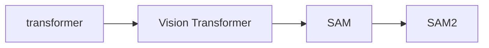
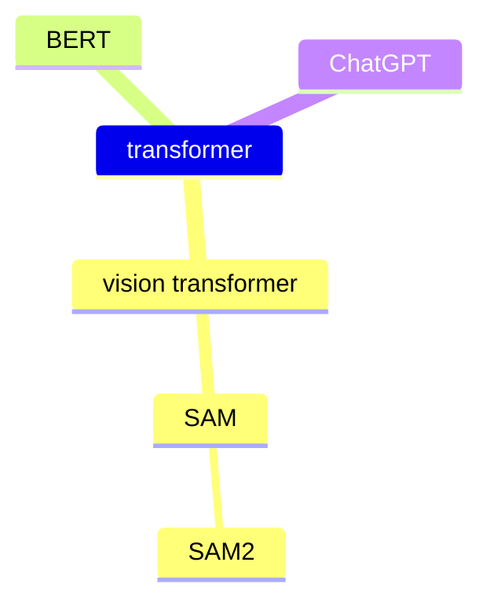

## Transformer相关笔记








```markmap
# transformer

## vision transformer
### SAM
#### Efficient SAM
#### SAM2
## NLP
###  BERT
### ChatGPT

## Object Detection
### DETR
#### Deformable DETR
## Landmark
### TransPose
### ViTPose
### Sparse Local Patch Transformer(SLPT)
### PoseFormer
### LOTR
### 1DFormer
## Segmentation
### SETR
### Segmenter
### SegFormer

```

