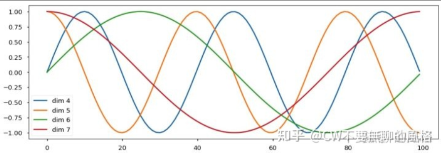

## Transformer相关笔记


### transformer简介

**Transformer模型**（直译为“变换器”）是一种采用[注意力机制](https://zh.wikipedia.org/wiki/注意力机制)的[深度学习](https://zh.wikipedia.org/wiki/深度学习)模型，这一机制可以按输入数据各部分重要性的不同而分配不同的权重。该模型主要用于[自然语言处理](https://zh.wikipedia.org/wiki/自然语言处理)（NLP）与[计算机视觉](https://zh.wikipedia.org/wiki/计算机视觉)（CV）领域。[[1\]](https://zh.wikipedia.org/wiki/Transformer模型#cite_note-1)

与[循环神经网络](https://zh.wikipedia.org/wiki/循环神经网络)（RNN）一样，Transformer模型旨在处理自然语言等顺序输入数据，可应用于[翻译](https://zh.wikipedia.org/wiki/统计机器翻译)、文本摘要等任务。而与RNN不同的是，Transformer模型能够一次性处理所有输入数据。注意力机制可以为输入序列中的任意位置提供上下文。如果输入数据是自然语言，则Transformer不必像RNN一样一次只处理一个单词，这种架构允许更多的[并行计算](https://zh.wikipedia.org/wiki/并行计算)，并以此减少训练时间。[[2\]](https://zh.wikipedia.org/wiki/Transformer模型#cite_note-:0-2)

Transformer模型于2017年由[谷歌大脑](https://zh.wikipedia.org/wiki/谷歌大脑)的一个团队在论文《Attention Is All You Need》中提出[[2\]](https://zh.wikipedia.org/wiki/Transformer模型#cite_note-:0-2)，现已逐步取代[长短期记忆](https://zh.wikipedia.org/wiki/长短期记忆)（LSTM）等RNN模型成为了NLP问题的首选模型。[[3\]](https://zh.wikipedia.org/wiki/Transformer模型#cite_note-wolf2020-3)并行化优势允许其在更大的数据集上进行训练。这也促成了[BERT](https://zh.wikipedia.org/wiki/BERT)、[GPT](https://zh.wikipedia.org/wiki/GPT_(语言模型))等预训练模型的发展。这些系统使用了[维基百科](https://zh.wikipedia.org/wiki/维基百科)、[Common Crawl](https://zh.wikipedia.org/w/index.php?title=Common_Crawl&action=edit&redlink=1)等大型语料库进行训练，并可以针对特定任务进行微调。[[4\]](https://zh.wikipedia.org/wiki/Transformer模型#cite_note-:6-4)[[5\]](https://zh.wikipedia.org/wiki/Transformer模型#cite_note-:7-5)

参考：https://zh.wikipedia.org/wiki/Transformer%E6%A8%A1%E5%9E%8B


```markmap
# transformer

## vision transformer
### SAM
#### Efficient SAM
#### SAM2
## NLP
###  BERT
### ChatGPT

## Object Detection
### DETR
#### Deformable DETR
## Landmark
### TransPose
### ViTPose
### Sparse Local Patch Transformer(SLPT)
### PoseFormer
### LOTR
### 1DFormer
## Segmentation
### SETR
### Segmenter
### SegFormer

```


### RNN vs Transformer

Transformer解决了RNN的几个关键问题，并提供了更高效和更强大的解决方案：

**并行处理与效率提升**：

- **自注意力机制**：与RNN不同，Transformer通过自注意力机制评估输入数据各部分的重要性，实现对序列更加精细的理解。
- **并行化能力**：Transformer架构支持数据的并行处理，大幅提高了训练和推理速度。

**解决长期依赖问题**：

- **全局上下文感知**：得益于自注意力机制，Transformer能够同时处理整个序列，有效地捕捉长期依赖，避免了顺序处理的限制。

**可伸缩性与灵活性**：

- **降低内存需求**：通过去除循环连接的需求，Transformer减少了内存使用，提高了模型的可伸缩性和效率。
- **高度适应性**：Transformer的架构包含了**堆叠的编解码器**，这种设计使其不仅在自然语言处理领域，在计算机视觉和语音识别等多个领域也能发挥出色的适应性。


| _                | **RNN**        | **Transformer**                      |
| ---------------- | -------------- | ------------------------------------ |
| **处理方式**     | 顺序处理       | 并行处理                             |
| **长上下文理解** | 难以捕捉长依赖 | 通过自注意力机制捕捉长依赖           |
| **可伸缩性**     | 差             | 好                                   |
| **应用领域**     | 自然语言处理   | 自然语言处理、计算机视觉、语音识别等 |
| **训练速度**     | 慢             | 快                                   |

参考：https://mp.weixin.qq.com/s?__biz=MzU3OTgyMjM3MA==&mid=2247484435&idx=1&sn=eeb8d952a4695211be575d7ef92d4166&chksm=fd61725eca16fb48b25ab8be527c4986d581f5f29e41989408362145c93ee1068264f78fbaef&scene=21#wechat_redirect


可参考笔记

[GitHub - dk-liang/Awesome-Visual-Transformer: Collect some papers about transformer with vision. Awesome Transformer with Computer Vision (CV)](https://github.com/dk-liang/Awesome-Visual-Transformer)

[Vision Transformer, LLM, Diffusion Model 超详细解读 (原理分析+代码解读) (目录) - 知乎 (zhihu.com)](https://zhuanlan.zhihu.com/p/348593638)

[Vision Transformer 超详细解读 (原理分析+代码解读) (十二) - 知乎 (zhihu.com)](https://zhuanlan.zhihu.com/p/369710857)

[Vision Transformer 超详细解读 (原理分析+代码解读) (十八) - 知乎 (zhihu.com)](https://zhuanlan.zhihu.com/p/413331094)


Transformer 是 Google 的团队在 2017 年提出的一种 NLP 经典模型，现在比较火热的 Bert 也是基于 Transformer。Transformer 模型使用了 Self-Attention 机制，**不采用** RNN 的**[顺序结构](https://zhida.zhihu.com/search?q=顺序结构)**，使得模型**可以并行化训练**，而且能够**拥有全局信息。**

本文介绍这个工作来自谷歌，<font color=Crimson>**Attention is not all you need** </font>这篇文章为网络架构中含有 attention 结构的模型提供了一个新的看法，这篇工作认为：Transformer 这种结构在 CV 和 NLP 任务上表现良好并不代表仅仅由 Self-attention 机制构成的网络 (即去掉 MLP 层，残差连接，Layer Normalziation 等等) 也能够表现良好。本文证明了一件事：

随着输入在网络中向前传播，深度不断加深，仅仅由 Self-attention 机制构成的网络 (即去掉 MLP 层，残差连接，Layer Normalziation 等等) 的表达能力会逐渐降低。最终，输出会退化成一个秩为1的矩阵，每一排的值变得一致。这个问题，本文把它称为 **Rank Collapse**。而Transformer中的其他构件 (即 MLP 层，残差连接，Layer Normalziation 等等) 可以缓解这个问题。比如，Shortcut 操作和 MLP 在缓解 Rank Collapse 问题上起了关键作用。


```markmap
# transformer
- NIPS 2017
- Google Research,Brain Team
## Vision Transformer
- ICLR2021
- Google Research, Brain Teeam
## DETR
- ECCV2020
- FaceBook AI
### Deformable DETR
- ICLR2021
- 商汤代季峰老师组
## IPT
- 北京华为诺亚方舟实验室
## TNT(Transformer in Transformer)
- 北京华为诺亚方舟实验室
## CPVT
- 
## DeiT
- FaceBook AI
## Visual Transformer
- UC Berkeley
## LLM
## Diffusion Model

```

参考：

[Vision Transformer 超详细解读 (原理分析+代码解读) (十八) - 知乎 (zhihu.com)](https://zhuanlan.zhihu.com/p/413331094)


[Vision Transformer 超详细解读 (原理分析+代码解读) (一) - 知乎 (zhihu.com)](https://zhuanlan.zhihu.com/p/340149804)


## Transformer原理图


## Input Embedding


### One-Hot Encoding

在 CV 中，我们通常将输入图片转换为4维（batch, channel, height, weight）张量来表示；而在 NLP 中，可以将输入单词用 **One-Hot** 形式编码成**序列向量。**向量长度是预定义的词汇表中拥有的单词量，向量在这一维中的值只有一个位置是1，其余都是0，1对应的位置就是词汇表中表示这个单词的地方。

 例如词汇表中有5个词，第3个词表示“你好”这个词，那么该词对应的 one-hot 编码即为 00**1**00（**第3个位置为1，其余为0**）。


代码：

```python
def one_hot(token_start, length):
    one_hot_encode = torch.zeros(token_start.shape[0], length).int()
    
    for i in range(token_start.shape[0]):
        one_hot_encode[i, token_start[i].item()]=1
    return one_hot_encode
```

### Word Embedding

One-Hot 的形式看上去很简洁，也挺美，但劣势在于它很**稀疏**，而且还可能很**长**。比如词汇表如果有 10k 个词，那么一个词向量的长度就需要达到 10k，而其中却仅有一个位置是1，其余全是0，太“浪费”！

更重要的是，这种方式无法体现出**词与词之间的关系。**比如 “爱” 和 “喜欢” 这两个词，它们的意思是相近的，但基于 one-hot 编码后的结果取决于它们在词汇表中的位置，无法体现出它们之间的关系。

因此，我们需要另一种词的表示方法，能够体现词与词之间的关系，使得**意思相近的词有相近的表示结果**，这种方法即 **Word Embedding。**

那么应该如何设计这种方法呢？最方便的途径是设计一个**可学习的权重矩阵 W，**将词向量与这个矩阵进行点乘，即得到新的表示结果。

嗯？就这么简单吗？CW 告诉你：是的。为何能work？举个例子来看吧！

假设 “爱” 和 “喜欢” 这两个词经过 one-hot 后分别表示为 10000 和 00001，权重矩阵设计如下：

```bash
[ w00, w01, w02
  w10, w11, w12
  w20, w21, w22
  w30, w31, w32
  w40, w41, w42 ]
```

那么两个词点乘后的结果分别是 [w00, w01, w02] 和 [w40, w41, w42]，在网络学习过程中（这两个词后面通常都是接主语，如“你”，“他”等，或者在翻译场景，它们被翻译的目标意思也相近，它们要学习的目标一致或相近），权重矩阵的参数会不断进行更新，从而使得 [w00, w01, w02] 和 [w40, w41, w42] 的值越来越接近。

另一方面，对于以上这个例子，我们还把向量的维度从5维压缩到了3维。因此，word embedding 还可以起到**降维**的效果。

其实，可以将这种方式看作是一个 **lookup table**：对于每个 word，进行 word embedding 就相当于一个lookup操作，在表中查出一个对应结果。

在 Pytorch 框架下，可以使用 `torch.nn.Embedding`来实现 word embedding：

```python
class Embeddings(nn.Module):
    def __init__(self, d_model, vocab):
        super(Embeddings, self).__init__()
 
        self.lut = nn.Embedding(vocab, d_model)
        self.d_model = d_model
 
    def forward(self, x):
        return self.lut(x) * math.sqrt(self.d_model)
```

其中，*vocab* 代表词汇表中的单词量，one-hot 编码后词向量的长度就是这个值；*d_model*代表权重矩阵的列数，通常为512，就是要将词向量的维度从 *vocab 编码*到 *d_model*。

### Position Embedding

经过 word embedding，我们获得了词与词之间关系的表达形式，但是**词在句子中的位置关系**还无法体现。

由于 Transformer 是并行地处理句子中的所有词，因此需要加入词在句子中的位置信息，结合了这种方式的词嵌入就是 **Position Embedding** 了。

那么具体该怎么做？我们通常容易想到两种方式：

1. 通过网络来学习；
2. 预定义一个函数，通过函数计算出位置信息。

Transformer 的作者对以上两种方式都做了探究，发现最终效果相当，于是采用了第2种方式，从而减少模型参数量，同时还能适应即使在训练集中没有出现过的句子长度。

计算位置信息的函数计算公式如下：
$$
PE_{(pos,2i)}=\sin(pos/10000^{2i/d_{model}}) \\PE_{(pos,2i+1)}=cos(pos/10000^{2i/d_{model}})
$$
*pos* 代表的是词在句子中的位置，*d* 是词向量的维度（通常经过 word embedding 后是512），*2i* 代表的是 *d* 中的偶数维度，(*2i + 1)* 则代表的是奇数维度，这种计算方式使得每一维都对应一个正弦曲线。




参考：[Transformer输入嵌入：Input Embedding-CSDN博客](https://blog.csdn.net/m0_61899108/article/details/121534347)


## Encoder

$$
(x_1, \cdots, x_n)\rightarrow(z_1,\cdots, z_n)
$$


## Decoder

$$
(z_1,\cdots, z_n) \rightarrow (y_1,\cdots, y_n)
$$


transformer论文中提到的参数

| 参数                            | 参数值                                                                                                               |
| ------------------------------- | -------------------------------------------------------------------------------------------------------------------- |
| EncoderLayer                    | $LayerNorm(x+SubLayer(x))$                                                                                           |
| DecoderLayer                    | 基本同上，有差异，Mask屏蔽当前位置的后续位置，通过Scaled Dot-Product Attention实现；插入encoder-decoder Attention层. |
| $Attention$                     | $Attention(Q,K,V)=softmax(\frac{QK^T}{\sqrt{d_k}})V$                                                                 |
| $MultiHead$                     | $MultiHead(Q,K,V)=Concat(head_1,\cdots, head_h)W^O \\ where \quad head_i = Attention(QW_i^Q,KW_i^K,VW_i^V)$          |
| Encoder中EncoderLayer数         | 6                                                                                                                    |
| Decoder中DecoderLayer数         | 6                                                                                                                    |
| FFN                             | $FFN(x)=\max(0,xW_1 + b_1)W_2 + b_2$                                                                                 |
| PE                              | $PE_{(pos,2i)}=\sin(pos/10000^{2i/d_{model}}) \\PE_{(pos,2i+1)}=cos(pos/10000^{2i/d_{model}})$                       |
| $d_{model}$                     | 512                                                                                                                  |
| head number $h$                 | 8                                                                                                                    |
| $d_k = d_v=d_{model}/h$         | 64                                                                                                                   |
| FFN中$d_{ff}$                   | 2048                                                                                                                 |
| Optimizer                       | Adam                                                                                                                 |
| $\beta_1$                       | 0.9                                                                                                                  |
| $\beta_2$                       | 0.98                                                                                                                 |
| $\epsilon$                      | $10^{-9}$                                                                                                            |
| $lrate$                         | $d_{model}^{-0.5} \cdot min(step\_num^{-0.5}, step\_num \cdot warmup\_steps^{-1.5})$                                 |
| $warmup\_steps$                 | 4000                                                                                                                 |
| Residual Dropout $P_{drop}$     | 0.1                                                                                                                  |
| Label Smoothing $\epsilon_{ls}$ | 0.1                                                                                                                  |
| train steps                     | 100K                                                                                                                 |

参考：https://github.com/Ri-Yue-Shui-Hua/transformer/blob/main/transformer.py


## FFN(前馈神经网络)

前馈神经网络 指上个神经元输出会作为下个神经元输入的网络。**意味着神经网络中没有环路**。


