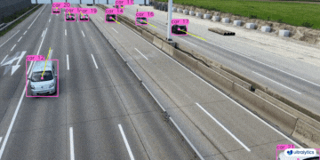
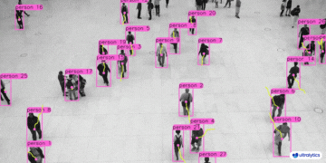
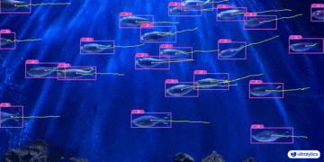
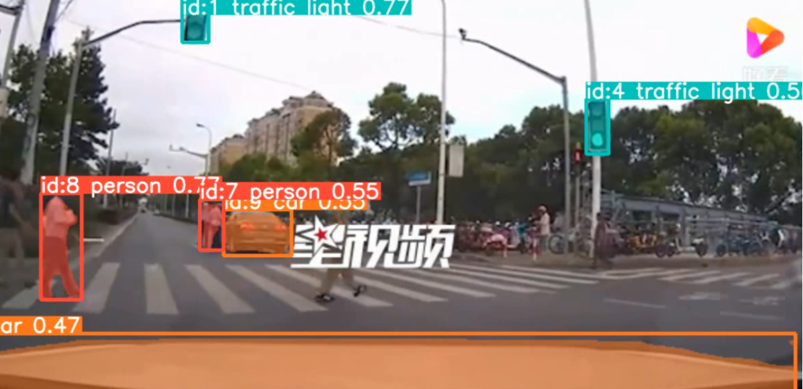
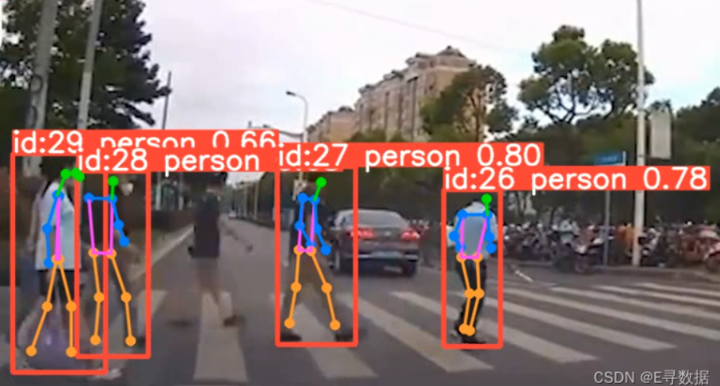

# 目标检测


# 目标追踪


## 搭建环境

​    操作系统：win10 x64

​    编程语言：python3.9

​    开发环境：Anaconda

## 概述

 Ultralytics**追踪器**的输出与标准的物体检测结果一致，但增加了物体ID的附加值。这使其易于追踪视频流中的物体并进行后续分析。以下是您应考虑使用Ultralytics YOLO来满足您物体追踪需求的原因：

- 效率： 实时处理视频流，同时保持准确性。
- 灵活性：支持多种追踪算法和配置。
- 易用性： 简单的Python API和CLI选项，便于快速集成和部署。
- 可定制性： 易于使用自定义训练的YOLO模型，允许集成到特定领域的应用中。

本文以官方模型yolov8n.pt、yolov8n-seg.pt、yolov8n-pose.pt为例。


## 可用追踪器

Ultralytics YOLO支持以下追踪算法。可以通过传递相关的YAML配置文件如`tracker=tracker_type.yaml`来启用：

- [BoT-SORT](https://github.com/NirAharon/BoT-SORT) - 使用 `botsort.yaml` 启用此追踪器。
- [ByteTrack](https://github.com/ifzhang/ByteTrack) - 使用 `bytetrack.yaml` 启用此追踪器。

## BOT-SORT

1. **算法特点**：
   - BoT-SORT（Boosted Object Tracking using SORT）是基于SORT（Simple Online and Realtime Tracking）算法的一个改进版本。
   - 它结合了SORT的简单性和鲁棒性，增强了目标丢失时的追踪能力。

2. **关键技术**：

- BoT-SORT 通常结合了多种技术，如全局运动补偿、外观匹配和接近度匹配等，来提高追踪的稳定性和准确性。

3. **适用场景**：

- 更适合于场景中有中断或遮挡的情况，能够在目标丢失后再次出现时继续追踪。

### botsort.yaml参数说明 

| 参数名            | 值            | 描述                                                   |
| ----------------- | ------------- | ------------------------------------------------------ |
| tracker_type      | botsort       | 设置追踪器的类型，此处为 BoT-SORT。                    |
| track_high_thresh | 0.5           | 第一次关联的高阈值，用于确定有效追踪目标。             |
| track_low_thresh  | 0.1           | 第二次关联的低阈值，即使置信度较低也可能视为有效目标。 |
| new_track_thresh  | 0.6           | 初始化新追踪的阈值，用于不匹配任何现有轨迹的检测对象。 |
| track_buffer      | 30            | 追踪缓冲时间长度，单位通常是帧数。                     |
| match_thresh      | 0.8           | 匹配轨迹的阈值，用于确定两个轨迹是否为同一目标。       |
| gmc_method        | sparseOptFlow | 全局运动补偿的方法，此处使用稀疏光流法。               |
| proximity_thresh  | 0.5           | 判断两个目标空间接近程度的阈值。                       |
| appearance_thresh | 0.25          | 判断两个目标外观相似程度的阈值。                       |
| with_reid         | FALSE         | 指定是否使用Re-Identification模型来辅助目标识别。      |

## ByteTrack

1. **算法特点：**

	1. ByteTrack 是一种高效的多目标追踪算法，特别强调在实时性和准确性之间的平衡。
	1. 它在保持较高的追踪精度的同时，能够实现非常快的处理速度。

2. **关键技术：**

1. ByteTrack 利用了强大的目标检测模型来生成高质量的检测框，并使用一种有效的关联策略来建立和维护目标的追踪。

3. **适用场景：**

1. 特别适用于需要高速处理和实时性能的应用，如监控视频分析、交通监控等。
   

### bytetrack.yaml参数说明 

| 参数名            | 值               | 描述                                                   |
| ----------------- | ---------------- | ------------------------------------------------------ |
| tracker_type      | bytetrack        | 设置追踪器的类型，此处为 ByteTrack。                   |
| track_high_thresh | 0.5              | 第一次关联的高阈值，用于确定有效追踪目标。             |
| track_low_thresh  | 0.1              | 第二次关联的低阈值，即使置信度较低也可能视为有效目标。 |
| new_track_thresh  | 0.6              | 初始化新追踪的阈值，用于不匹配任何现有轨迹的检测对象。 |
| track_buffer      | 30               | 追踪缓冲时间长度，单位通常是帧数。                     |
| match_thresh      | 0.8              | 匹配轨迹的阈值，用于确定两个轨迹是否为同一目标。       |
| min_box_area      | 10 (注释状态)    | 最小框面积阈值（目前未使用，用于追踪器评估）。         |
| mot20             | False (注释状态) | 用于追踪器评估（目前未使用）。                         |

## 直接使用框架输出追踪结果

```python
from ultralytics import YOLO
 
# 加载官方或自定义模型
model = YOLO('yolov8n.pt')  # 加载一个官方的检测模型
model = YOLO('yolov8n-seg.pt')  # 加载一个官方的分割模型
model = YOLO('yolov8n-pose.pt')  # 加载一个官方的姿态模型
 
# 使用模型进行追踪
results = model.track(source="https://youtu.be/LNwODJXcvt4", show=True)  # 使用默认追踪器进行追踪
results = model.track(source="https://youtu.be/LNwODJXcvt4", show=True, tracker="bytetrack.yaml")  # 使用ByteTrack追踪器进行追踪
 
results = model.track(source="https://youtu.be/LNwODJXcvt4", save=True)
```

### 导入库和加载模型

1. **导入 YOLO 类**：

> - `from ultralytics import YOLO`：这行代码从 `ultralytics` 库中导入 `YOLO` 类，用于后续的模型加载和操作。

2. **加载官方或自定义模型**：

> - model = YOLO('yolov8n.pt')：加载一个官方的 YOLOv8n 检测模型，用于识别和定位图像中的对象。
> - model = YOLO('yolov8n-seg.pt')：加载一个官方的 YOLOv8n 分割模型，用于对象的识别、定位和像素级分割。
> - model = YOLO('yolov8n-pose.pt')：加载一个官方的 YOLOv8n 姿态模型，专用于识别图像中人物的姿态。


### 使用模型进行追踪

1. 使用模型进行追踪：

> 1. `results = model.track("./peopl_track.mp4", save=True)`：使用加载的模型对本地视频文件 peopl_track.mp4 进行目标追踪，并保存追踪结果。这里使用的是默认配置的追踪器。
> 2. `results = model.track("./peopl_track.mp4", show=True, tracker="bytetrack.yaml")`：同样对 peopl_track.mp4 进行追踪，但这次指定使用 bytetrack.yaml 配置的 ByteTrack 追踪器，并显示追踪结果。

### 其他细节

- `if __name__ == '__main__'`: 这行代码确保以下的代码块只在直接运行此脚本时执行，而不是在作为模块导入时执行。
- `save=True` 参数表示将追踪结果保存到文件。
- `show=True` 参数表示在进行追踪时实时显示结果。
- `tracker="bytetrack.yaml"` 指定使用 ByteTrack 追踪器进行追踪，这将应用 ByteTrack 追踪算法的特定参数和行为。

如上所述，Detect、Segment和Pose模型在视频或流媒体源上运行时均可进行追踪。

### 追踪效果展示

​    想对视频直接进行追踪并保存结果，使用：results = model.track("./peopl_track.mp4", save=True)，这行代码进行保存，效果如下：


#### **目标检测追踪效果展示:**


<center class="half">     


#### 实例分割追踪效果展示：



#### 姿态检测最总效果展示：



### python源码循环追踪

```python
import cv2
from ultralytics import YOLO
 
# 加载YOLOv8模型
model = YOLO('yolov8n.pt')
 
# 打开视频文件
video_path = "test_track.mp4"
cap = cv2.VideoCapture(video_path)
 
# 循环遍历视频帧
while cap.isOpened():
    # 从视频读取一帧
    success, frame = cap.read()
 
    if success:
        # 在帧上运行YOLOv8追踪，持续追踪帧间的物体
        results = model.track(frame, persist=True)
        # 输出每次追踪推理结果的boxes，这些参数实际上是和模型直接predict类似的。
        print(results[0].boxes)
        # 在帧上展示结果
        annotated_frame = results[0].plot()
        # 展示带注释的帧
        cv2.imshow("YOLOv8 Tracking", annotated_frame)
 
        # 如果按下'q'则退出循环
        if cv2.waitKey(1) & 0xFF == ord("q"):
            break
    else:
        # 如果视频结束则退出循环
        break
 
# 释放视频捕获对象并关闭显示窗口
cap.release()
cv2.destroyAllWindows()
```

#### 输出boxes示意

```bash
cls: tensor([2., 2., 2.])
conf: tensor([0.7348, 0.7214, 0.7010])
data: tensor([[2.5676e+02, 2.7926e+02, 3.1822e+02, 3.2295e+02, 1.0000e+00, 7.3481e-01, 2.0000e+00],
        [3.6795e+02, 2.5550e+02, 4.1459e+02, 2.8850e+02, 2.0000e+00, 7.2141e-01, 2.0000e+00],
        [8.1858e+02, 3.2820e+02, 9.2200e+02, 3.9968e+02, 3.0000e+00, 7.0101e-01, 2.0000e+00]])
id: tensor([1., 2., 3.])
is_track: True
orig_shape: (622, 1104)
shape: torch.Size([3, 7])
xywh: tensor([[287.4892, 301.1048,  61.4607,  43.6855],
        [391.2666, 271.9997,  46.6412,  32.9959],
        [870.2893, 363.9404, 103.4269,  71.4856]])
xywhn: tensor([[0.2604, 0.4841, 0.0557, 0.0702],
        [0.3544, 0.4373, 0.0422, 0.0530],
        [0.7883, 0.5851, 0.0937, 0.1149]])
xyxy: tensor([[256.7588, 279.2621, 318.2195, 322.9476],
        [367.9460, 255.5017, 414.5872, 288.4976],
        [818.5758, 328.1976, 922.0027, 399.6832]])
xyxyn: tensor([[0.2326, 0.4490, 0.2882, 0.5192],
        [0.3333, 0.4108, 0.3755, 0.4638],
        [0.7415, 0.5276, 0.8351, 0.6426]])
```

1. cls (Class):
   tensor([2., 2., 2.]) 表示检测到的对象的类别ID。这里，每个检测到的对象都被分类为ID为2的类别。
2. conf (Confidence Score):
   tensor([0.7348, 0.7214, 0.7010]) 表示模型对于每个检测对象所属类别的置信度。数值越高，表示模型越确信其分类。
3. data:
   这是一个包含了每个检测对象的详细信息的张量，其中每行代表一个对象。每行的数据格式为 [x_min, y_min, x_max, y_max, cls, conf, id]。
   x_min, y_min 和 x_max, y_max 是对象边界框的坐标。
   cls 是类别ID，conf 是置信度，id 是追踪时分配给对象的唯一标识符。
4. id:
   tensor([1., 2., 3.]) 表示每个检测对象在追踪过程中的唯一标识符。
5. is_track:
   表示这些数据是否是在追踪模式下生成的。在这里，True 表示是。
6. orig_shape:
   (622, 1104) 是原始图像的尺寸（高度 x 宽度）。
7. shape:
   torch.Size([3, 7]) 表示 data 张量的形状，这里是 3 行 7 列，对应于三个检测对象和每个对象的七个数据点。
8. xywh (X, Y, Width, Height):
   这是对象边界框的另一种表示方式，格式为 [中心点x, 中心点y, 宽度, 高度]。
9. xywhn (Normalized X, Y, Width, Height):
   这也是对象边界框的表示，但所有值都经过归一化，表示为相对于整个图像尺寸的比例。
10. xyxy (X_min, Y_min, X_max, Y_max):
    这是对象边界框的坐标表示，格式为 [x_min, y_min, x_max, y_max]。
11. xyxyn (Normalized X_min, Y_min, X_max, Y_max):
    与 xyxy 相似，但所有坐标值都经过归一化，表示为相对于整个图像尺寸的比例。
             请注意从model(frame)更改为model.track(frame)的变化，这使能够启用物体追踪而不只是简单的检测。这个修改的脚本将在视频的每一帧上运行追踪器，可视化结果，并在窗口中显示它们。通过按'q'可以退出循环。

### 随时间绘制追踪路径

​        在连续帧上可视化物体追踪路径可以提供有关视频中检测到的物体的运动模式和行为的有价值的洞见。使用Ultralytics YOLOv8，绘制这些路径是一个无缝且高效的过程。

在以下示例中，我们演示了如何利用YOLOv8的追踪功能在多个视频帧上绘制检测物体的移动。这个脚本涉及打开视频文件、逐帧读取，并使用YOLO模型识别并追踪各种物体。通过保留检测到的边界框的中心点并连接它们，我们可以绘制表示跟踪物体路径的线条。

```python
from collections import defaultdict
 
import cv2
import numpy as np
 
from ultralytics import YOLO
 
# 加载YOLOv8模型
model = YOLO('yolov8n.pt')
 
# 打开视频文件
video_path = "test_track.mp4"
cap = cv2.VideoCapture(video_path)
 
# 存储追踪历史
track_history = defaultdict(lambda: [])
 
# 循环遍历视频帧
while cap.isOpened():
    # 从视频读取一帧
    success, frame = cap.read()
 
    if success:
        # 在帧上运行YOLOv8追踪，持续追踪帧间的物体
        results = model.track(frame, persist=True)
 
        # 获取框和追踪ID
        boxes = results[0].boxes.xywh.cpu()
        track_ids = results[0].boxes.id.int().cpu().tolist()
 
        # 在帧上展示结果
        annotated_frame = results[0].plot()
 
        # 绘制追踪路径
        for box, track_id in zip(boxes, track_ids):
            x, y, w, h = box
            track = track_history[track_id]
            track.append((float(x), float(y)))  # x, y中心点
            if len(track) > 30:  # 在90帧中保留90个追踪点
                track.pop(0)
 
            # 绘制追踪线
            points = np.hstack(track).astype(np.int32).reshape((-1, 1, 2))
            cv2.polylines(annotated_frame, [points], isClosed=False, color=(230, 230, 230), thickness=10)
 
        # 展示带注释的帧
        cv2.imshow("YOLOv8 Tracking", annotated_frame)
 
        # 如果按下'q'则退出循环
        if cv2.waitKey(1) & 0xFF == ord("q"):
            break
    else:
        # 如果视频结束则退出循环
        break
 
# 释放视频捕获对象并关闭显示窗口
cap.release()
cv2.destroyAllWindows()
```

这段代码使用了 OpenCV 和 Ultralytics 的 YOLO 库来实现对视频文件中物体的追踪。具体来说，它读取一个视频文件，使用 YOLO 模型识别和追踪每一帧中的物体，并显示带有追踪路径的视频帧。以下是详细解释：

#### 导入所需库

> 1. from collections import defaultdict：从标准库中导入 defaultdict，这是一种特殊的字典，用于存储追踪历史。
> 2. import cv2：导入 OpenCV 库，用于视频文件的读取和处理。
> 3. import numpy as np：导入 NumPy 库，用于数学运算和处理数组。
> 4. from ultralytics import YOLO：从 Ultralytics 库中导入 YOLO 类，用于加载和使用 YOLO 模型。

#### 加载 YOLOv8 模型
> model = YOLO('yolov8n.pt')：加载预训练的 YOLOv8 模型。

#### 处理视频文件
> 1. cap = cv2.VideoCapture(video_path)：创建一个视频捕获对象，用于从指定路径读取视频。
> 2. track_history = defaultdict(lambda: [])：创建一个 defaultdict 来存储每个追踪对象的历史位置。

#### 循环遍历视频帧
1. while cap.isOpened()：循环直到视频结束。

> 1. success, frame = cap.read()：从视频中读取一帧。
> 2. if success：如果成功读取帧，则继续处理。

2. **使用 YOLO 进行追踪**

> 1. results = model.track(frame, persist=True)：在当前帧上运行 YOLO 追踪器。
> 2. boxes = results[0].boxes.xywh.cpu()：提取追踪到的物体的边界框（格式为中心 x, y 坐标和宽度、高度）。
> 3. track_ids = results[0].boxes.id.int().cpu().tolist()：获取每个物体的唯一追踪 ID。

3. **绘制追踪路径**

> 1. 使用循环遍历每个追踪物体，并更新其在 track_history 中的路径。
> 2. 使用 OpenCV 的 cv2.polylines 在 annotated_frame 上绘制物体的追踪路径。

4. **显示带注释的视频帧**

> 1. cv2.imshow("YOLOv8 Tracking", annotated_frame)：显示经过注释的视频帧。

5. **退出机制**

> 1. 按下 'q' 键时退出循环。


6. **清理资源**

> 1. cap.release()：释放视频捕获对象。
> 2. cv2.destroyAllWindows()：关闭所有 OpenCV 创建的窗口。


原文链接：https://blog.csdn.net/qq_42452134/article/details/135241059

[Track - Ultralytics YOLO Docs](https://docs.ultralytics.com/modes/track/#contribute-new-trackers)


