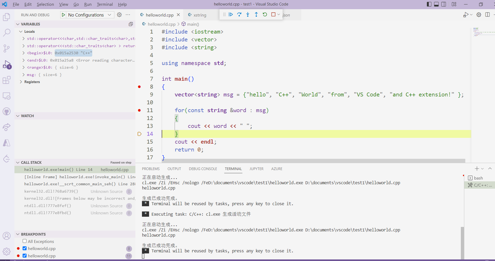
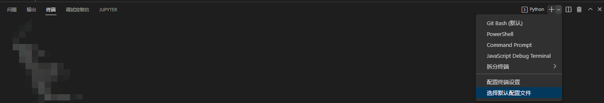
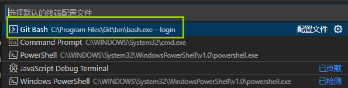
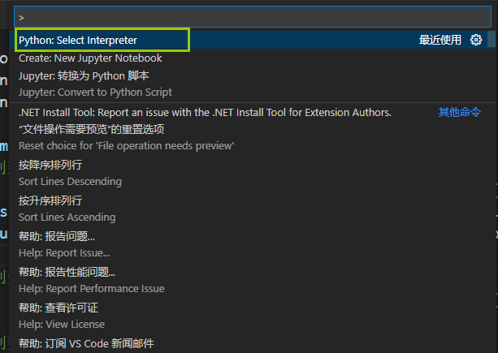
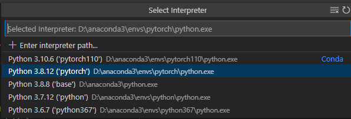

# VSCODE使用

## 打开vscode


From the Developer Command Prompt, create an empty folder called "projects" where you can store all your VS Code projects, then create a subfolder called "helloworld", navigate into it, and open VS Code (`code`) in that folder (`.`) by entering the following commands:

在

中输入；

```bash
code
```

就可以打开vscode，并可以使用cl调试。

参考：[Configure Visual Studio Code for Microsoft C++](https://code.visualstudio.com/docs/cpp/config-msvc)


## debug vscode

其中Developer Command Prompt 先进入代码目录下，然后执行命令code，打开vscode，删除原task.json，重新生成task.json。

然后就可以调试了。编译器配置的是msvc。




## vscode调试python

设置默认终端为Git Bash.

在设置之前，默认的一直都是Windows Powershell 导致不能调试程序。







选择使用的python环境，使用在VSCode界面按下`Ctrl + Shift + P` ，然后选择`Python: Select Interpreter` .





然后在候选中选择想要使用的python环境。



