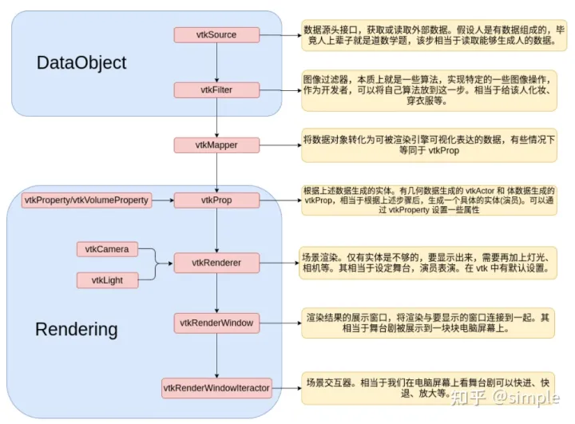
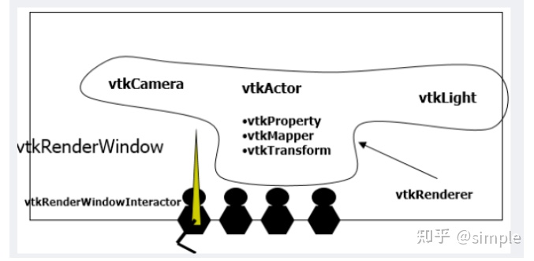

# VTK 简介

VTK（**visualization toolkit**）是一个开源的免费软件系统，主要用于三维计算机图形学、图像处理和可视化。Vtk 是在面向对象原理的基础上设计和实现的，它的内核是用 C++ 构建的，包含有大约 250,000 行代码，2000 多个类，还包含有几个转换界面，因此也可以自由的通过 Java，Tcl/Tk 和 Python 各种语言使用 VTK。

VTK 是一个开放源码、自由获取的软件系统，全世界的数以千计的研究人员和开发人员用它来进行 3D 计算机图形，图像处理，可视化。VTK 包含一个 c++类库，众多的翻译接口层，包括 Tcl/Tk，Java,Python。 Visualization Toolkit 是一个用于可视化应用程序构造与运行的支撑环境，它是在三维函数库 OpenGL 的基础上采用面向对象的设计方法发展起来的，它将我们在可视化开发过程中会经常遇到的细节屏蔽起来，并将一些常用的算法封装起来。比如 Visualization Toolkit 将我们在表面重建中比较常见的 MarchingCubes 算法封装起来，以类的形式给我们以支持，这样我们在对三维规则点阵数据进行表面重建时就不必再重复编写 MarchingCubes 算法的代码，而直接使用 Visualization Toolkit 中已经提供的 vtkMarchingCubes 类。Visualization Toolkit 是给从事可视化应用程序开发工作的研究人员提供直接的技术支持的一个强大的可视化开发工具。

引用百度百科的介绍：Vtk（visualization toolkit）是一个开源的免费软件系统，主要用于三维计算机图形学、图像处理和可视化。是一个开放源码，跨平台、支持并行处理（VTK曾用于处理大小近乎1个Petabyte的资料，其平台为美国Los Alamos国家实验室所有的具1024个处理器之大型系统）的图形应用函式库。2005年时曾被美国陆军研究实验室用于即时模拟俄罗斯制反导弹战车ZSU23-4受到平面波攻击的情形，其计算节点高达2.5兆之多。


## vtk的特点

1: 具有强大的三维图形功能。Visualization Toolkit 既支持基于体素Voxel-basedrendering 的体绘制Volume Rendering又保留了传统的面绘制，从而在极大的改善可视化效果的同时又可以充分利用现有的图形库和图形硬件。

2: Visualization Toolkit 的体系结构使其具有非常好的流streaming和高速缓存caching 的能力，在处理大量的数据时不必考虑内存资源的限制。

3: Visualization Toolkit 能够更好的支持基于网络的工具比如Java 和VRML 。随着Web 和Internet 技术的发展VisualizationToolkit 有着很好的发展前景

4: 能够支持多种着色如OpenGL 等。

5: Visualization Toolkit 具有设备无关性，其代码具有良好的可移植性。同时，官方也给出了各个编译器的技术文档与案例、教程。

6: VTK应用程序使用Filter（过滤器）操作数据，每个过滤器检查其接受的数据并产生输出数据。多个Filter与数据源组成一个数据流网络。可配置的网络将原始数据转换为更易理解的模式。

6: Visualization Toolkit 中定义了许多宏，这些宏极大的简化了编程工作并且加强了一致的对象行为

7: Visualization Toolkit 具有更丰富的数据类型，支持对多种数据类型进行处理。其核心数据模型能够表示几乎所有与物理科学相关的现实世界问题，适合涉及有限差分和有限元解决方案的医学成像和工程工作。

8: 既可以工作于Windows 操作系统又可以工作于Unix 操作系统极大的方便了用户。


## vtk的开发流程


整个可视化流程，可以大致分为两个阶段。一个是数据准备阶段，另一个是渲染阶段。数据准备阶段主要就是读取数据、数据处理(过滤)；渲染阶段就是将处理后的数据，生成对应实体，在设定的渲染场景展示，并能够实现交互。

而各部分实现的功能简单明了，目的明确，我们走完上述流程，就可以得到一个能被展示的模型。各部分间有着承上启下的关系，整个流程其实就是数据传递、处理的流程。因此用数据流来描述可能更加精确，而整个过程就可以看做数据流在管道中朝着一个方向流动的过程。整个流水线也被叫做 vtk 的可视化管线。



```cpp
int main(int, char* [])
    {
        //创建一个圆柱
        vtkSmartPointer<vtkCylinderSource> cylinderSource = vtkSmartPointer<vtkCylinderSource>::New();
        cylinderSource->SetHeight(10.0);//设置高度
        cylinderSource->SetCenter(0.0, 0.0, 0.0);//设置中心点
        cylinderSource->SetRadius(2.0);//设置半径
        cylinderSource->SetResolution(50);//设置分辨率

        //vtkPolyDataMapper用来把输入的数据进行转换为几何图元（点、线、多边形）进行渲染
        vtkSmartPointer<vtkPolyDataMapper> cylinderMapper1 = vtkSmartPointer<vtkPolyDataMapper>::New();
        cylinderMapper1->SetInputConnection(cylinderSource->GetOutputPort());
        //负责在场景中显示出来要渲染的数据
        vtkSmartPointer<vtkActor> cylinderActor1 = vtkSmartPointer<vtkActor>::New();
        cylinderActor1->SetMapper(cylinderMapper1);
        cylinderActor1->GetProperty()->SetColor(0.0, 1.0, 0.0);
        //场景中的相机，是从哪看的意思
        vtkSmartPointer<vtkCamera> camera = vtkSmartPointer<vtkCamera>::New();
        camera->SetViewUp(0, 0, -1);
        camera->SetFocalPoint(0, 0, 0);
        camera->SetPosition(50,0, 0);
        //代表在场景中显示的每一个数据都是一个Renderer
        vtkSmartPointer<vtkRenderer> renderer1 = vtkSmartPointer<vtkRenderer>::New();
        renderer1->AddActor(cylinderActor1);
        renderer1->SetBackground(.3, .3, .5);
        renderer1->SetActiveCamera(camera);
        //代表显示场景的窗口，和操作平台有关系
        vtkSmartPointer<vtkRenderWindow> renderWindow = vtkSmartPointer<vtkRenderWindow>::New();
        renderWindow->SetSize(600, 600);
        renderWindow->AddRenderer(renderer1);
        //提供键盘、鼠标等交互机制
        vtkSmartPointer<vtkRenderWindowInteractor> renderWindowInteractor = vtkSmartPointer<vtkRenderWindowInteractor>::New();
        renderWindowInteractor->SetRenderWindow(renderWindow);
        //控制旋转、缩放、移动 的交互样式
        vtkSmartPointer<vtkInteractorStyleTrackballCamera> style = vtkSmartPointer<vtkInteractorStyleTrackballCamera>::New();
        renderWindowInteractor->SetInteractorStyle(style);
        renderWindow->Render();
        renderWindowInteractor->Start();

        return EXIT_SUCCESS;
    }
```


运行场景结果


通过以上代码可以看到 几个重要的类。

1.vtkCylinderSource代表原始数据vtkpolydata。

2.vtkPolyDataMapper接收vtkpolydata数据映射为图元进行渲染，存放数据和渲染信息。

3.vtkActor负责把mapper的数据进行可视化。

4.vtkRenderer负责管理场景的渲染数量和流程，一个场景中可以多个vtkRenderer。

5.vtkRenderWindow 调用对应操作系统平台的窗口来进行场景的渲染。

5.vtkRenderWindowInteractor 调用对应平台窗口的交互机制，包括鼠标，键盘等。

6.vtkcamera代表渲染场景中的相机，代表人从哪里观察。

7.vtklight 设置场景里面的灯光。

其实大概可以理解到vtk的流水线机制是什么样的。能看懂如下的图代表你理解了。




可以将以上示例看作一个舞台剧演出。观看舞台剧时，观众坐在台下，展现在观众面前的是一个舞台，舞台上有各式的灯光和各样的演员。演员出场时肯定是会先化妆，观众有时还会与台上的演员有一定的互动。
整个剧院就好比 VTK 程序的渲染窗口（vtkRenderWindow）;舞台就相当于渲染场景（vtkRenderer）;而那些演员就是程序中的 Actor，台上演员与台下观众的互动可以看作与应用程序的交互（vtkRenderWindowInteractor）;演员与观众的互动方式有很多种，现场的观众可以直接上台跟演员们握手拥抱，电视机前的可以发短信，计算机前的可以微博关注等，这就好比程序中的交互器样式（vtkInteractorStyle）∶对干舞台上的演员，观众都可以一 一分辨出来，不会弄混，是因为他们穿着打扮、容貌都不一样，这就相当于程序中 vtkActor 的不同属性（vtkProperty）;台下观众的眼睛可以看作 vtkCamera，前排的观众因为离得近，在观看台上演员时会觉得他们比较高大，而后排的观众因为离得远，所以那些演员看起来就会显得小些，每位观众看到的东西在他/她的世界里都是唯一的，所以渲染场景 Renderer 里的
vtkCamera对象也是只有一个;舞台上的灯光可以有多个，所以渲染场景里的vtkLight也存在多个。


```cpp
#ifndef vtkImageResize_h
#define vtkImageResize_h

#include "vtkImagingCoreModule.h" // For export macro
#include "vtkThreadedImageAlgorithm.h"

class vtkAbstractImageInterpolator;

class VTKIMAGINGCORE_EXPORT vtkImageResize : public vtkThreadedImageAlgorithm
{
public:
  static vtkImageResize *New();
  vtkTypeMacro(vtkImageResize, vtkThreadedImageAlgorithm);
  void PrintSelf(ostream& os, vtkIndent indent) override;

  enum
  {
    OUTPUT_DIMENSIONS,
    OUTPUT_SPACING,
    MAGNIFICATION_FACTORS
  };
```


