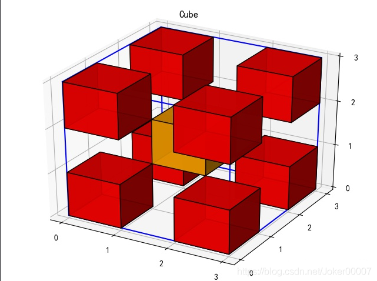
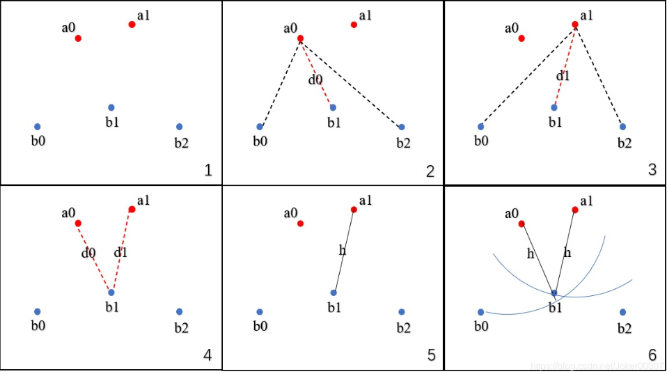

# 医学图像


## 医学图像数据集


### 髋数据集

**Segmented CT pelvis scans with annotated anatomical landmarks**

[Segmented CT pelvis scans with annotated anatomical landmarks]([Segmented CT pelvis scans with annotated anatomical landmarks | doi:10.23698/aida/ctpel | AIDA dataset register (scilifelab.se)](https://datahub.aida.scilifelab.se/10.23698/aida/ctpel))

5 bone segmentation masks and 15 annotations of anatomical landmarks for pelvis bones in each of 90 Computed Tomography (CT) cases extracted from the [CT Lymph nodes](https://wiki.cancerimagingarchive.net/display/Public/CT+Lymph+Nodes) and [CT Colonography](https://wiki.cancerimagingarchive.net/display/Public/CT+COLONOGRAPHY) collections from the [The Cancer Imaging Archive](https://www.cancerimagingarchive.net/) (TCIA).

Keywords: Radiology, Annotated, Pelvis, CT, Computed tomography, Anatomical landmarks, Bone segmentation.


## Sample images

Sample images with reduced image quality. Please click to preview.

- 
- 


## Dataset information

| Short name  | CTPEL                                                        |
| :---------- | ------------------------------------------------------------ |
| Cite as     | Bryan Connolly and Chunliang Wang (2019) Segmented CT pelvis scans with annotated anatomical landmarks [doi:10.23698/aida/ctpel](https://doi.org/10.23698/aida/ctpel) |
| Field       | Radiology                                                    |
|             |                                                              |
| Organ       | [Pelvis](https://termbrowser.nhs.uk/?perspective=full&conceptId1=12921003) |
| Age span    |                                                              |
| Title       | Segmented CT pelvis scans with annotated anatomical landmarks |
| Author      | Bryan Connolly [Chunliang Wang](https://orcid.org/0000-0002-0442-3524) |
| Year        | 2019                                                         |
| DOI         | [doi:10.23698/aida/ctpel](https://doi.org/10.23698/aida/ctpel) |
| Status      | Ongoing                                                      |
| Version     | 1.1                                                          |
| Scans       | 90                                                           |
| Annotations | 1800                                                         |
| Size        | 28.0GB                                                       |
| Resolution  |                                                              |
| Modality    | CT                                                           |
| Scanner     |                                                              |
| Stain       |                                                              |
| Phase       |                                                              |
| References  | [Wang C., Connolly B., de Oliveira Lopes P.F., Frangi A.F., Smedby Ö. (2019) Pelvis Segmentation Using Multi-pass U-Net and Iterative Shape Estimation. In: Vrtovec T., Yao J., Zheng G., Pozo J. (eds) Computational Methods and Clinical Applications in Musculoskeletal Imaging. MSKI 2018. Lecture Notes in Computer Science, vol 11404. Springer, Cham](https://doi.org/10.1007/978-3-030-11166-3_5) |
| Copyright   | Copyright 2019 KTH, Chunliang Wang                           |
| Access      | Available under the following licenses, described in the [License](https://datahub.aida.scilifelab.se/10.23698/aida/ctpel#license) section below.[Controlled access](https://datahub.aida.scilifelab.se/10.23698/aida/ctpel#controlled-access) Free for use in research or education.[AIDA license](https://datahub.aida.scilifelab.se/10.23698/aida/ctpel#aida-license) Free for use within AIDA. |

## Annotation

Segmentation was done first with an interactive software (Mialab), followed by manual inspection and correction using ITKSNAP. The interactive method is based on fuzzy connectedness followed by level set method. Both the segmentation mask and annotated anatomical landmarks were created by a trained radiologist.

## File formats

DICOM. Please see our help pages for some examples of [working with DICOM](https://datahub.aida.scilifelab.se/about/help/#working-with-dicom).

### Importing binary masks to numpy

The dataset contains a DICOM SEG file, which can be converted to an ITK image file (mha, nifti, etc) by using [dcmqi](https://github.com/QIICR/dcmqi) and the command line tool [segimage2itkimage](https://qiicr.gitbook.io/dcmqi-guide/opening/cmd_tools/seg/segimage2itkimage), which is straightforward to read into a numpy array.

### Landmarks

Landmarks are available in the sr.dcm file and saved using the TID 1500 template.

## License

### Controlled access

Free for use in research or education. Please contact AIDA for terms of access.

You are invited to send an [access request email](mailto:aida-data@nbis.se?cc=chunwan@kth.se&subject=Requesting access to dataset doi:10.23698/aida/ctpel&body=Hi! I work at INSTITUTION department of DEPARTMENT in COUNTRY%2C emailing from my institutional account. I would like to request access to the dataset doi%3A10.23698%2Faida%2Fctpel%2C for use in research or education. Our planned use of the data can be summarized as%3A BRIEF_DESCRIPTION_OF_PLANNED_ACTIVITIES_HERE Dataset%3A https%3A%2F%2Fdatahub.aida.scilifelab.se%2F10.23698%2Faida%2Fctpel Also%2C I would like to ALTERNATIVELY_WOULD_NOT_LIKE_TO be included in the public record of data sharing facilitated by AIDA%3A https%3A%2F%2Fdocs.google.com%2Fspreadsheets%2Fd%2F1fl2BwZJ4rivOKzOCy5pAnxU8N1CyoF86BTCnH-rBV04 which is used to facilitate scientific discussion%2C and to show what good AIDA has been to the global research community. (If "not"%2C then only the institution%2Fdepartment information will be included. This choice of personal participation is not weighed into the access request eligibility evaluation.) %2FMY_NAME ) from your institutional account.

Clicking the access request email link above should open a draft email message in a new window, to help you provide relevant information for efficient request evaluation. If the above link does not work for you, then please click to view the suggested email text.

### AIDA BY license

#### Segmentation masks and anatomical landmark annotations

Copyright 2019 KTH, Chunliang Wang

Permission to use, copy, modify, and/or distribute the data within AIDA (Analytic Imaging Diagnostics Arena https://medtech4health.se/aida) for the purpose of research or education with or without fee is hereby granted, provided that the above copyright notice and this permission notice appear in all copies.

THE DATA IS PROVIDED “AS IS” AND THE AUTHOR DISCLAIMS ALL WARRANTIES WITH REGARD TO THIS DATA INCLUDING ALL IMPLIED WARRANTIES OF MERCHANTABILITY AND FITNESS. IN NO EVENT SHALL THE AUTHOR BE LIABLE FOR ANY SPECIAL, DIRECT, INDIRECT, OR CONSEQUENTIAL DAMAGES OR ANY DAMAGES WHATSOEVER RESULTING FROM LOSS OF USE, DATA OR PROFITS, WHETHER IN AN ACTION OF CONTRACT, NEGLIGENCE OR OTHER TORTIOUS ACTION, ARISING OUT OF OR IN CONNECTION WITH THE USE OR CHARACTERISTICS OF THIS DATA.

## Attribution

In addition to the TCIA rules about using the image data, we would really appreciate if you include the following references in publications that make use of the provided segmentation masks or anatomical landmarks:

[1] Bryan Connolly and Chunliang Wang (2019) Segmented CT pelvis scans with annotated anatomical landmarks [doi:10.23698/aida/ctpel](https://doi.org/10.23698/aida/ctpel).

[2] [Wang C., Connolly B., de Oliveira Lopes P.F., Frangi A.F., Smedby Ö. (2019) Pelvis Segmentation Using Multi-pass U-Net and Iterative Shape Estimation. In: Vrtovec T., Yao J., Zheng G., Pozo J. (eds) Computational Methods and Clinical Applications in Musculoskeletal Imaging. MSKI 2018. Lecture Notes in Computer Science, vol 11404. Springer, Cham](https://doi.org/10.1007/978-3-030-11166-3_5)


## 图像分割评估指标——surface-distance计算库

[图像分割评估指标——surface-distance计算库_average surface distance-CSDN博客](https://blog.csdn.net/Joker00007/article/details/108065053)


### 一、简介

当我们评价图像分割的质量和模型表现时，经常会用到各类表面距离的计算。这里推荐一个deepmind的表面距离度量计算库surface-distance。
该库的下载地址：https://download.csdn.net/download/Joker00007/12718748
Github地址：https://github.com/deepmind/surface-distance
（注：Github上的代码存在Bug，可直接在第一个链接下载，该文件是已经改完错误的）

这个库主要包含了以下几个表面距离计算：

- Average surface distance 平均表面距离
- ausdorff distance 豪斯多夫距离
- urface overlap 表面重叠度
- urface dice 表面dice值
- olumetric dice 三维dice值

### 二、计算各类度量

该计算库的调用API都是类似的，首先调用compute_surface_distances这个函数计算出中间结果，再用这个中间结果去计算各类距离。
compute_surface_distances的参数有三个，mask_gt和mask_pred分别为ground truth和prediction的volume，spacing_mm是每个轴的体素间距。
体素间距是医疗影像上常见的一个参数，它的含义是，图像中相邻的两个体素（即两个点）间的直线距离转换为现实中的距离是多少毫米。例如，一个shape为(256, 256, 64)的array，spacing_mm为(1.1, 1.1, 3)，实际表示的是 (281.6mm, 281.6mm, 192mm) 大小的块。体素间距不同，计算得到的surface distance也不同。如果不确定自己的数据体素间距是多少，就设为(1.0, 1.0, 1.0)。



- 3D Volume的表面定义：对于一个体素，如果在其18邻域范围（请看上图，在3x3的方阵中，橘黄色方块表示当前体素，除了红色方块外，其他的都属于邻域范围）内至少有一个像素不是物体，则认为该体素属于表面，依次遍历所有的体素便得到volume的表面。
- 表面距离：设P为prediction的表面点集，G为ground truth的Volume表面点集，P中任意一点的表面距离为该体素到G中所有体素的欧式距离的最小值，依次遍历P中所有的点即可得到表面距离。
  

①Average surface distance 平均表面距离
顾名思义，这个指标就是P中所有点的表面距离的平均。这个指标又可称为Average Symmetric Surface Distance (ASSD)，它也是医疗图像分割竞赛CHAOS中的一个评估指标。平均表面距离的计算代码如下：

```python
import surface_distance as surfdist

surface_distances = surfdist.compute_surface_distances(mask_gt, mask_pred, spacing_mm=(1.0, 1.0, 1.0))
avg_surf_dist = surfdist.compute_average_surface_distance(surface_distances)
```

②Hausdorff distance 豪斯多夫距离
关于这个距离的计算，很多人都讲的不是非常清晰，甚至有很多人介绍的是错的。这里我介绍一个比较简单清晰的计算流程，请对照下图阅读。

1.给定两个点集合A{ a0, a1, … }和B{ b0, b1, b2, …}
2.取A集合中的一点a0，计算a0到B集合中所有点的距离，保留最短的距离d0
3.遍历A集合中所有点，图中一共两点a0和a1，计算出d0和d1
4.比较所有的距离{ d0, d1 }，选出最长的距离d1
5.这个最长的距离就是h，它是A→B的单向豪斯多夫距离，记为h( A, B )
6.对于A集合中任意一点a，我们可以确定，以点a为圆心，h为半径的圆内部必有B集合中的点
7.交换A集合和B集合的角色，计算B→A的单向豪斯多夫距离h( B, A )，选出h( A, B )和h( B, A )中最长的距离，就是A,B集合的双向豪斯多夫距离



豪斯多夫距离95%的计算代码如下：

```python
import surface_distance as surfdist

surface_distances = surfdist.compute_surface_distances(mask_gt, mask_pred, spacing_mm=(1.0, 1.0, 1.0))
hd_dist_95 = surfdist.compute_robust_hausdorff(surface_distances, 95)
```

compute_robust_hausdorff这个函数的第二个参数表示最大距离分位数，取值范围为0-100，它表示的是计算步骤4中，选取的距离能覆盖距离的百分比，例如我这里选取了95%，那么在计算步骤4中选取的不是最大距离，而是将距离从大到小排列后，取排名为5%的距离。这么做的目的是为了排除一些离群点所造成的不合理的距离，保持整体数值的稳定性。

③Surface overlap 表面重叠度
给定一个容许的误差距离，在此容差范围内的表面视作重叠部分，计算mask_gt和mask_pred的表面重叠比例。表面重叠度的计算代码如下：

```python
import surface_distance as surfdist

surface_distances = surfdist.compute_surface_distances(mask_gt, mask_pred, spacing_mm=(1.0, 1.0, 1.0))
surface_overlap = surfdist.compute_surface_overlap_at_tolerance(surface_distances, 1)
```

compute_surface_overlap_at_tolerance函数的第二个参数表示容许误差，以mm为单位，例如我这里选择了1，那么容许误差也就是空间欧氏距离小于1mm的点都会被当做是重叠部分。
注意，这里返回的surface_overlap有两个值，分别代表pred->gt和gt->pred的重叠比例。大多数情况下这两个比例是相等的，但是在某些情况下是不同的

④Surface dice 表面dice值
给定一个容许的误差距离，在此容差范围内的表面视作重叠部分，计算mask_gt和mask_pred的表面重叠dice值。表面dice值的计算代码如下：

```python
import surface_distance as surfdist

surface_distances = surfdist.compute_surface_distances(mask_gt, mask_pred, spacing_mm=(1.0, 1.0, 1.0))
surface_dice = surfdist.compute_surface_dice_at_tolerance(surface_distances, 1)
```

compute_surface_dice_at_tolerance这个函数的第二个参数跟表面重叠度函数的第二个参数是一样的用法。该函数的返回值只有一个，因为pred->gt和gt->pred的表面dice是相同的。

⑤Volumetric dice 三维dice值
计算pred与gt之间的三维dice值。注意，这与上面计算的表面dice不同，三维dice值会考虑空间中的每一个点而不仅仅是表面。三维dice的计算代码如下：

```python
import surface_distance as surfdist

volume_dice = surfdist.compute_dice_coefficient(mask_gt, mask_pred)
```

该函数的返回值为0~1之间的float值，如果gt和pred均为空，那么会返回NAN值。

### 三、公开竞赛中的度量

这边统计一些公开竞赛中所选取的metric，不在surfdist库里的metric将加以括号。

[CHAOS](https://chaos.grand-challenge.org/Evaluation/): Volumetric dice, Average surface distance, ( Relative absolute volume difference ), ( Maximum symmetric surface distance )
[StructSeg](https://structseg2019.grand-challenge.org/Evaluation/): Volumetric dice, Hausdorff distance 95%
[RT-MAC](http://aapmchallenges.cloudapp.net/competitions/34#learn_the_details-evaluation-with-order): Volumetric dice, Average surface distance, Hausdorff distance 95%
[KiTS19](https://kits19.grand-challenge.org/evaluation/results/): Volumetric dice
[SegTHOR](https://competitions.codalab.org/competitions/21145#learn_the_details-evaluation): Volumetric dice, Hausdorff distance 95%
这边可以看出，Volumetric dice和Hausdorff distance 95%是最常用的两种metric，推荐大家在评估自己的模型的时候优先使用这两种。

### 四、最后

自己写的Average surface distance和95%Hausdorff distance函数调用
```python
import surface_distance as surfdist
import nibabel as nib
import numpy as np
import h5py

mask_pred_path = r"E:\...\pred_segmentation_case000051.nii.gz"
mask_gt_path = r"E:\...\segmentation_case000051.nii.gz"
mask_gt = nib.load(mask_gt_path)
mask_pred = nib.load(mask_pred_path)
spacing_mm = h5py.File(r'E:\...\pixel_size.mat', 'r')['pixel_size'][:]

#Average surface distance 平均表面距离
def mBoudDis(mask_pred, mask_gt, spacing_mm_s):
    width_t, height_t, queue0_t, queue1_t = mask_gt.dataobj.shape
    width_p, height_p, queue0_p, queue1_p = mask_pred.dataobj.shape 
    
    mB = []
    if(queue1_t != queue1_p):
        return("Error,The two sets of data have different dimensions")
    else:
        for i in range(queue1_t):
            gt = mask_gt.dataobj[:,:,:,i]
            pred = mask_pred.dataobj[:,:,:,i]
            
            gt = gt.astype(np.bool)
            pred = pred.astype(np.bool)
            surface_distances = surfdist.compute_surface_distances(gt, pred, spacing_mm = spacing_mm_s)
            #avg_surf_dist有两个参数，第一个参数是average_distance_gt_to_pred，第二个参数是average_distance_pred_to_gt
            surf_dist = surfdist.compute_average_surface_distance(surface_distances)
            avg_surf_dist = (surf_dist[0]+surf_dist[1])/2
            mB.append(avg_surf_dist)   
    return  mB
print("ASD:",mBoudDis(mask_pred, mask_gt, spacing_mm))

#95%Hausdorff distance 豪斯多夫距离
def hausd95(mask_pred, mask_gt, spacing_mm_s):
    width_t, height_t, queue0_t, queue1_t = mask_gt.dataobj.shape
    width_p, height_p, queue0_p, queue1_p = mask_pred.dataobj.shape 
    
    mH = []
    if(queue1_t != queue1_p):
        return("Error,The two sets of data have different dimensions")
    else:
        for i in range(queue1_t):
            gt = mask_gt.dataobj[:,:,:,i]
            pred = mask_pred.dataobj[:,:,:,i]
            
            gt = gt.astype(np.bool)
            pred = pred.astype(np.bool)
    
            surface_distances = surfdist.compute_surface_distances(gt, pred, spacing_mm = spacing_mm_s)
            hd_dist_95 = surfdist.compute_robust_hausdorff(surface_distances, 95) 
            mH.append(hd_dist_95)   
    return mH
print("mH95:",hausd95(mask_pred, mask_gt, spacing_mm))
```


## 数据增强

### SimpleITK实现医学图像增强

参考：[Python SimpleITK实现医学图像增强算法_医学图片增强血管python-CSDN博客](https://blog.csdn.net/sinat_28371057/article/details/112450574)

#### 对数变换

图像对数变换首先将图像从SimpleITK图像数据转成[Numpy](https://so.csdn.net/so/search?q=Numpy&spm=1001.2101.3001.7020)矩阵数据，然后采用Numpy的log1p（）函数来计算数据的log（1+x）变换，由于1+x不能小于零，因此这里我们使用图像减去图像的最小值来计算对数变换结果。

```python
def log_transform(image: sitk.Image):
    # ln(1+x)
    np_image = sitk.GetArrayFromImage(image)
    np_log_image = np.log1p(np_image - np.min(np_image))  # ln(1+x)
    log_image = sitk.GetImageFromArray(np_log_image)
    log_image.SetOrigin(image.GetOrigin())
    log_image.SetSpacing(image.GetSpacing())
    log_image.SetDirection(image.GetDirection)
    return log_image
```

#### 幂次变换

图像对数变换首先将图像从SimpleITK图像数据转成Numpy矩阵数据，然后采用Numpy的power（）函数来计算数据的幂次变换，为了防止出现计算值溢出错误，因此这里我们使用图像减去图像均值再除以图像方差来计算图像幂次变换结果，，在这里我们计算图像3次幂变换。

```python
def power_transform(image: sitk.Image, n):
    # power(x, n)
    np_image = sitk.GetArrayFromImage(image)
    np_image_clone1 = np_image.copy()
    np_image_clone1 = (np_image_clone1 - np_image.mean()) / np_image.std()
    np_power_image = np.power(np_image_clone1, n)
    power_image = sitk.GetImageFromArray(np_power_image)
    power_image.SetOrigin(image.GetOrigin())
    power_image.SetSpacing(image.GetSpacing())
    power_image.SetDirection(image.GetDirection())
    return power_image
```


#### 指数变换

图像指数变换首先将图像从SimpleITK图像数据转成Numpy矩阵数据，然后采用Numpy的exp（）函数来计算数据的指数变换，为了防止出现计算值溢出错误，因此这里我们使用图像减去图像均值再除以图像方差来计算图像指数变换结果。

```python
def exponential_transform(image: sitk.Image):
    # exp(x)
    np_image = sitk.GetArrayFromImage(image)
    np_image_clone = np_image.copy()
    np_image_clone = (np_image_clone - np_image.mean()) / np_image.std()
    np_exp_image = np.exp(np_image_clone)
    exp_image = sitk.GetImageFromArray(np_exp_image)
    exp_image.SetOrigin(image.GetOrigin())
    exp_image.SetDirection(image.GetDirection())
    exp_image.SetSpacing(image.GetSpacing())
    return exp_image
```


#### 直方图均衡化

我们使用函数AdativeHistogramEqualizationImageFilter（）函数来实现图像的直方图均衡化，这个类函数需要人为设置三个参数：Alpha，Beta，Radius，其中Alpha参数是用来控制结果相对于经典直方图均衡化方法结果的相似程度，Beta参数用来控制图像锐化程度，Radius用来控制直方图统计时的区域大小。
```python
def histogram_equalization(image: sitk.Image):
    # Histogram equalization
    sitk_hisequal = sitk.AdaptiveHistogramEqualizationImageFilter()
    sitk_hisequal.SetAlpha(0.9)
    sitk_hisequal.SetBeta(0.9)
    sitk_hisequal.SetRadius(3)
    sitk_hisequal = sitk_hisequal.Execute(image)
    return sitk_hisequal
```


#### 拉普拉斯图像锐化

我们使用LaplacianSharpeningImageFilter（）函数来对图像进行拉普拉斯锐化。参数设置也比较简单，是否使用输入图像的Spacing来进行计算，在这里我们为了保持一致性，设置使用输入图像的Spacing。

```python
def laplaciansharp(image: sitk.Image):
    # laplace sharpen
    sitk_laplaciansharp = sitk.LaplacianSharpeningImageFilter()
    sitk_laplaciansharp.UseImageSpacingOn()
    sitk_laplaciansharp = sitk_laplaciansharp.Execute(image)
    return sitk_laplaciansharp
```


好用的数据增强主要应该是：平移和旋转。


