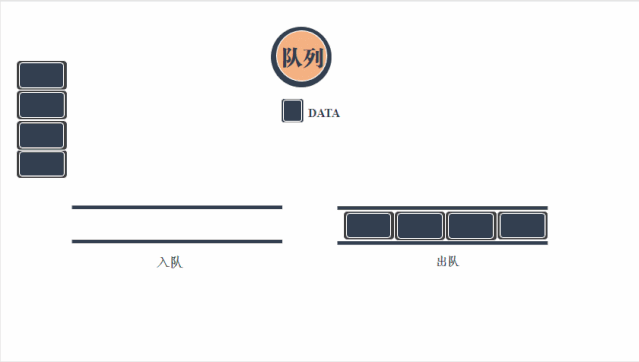

# 数据结构

[图解！24张图彻底弄懂九大常见数据结构！ - 腾讯云开发者社区-腾讯云 (tencent.com)](https://cloud.tencent.com/developer/article/1634155)


## 常见的数据结构

- **栈（Stack）：**栈是一种特殊的线性表，它只能在一个表的一个固定端进行数据结点的插入和删除操作。
- **队列（Queue）：**队列和栈类似，也是一种特殊的线性表。和栈不同的是，队列只允许在表的一端进行插入操作，而在另一端进行删除操作。
- **数组（Array）：**数组是一种聚合数据类型，它是将具有相同类型的若干变量有序地组织在一起的集合。
- **链表（Linked List）：**链表是一种数据元素按照链式存储结构进行存储的数据结构，这种存储结构具有在物理上存在非连续的特点。
- **树（Tree）：**树是典型的非线性结构，它是包括，2 个结点的有穷集合 K。
- **图（Graph）：**图是另一种非线性数据结构。在图结构中，数据结点一般称为顶点，而边是顶点的有序偶对。
- **堆（Heap）：**堆是一种特殊的树形数据结构，一般讨论的堆都是二叉堆。
- **散列表（Hash table）：**散列表源自于散列函数(Hash function)，其思想是如果在结构中存在关键字和T相等的记录，那么必定在F(T)的存储位置可以找到该记录，这样就可以不用进行比较操作而直接取得所查记录。


##   **数组**

数组可以说是最基本最常见的数据结构。数组一般用来存储相同类型的数据，可通过数组名和下标进行数据的访问和更新。数组中元素的存储是按照先后顺序进行的，同时在内存中也是按照这个顺序进行连续存放。数组相邻元素之间的内存地址的间隔一般就是数组数据类型的大小。


##  **链表**

链表相较于数组，除了数据域，还增加了指针域用于构建链式的存储数据。链表中每一个节点都包含此节点的数据和指向下一节点地址的指针。由于是通过指针进行下一个数据元素的查找和访问，使得链表的自由度更高。

这表现在对节点进行增加和删除时，只需要对上一节点的指针地址进行修改，而无需变动其它的节点。不过事物皆有两极，指针带来高自由度的同时，自然会牺牲数据查找的效率和多余空间的使用。

一般常见的是有头有尾的单链表，对指针域进行反向链接，还可以形成双向链表或者循环链表。


### **链表和数组对比**

链表和数组在实际的使用过程中需要根据自身的优劣势进行选择。链表和数组的异同点也是面试中高频的考察点之一。这里对单链表和数组的区别进行了对比和总结。


##  **跳表**

从上面的对比中可以看出，链表虽然通过增加指针域提升了自由度，但是却导致数据的查询效率恶化。特别是当链表长度很长的时候，对数据的查询还得从头依次查询，这样的效率会更低。跳表的产生就是为了解决链表过长的问题，通过增加链表的多级索引来加快原始链表的查询效率。这样的方式可以让查询的时间复杂度从O(n)提升至O(logn)。


跳表通过增加的多级索引能够实现高效的动态插入和删除，其效率和红黑树和平衡二叉树不相上下。目前redis和levelDB都有用到跳表。

从上图可以看出，索引级的指针域除了指向下一个索引位置的指针，还有一个down指针指向低一级的链表位置，这样才能实现跳跃查询的目的。

##  **栈**

栈是一种比较简单的数据结构，常用一句话描述其特性，后进先出。栈本身是一个线性表，但是在这个表中只有一个口子允许数据的进出。这种模式可以参考腔肠动物...即进食和排泄都用一个口...

栈的常用操作包括入栈push和出栈pop，对应于数据的压入和压出。还有访问栈顶数据、判断栈是否为空和判断栈的大小等。由于栈后进先出的特性，常可以作为数据操作的临时[容器](https://cloud.tencent.com/product/tke?from=10680)，对数据的顺序进行调控，与其它数据结构相结合可获得许多灵活的处理。


## **队列**

队列是栈的兄弟结构，与栈的后进先出相对应，队列是一种先进先出的数据结构。顾名思义，队列的[数据存储](https://cloud.tencent.com/product/cdcs?from=10680)是如同排队一般，先存入的数据先被压出。常与栈一同配合，可发挥最大的实力。





##  **树**

树作为一种树状的数据结构，其数据节点之间的关系也如大树一样，将有限个节点根据不同层次关系进行排列，从而形成数据与数据之间的父子关系。常见的数的表示形式更接近“倒挂的树”，因为它将根朝上，叶朝下。

树的数据存储在结点中，每个结点有零个或者多个子结点。没有父结点的结点在最顶端，成为根节点；没有非根结点有且只有一个父节点；每个非根节点又可以分为多个不相交的子树。

这意味着树是具备层次关系的，父子关系清晰，家庭血缘关系明朗；这也是树与图之间最主要的区别。


```bash
完全二叉树：除了最后一层结点，其它层的结点数都达到了最大值；同时最后一层的结点都是按照从左到右依次排布。

满二叉树：除了最后一层，其它层的结点都有两个子结点。
```

### **平衡二叉树**

平衡二叉树又被称为AVL树，它是一棵二叉排序树，且具有以下性质：它是一棵空树或它的左右两个子树的高度差的绝对值不超过1，并且左右两个子树都是一棵平衡二叉树。

```bash
二叉排序树：是一棵空树，或者：若它的左子树不空，则左子树上所有结点的值均小于它的根结点的值；若它的右子树不空，则右子树上所有结点的值均大于它的根结点的值；它的左、右子树也分别为二叉排序树。

树的高度：结点层次的最大值

平衡因子：左子树高度 - 右子树高度
```


二叉排序树意味着二叉树中的数据是排好序的，顺序为左结点<根节点<右结点，这表明二叉排序树的中序遍历结果是有序的。（还不懂二叉树四种遍历方式[前序遍历、中序遍历、后序遍历、层序遍历]的同学赶紧补习！）


数据结构的运算


数据结构的分类


[最值得收藏的 数据结构 全部知识点思维导图整理(王道考研), 附带经典题型整理_孤柒「一起学计算机」的博客-CSDN博客_数据结构思维导图](https://blog.csdn.net/weixin_43959833/article/details/115265378)


