# Statistical-Shape-Model


[UK-Digital-Heart-Project/Statistical-Shape-Model: Statistical shape model of the heart (github.com)](https://github.com/UK-Digital-Heart-Project/Statistical-Shape-Model)

## UK-Digital-Heart-Project

### Statistical-Shape-Model


This repository describes a statistical shape model for the ventricles of the heart. The shape model is constructed by registering 1093 hearts to the template space using rigid registration (so that the position and orientation differences are removed) and applying principal component analysis (PCA) to the surface meshes of all these hearts.

### Data

We have performed PCA three times, namely on the left ventricle (LV), the right ventricle (RV) and both ventricles. The mean shape model, the first 100 principal components (PC) and the corresponding eigenvalues or variances are provided. Suppose X denote a m-by-n matrix containing the point coordinates for m hearts. n denotes the number of coordinates, which is three times the number of points. Using Matlab language, the mean shape model and the PC decomposition are computed by,

```bash
mean_shape = mean(X, 1);
[pc, score, variance, tsquare] = princomp(X, 'econ');
```

The mean shape model is saved as a VTK file. The PCs and variances are saved as csv files. We only store the first 100 PCs and the their variances, which already encode over 99.9% of the shape variation. To reduce file sizes on github, the csv files are compressed using gzip. The numpy.genfromtxt() function in Python normally recognises the gzip format automatically. If not, you may need to decompress the files first.

### Script

If you are interested in a specific mode and would like to see how it affects the heart shape, we have also included a Python script which loads the data and computes the shape at a certain standard deviation from the mean shape.


### How to cite

This study is part of the UK Digital Heart Project, which was set up by Prof. Stuart Cook and Dr. Declan O'Regan at the MRC Clinical Sciences Centre, Imperial College London, UK. It is co-funded by the BHF, MRC and NIHR. In the event you find the shape model useful, please consider giving appropriate credit to it by citing the following relevant papers, which describe the atlas construction methodology [1], the imaging prototol and clinical background [2]. Thank you.

[1] W. Bai, W. Shi, A. de Marvao, T.J.W. Dawes, D.P. O’Regan, S.A. Cook, D. Rueckert. A bi-ventricular cardiac atlas built from 1000+ high resolution MR images of healthy subjects and an analysis of shape and motion. Medical Image Analysis, 26(1):133-145, 2015. [doi:10.1016/j.media.2015.08.009](http://dx.doi.org/10.1016/j.media.2015.08.009)

[2] A. de Marvao, T. Dawes, W. Shi, C. Minas, N.G. Keenan, T. Diamond, G. Durighel, G. Montana, D. Rueckert, S.A. Cook, D.P. O'Regan. Population-based studies of myocardial hypertrophy: high resolution cardiovascular magnetic resonance atlases improve statistical power. J Cardiovasc Magn Reson, 16:16, 2014. [doi:10.1186/1532-429x-16-16](http://dx.doi.org/10.1186/1532-429x-16-16)

Copyright 2016 Imperial College London


提供代码：

```python
#!/usr/bin/python
# Reconstruct the shape at a certain standard deviation from the mean shape model

import vtk, numpy as np

# Specify the anatomical structure
which_shape  = 'LV'  # LV, RV or Both
which_mode   = 0     # 0 corresponds to the 1st PC
how_much_std = 3     # 3 standard deviation

# Read the mean shape
reader = vtk.vtkPolyDataReader()
mean_shape = '{0}_ED_mean.vtk'.format(which_shape)
reader.SetFileName(mean_shape)
reader.Update()
polydata = reader.GetOutput()
points = polydata.GetPoints()
n_points = points.GetNumberOfPoints()

# Read the principal component and variance
pc = np.genfromtxt('LV_ED_pc_100_modes.csv.gz', delimiter=',')
variance = np.genfromtxt('LV_ED_var_100_modes.csv.gz', delimiter=',')

pc_i = pc[:, which_mode]
pc_i = np.reshape(pc_i, (n_points, 3))
std = np.sqrt(variance[which_mode])

# Compute the varying shape
for j in range(0, n_points):
    p = points.GetPoint(j)
    p += how_much_std * std * pc_i[j]
    points.SetPoint(j, p)

# Write the shape
writer = vtk.vtkPolyDataWriter()
writer.SetInputData(polydata)
writer.SetFileName('LV_ED_mode{0}_{1}std.vtk'.format(which_mode + 1, how_much_std))
writer.Write()
```


上述代码测试显示：内部红色的为平均模型，外部绿色的为3倍方差的模型。

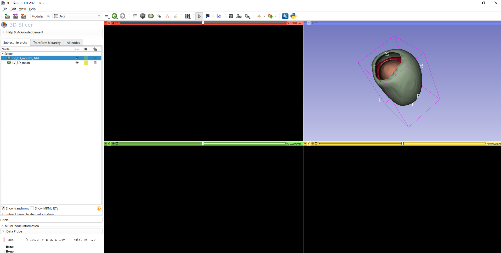


## msrepo-statistical_shape_model

[msrepo/statistical_shape_model: Statistical Shape Model using PCA on standard 2D hand dataset (github.com)](https://github.com/msrepo/statistical_shape_model)


### Statistical Shape Model using PCA on standard 2D hand dataset


Original Dataset courtesy of [Mikkel B. Stegmann](http://www2.imm.dtu.dk/pubdb/pubs/403-full.html)

### References

- [Annotated 2D Hand Image dataset](http://www2.imm.dtu.dk/pubdb/pubs/403-full.html)
- [Other free datasets for 2D Statistical Shape Models](https://www2.imm.dtu.dk/~aam/datasets/datasets.html)
- [Active Appearance Model](http://www.imm.dtu.dk/~aam/main/main.html)


[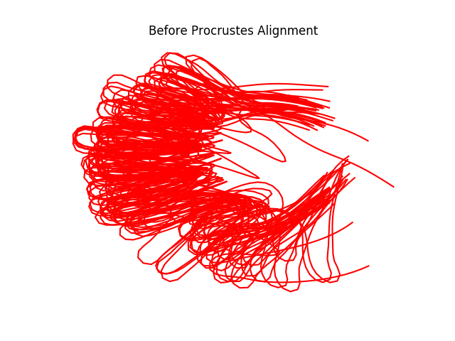](https://github.com/msrepo/statistical_shape_model/blob/master/results/before_procrustes.png) [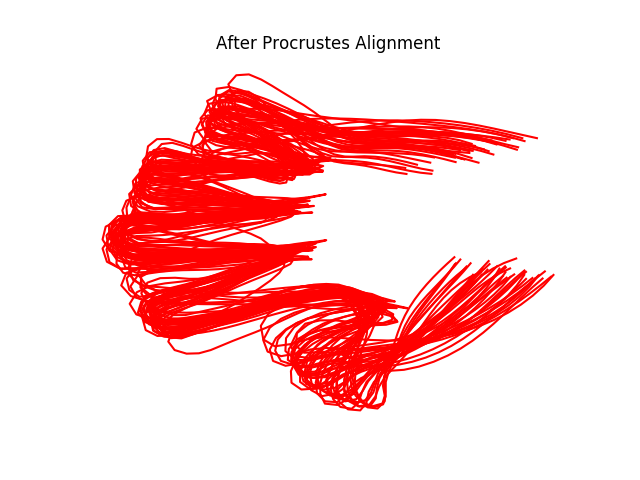](https://github.com/msrepo/statistical_shape_model/blob/master/results/after_procrustes.png) [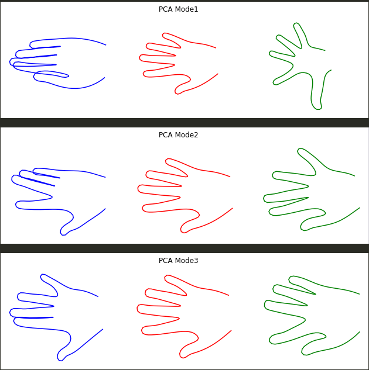](https://github.com/msrepo/statistical_shape_model/blob/master/hand_PCA_modes.png)


执行项目中的脚本：

```bash
python pca_statixtical_shape_model.py
```

```python
#!/usr/bin/env python3
# -*- coding: utf-8 -*-
# read_files.py
"""
Created on Fri May  8 08:22:50 2020

@author: ms
"""
import os
import matplotlib.image as mpimg

def skip_comments(fp):
    while True:
        last_pos = fp.tell()
        line = fp.readline()
        if not line.strip().startswith('#') and  line.strip():
           break
    fp.seek(last_pos)
    
def getxy_selective(line):
    points = line.split()
    return [float(points[2]), float(points[3])]

def getxy(line):
    points = line.split()
    return [ float(point) for point in points]

def readPoints(filepath, filename,getxy=getxy):
    with open(os.path.join(filepath,filename)) as fp:
        skip_comments(fp)
        num_points = int(fp.readline())
        skip_comments(fp)
        points = [getxy(fp.readline()) for i in range(num_points)]
    return points

def imgname_from_segfilename(filepath, filename):
    return os.path.join(filepath,filename.split(sep='.')[0]+'.bmp')


def readSegmentations(filepath,getxy = getxy,extension = 'asf'):
    segmentationlist = [ readPoints(filepath,file,getxy) for file in os.listdir(filepath)
                            if file.endswith(extension)]
    return segmentationlist

def getImageWH(filename):
    img = mpimg.imread(filename)
    return img.shape
```

```python
#!/usr/bin/env python3
# -*- coding: utf-8 -*-
# my_interpolate.py
"""
Created on Fri May  8 20:46:34 2020

@author: ms
"""
import numpy as np
import matplotlib.pyplot as plt
from scipy import interpolate


def interp(points, closed_curve = False,k_=3,s_=0):
    if closed_curve:
        points = np.vstack((points,points[0]))
    tck, u = interpolate.splprep([points[:,0],points[:,1]], k=k_,s=s_)
    if closed_curve:
        u = np.linspace(0,1,num = 150,endpoint = True)
    else:
        u = np.linspace(0,1,num = 150,endpoint = False)
    interp_inner = interpolate.splev(u, tck)
    return interp_inner

def showInterp(interp_points,W=256,H=256,marker = 'r'):
    plt.plot(interp_points[0]*W,interp_points[1]*H,marker)
    plt.axis('off')

```


```python
#!/usr/bin/env python3
# -*- coding: utf-8 -*-
# pca_statixtical_shape_model.py
"""
Created on Thu May  7 08:54:23 2020

@author: ms
"""
import os
import numpy as np
import scipy.linalg 
import matplotlib.pyplot as plt
import matplotlib.image as mpimg
from read_files import *
from my_interpolate import *

DATASET = 'HAND'

def get_centroids(points):
    """ obtain centroid of LV cardiac dataset which consists of two
    circles each containing 33 points """
    c1 = np.mean(points[:33],axis = 0)
    c2 = np.mean(points[33:],axis = 0) 
    return c1,c2

def unmake_1d(hand):
    return np.array([ [hand[i], hand[i+56]] for i in range(0,hand.shape[0]//2)])

def make_1d(hand):
    return np.concatenate((hand[:,0],hand[:,1])).reshape(-1)


def showImg(filename,show = False):
    plt.imshow(mpimg.imread(filename))
    plt.axis('off')
    if show:
        plt.show()


    
def showPoints(points,W=256,H=256, show = False,color = 'white'):
    points = np.array(points)
    plt.scatter(points[:,0]*W,points[:,1]*H,color=color,s = 1) 
    if show:
        plt.show()

def showSegImg(imgpath,points,W = None,H = None):
    if W is  None:
        W,H = getImageWH(imgpath)
    showImg(imgpath)
    if DATASET == 'HAND':
        pass
    else:

        showInterp(interp(points[:33]),W,H)
        showInterp(interp(points[33:]),W,H)
    showPoints(points,W,H,True)


def showCentroids(centroids,W=256,H=256):
    plt.scatter(centroids[:,0,0]*W,centroids[:,0,1]*H,marker = '4',color = 'black')
    plt.scatter(centroids[:,1,0]*W,centroids[:,1,1]*H,marker = '4',color = 'black')
    plt.axis('off')

def showPCAModes(mean_centre, mode ,title = None):
    mean_center_in = mean_centre.reshape(66,-1)[:33]
    mean_center_out = mean_centre.reshape(66,-1)[33:]

    ax1 = plt.subplot(1,2,1)
    showInterp(interp(mean_center_in),marker = 'r')
    showInterp(interp(mean_center_out),marker = 'r')
    showInterp(interp(mean_center_in + mode.reshape(66,-1)[:33]),marker = 'b')
    showInterp(interp(mean_center_out + mode.reshape(66,-1)[:33]),marker = 'b')

    plt.subplot(1,2,2, sharex = ax1,sharey = ax1)
    showInterp(interp(mean_center_in),marker = 'r')
    showInterp(interp(mean_center_out),marker = 'r')
    showInterp(interp(mean_center_in - mode.reshape(66,-1)[33:]),marker = 'g')
    showInterp(interp(mean_center_out - mode.reshape(66,-1)[33:]),marker = 'g')
    if title:
        plt.suptitle(title)
    
    plt.show()
    
def procrustes_hand(hands):
    np.testing.assert_equal(make_1d(unmake_1d(hands[0])),hands[0])
    normalized_hands = hands
    old_normalized_hands = hands
    
    fig = plt.figure()
    for hand in normalized_hands:
        showInterp(interp(unmake_1d(hand)))
    plt.title('Before Procrustes Alignment')
    plt.show()
    
    for count in range(5):
        mean_hand = np.mean(normalized_hands,axis = 0)
        for i,hand in enumerate(hands):
            _, mtx, disparity = scipy.spatial.procrustes(unmake_1d(mean_hand),
                                                         unmake_1d(hand))
            normalized_hands[i] = make_1d(mtx)

        
    fig = plt.figure()
    for hand in normalized_hands:
        showInterp(interp(unmake_1d(hand)))
    plt.title('After Procrustes Alignment')
    plt.show()
    
    return normalized_hands

def main():

    filepath = './ssm_datasets/hand/all/shapes'
    segmentationlist = readSegmentations(filepath,getxy)[0]
    hands = np.array(segmentationlist).T
    
    showSegImg(os.path.join(filepath,'0000.jpg'),unmake_1d(hands[0]),600,600)
    
    normalized_hands = procrustes_hand(hands)
    
    mean_normalized_hand = np.mean(normalized_hands,axis = 0)
    cov_mat = np.cov(normalized_hands.T)        
    eig_val, eig_vec = np.linalg.eigh(cov_mat)
    m = unmake_1d(mean_normalized_hand)
    for i in range(1,5):
        modeminus = unmake_1d(eig_vec[:,-i]*-3*np.sqrt(eig_val[-i]))+unmake_1d(mean_normalized_hand)
        modeplus = unmake_1d(eig_vec[:,-i]*3*np.sqrt(eig_val[-i]))+unmake_1d(mean_normalized_hand)
        fig = plt.figure(figsize =(11,3))
        ax1 = plt.subplot(131)
        showInterp(interp(modeminus),marker = 'b')   
        plt.subplot(132,sharex = ax1, sharey = ax1)
        showInterp(interp(m))
        plt.subplot(133,sharex = ax1, sharey = ax1)
        showInterp(interp(modeplus),marker = 'g')
        plt.suptitle('PCA Mode' + str(i))
        plt.show()
    

def lv_cardiac_pca():
    filepath = './ssm_datasets/lv_cardiac/data'
    segmentationlist = readSegmentations(filepath)
    
    lv_cardiac = np.array([np.array(segment) for segment in segmentationlist])
    mean_lv_cardiac = np.mean(lv_cardiac, axis = 0)
    
    showSegImg(imgname_from_segfilename(filepath,'c4480h_s1.asf'),
               lv_cardiac[0].reshape(-1,2))
    
    mean_centroids = np.array([get_centroids(mean_lv_cardiac.reshape(-1,2))])
    centroids = np.array([get_centroids(segment) for segment in segmentationlist ])
    
    
    diff1 = centroids[:,0,:] - mean_centroids[:,0,:]
    centred1 = lv_cardiac[:,:33,:] - diff1.reshape(14,1,2)
    diff2 = centroids[:,1,:] - mean_centroids[:,1,:]
    centred2 = lv_cardiac[:,33:,:] - diff2.reshape(14,1,2)
    

    
    centred = np.concatenate((centred1.reshape(14,-1),centred2.reshape(14,-1)),axis = 1)
    _cov_mat = np.cov(centred.T)
    mean_centred = np.mean(centred, axis = 0)
    eig_val, eig_vec = scipy.linalg.eigh(_cov_mat)
    for i in range(1,5):
        mode = eig_vec[:,-i] * 3 * np.sqrt(eig_val[-i])
        showPCAModes(mean_centred,mode,"PCA Major Mode "+ str(i))
        
    for c1,c2 in zip(centred1,centred2):
        showInterp(interp(c1),marker = 'b')
        showInterp(interp(c2))
    plt.title('Training Data LV Segmentation')
    plt.show()
    
    
if __name__ == '__main__':
    main()

```


执行输出结果：

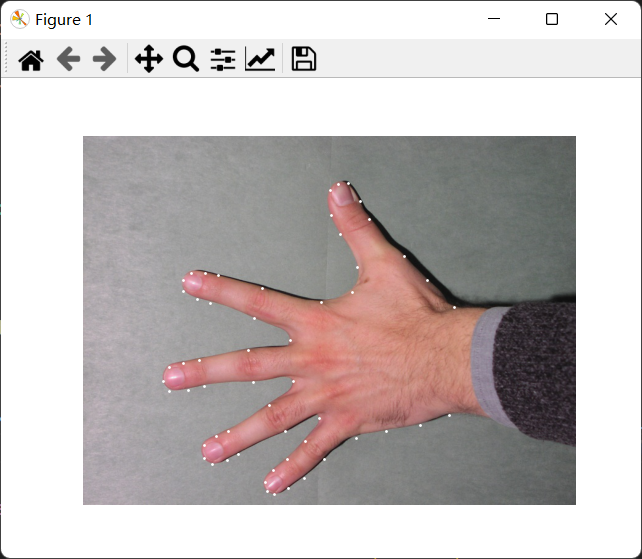


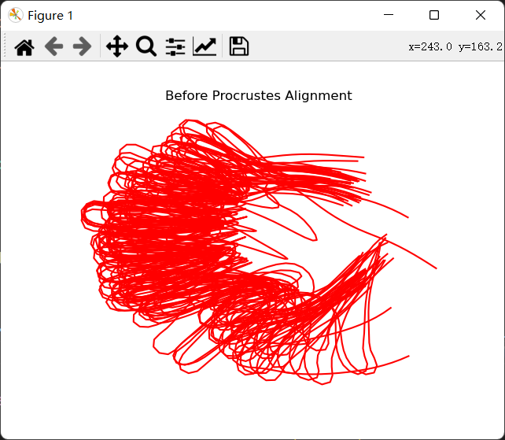

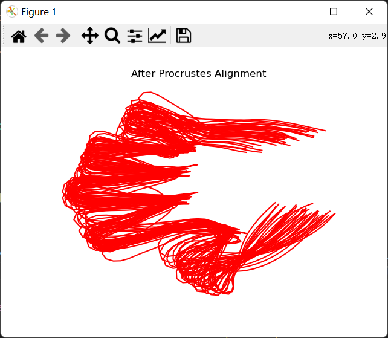


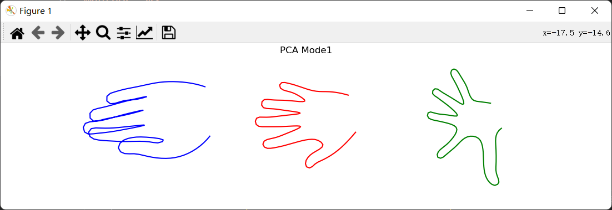


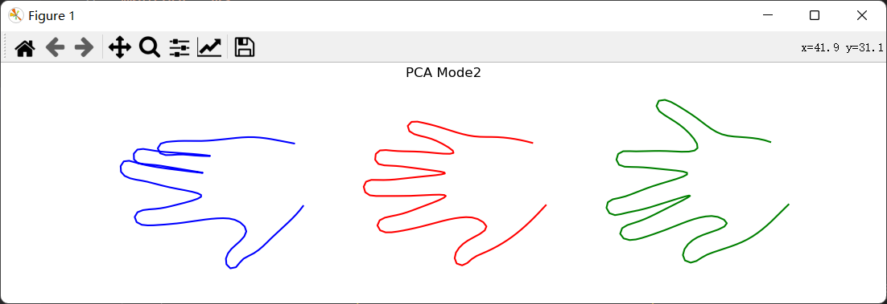


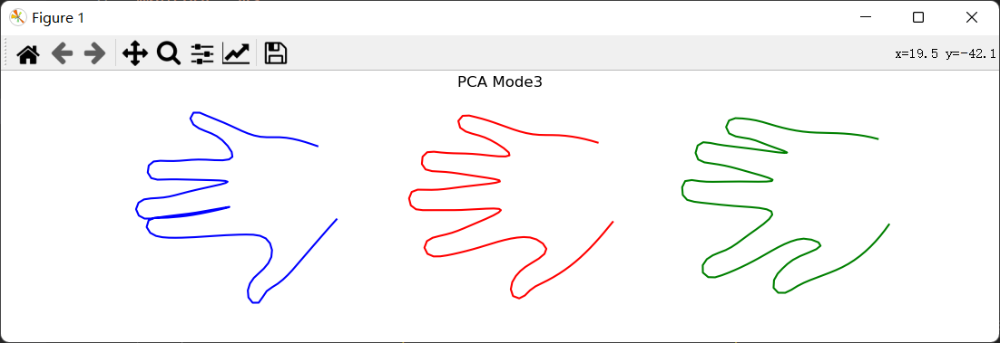

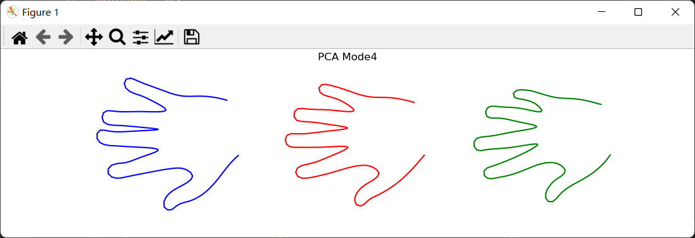


## SSM


[Jianningli/ssm: Back to the Roots: Reconstructing Large and Complex Cranial Defects using an Image-based Statistical Shape Model (github.com)](https://github.com/Jianningli/ssm)

Back to the Roots: Reconstructing Large and Complex Cranial Defects using an Image-based Statistical Shape Model

Manual implant cleaning: [**demonstration video**](https://figshare.com/articles/dataset/Reconstruction_of_Large_and_Complex_Cranial_Defects/19328816/3?file=34326815) Dataset: [**download here**](https://autoimplant2021.grand-challenge.org/) Paper: [**pdf**](https://arxiv.org/abs/2204.05703)


```python
import nrrd
import gc
import ants, shutil
from glob import glob
from sklearn.decomposition import PCA


class skullRecSSM(object):
	def __init__(self,numOfImg4SSM=30):
		self.numOfImg4SSM=numOfImg4SSM

	def reg(self,fix_img,moving_img):
	    outs = ants.registration(fix_img, moving_img, type_of_transforme = 'Similarity')
	    warped_img = outs['warpedmovout']
	    return warped_img


	def inverse_reg(self,fixed1,moving1,moving2):
		outs1 = ants.registration(fixed1, moving1, type_of_transforme = 'Similarity')
		outs2 = ants.apply_transforms(moving1, moving2,transformlist=outs1['invtransforms'])
		outs2=outs2.numpy()
		outs2=(outs2>0)
		outs2=outs2+1-1
		return outs2


	def ssm_train(self,warped_train_dir):
		complete = glob(warped_train_dir+'*.nrrd')
		pca = PCA(n_components=len(complete))
		#(512,512,222) is the size of the fixed image
		data=np.zeros(shape=(len(complete),512,512,222),dtype='int16')
		for i in range(len(complete)):
			temp,header=nrrd.read(complete[i])
			data[i,:,:,:]=temp
			del temp
		data=data[0:self.numOfImg4SSM]
		self.mean_shape=data.mean(axis=0)
		data=np.reshape(data,(len(complete),512*512*222))
		data_pca = pca.fit_transform(data)

		#explained_variance_ratio
		#percentage=pca.explained_variance_ratio_
		#components_
		#components_=pca.components_

		data_inv=np.linalg.pinv(data)

		del data
		gc.collect()

		self.eigenvec=data_inv.dot(data_pca)

		del data_
		del data_inv
		gc.collect()

	


	def ssm_test(self, testImg, useOnlyMeanShape=False):

		testdata=np.reshape(testImg,(1,512*512*222))
		testdatapca=testdata.dot(self.eigenvec)

		lambda_n=[]
		for i in range(len(testdatapca)):
			lambda_n.append(testdatapca[i])	
		lambda_n=np.array(lambda_n)
		#scale [0,1]
		lambda_n = (lambda_n - np. min(lambda_n))/np. ptp(lambda_n)
		lambda_n=np.transpose(lambda_n)
		reconstructed=eigenvec.dot(lambda_n)
		reconstructed=np.reshape(reconstructed,(512,512,222))
		if useOnlyMeanShape:
			rec=self.mean_shape
		else:
			rec=reconstructed+self.mean_shape

		rec=(rec>0)
		rec=rec+1-1

		return  rec


if __name__ == "__main__":

	fixed_img=ants.image_read('./fixed/001.nrrd')
	moving_train_dir='./moving_train/'
	moving_test_dir='./moving_test/'
	warped_train_dir='./warped_img/train/'
	warped_test_dir='./warped_img/test/'
	results_dir='./results/'


	moving_train_imgs = glob(moving_train_dir+'*.nrrd')
	moving_test_imgs = glob(moving_test_dir+'*.nrrd')
	warped_test_img = glob(warped_test_dir+'*.nrrd')


	model=skullRecSSM(30)

	print('warpping training images...')


	for idx in range(len(moving_train_imgs)):
		NamePrefix = str(idx).zfill(3)
	    moving_img = ants.image_read(moving_train_imgs[idx])
	    outs = model.reg(fixed_img, moving_img)
	    warped_img = outs['warpedmovout']
	    ants.image_write(warped_img, warped_train_dir + NamePrefix +'.nrrd')

	rint('building SSM...')
	model.ssm_train(warped_train_dir)


	print('warpping test images...')
	for idx in range(len(moving_test_imgs)):
		NamePrefix = str(idx).zfill(3)
	    moving_img = ants.image_read(moving_test_imgs[idx])
	    outs = ssm.reg(fixed_img, moving_img)
	    warped_img = outs['warpedmovout']
	    ants.image_write(warped_img, warped_test_dir + NamePrefix +'.nrrd')


	print('fitting...')
	for i in range(len(warped_test_img)):
		NamePrefix = str(i).zfill(3)
		test,h=nrrd.read(warped_test_img[i])
		h['type']='int32'
		h['encoding']='gzip'	
		rec=model.ssm_test(test,useOnlyMeanShape=False)
		implant=rec-test
		nrrd.write(results_dir+'skulls/'+NamePrefix,rec.astype('int32'),h)
		nrrd.write(results_dir+'implants/'+NamePrefix,implant.astype('int32'),h)


	print('converting the results back to original image space...')
	skull_imgs = glob(results_dir+'skulls/'+'*.nrrd')
	implant_imgs = glob(results_dir+'implants/'+'*.nrrd')

	for i in range(len(warped_test_img)):
	    NamePrefix = str(i).zfill(3)
	    moving = ants.image_read(moving_test_imgs[i])
	    moving_results = ants.image_read(implant_imgs[i])
	    converted_img=model.inverse_reg(fixed_img,moving,moving_results)
	    _,header=nrrd.read(moving_test_imgs[i])
	    nrrd.write(implant_imgs,converted_img.astype('int32'),header)
```


# Snake模型


## 主动轮廓模型：Snake模型的python实现


[主动轮廓模型：Snake模型的python实现_\lambda的博客-CSDN博客_python snake模型](https://blog.csdn.net/Augurlee/article/details/99673985)


