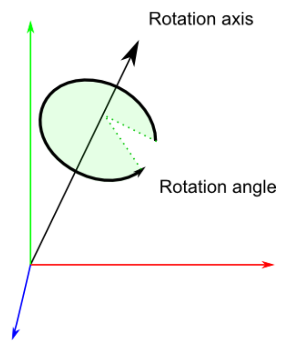

## Axis-Angle与四元数

绕坐标轴的多次旋转可以等效为绕某一转轴旋转一定的角度。假设等效旋转轴方向向量为$K=[k_x, k_y, k_z]^T$，等效旋转角为$\theta$，则四元数$q=(x,y,z,w)$，其中：
$$

\begin{align*}     
&x = k_x \cdot sin\frac{\theta}{2}\\    
&y = k_y \cdot sin\frac{\theta}{2}\\
&z = k_z \cdot sin\frac{\theta}{2}\\
&w = cos\frac{\theta}{2}
\end{align*}
$$

且有$x^2 + y^2+z^2+w^2 = 1$ 

参考：

[彻底搞懂“旋转矩阵/欧拉角/四元数”，让你体会三维旋转之美_欧拉角判断动作-CSDN博客](https://blog.csdn.net/weixin_45590473/article/details/122884112)

[四元数与欧拉角（RPY角）的相互转换 - XXX已失联 - 博客园 (cnblogs.com)](https://www.cnblogs.com/21207-iHome/p/6894128.html)