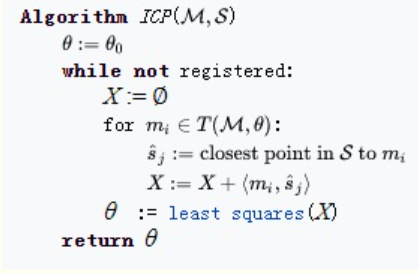

# 点集配准技术（ICP、RPM、KC、CPD）

在计算机视觉和模式识别中，点集配准技术是查找将两个点集对齐的空间变换过程，寻找这种变换的目的主要包括：1、将多个数据集合并为一个全局统一的模型；2、将未知的数据集映射到已知的数据集上以识别其特征或估计其姿态。点集的获取可以是来自于3D扫描仪或测距仪的原始数据，在图像处理和图像配准中，点集也可以通过从图像中提取获得的一组特征（例如角点检测）。

点集配准研究的问题可以概括如下：假设$\{ \pmb{M}, \pmb{S}\}$ 是空间$\mathbb{R}^d$ 中的两个点集，我们要寻找一种变换$\pmb{T}$ ，或者说是一种从$\mathbb{R}^d$ 空间到$\mathbb{R}^d$ 空间的映射，将其作用于点集$\pmb{M}$ 后，可以使得变换后的点集$\pmb{M}$ 和点集$\pmb{S}$ 之间的差异最小。将变换后的点集$\pmb{M}$ 记为$\pmb{T(M)}$ ，那么转换后的点集$\pmb{T(M)}$ 与点集$\pmb{S}$ 的差异可以由某种距离函数来定义，一种简单的方法是对配对点集取欧氏距离的平方：
$$
dist(T(M),S)=\sum_{m=T(M)}\sum_{s=S}(m-s)^2
$$
点集配准方法一般分为刚性配准和非刚性配准。

**刚性配准** ：给定两个点集，刚性配准产生一个刚性变换，该变换将一个点集映射到另一个点集。刚性变换定义为不改变任何两点之间距离的变换，一般这种变换只包括平移和旋转。

**非刚性变换** ：给定两个点集，非刚性配准产生一个非刚性变换，该变换将一个点集映射到另一个点集。刚性变换包括仿射变换，例如缩放和剪切等，也可以涉及其他非线性变换。

下面我们来具体介绍几种点集配准技术。

## Interative closet point (ICP)

ICP算法是一种迭代方式的刚性配准算法，它为点集$\pmb{M}$ 中每个点$m_i$ 寻找在点集$\pmb{S}$ 中的最近点$s_j$ ，然后利用最小二乘方式得到变换$\pmb{T}$ ，算法伪代码如下：

ICP算法对于待配准点集的初始位置比较敏感，当点集$\pmb{M}$ 的初始位置与点集$\pmb{S}$ 比较接近时，配准结果会比较好。另外ICP算法在每次计算迭代过程中都会改变最近点对，所以其实很难证明ICP算法能准确收敛到局部最优值，但是由于ICP算法直观易懂且易于实现，因此它目前仍然是最常用的点集配准算法。

在计算变换$\pmb{T}$ 时，可以使用SVD方式，过程如下：

优化目标：
$$
\{R, \mathbf{t}\} = \arg min \sum_{i=1}^n ||(R \mathbf{p}_i - \mathbf{t})-\mathbf{q}_i||^2
$$

1. 将点集去中心化：

$$
\bar{\mathbf{p}}=\frac{1}{n} \sum_{i=1}^n\mathbf{p}_i, \bar{\mathbf{q}}=\frac{1}{n} \sum_{i=1}^n\mathbf{q}_i \\
\mathbf{x}_i = \mathbf{p}_i - \bar{\mathbf{p}}, \mathbf{y}_i = \mathbf{q}_i - \bar{\mathbf{q}}
$$

2. 计算协方差矩阵并SVD分解：

[点集配准技术（ICP、RPM、KC、CPD） - 算法小丑 - 博客园 (cnblogs.com)](https://www.cnblogs.com/shushen/p/11676486.html)

